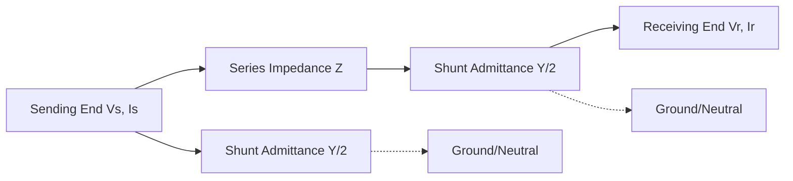
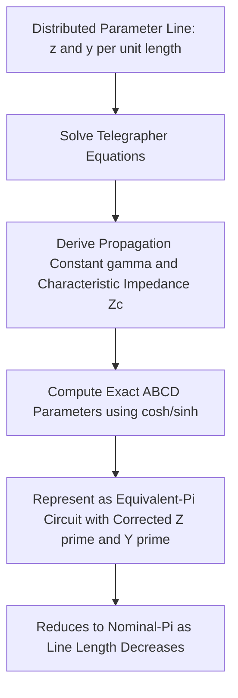

## Short-Line, Medium-Line, and Long-Line Models

### Overview

Transmission lines are physically distributed-parameter systems — resistance, inductance, capacitance, and conductance exist continuously along the line's length. For practical circuit analysis, however, lines are commonly approximated using lumped-parameter models whose complexity is chosen based on line length, since the relative significance of shunt capacitance and the accuracy of a lumped approximation both depend on how the line length compares to the power-frequency wavelength. Three standard model classes — short, medium, and long — provide progressively more accurate representations at increasing complexity.

### Classification by Length

**Key Points**

- **Short line**: typically lines up to approximately 80 km (50 miles); shunt capacitance effects are considered negligible and are omitted from the model entirely
- **Medium line**: typically lines between approximately 80 km and 250 km (50–150 miles); shunt capacitance is included but represented as lumped elements rather than distributed
- **Long line**: typically lines exceeding approximately 250 km (150 miles); requires the distributed-parameter (exact) representation to accurately capture wave propagation effects
- [Unverified] These length thresholds are widely cited rules of thumb in textbooks and industry practice, but exact boundaries vary somewhat between references and are not rigid physical cutoffs — the underlying criterion is the ratio of line length to wavelength, not the absolute length category label itself

### Short-Line Model

#### Circuit Representation

**Key Points**

- Represents the line purely as a series impedance $Z = (r + j\omega L) \times l$, with no shunt (capacitive) branch included
- Sending-end and receiving-end current are equal ($I_S = I_R$), since no shunt current path exists in the model
- Appropriate when shunt charging current is small relative to load current, which holds for shorter lines at typical loading levels

#### Governing Equations

$$V_S = V_R + I_R Z$$

$$I_S = I_R$$

where $Z = R + jX_L$ is the total series impedance of the line.

### Medium-Line Model

#### Nominal-π Representation

**Key Points**

- Represents the line's total shunt admittance as two equal lumped capacitive branches, each equal to half the total line charging admittance, placed at the sending and receiving ends, with the full series impedance $Z$ connecting them
- This is the most commonly used medium-line model and is referred to as the **nominal-π** circuit
- An alternative, less commonly used representation is the **nominal-T** circuit, which splits the series impedance into two halves with the full shunt admittance lumped at the midpoint

#### ABCD Parameters for Nominal-π

Two-port network (ABCD ) parameters relate sending-end quantities to receiving-end quantities:

$$\begin{bmatrix} V_S \\ I_S \end{bmatrix} = \begin{bmatrix} A & B \\ C & D \end{bmatrix} \begin{bmatrix} V_R \\ I_R \end{bmatrix}$$

For the nominal-π model:

$$A = D = 1 + \frac{ZY}{2}, \qquad B = Z, \qquad C = Y\left(1 + \frac{ZY}{4}\right)$$

where $Z$ is total series impedance and $Y$ is total shunt admittance of the line. The relationship $AD - BC = 1$ holds for any passive, reciprocal two-port network, providing a standard consistency check on calculated parameters.

### Long-Line Model — Distributed Parameters

#### Motivation

**Key Points**

- For longer lines, the lumped-parameter approximation of the medium-line model introduces increasing error, since it does not capture the wave propagation (traveling wave) nature of voltage and current along a truly distributed line
- The long-line (exact) model treats the line as a continuum, solving the telegrapher's equations for a uniform transmission line with distributed series impedance $z$ (per unit length) and shunt admittance $y$ (per unit length)

#### Propagation Constant and Characteristic Impedance

The line's behavior is characterized by two derived parameters:

$$\gamma = \sqrt{zy} = \alpha + j\beta \quad \text{(propagation constant)}$$

$$Z_C = \sqrt{\frac{z}{y}} \quad \text{(characteristic impedance, or surge impedance)}$$

where $\alpha$ (the attenuation constant) governs the exponential decay of wave amplitude along the line, and $\beta$ (the phase constant) governs the phase shift per unit length.

#### Exact ABCD Parameters

For a line of length $l$, the exact (long-line) ABCD parameters are:

$$A = D = \cosh(\gamma l)$$

$$B = Z_C \sinh(\gamma l)$$

$$C = \frac{\sinh(\gamma l)}{Z_C}$$

#### Equivalent-π for Long Lines

**Key Points**

- The exact long-line model can be represented as an "equivalent-π" circuit — structurally identical to the nominal-π model, but with corrected series impedance $Z'$ and shunt admittance $Y'$ terms that incorporate hyperbolic correction factors, making the equivalent-π circuit exact rather than approximate

$$Z' = Z_C \sinh(\gamma l) = Z \cdot \frac{\sinh(\gamma l)}{\gamma l}$$

$$\frac{Y'}{2} = \frac{1}{Z_C}\tanh\left(\frac{\gamma l}{2}\right) = \frac{Y}{2} \cdot \frac{\tanh(\gamma l /2)}{\gamma l / 2}$$

where $Z = zl$ and $Y = yl$ are the total nominal (lumped) series impedance and shunt admittance calculated as if the line were a simple lumped element, and the correction factors $\sinh(\gamma l)/\gamma l$ and $\tanh(\gamma l/2)/(\gamma l/2)$ approach unity as line length decreases, converging to the nominal-π model in the short-line limit. [Inference] This convergence behavior is why the nominal-π model provides a reasonable approximation for medium-length lines — the hyperbolic correction terms remain close to 1 within that length range.

### Comparative Summary Table

| Model | Length Range (typical) | Shunt Capacitance | Representation |
| --- | --- | --- | --- |
| Short Line | Up to ~80 km | Neglected | Series impedance only |
| Medium Line | ~80–250 km | Lumped (nominal-π or nominal-T) | Two-port ABCD with approximate Y/2 branches |
| Long Line | Above ~250 km | Distributed (exact) | Hyperbolic (exact) ABCD or equivalent-π |

### Model Selection Diagram (svg_diagram)

<svg xmlns="http://www.w3.org/2000/svg" viewBox="0 0 640 300">
<text x="320" y="20" text-anchor="middle" font-size="14" font-weight="bold">Model Selection by Line Length (svg_diagram)</text>
<line x1="60" y1="150" x2="600" y2="150" stroke="black" stroke-width="2" />
<line x1="60" y1="140" x2="60" y2="160" stroke="black" stroke-width="2" />
<line x1="260" y1="140" x2="260" y2="160" stroke="black" stroke-width="2" />
<line x1="440" y1="140" x2="440" y2="160" stroke="black" stroke-width="2" />
<line x1="600" y1="140" x2="600" y2="160" stroke="black" stroke-width="2" />
<text x="60" y="180" font-size="11">0 km</text>
<text x="240" y="180" font-size="11">~80 km</text>
<text x="420" y="180" font-size="11">~250 km</text>
<text x="150" y="120" font-size="12" text-anchor="middle">Short Line</text>
<text x="150" y="105" font-size="10" text-anchor="middle">Series Z only</text>
<text x="350" y="120" font-size="12" text-anchor="middle">Medium Line</text>
<text x="350" y="105" font-size="10" text-anchor="middle">Nominal-Pi</text>
<text x="520" y="120" font-size="12" text-anchor="middle">Long Line</text>
<text x="520" y="105" font-size="10" text-anchor="middle">Equivalent-Pi (exact)</text>
</svg>

### Voltage Regulation and the ABCD Parameters

**Key Points**

- Percent voltage regulation relates sending-end and receiving-end voltage under load versus no-load conditions, and can be computed directly from ABCD parameters:

$$\%VR = \frac{|V_S|/|A| - |V_{R,\,rated}|}{|V_{R,\,rated}|} \times 100\%$$

- ABCD parameters also enable direct computation of sending-end voltage/current from receiving-end conditions (or vice versa) for any of the three model classes, making them a unifying analytical framework across all line length categories

### Ferranti Effect and Long-Line Behavior

**Key Points**

- The Ferranti effect — where receiving-end voltage exceeds sending-end voltage under light or no-load conditions — becomes increasingly significant for longer lines, since it results from the line's distributed capacitance interacting with a comparatively lightly loaded (high effective shunt-dominated) condition
- This effect, while present to a small degree even in medium-length lines, is most pronounced and most accurately captured using the long-line (distributed) model, particularly for very long EHV lines where the line length becomes a non-negligible fraction of the power-frequency wavelength (approximately 5,000–6,000 km at 50/60 Hz, meaning even long practical transmission lines represent only a modest fraction of a full wavelength) [Unverified — wavelength figure is an approximate calculation from standard wave propagation velocity assumptions and can vary slightly with the specific propagation velocity used]

### Surge Impedance Loading Context

**Key Points**

- The characteristic impedance $Z_C$ derived in the long-line model directly defines Surge Impedance Loading (SIL), the loading level at which a line's reactive power production (from shunt capacitance) exactly balances its reactive power consumption (from series inductance)
- This concept, central to long-line behavior, connects directly to practical transmission planning limits on line loading and is addressed in detail under Surge Impedance Loading and Power Transfer Capability

### Practical Application Notes

**Key Points**

- Modern power system analysis software (load flow, short-circuit, and stability programs) generally implements the exact long-line (or equivalent-π) model universally for all line lengths, since computational cost is no longer a significant constraint — the short/medium/long classification is now primarily a pedagogical and hand-calculation framework rather than a software implementation necessity
- [Inference] Despite widespread software use of exact models, understanding the short/medium/long distinction remains valuable for developing engineering intuition about when shunt capacitance effects become significant and for validating software results against hand-calculation checks

### Related Topics

- Series Resistance and Inductance of Transmission Lines
- Shunt Capacitance and Conductance
- Surge Impedance Loading and Power Transfer Capability
- Ferranti effect and long-line receiving-end overvoltage
- ABCD (two-port) parameter methods in power system analysis
- Traveling wave theory and transmission line transients
- Voltage regulation calculation methods for transmission lines
- Shunt and series compensation strategies for long transmission lines