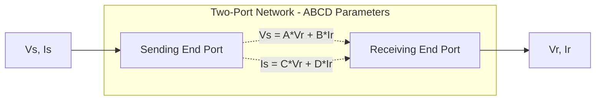
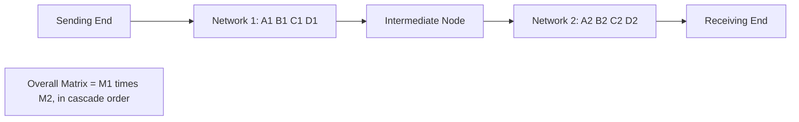

## ABCD Parameters and Two-Port Representation

### Overview

ABCD parameters (also called transmission parameters or general circuit constants) provide a standardized two-port network framework for relating the sending-end voltage and current of a transmission line, transformer, or cascaded network to its receiving-end voltage and current. This representation unifies the short, medium, and long-line models introduced in Short-Line, Medium-Line, and Long-Line Models under a single mathematical structure, and extends naturally to cascaded networks and other power system elements.

### Two-Port Network Concept

**Key Points**

- A two-port network has one pair of terminals (the sending end, or input port) and another pair of terminals (the receiving end, or output port), with the network's internal behavior fully characterized by the relationship between the four terminal quantities: $V_S$, $I_S$, $V_R$, $I_R$
- The ABCD parameter formulation expresses sending-end quantities as linear combinations of receiving-end quantities, which is a natural convention in power systems since receiving-end (load) conditions are often the known or specified quantities in radial network analysis

### Defining Equations

$$V_S = A V_R + B I_R$$

$$I_S = C V_R + D I_R$$

In matrix form:

$$\begin{bmatrix} V_S \\ I_S \end{bmatrix} = \begin{bmatrix} A & B \\ C & D \end{bmatrix} \begin{bmatrix} V_R \\ I_R \end{bmatrix}$$

### Physical Interpretation of Each Parameter

**Key Points**

- **A** (dimensionless): the voltage ratio $V_S/V_R$ under open-circuit receiving end ($I_R = 0$) — represents how sending-end voltage relates to receiving-end voltage with no load current drawn
- **B** (ohms): the ratio $V_S/I_R$ under short-circuit receiving end ($V_R = 0$) — represents the transfer impedance of the network
- **C** (siemens): the ratio $I_S/V_R$ under open-circuit receiving end ($I_R = 0$) — represents the transfer admittance of the network
- **D** (dimensionless): the current ratio $I_S/I_R$ under short-circuit receiving end ($V_R = 0$) — represents how sending-end current relates to receiving-end current under a bolted short-circuit condition

### Reciprocity and Symmetry Conditions

**Key Points**

- For any passive, linear, reciprocal two-port network (which includes all standard transmission line models), the determinant condition holds:

$$AD - BC = 1$$

- This provides a standard verification check on any calculated or measured set of ABCD parameters — if this relationship does not hold (within expected numerical precision), an error exists in the parameter derivation
- For a symmetrical network (where the sending and receiving ends are electrically interchangeable, as is the case for a uniform transmission line viewed from either end), $A = D$

### ABCD Parameters by Model Type

#### Short-Line Model

$$A = 1, \qquad B = Z, \qquad C = 0, \qquad D = 1$$

where $Z$ is the total series impedance. Since $C = 0$, no shunt admittance is represented, consistent with the short-line assumption discussed in Short-Line, Medium-Line, and Long-Line Models.

#### Medium-Line (Nominal-π) Model

$$A = D = 1 + \frac{ZY}{2}, \qquad B = Z, \qquad C = Y\left(1 + \frac{ZY}{4}\right)$$

where $Z$ is total series impedance and $Y$ is total shunt admittance.

#### Long-Line (Exact/Distributed) Model

$$A = D = \cosh(\gamma l), \qquad B = Z_C \sinh(\gamma l), \qquad C = \frac{\sinh(\gamma l)}{Z_C}$$

where $\gamma$ is the propagation constant and $Z_C$ is the characteristic impedance of the line, as derived from the distributed-parameter telegrapher's equations.

### Two-Port Representation Diagram

### Cascaded Networks

#### Combination Rule

**Key Points**

- One of the primary practical advantages of the ABCD formulation is that cascaded two-port networks (e.g., a transmission line section followed by a transformer, followed by another line section) combine via simple matrix multiplication
- For two cascaded networks with parameter matrices $M_1$ and $M_2$ (network 1 closer to the sending end), the overall equivalent network matrix is:

$$M_{total} = M_1 \times M_2 = \begin{bmatrix} A_1 & B_1 \\ C_1 & D_1 \end{bmatrix} \begin{bmatrix} A_2 & B_2 \\ C_2 & D_2 \end{bmatrix}$$

- Matrix multiplication order matters and must follow the physical cascading order from sending end to receiving end, since matrix multiplication is not commutative

**Example**

A transmission line section (Matrix $M_1$) feeding a step-down transformer (Matrix $M_2$, represented by its own equivalent ABCD parameters derived from series impedance and negligible shunt branch, per the approximate equivalent circuit discussed in Transformer Equivalent Circuits and Per-Unit Modeling) can be combined into a single overall ABCD matrix by multiplying $M_1 \times M_2$, allowing sending-end line conditions to be related directly to receiving-end (post-transformer) conditions without separately solving each stage. [Illustrative application; specific transformer ABCD representation depends on whether the approximate or exact equivalent circuit is used.]

### Transformer ABCD Parameters

**Key Points**

- An ideal transformer with turns ratio $a = N_1/N_2$ has ABCD parameters $A = a$, $B = 0$, $C = 0$, $D = 1/a$
- A practical transformer represented by its approximate equivalent circuit (series impedance $Z_T$ referred to one side, neglecting the shunt magnetizing branch) combined with an ideal transformer stage can be represented as a cascade of a series-impedance two-port ($A=1, B=Z_T, C=0, D=1$) and an ideal-transformer two-port, using the cascading rule above

### Sending-End Quantities from Receiving-End Conditions

**Key Points**

- Given known receiving-end (load) voltage and current, sending-end voltage and current are computed directly from the defining ABCD equations, which is the most common application direction in radial feeder and transmission line analysis
- The inverse relationship (finding receiving-end quantities from known sending-end conditions) requires inverting the ABCD matrix:

$$\begin{bmatrix} V_R \\ I_R \end{bmatrix} = \begin{bmatrix} D & -B \\ -C & A \end{bmatrix} \begin{bmatrix} V_S \\ I_S \end{bmatrix}$$

(using the property that for a matrix with determinant $AD-BC=1$, the inverse takes this simplified adjugate form)

### Voltage Regulation from ABCD Parameters

**Key Points**

- Percent voltage regulation, introduced in Short-Line, Medium-Line, and Long-Line Models, is computed using the $A$ parameter directly:

$$\%VR = \frac{\left|V_S/A\right| - \left|V_{R,\,rated}\right|}{\left|V_{R,\,rated}\right|} \times 100\%$$

- This represents the percentage voltage drop that occurs between no-load and full-load receiving-end conditions for a fixed sending-end voltage magnitude, since $V_S/A$ represents the no-load receiving-end voltage (when $I_R = 0$)

### Power Transfer Using ABCD Parameters

**Key Points**

- Real and reactive power at the receiving end can be expressed directly in terms of ABCD parameters and the sending/receiving voltage magnitudes and angles, providing an alternative to direct impedance-based power flow calculations
- Expressing $A = |A|\angle\alpha$ and $B = |B|\angle\beta$, the receiving-end real power is:

$$P_R = \frac{|V_S||V_R|}{|B|}\cos(\beta - \delta) - \frac{|A||V_R|^2}{|B|}\cos(\beta - \alpha)$$

where $\delta$ is the angle between $V_S$ and $V_R$. [Inference] This power-circle-diagram-based formulation is more commonly used in academic treatments of long-line power transfer analysis than in routine software-based power flow studies, which typically work directly with admittance matrices rather than ABCD two-port equations.

### Application Scope Beyond Transmission Lines

**Key Points**

- ABCD parameters apply generally to any linear, passive two-port network, including transformers, series/shunt compensation devices (fixed reactors, capacitor banks represented as two-port elements), and combinations thereof
- This generality makes the ABCD framework useful for representing entire radial circuits (source through multiple line sections and transformers to a load) as a single equivalent two-port network for simplified analysis
- [Unverified] While theoretically extensible to more complex network topologies, ABCD parameters are most naturally suited to simple series/cascade (radial) configurations rather than meshed networks, where admittance (Y-bus) or impedance (Z-bus) matrix methods are the standard analytical approach

### Related Topics

- Short-Line, Medium-Line, and Long-Line Models
- Series Resistance and Inductance of Transmission Lines
- Shunt Capacitance and Conductance
- Transformer Equivalent Circuits and Per-Unit Modeling
- Surge Impedance Loading and Power Transfer Capability
- Voltage regulation calculation methods for radial feeders
- Y-bus and Z-bus network matrix methods for meshed system analysis
- Power circle diagrams and graphical power transfer analysis