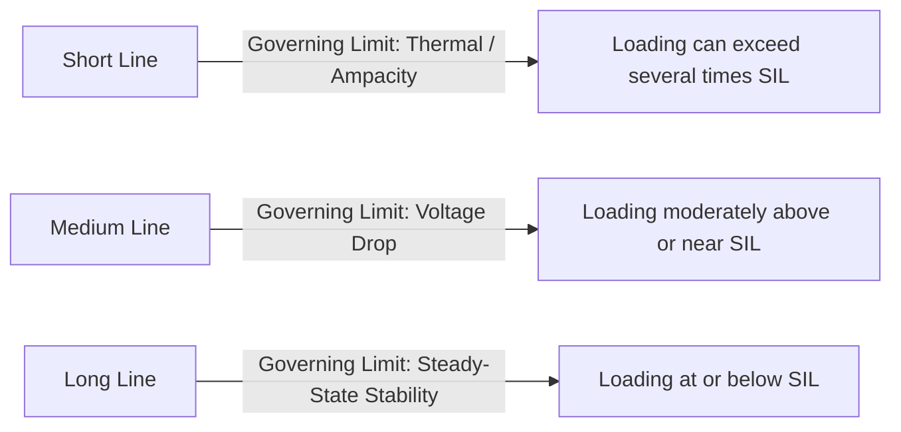
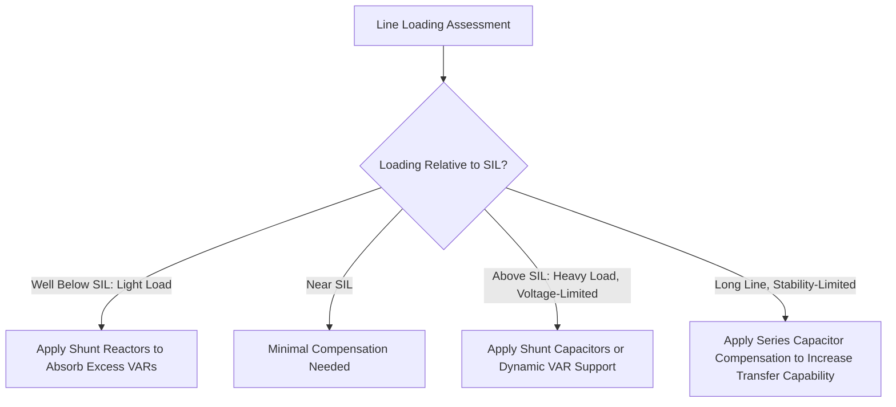

## Surge Impedance Loading and Reactive Compensation

### Overview

Surge Impedance Loading (SIL) defines the unique power transfer level at which a transmission line's reactive power balance is self-sustaining — the line's series inductance consumes exactly as much reactive power as its shunt capacitance produces. This natural loading point serves as a fundamental reference for transmission planning, line loadability assessment, and the design of reactive compensation schemes that extend usable power transfer beyond SIL-constrained limits or correct reactive imbalance at other loading levels.

### Characteristic (Surge) Impedance

**Key Points**

- Derived from the distributed line parameters introduced in Series Resistance and Inductance of Transmission Lines and Shunt Capacitance and Conductance:

$$Z_C = \sqrt{\frac{z}{y}} \approx \sqrt{\frac{L}{C}}$$

- The approximation (neglecting resistance $r$ and conductance $g$) is standard for characterizing SIL, since reactive power balance is fundamentally a lossless-line concept; resistance introduces real power loss that does not affect the reactive balance point in the idealized definition
- Typical overhead transmission line surge impedance values fall in the range of approximately 250–500 $\Omega$, with higher voltage/larger bundled-conductor lines generally exhibiting lower surge impedance due to increased effective capacitance and reduced inductance from bundling [Unverified — presented as a general range; specific values depend on conductor geometry, bundling, and voltage class]

### Definition of Surge Impedance Loading

**Key Points**

- SIL is defined as the three-phase power delivered by the line when terminated in a resistive load exactly equal to its surge impedance $Z_C$
- At this loading level, the line's reactive power consumption ($I^2 X_L$ from series inductance) exactly equals its reactive power production ($V^2 B_C$ from shunt capacitance), meaning the line neither absorbs nor supplies net reactive power to the connected system

$$SIL = \frac{V_{LL}^2}{Z_C} \text{ (MW, using line-to-line voltage in kV and } Z_C \text{ in ohms)}$$

**Example**

A 500 kV line with a surge impedance of 275 $\Omega$ has a SIL of $500^2/275 \approx 909$ MW. [Illustrative numeric example using representative values; actual surge impedance depends on the specific conductor bundle and tower geometry of the line in question.]

### Voltage and Current Behavior Relative to SIL

**Key Points**

- When line loading equals SIL, voltage magnitude remains essentially flat along the line's length (no significant rise or fall), since the reactive power balance means neither inductive voltage drop nor capacitive voltage rise dominates
- When loading is **below SIL** (lightly loaded line), the line acts as a net reactive power source (capacitive effect dominates), causing receiving-end voltage to rise above sending-end voltage — this is the Ferranti effect referenced in Shunt Capacitance and Conductance and Short-Line, Medium-Line, and Long-Line Models
- When loading is **above SIL** (heavily loaded line), the line acts as a net reactive power sink (inductive effect dominates), causing voltage to drop from sending end to receiving end, consistent with typical loaded-line behavior

### Voltage Profile Diagram (svg_diagram)

<svg xmlns="http://www.w3.org/2000/svg" viewBox="0 0 640 320">
<text x="320" y="20" text-anchor="middle" font-size="14" font-weight="bold">Voltage Profile Along Line vs. Loading Relative to SIL (svg_diagram)</text>
<line x1="70" y1="280" x2="580" y2="280" stroke="black" stroke-width="1.5" />
<line x1="70" y1="280" x2="70" y2="50" stroke="black" stroke-width="1.5" />
<text x="580" y="300" font-size="12">Distance Along Line</text>
<text x="20" y="55" font-size="12">Voltage (pu)</text>
<line x1="70" y1="150" x2="580" y2="150" stroke="gray" stroke-dasharray="3,3" />
<text x="30" y="153" font-size="11">1.0</text>
<path d="M 70 200 Q 325 80 580 60" fill="none" stroke="#117864" stroke-width="2.5" />
<text x="400" y="90" font-size="11" fill="#117864">Below SIL: V rises (Ferranti)</text>
<line x1="70" y1="150" x2="580" y2="150" stroke="#1a5276" stroke-width="2.5" />
<text x="230" y="140" font-size="11" fill="#1a5276">At SIL: V approximately flat</text>
<path d="M 70 100 Q 325 200 580 260" fill="none" stroke="#c0392b" stroke-width="2.5" />
<text x="380" y="230" font-size="11" fill="#c0392b">Above SIL: V drops</text>
</svg>

### Loadability Curve and Practical Loading Limits

**Key Points**

- The **line loadability curve** plots the maximum practical loading of a line as a multiple of SIL against line length, reflecting that different limiting constraints dominate at different length ranges
- For **short lines**, thermal (conductor ampacity) limits typically govern maximum loading, often allowing loading well above SIL (sometimes 3–5 times SIL or more for short lines) [Unverified — specific multiples are illustrative rules of thumb from standard loadability curve references, such as the commonly cited St. Clair curve, and vary with specific system and conductor characteristics]
- For **medium-length lines**, voltage drop (maintaining acceptable receiving-end voltage) typically becomes the binding constraint, generally limiting loading to a lower multiple of SIL than the thermal limit would otherwise allow
- For **long lines**, steady-state stability (maintaining adequate transmission angle margin) typically becomes the binding constraint, often limiting loading to at or below SIL for very long lines
- [Unverified] This three-region loadability characterization (thermal-limited, voltage-limited, stability-limited) is a widely referenced planning heuristic (commonly associated with the "St. Clair curve") rather than a precise formula, and actual limits depend on specific system strength, voltage support, and reliability criteria at each end of the line

### Reactive Compensation Strategies

#### Shunt Reactors

**Key Points**

- Used to absorb excess reactive power on lightly loaded (below-SIL) long lines, counteracting the Ferranti effect and limiting receiving-end overvoltage
- Commonly switched (energized/de-energized) based on loading conditions, since a fixed shunt reactor sized for light-load conditions would over-absorb reactive power (potentially causing undervoltage) during heavier loading
- Can be connected at the line terminals (bus-connected) or, in some designs, directly across sections of the line itself (line-connected reactors) for very long EHV lines

#### Shunt Capacitor Banks

**Key Points**

- Used to supply reactive power support during heavily loaded (above-SIL) conditions, helping to counteract voltage drop and improve voltage profile
- Typically switched in stages to match varying system reactive power needs across the daily/seasonal load cycle

#### Series Capacitor Compensation

**Key Points**

- Series capacitors are inserted in series with the transmission line to partially cancel the line's series inductive reactance, effectively reducing the electrical length of the line
- This reduction in effective reactance increases the maximum steady-state power transfer capability (per the $P = V_1V_2\sin\delta/X$ relationship) and can raise the effective SIL-relative loadability of long, stability-limited lines
- Series compensation introduces additional protection and control considerations, including the risk of subsynchronous resonance (SSR) interaction with nearby turbine-generator shafts, which must be evaluated particularly when compensating lines connected near large steam turbine-generators

#### Static and Dynamic Reactive Compensation (SVC, STATCOM)

**Key Points**

- Static VAR Compensators (SVC) and Static Synchronous Compensators (STATCOM) provide continuously variable, fast-responding reactive power support (absorption or supply) at a bus, rather than the discrete switching steps of conventional reactor/capacitor banks
- These devices can dynamically adjust reactive output in response to real-time voltage conditions, providing more precise voltage regulation than switched shunt compensation alone, particularly valuable for lines and systems experiencing rapid loading variation
- [Inference] The choice between switched shunt banks, series capacitors, and SVC/STATCOM devices for a given compensation need typically involves a trade-off between capital cost, response speed requirements, and the specific nature of the reactive power problem being addressed (static voltage support vs. dynamic stability enhancement)

### Compensation Application by Loading Region

### Effect of Compensation on Effective SIL

**Key Points**

- Series compensation effectively reduces the line's apparent series reactance, which increases the natural power transfer capability but does not change the physical SIL of the uncompensated line itself — rather, it shifts the stability-limited loadability curve favorably
- Shunt compensation (reactors/capacitors) addresses reactive power balance and voltage profile at a given loading point but does not directly alter the fundamental steady-state stability power transfer limit in the same way series compensation does
- [Inference] Because series and shunt compensation address different aspects of the loadability problem (stability/angle limit versus reactive/voltage balance), many long-line compensation schemes employ both types together to address voltage profile and stability margin simultaneously

### Relationship to Steady-State Stability Limit

The theoretical maximum steady-state power transfer for a lossless line (from the two-machine power-angle relationship) is:

$$P_{max} = \frac{V_S V_R}{X_L}\sin(90°) = \frac{V_S V_R}{X_L}$$

occurring at a 90° angle difference, though practical operating limits maintain substantial margin below this theoretical maximum (commonly citing stability margins well below the 90° theoretical angle) to accommodate dynamic disturbances and maintain adequate transient stability reserve. [Unverified — specific practical margin criteria (e.g., maximum operating angle) are utility- and reliability-standard-specific rather than a single universal value.]

### Related Topics

- Series Resistance and Inductance of Transmission Lines
- Shunt Capacitance and Conductance
- Short-Line, Medium-Line, and Long-Line Models
- ABCD Parameters and Two-Port Representation
- Ferranti effect and long-line receiving-end overvoltage
- Subsynchronous resonance (SSR) and series compensation interaction with turbine-generators
- FACTS devices: SVC, STATCOM, and series/shunt compensation technologies
- Steady-state and transient stability analysis using power-angle relationships
- Line loadability curves (St. Clair curve) and transmission planning criteria