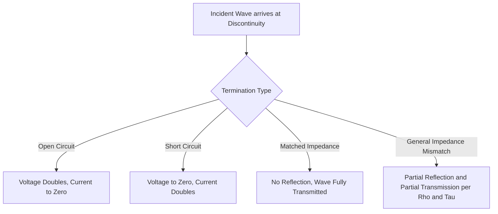
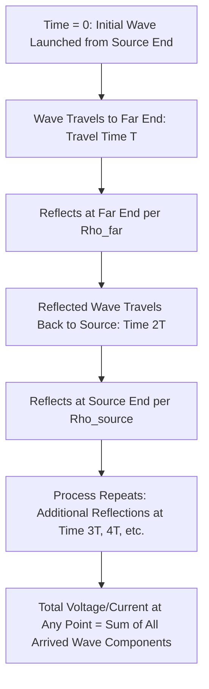

## Traveling Waves and Surge Phenomena

### Overview

Traveling wave theory describes how voltage and current disturbances propagate along a transmission line as electromagnetic waves rather than as instantaneous, uniformly distributed changes. This distributed-parameter, time-domain perspective is essential for understanding transient overvoltages from lightning strikes and switching operations, and underpins the design of insulation coordination, surge arresters, and traveling-wave-based fault location and protection methods.

### Physical Basis: The Telegrapher's Equations

**Key Points**

- A transmission line is modeled as a continuum of infinitesimal series impedance ($r$, $l$ per unit length) and shunt admittance ($g$, $c$ per unit length) elements, the same distributed parameters introduced in Series Resistance and Inductance of Transmission Lines and Shunt Capacitance and Conductance
- The telegrapher's equations describe how voltage $v(x,t)$ and current $i(x,t)$ vary with both position $x$ along the line and time $t$:

$$-\frac{\partial v}{\partial x} = r\,i + l\,\frac{\partial i}{\partial t}$$

$$-\frac{\partial i}{\partial x} = g\,v + c\,\frac{\partial v}{\partial t}$$

- These coupled partial differential equations, when combined, yield the classical wave equation, showing that voltage and current disturbances propagate as waves along the line rather than appearing instantaneously everywhere

### Wave Propagation Velocity

**Key Points**

- For a lossless line ($r = g = 0$), the propagation velocity of the traveling wave is:

$$v_p = \frac{1}{\sqrt{lc}}$$

- For an overhead transmission line, this velocity approaches the speed of light in free space (approximately $3 \times 10^8$ m/s), since the surrounding medium is predominantly air; underground cables exhibit substantially lower propagation velocity (commonly on the order of 50–60% of the speed of light) due to the higher permittivity of the cable's solid dielectric insulation [Unverified — specific velocity factors depend on the particular cable insulation material and construction]

### Characteristic (Surge) Impedance in Wave Propagation

**Key Points**

- The characteristic impedance $Z_C = \sqrt{l/c}$ (for a lossless line), already introduced in Surge Impedance Loading and Reactive Compensation, plays a central role in traveling wave analysis: it relates the traveling voltage wave to its accompanying traveling current wave

$$v^+(x,t) = Z_C \, i^+(x,t)$$

for a forward-traveling wave, with an analogous relationship (with opposite sign convention) for a backward-traveling (reflected) wave

### Wave Reflection and Refraction at Discontinuities

#### General Reflection/Refraction Coefficients

**Key Points**

- When a traveling wave encounters a discontinuity (a change in surge impedance, such as a junction between a line and a cable, a transformer, an open circuit, or a short circuit), part of the wave is reflected back toward the source and part is transmitted (refracted) into the new medium
- For a wave traveling on a line of surge impedance $Z_1$ encountering a junction with a line/element of surge impedance $Z_2$, the reflection coefficient $\rho$ and transmission (refraction) coefficient $\tau$ for voltage are:

$$\rho = \frac{Z_2 - Z_1}{Z_2 + Z_1}, \qquad \tau = \frac{2Z_2}{Z_2 + Z_1}$$

- Current reflection and transmission coefficients follow analogous but sign-adjusted relationships, since current and voltage waves are related through the surge impedance with opposite sign convention for reflected waves

#### Special Termination Cases

**Key Points**

- **Open-circuit termination** ($Z_2 = \infty$): voltage reflection coefficient $\rho = +1$ (full positive reflection, voltage doubles momentarily at the open end), while current reflection coefficient is $-1$ (current reflects fully negated, going to zero at the open termination)
- **Short-circuit termination** ($Z_2 = 0$): voltage reflection coefficient $\rho = -1$ (voltage goes to zero at the short), while current reflection coefficient is $+1$ (current doubles momentarily at the short-circuit point)
- **Matched termination** ($Z_2 = Z_1$): no reflection occurs ($\rho = 0$); the incident wave is fully absorbed as if the line continued indefinitely — this is the basis for line termination and surge absorber design in some specialized applications

### Lattice Diagrams

**Key Points**

- A lattice diagram (Bewley lattice diagram) is a graphical method for tracking multiple reflections of a traveling wave between two discontinuities (e.g., a line section terminated by different impedances at each end), plotting position on the horizontal axis and time on the vertical axis
- Each diagonal line represents a wave traveling in one direction; at each discontinuity, the wave splits into a reflected component (continuing back along the diagram) and a transmitted component, with magnitudes determined by the applicable reflection/transmission coefficients at that boundary
- This method allows manual calculation of the voltage or current at any point on the line at any time, by summing all wave arrivals (original plus all relevant reflections) up to that time

### Lightning Surges

**Key Points**

- Direct or nearby lightning strikes inject a very fast-rising, high-magnitude traveling wave onto a transmission line (via a direct strike to the phase conductor, or via induced/backflash mechanisms when a strike hits a shield wire or nearby tower)
- Standard lightning impulse waveshapes used for testing and analysis (e.g., the 1.2/50 microsecond waveform, indicating rise time and time-to-half-value) are standardized representations used in insulation coordination studies, referenced in Transformer Testing, Protection, and Condition Monitoring for impulse withstand testing
- The rate of voltage rise and the traveling wave's interaction with line terminations (transformers, open breakers, cable/line junctions) determines the peak voltage stress experienced by connected equipment, which can significantly exceed the incident surge magnitude at an open-circuit-like termination due to the doubling effect described above

### Switching Surges

**Key Points**

- Circuit breaker operations (energizing a line, clearing a fault, reclosing) launch traveling waves due to the abrupt change in circuit conditions at the switching instant
- Switching surges generally have slower rise times than lightning surges but can persist longer and, on very long EHV lines, can produce significant overvoltage magnitudes due to resonance and reflection effects specific to the switched line's length and termination conditions
- Controlled/synchronized closing (point-on-wave switching) is sometimes used specifically to minimize switching surge magnitude by controlling the electrical angle at which the breaker contacts close relative to the voltage waveform [Unverified — application of point-on-wave switching control is more common on certain EHV circuit breaker applications and shunt reactor/capacitor switching than as a universal practice across all breaker types]

### Surge Arresters and Insulation Coordination

**Key Points**

- Surge (lightning) arresters provide a nonlinear voltage-limiting device connected between phase conductors and ground, designed to conduct heavily once voltage exceeds a threshold (limiting the peak voltage that reaches protected equipment) while presenting high impedance at normal operating voltage
- Modern surge arresters predominantly use metal-oxide varistor (MOV) technology, offering a highly nonlinear voltage-current characteristic without the gapped-spark-gap structure of older arrester designs
- Insulation coordination is the overall engineering process of selecting equipment insulation withstand levels relative to expected surge magnitudes (as limited by surge arrester protective levels), ensuring an appropriate margin between the arrester's protective level and the equipment's withstand capability

### Traveling-Wave-Based Fault Location

**Key Points**

- Fault-induced traveling waves propagate from the fault location toward both line terminals; by precisely timing wave arrival at each end (often using GPS-synchronized time-stamping) and knowing the line's propagation velocity, the fault location can be calculated from the time difference between the two arrivals

$$d = \frac{l + v_p(t_A - t_B)}{2}$$

where $l$ is total line length, $v_p$ is propagation velocity, and $t_A$, $t_B$ are the wave arrival times at each end. This method offers substantially higher location accuracy than traditional impedance-based fault location methods, particularly valuable for long transmission lines. [Unverified — accuracy figures and specific implementation details are vendor- and installation-specific]

### Traveling-Wave-Based Protection

**Key Points**

- Traveling-wave relays use the very fast (microsecond-scale) initial wavefront arriving at a line terminal following a fault to make extremely fast trip decisions, offering protection speeds significantly faster than conventional phasor-based distance or differential protection
- [Unverified] Adoption of traveling-wave protection has grown in recent years, particularly for long EHV lines and applications demanding very fast fault clearing, though conventional phasor-based protection remains the predominant approach across most transmission systems

### Practical Application Summary

**Key Points**

- Traveling wave analysis is primarily applied in: insulation coordination and surge arrester application studies, transient (electromagnetic transient, EMT) simulation of switching and lightning events, traveling-wave-based fault location systems, and specialized ultra-high-speed protection schemes
- Standard steady-state power system studies (load flow, conventional short-circuit analysis) do not require traveling wave theory, since they operate on phasor (frequency-domain, power-frequency) representations rather than time-domain transient wave propagation
- Electromagnetic Transients Program (EMTP)-type simulation tools implement traveling wave line models explicitly to accurately capture these fast transient phenomena for detailed transient studies

### Related Topics

- Series Resistance and Inductance of Transmission Lines
- Shunt Capacitance and Conductance
- Surge Impedance Loading and Reactive Compensation
- Insulation coordination and surge arrester application (IEEE/IEC standards)
- Lightning performance of transmission lines (shielding, backflash, tower footing resistance)
- Circuit breaker switching transients and point-on-wave control
- Electromagnetic Transients Program (EMTP) simulation methods
- Traveling-wave-based fault location and ultra-high-speed protection schemes