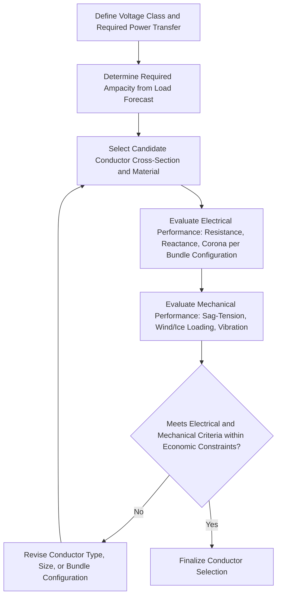

## Conductor Types and Selection Criteria

### Overview

Transmission line conductor selection involves balancing electrical performance (ampacity, resistance, reactance contribution), mechanical requirements (tensile strength, sag-tension behavior, wind/ice loading), and economic factors (material cost, losses, installation) across the range of available conductor constructions. The choice of conductor material and construction directly shapes the electrical parameters covered in Series Resistance and Inductance of Transmission Lines and Shunt Capacitance and Conductance, as well as the mechanical design of supporting structures.

### Conductor Materials

#### Aluminum

**Key Points**

- The dominant conductor material for overhead transmission lines due to its favorable combination of low cost, light weight (approximately one-third the density of copper), and adequate conductivity
- Pure aluminum has lower tensile strength than copper, which is a primary reason for reinforcement (steel core) or alloying in most transmission-grade conductor designs
- Aluminum conductivity is typically referenced as approximately 61% of the International Annealed Copper Standard (IACS) for standard electrical-grade aluminum, though aluminum alloys used for conductor applications can have somewhat different conductivity/strength trade-offs [Unverified — specific conductivity percentage depends on the aluminum alloy grade used]

#### Copper

**Key Points**

- Historically the original transmission conductor material, offering higher conductivity and tensile strength than aluminum for a given cross-sectional area
- Largely displaced by aluminum-based conductors for new overhead transmission construction due to aluminum's substantially lower cost per unit of current-carrying capacity, though copper remains common in underground cables, substation buswork, and specialized applications
- [Unverified] The specific balance of remaining copper transmission applications varies by region and historical infrastructure vintage

#### Steel

**Key Points**

- Used primarily as a reinforcing core material within composite conductors (providing tensile strength) rather than as the primary current-carrying material, since steel's electrical conductivity is substantially lower than aluminum or copper
- Also used for overhead ground wires (shield wires), sometimes in combination with optical fiber (OPGW — Optical Ground Wire) for combined lightning shielding and communication functions

### Common Conductor Constructions

#### ACSR (Aluminum Conductor Steel Reinforced)

**Key Points**

- The most widely used transmission conductor type historically, consisting of aluminum strands surrounding a steel core, with the steel core providing tensile strength and the aluminum strands carrying the majority of current
- Available in various stranding configurations (differing aluminum-to-steel strand ratios), allowing designers to select a balance of strength versus conductivity/weight appropriate to the specific span and loading requirements
- The steel core carries negligible current at power frequency due to current redistribution favoring the higher-conductivity aluminum strands (and, to a lesser degree, due to the steel's higher relative resistance and any magnetic effects), a point also noted in Series Resistance and Inductance of Transmission Lines

#### AAC (All-Aluminum Conductor)

**Key Points**

- Constructed entirely of aluminum strands with no steel reinforcement, offering the highest conductivity for a given cross-sectional area among common conductor types but with lower tensile strength than ACSR
- Commonly used for shorter spans and distribution applications where high tensile strength is less critical, and in corrosive/coastal environments where the absence of steel eliminates galvanic corrosion concerns between dissimilar metals

#### AAAC (All-Aluminum Alloy Conductor)

**Key Points**

- Uses a higher-strength aluminum alloy (rather than steel) throughout, providing improved tensile strength compared to AAC while retaining the corrosion-resistance and weight advantages of an all-aluminum construction
- Often selected for coastal or corrosive environments as an alternative to ACSR, avoiding the bimetallic corrosion risk associated with the aluminum-steel interface in ACSR under certain conditions

#### ACAR (Aluminum Conductor Alloy Reinforced)

**Key Points**

- Combines standard aluminum strands with higher-strength aluminum alloy strands (rather than a steel core), providing a strength/conductivity balance intermediate between AAC and ACSR while avoiding a steel core entirely

#### High-Temperature Low-Sag (HTLS) Conductors

**Key Points**

- A category of advanced conductor designs developed to allow higher continuous operating temperatures (and correspondingly higher ampacity) while limiting sag increase compared to conventional ACSR at the same temperature, addressing the traditional sag-temperature trade-off that limits conventional conductor uprating
- Common HTLS sub-types include: ACSS (Aluminum Conductor Steel Supported, using fully annealed aluminum strands around a steel core, allowing operation at higher temperatures since the steel core carries essentially all mechanical load), and various composite-core designs (e.g., ACCC — Aluminum Conductor Composite Core, using a carbon/glass fiber composite core instead of steel for reduced weight and lower thermal expansion, and gap-type conductors)
- [Unverified] HTLS conductors are typically applied selectively for line uprating/reconductoring projects where increased capacity is needed without new right-of-way or structure replacement, given their generally higher cost than conventional ACSR — specific technology selection depends on project-specific technical and economic evaluation

### Electrical Selection Criteria

#### Ampacity (Current-Carrying Capacity)

**Key Points**

- Determined by the conductor's ability to dissipate $I^2R$ heating to the surrounding environment while remaining within its rated maximum operating temperature, considering ambient temperature, wind speed, solar heating, and conductor emissivity
- Standard methodologies (e.g., IEEE Std 738) provide the heat balance equation framework for calculating steady-state and transient ampacity ratings based on these environmental and conductor-specific parameters
- Larger cross-sectional area increases ampacity but also increases conductor weight, cost, and (for a solid or lightly stranded design) wind/ice loading — motivating the stranded, often multi-material constructions described above

#### Resistance and Losses

**Key Points**

- Directly informs $I^2R$ loss calculations, as discussed in Transformer Losses, Efficiency, and Thermal Loading in the transformer context, and analogously significant for conductor selection given that line losses represent an ongoing operational cost over the conductor's service life
- Larger conductor cross-section reduces resistance and losses but increases capital cost, motivating loss-evaluation-based economic conductor sizing methods (analogous in principle to the capitalized loss evaluation approach used for transformer procurement)

#### Reactance and Bundle Configuration

**Key Points**

- As discussed in Series Resistance and Inductance of Transmission Lines, conductor bundling (multiple sub-conductors per phase) reduces series reactance by increasing the effective bundle GMR, an important consideration for higher-voltage lines where reactance-driven voltage drop and power transfer capability are significant design drivers
- Bundle conductor selection (number of sub-conductors, sub-conductor spacing) balances reactance reduction, corona/electric field mitigation (per Shunt Capacitance and Conductance), and the added mechanical/structural complexity of bundle spacers and larger tower/insulator assemblies

### Mechanical Selection Criteria

#### Tensile Strength and Sag-Tension Behavior

**Key Points**

- Conductor tensile strength (rated breaking strength, RBS) must be adequate to withstand everyday tension plus additional loading from wind and ice, while maintaining appropriate sag under the full range of expected temperature and loading conditions
- Sag-tension calculations determine the conductor's position between supporting structures across the full operating temperature range (from cold, high-tension conditions to hot, high-sag conditions), ensuring adequate ground clearance is maintained under worst-case sag conditions
- Conductor creep (permanent, time-dependent elongation under sustained tension, particularly significant for aluminum) must be accounted for in long-term sag-tension design, since it gradually increases sag over the conductor's service life independent of thermal effects

#### Wind and Ice Loading

**Key Points**

- Design loading criteria (per applicable national/regional standards, e.g., NESC in the United States) specify combined wind and ice loading scenarios that the conductor and supporting structures must withstand without exceeding allowable stress limits
- Ice accumulation significantly increases both conductor weight (vertical load) and effective diameter (increasing wind loading area), making combined ice-plus-wind loading scenarios often more severe than either loading type considered alone
- [Unverified] Specific design loading districts/zones and criteria vary substantially by region and applicable standard, reflecting local climate severity

#### Aeolian Vibration and Galloping

**Key Points**

- **Aeolian vibration**: high-frequency, low-amplitude oscillation caused by vortex shedding in steady, moderate winds, which can cause conductor fatigue at suspension points and clamps over time if not adequately damped (commonly mitigated using stockbridge dampers)
- **Galloping**: low-frequency, high-amplitude oscillation that can occur under specific combinations of moderate wind and asymmetric ice accretion (which creates an aerodynamically unstable conductor cross-section), potentially causing phase-to-phase contact or severe mechanical stress on structures and hardware
- Both phenomena influence conductor selection (surface characteristics, bundle configuration) and require appropriate damping/spacer hardware design as a complementary mitigation measure

### Conductor Selection Decision Framework

### Economic Considerations

**Key Points**

- Conductor selection often involves an economic optimization balancing initial capital cost (conductor material, larger structures/insulators for heavier or larger-diameter conductors) against the capitalized value of resistive losses over the line's operating life, conceptually analogous to the loss evaluation approach discussed for transformers
- Right-of-way constraints and the cost/feasibility of new structures can favor conductor uprating (including HTLS technology) over new line construction when capacity increases are needed on existing corridors
- [Unverified] Specific economic evaluation methodologies and loss capitalization rates are utility- and project-specific financial parameters rather than standardized engineering constants

### Related Topics

- Series Resistance and Inductance of Transmission Lines
- Shunt Capacitance and Conductance
- Transmission tower design and structural loading criteria
- Sag-tension calculation methods and conductor creep behavior
- Aeolian vibration damping and galloping mitigation hardware
- Overhead ground wires and OPGW (Optical Ground Wire) applications
- IEEE Std 738 conductor ampacity calculation methodology
- Line uprating and reconductoring with High-Temperature Low-Sag (HTLS) conductors