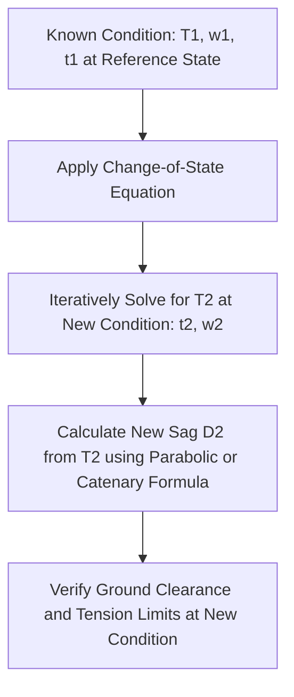

## Sag-Tension Calculations

### Overview

Sag-tension calculations determine the physical shape (sag) and mechanical tension of a transmission conductor suspended between support structures across the full range of operating conditions — temperature extremes, ice accretion, and wind loading. These calculations are fundamental to ensuring adequate ground clearance is maintained throughout the conductor's service life while keeping mechanical stress within safe limits for the conductor and supporting structures, directly building on the conductor selection principles discussed in Conductor Types and Selection Criteria.

### The Catenary Curve

**Key Points**

- A conductor suspended between two support points under its own weight (and any additional ice/wind loading) forms a catenary curve, described by hyperbolic cosine functions, though the parabolic approximation is commonly used for spans typical of transmission line design given the small sag-to-span ratio involved
- The exact catenary equation for conductor height $y$ as a function of horizontal position $x$ (measured from the low point of the curve) is:

$$y = \frac{T_0}{w}\left[\cosh\left(\frac{wx}{T_0}\right) - 1\right]$$

where $T_0$ is the horizontal component of tension and $w$ is the conductor weight per unit length (including any ice/wind loading).

#### Parabolic Approximation

**Key Points**

- For typical transmission spans, where sag is small relative to span length, the catenary can be approximated by a parabola, substantially simplifying hand calculations:

$$y \approx \frac{w x^2}{2T_0}$$

- The maximum sag $D$ at midspan for a level span of length $S$ is:

$$D = \frac{wS^2}{8T_0}$$

- [Unverified] The specific sag-to-span ratio threshold below which the parabolic approximation is considered acceptably accurate is a matter of standard engineering practice guidance rather than a single universally cited numeric cutoff, though it is well-established as suitable for the great majority of practical transmission spans

### Sag-Tension Diagram (svg_diagram)

<svg xmlns="http://www.w3.org/2000/svg" viewBox="0 0 640 320">
<text x="320" y="20" text-anchor="middle" font-size="14" font-weight="bold">Conductor Sag Between Support Structures (svg_diagram)</text>
<line x1="100" y1="80" x2="100" y2="260" stroke="black" stroke-width="3" />
<line x1="540" y1="80" x2="540" y2="260" stroke="black" stroke-width="3" />
<text x="80" y="70" font-size="11">Structure A</text>
<text x="520" y="70" font-size="11">Structure B</text>
<path d="M 100 100 Q 320 220 540 100" fill="none" stroke="#1a5276" stroke-width="2.5" />
<line x1="320" y1="160" x2="320" y2="220" stroke="gray" stroke-dasharray="3,3" />
<text x="330" y="195" font-size="11">Sag (D)</text>
<line x1="100" y1="100" x2="540" y2="100" stroke="gray" stroke-dasharray="3,3" />
<text x="290" y="90" font-size="11">Span (S)</text>
<line x1="320" y1="260" x2="320" y2="280" stroke="black" stroke-dasharray="2,2" />
<text x="260" y="300" font-size="11">Ground Clearance (must be maintained under max sag)</text>
</svg>

### Conductor Loading Conditions

#### Everyday (Base) Condition

**Key Points**

- Represents typical ambient temperature with no ice or unusual wind loading, used as the reference condition from which other loading conditions are derived via the change-of-state equation
- Everyday tension is typically specified as a percentage of the conductor's rated breaking strength (RBS) — commonly cited design practice targets initial (unloaded, installation) tension well below RBS, with specific percentages set by applicable design standards and utility practice [Unverified — specific percentage of RBS varies by standard, region, and conductor type rather than a single universal value]

#### Maximum Ice and Wind Loading Condition

**Key Points**

- Represents the combined loading of ice accretion (increasing both weight and effective diameter) and design wind speed acting on the ice-covered conductor, per applicable regional loading criteria (e.g., NESC loading districts in the United States, or region-specific standards elsewhere)
- This condition typically governs maximum conductor tension, since it combines the heaviest total effective load (conductor weight plus ice) with concurrent wind force, representing the mechanically most severe design scenario

#### Maximum Temperature Condition

**Key Points**

- Represents the highest conductor operating temperature (from maximum electrical loading combined with worst-case ambient/solar heating conditions), at which conductor thermal expansion produces maximum sag
- This condition typically governs the minimum ground clearance check, since thermal expansion at maximum operating temperature produces the greatest sag and hence the least clearance to ground or crossing structures

#### Minimum Temperature Condition

**Key Points**

- Represents the coldest design temperature, at which conductor thermal contraction produces minimum sag and maximum tension (in the absence of ice loading)
- Relevant for checking maximum tension limits are not exceeded and for structure/hardware design at the high-tension, low-temperature extreme

### The Change-of-State Equation

**Key Points**

- Relates conductor tension and sag at one set of conditions (temperature, loading) to tension and sag at another set of conditions, accounting for both thermal expansion/contraction and elastic (tension-induced) stretch
- The general change-of-state equation, derived from the parabolic sag approximation combined with the conductor's stress-strain and thermal expansion characteristics, is expressed as:

$$T_2 - \frac{E A w_1^2 S^2}{24 T_1^2} + E A \alpha (t_2 - t_1) = T_1 + \frac{E A w_2^2 S^2}{24 T_2^2}$$

where $T_1$, $T_2$ are horizontal tensions at initial and final conditions, $w_1$, $w_2$ are the corresponding total unit weights (including any ice loading), $E$ is the conductor's modulus of elasticity, $A$ is cross-sectional area, $\alpha$ is the coefficient of linear thermal expansion, and $t_1$, $t_2$ are the corresponding temperatures. [Unverified — this is the standard form found in transmission line mechanical design references; specific solution methods (iterative/numerical, since $T_2$ appears on both sides) and exact notation conventions can vary slightly between textbooks and design software.]

- Because $T_2$ appears in the equation in a form that cannot be isolated algebraically (it appears both linearly and within a squared denominator term), the equation is typically solved iteratively or via numerical methods rather than direct algebraic solution

### Conductor Elastic and Thermal Properties

**Key Points**

- **Modulus of elasticity** ($E$): characterizes conductor stretch under tension; composite conductors (such as ACSR) exhibit a composite modulus reflecting the combined behavior of the aluminum and steel components, which can behave somewhat differently under low tension (aluminum and steel sharing load elastically) versus high tension (potential aluminum strand slack takeup effects) — full engineering treatment often uses manufacturer-supplied stress-strain curves rather than a single constant modulus value
- **Coefficient of thermal expansion** ($\alpha$): governs conductor length change with temperature; composite conductors again exhibit an effective coefficient reflecting the relative contribution and thermal behavior of each constituent material
- **Conductor creep**: permanent, time-dependent inelastic elongation under sustained tension over the conductor's service life, particularly significant for aluminum; creep effects are typically incorporated into long-term ("final") sag-tension calculations separately from the elastic and thermal effects captured in the standard change-of-state equation

### Stringing Sag Tables

**Key Points**

- During construction, conductors are strung (pulled to final position) according to stringing sag tables or charts that specify the correct sag (or tension) for the actual ambient temperature at the time of stringing, ensuring the conductor achieves the intended design tension/sag relationship once installed
- These tables are generated by applying the change-of-state equation across the full range of anticipated stringing temperatures, referenced back to the design's specified initial (everyday) tension condition
- Ruling span concepts are used for multi-span sections with dissimilar individual span lengths, calculating an equivalent single span length that represents the tension behavior of the full multi-span section for stringing purposes

### Clearance Requirements

**Key Points**

- Minimum ground clearance requirements (varying by voltage class, terrain type, and crossing conditions such as roads, railways, or other utility lines) are specified by applicable electrical safety codes (e.g., the National Electrical Safety Code, NESC, in the United States, or equivalent regional/national standards elsewhere)
- Clearance must be verified at the maximum sag condition (typically maximum conductor operating temperature, sometimes also checked under ice loading conditions depending on the applicable code's requirements), since this represents the worst-case (minimum clearance) scenario
- [Unverified] Specific clearance values vary substantially by jurisdiction, voltage class, and crossing type; applicable local/national code requirements should always be consulted directly for specific design compliance rather than relying on generic figures

### Structure Loading Implications

**Key Points**

- Conductor tension at each support structure directly informs structure and hardware design loading, particularly at angle structures (where the line changes direction) and dead-end structures (which must withstand the full unbalanced tension of the conductor on one side)
- Tension differences between adjacent spans (from differing span lengths, elevation changes, or asymmetric ice loading scenarios) can impose additional unbalanced longitudinal loads on structures, requiring specific design consideration beyond the simple level-span sag-tension calculation

### Related Topics

- Conductor Types and Selection Criteria
- Transmission tower design and structural loading criteria
- Aeolian vibration damping and galloping mitigation hardware
- Ruling span concept and multi-span stringing methodology
- National Electrical Safety Code (NESC) and regional clearance/loading standards
- Conductor creep behavior and long-term sag prediction
- High-Temperature Low-Sag (HTLS) conductor sag-tension characteristics
- Insulator and hardware selection for angle and dead-end structures