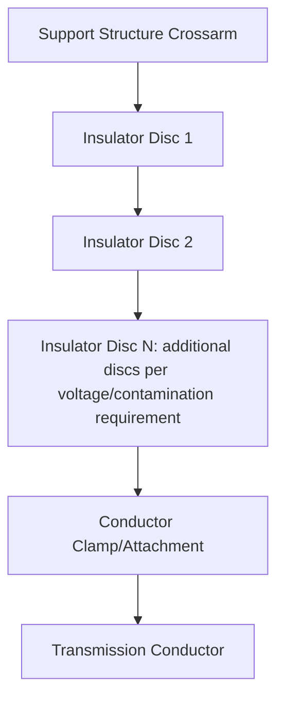
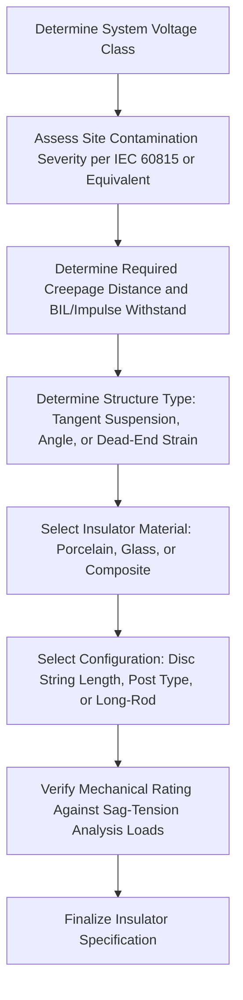

## Insulator Types and Selection

### Overview

Transmission line insulators provide electrical isolation between energized conductors and grounded support structures while mechanically supporting the conductor's weight and tension loads. Insulator selection involves balancing electrical withstand requirements (power-frequency, lightning impulse, and switching surge voltages), mechanical strength requirements (tension or cantilever loading depending on application), and environmental resistance (contamination, UV degradation, mechanical aging), all coordinated with the surge and insulation coordination principles introduced in Traveling Waves and Surge Phenomena.

### Insulator Materials

#### Porcelain

**Key Points**

- The traditional insulator material, offering good electrical and mechanical properties along with long-established manufacturing and performance history
- Susceptible to brittle fracture from mechanical impact or internal defects, and porcelain insulators can develop internal voids that lead to eventual electrical puncture failure, particularly in older or lower-quality units
- Remains widely used, particularly in regions with established porcelain insulator manufacturing and maintenance practices

#### Glass (Toughened/Tempered)

**Key Points**

- Toughened glass insulators shatter (self-destruct) visibly when internally damaged or electrically punctured, providing an inherent visual indication of a failed unit that porcelain does not typically provide as reliably
- This "self-indicating" failure characteristic is often cited as a maintenance advantage, since damaged units can be readily identified during visual inspection rather than requiring specialized testing
- Historically favored in some regions/utilities for this failure-indication characteristic, though usage patterns vary considerably by region and utility practice

#### Composite (Polymer/Non-Ceramic)

**Key Points**

- Constructed with a fiberglass-reinforced epoxy or similar composite rod core (providing mechanical strength) covered by weathersheds made of silicone rubber, EPDM, or similar polymer material (providing electrical insulation and contamination performance)
- Significantly lighter weight than porcelain or glass for equivalent electrical/mechanical rating, simplifying installation and reducing structure loading requirements
- Generally exhibits superior contamination (pollution) performance compared to porcelain/glass due to the hydrophobic surface properties of silicone rubber, which causes water to bead rather than form continuous conductive films across the surface
- [Unverified] Long-term aging behavior and service life of composite insulators, while extensively studied and improved over decades of use, is sometimes noted as having a shorter established service history compared to porcelain/glass units that have been in continuous use for a much longer period — specific comparative service life expectations depend on the particular polymer formulation, environmental exposure, and manufacturer

### Insulator Shapes and Mechanical Configurations

#### Pin-Type Insulators

**Key Points**

- Mounted directly on a pin attached to the crossarm, with the conductor tied or clamped to a groove near the top of the insulator
- Primarily used for lower-voltage distribution lines rather than higher-voltage transmission applications, since pin-type insulator voltage ratings become impractically large (and mechanically unwieldy) at higher transmission voltage classes

#### Suspension (Disc) Insulators

**Key Points**

- Consist of individual disc-shaped insulator units connected in series (a "string"), with the number of discs selected based on the required voltage withstand rating for the specific transmission voltage class and environmental (contamination) severity
- The conductor hangs below the insulator string, which itself hangs from the supporting structure, making this configuration a tension-loaded ("suspension") application well suited to standard tangent (straight-line) transmission structures
- Individual disc units are highly standardized in mechanical and electrical rating, allowing flexible string length adjustment for different voltage classes and contamination severity levels simply by adding or removing disc units

#### Strain (Dead-End) Insulators

**Key Points**

- Used at dead-end and large-angle structures where the insulator string must withstand the full longitudinal tension of the conductor rather than simply supporting vertical weight
- Typically configured as horizontal disc strings (rather than the vertically hanging suspension configuration) to align with the direction of conductor tension at these structure types
- Mechanical strength rating (rather than purely electrical withstand rating) often becomes the governing selection criterion for strain insulator applications, given the substantial tension loads involved

#### Post-Type (Line Post) Insulators

**Key Points**

- A rigid, single-piece (or composite rod core) insulator mounted vertically or horizontally on the structure, supporting the conductor directly without the flexible, hanging-string configuration of suspension insulators
- Commonly used on tangent structures for certain voltage classes and structure types, offering a more compact, rigid alternative to disc strings, particularly common with composite (polymer) construction

### Electrical Design Considerations

#### Power-Frequency (Wet/Dry) Withstand

**Key Points**

- Insulators must withstand normal system operating voltage continuously, plus temporary overvoltage conditions, under both dry and wet (rain) surface conditions, since wet conditions generally reduce flashover withstand voltage compared to dry conditions
- Standard testing per applicable standards (IEC 60383, IEEE Std 4) verifies power-frequency withstand under specified wet and dry test conditions

#### Impulse (Lightning and Switching Surge) Withstand

**Key Points**

- Insulators must also withstand the transient overvoltages discussed in Traveling Waves and Surge Phenomena, characterized by standardized impulse withstand voltage ratings (e.g., Basic Insulation Level, BIL, for lightning impulse; switching impulse withstand level for higher voltage classes where switching surges become the more significant transient concern)
- Insulator string length (number of discs, or equivalent composite insulator leakage/arcing distance) must be coordinated with the overall insulation coordination study for the line, ensuring appropriate margin relative to expected surge magnitudes as limited by surge arrester protective levels

#### Creepage Distance and Contamination Performance

**Key Points**

- **Creepage distance** (the total surface path length along the insulator, following its shed profile, from the energized end to the grounded end) is the primary parameter governing contamination flashover performance, since contamination-driven flashover occurs via a surface leakage current path rather than through the air directly
- Insulators for contaminated environments (coastal salt exposure, industrial pollution, agricultural dust/fertilizer exposure) require greater creepage distance per unit of system voltage than insulators for clean environments, commonly expressed as a specific creepage distance (mm/kV) design target based on the site's contamination severity classification
- IEC 60815 provides standardized contamination severity classification (from very light to very heavy pollution) with corresponding recommended minimum specific creepage distance values [Unverified — specific numeric recommendations should be taken directly from the current edition of the applicable standard, since these values are periodically reviewed and updated]

### Insulator Contamination Diagram (svg_diagram)

<svg xmlns="http://www.w3.org/2000/svg" viewBox="0 0 640 300">
<text x="320" y="20" text-anchor="middle" font-size="14" font-weight="bold">Creepage Distance Concept on a Disc Insulator (svg_diagram)</text>
<ellipse cx="320" cy="100" rx="150" ry="20" fill="none" stroke="#1a5276" stroke-width="2" />
<ellipse cx="320" cy="140" rx="150" ry="20" fill="none" stroke="#1a5276" stroke-width="2" />
<ellipse cx="320" cy="180" rx="150" ry="20" fill="none" stroke="#1a5276" stroke-width="2" />
<path d="M 170 100 Q 200 120 170 140 Q 200 160 170 180" fill="none" stroke="#c0392b" stroke-width="2" stroke-dasharray="4,2" />
<text x="60" y="140" font-size="11" fill="#c0392b">Creepage Path (surface distance)</text>
<line x1="320" y1="80" x2="320" y2="200" stroke="gray" stroke-dasharray="2,2" />
<text x="330" y="70" font-size="11">Dry-Arc Distance (straight-line air gap)</text>
</svg>

### Mechanical Selection Considerations

**Key Points**

- Suspension insulator strings are selected based on required tensile (mechanical) strength, generally specified as a combined mechanical and electrical (M&E) rating for standard disc units, ensuring adequate margin above the maximum expected conductor tension (per the sag-tension analysis discussed in Sag-Tension Calculations) including a safety factor per applicable design standards
- Post-type and line-post insulators are selected based on cantilever strength rating, since these rigid insulators experience bending loads from wind and conductor weight rather than pure tension
- [Unverified] Specific safety factor requirements for insulator mechanical rating relative to maximum expected load are governed by applicable national/regional structural design standards and utility practice, varying by jurisdiction

### Environmental and Aging Considerations

**Key Points**

- UV radiation exposure, particularly relevant for polymer/composite insulator sheds, can cause surface degradation (chalking, erosion) over time if the polymer formulation's UV resistance is inadequate for the specific installation environment
- Thermal cycling and mechanical fatigue over decades of service can affect all insulator material types differently, with porcelain/glass generally exhibiting different long-term failure modes (e.g., cement growth in porcelain cap-and-pin units, potentially leading to mechanical or electrical degradation over very long service periods) compared to composite insulator aging mechanisms (shed erosion, potential core degradation if water ingress occurs)
- [Unverified] Comparative long-term reliability statistics between insulator material types are utility- and environment-specific, and are typically assessed through insulator condition monitoring and periodic testing programs rather than assumed from generic material comparisons alone

### Insulator Selection Decision Framework

### Related Topics

- Traveling Waves and Surge Phenomena
- Sag-Tension Calculations
- Conductor Types and Selection Criteria
- Insulation coordination and surge arrester application
- IEC 60815 contamination severity classification and creepage distance guidelines
- Transmission tower design and structural loading criteria
- Insulator testing standards (IEC 60383, IEEE Std 4)
- Live-line maintenance and insulator inspection/testing methods