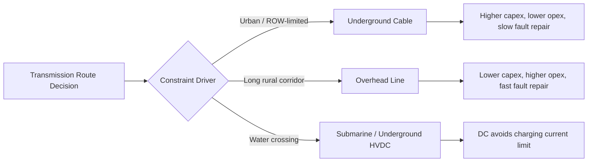

## Overhead versus Underground Transmission Tradeoffs

### Overview

Overhead transmission (OHTL) and underground transmission (UGTL, typically via underground cable — UGC) represent two fundamentally different engineering approaches to delivering bulk electrical power. The choice between them is rarely made on electrical performance alone; it is a multidimensional decision involving capital cost, right-of-way (ROW) availability, reliability requirements, environmental constraints, and long-term maintainability. This topic covers the electrical, mechanical, economic, and operational tradeoffs that drive that decision.

### Fundamental Electrical Differences

**Capacitance and Charging Current**

The dominant electrical distinction between OHTL and UGC is capacitance. Underground cables have conductors separated by a thin layer of solid dielectric (XLPE, EPR, or oil-impregnated paper) instead of air, and the geometric spacing between conductor and ground (cable sheath/shield) is much smaller than the spacing between an overhead conductor and earth.

$$C = \frac{2\pi\varepsilon}{\ln(D/r)}$$

where $D$ is the spacing between conductor and return path and $r$ is the conductor radius. Because $D$ is small and $\varepsilon$ (relative permittivity of solid dielectrics, typically 2.3–3.5) is much larger than that of air ($\varepsilon_r \approx 1$), UGC capacitance per unit length is typically 20–40 times higher than an equivalent overhead line.

This elevated capacitance produces significant charging current:

$$I_c = \omega C V$$

For long UGC runs, charging current can consume a large fraction of the cable's thermal ampacity even with zero load, which limits the practical unloaded (or lightly loaded) transmission distance of AC underground cable to roughly 40–60 km before reactive compensation (shunt reactors) becomes mandatory. Overhead lines, by contrast, can span hundreds of kilometers before charging current becomes limiting.

**Inductance and Reactance**

Overhead lines have higher series inductance $L$ (wider phase spacing, larger geometric mean distance) than underground cables, where phase conductors are bundled close together (or in flat/trefoil formation) in the same duct bank or direct-buried trench. UGC's lower inductive reactance improves voltage regulation over short distances but does little to offset the charging current penalty over long ones.

**Thermal Behavior**

Overhead conductors reject heat to ambient air through convection and radiation, benefiting from continuous airflow. Underground cables are thermally constrained by surrounding soil, which has far lower thermal conductivity than air and is prone to moisture migration and thermal drying-out around the cable, which raises soil thermal resistivity and can cause thermal runaway if not properly designed. Consequently, an underground cable of a given conductor cross-section typically carries substantially less current than an overhead conductor of the same size — often cited as an ampacity derating on the order of 30–50%, though this varies strongly with burial depth, soil thermal resistivity, backfill material, spacing, and installation configuration (duct bank vs. direct buried vs. air-filled tunnel). [Inference — exact derating is highly installation-specific and should be confirmed via IEC 60287 or Neher-McGrath thermal calculations for a given design.]

### Cost Comparison

**Capital Cost**

Underground transmission is consistently and substantially more expensive to construct than overhead transmission at the same voltage class. Industry studies and utility cost data commonly cite UGC capital costs at roughly 4 to 14 times that of an equivalent overhead line, with the ratio widening at higher voltages (345 kV and above) because cable insulation, jointing, and terminal equipment costs scale nonlinearly with voltage. [Unverified — ratios vary significantly by country, terrain, voltage class, and cable technology (XLPE vs. gas-insulated line vs. HVDC), and should be sourced from current utility or industry cost benchmarking studies for a specific project.]

Key cost drivers for UGC:

- Trenching, boring, or tunneling (especially in urban rock or congested utility corridors)
- Cable material cost (copper/aluminum conductor plus dielectric insulation system)
- Splicing and termination structures (joint bays every 500–1000 m for extruded cable)
- Reactive compensation stations (shunt reactors) for long circuits
- Thermal backfill (fluidized thermal backfill, FTB) to manage soil thermal resistivity

Key cost drivers for OHTL:

- Tower/pole structures and foundations
- Right-of-way acquisition and vegetation management
- Conductor and insulator hardware
- Lightning protection (shield wires, grounding)

**Lifecycle and Maintenance Cost**

Overhead lines require ongoing vegetation management, periodic insulator washing/inspection, and are more exposed to storm damage, ice loading, and wildlife/vandalism-related outages. Underground cables have very low routine maintenance needs once installed but carry a much higher cost and duration for fault location and repair — a cable fault can take days to weeks to locate, excavate, and splice, versus hours for an overhead conductor repair.

### Reliability and Fault Characteristics

**Failure Modes**

| Factor | Overhead | Underground |
| --- | --- | --- |
| Weather exposure (wind, ice, lightning) | High | Very Low |
| Fault frequency | Higher (more exposure) | Lower |
| Mean Time to Repair (MTTR) | Low (hours) | High (days–weeks) |
| Right-of-way encroachment/dig-ins | Low | Moderate–High (third-party excavation) |
| Visual/thermal fault detection | Easy (visible arcing, thermal imaging) | Difficult (buried, requires TDR/impedance-based fault location) |

Overhead lines tend to have more frequent but shorter-duration outages (transient faults cleared by reclosing after lightning strikes, for example). Underground systems have fewer faults overall but each fault event is more severe operationally, since crews must excavate and identify the exact fault location before repair.

**Fault Location Techniques for UGC**

Because the cable is inaccessible, fault location relies on:

- Time Domain Reflectometry (TDR) — sends a pulse and measures reflection timing from the fault impedance discontinuity
- Impulse current / surge reflection methods for high-resistance faults
- Sheath fault detection via bridge methods for insulation degradation between phase conductor and metallic sheath

### Environmental, Aesthetic, and Land-Use Factors

- **Visual impact**: Overhead towers are highly visible and often opposed in scenic, historic, or residential areas — a major driver of urban and suburban undergrounding projects.
- **Right-of-way width**: Overhead HVAC/HVDC corridors require wide cleared easements for clearance and access; underground corridors need a narrower surface footprint but a wider disturbed construction zone during installation.
- **Electromagnetic field (EMF) exposure**: Underground cables, being closer to grade and often shielded by earth, can have comparable or lower EMF at ground level depending on phase configuration, though this depends on cable arrangement (flat vs. trefoil) and burial depth. [Inference]
- **Land use compatibility**: Underground routing allows land above the corridor to remain usable for roads, parking, and (with restrictions) some surface activities, whereas overhead ROW is generally restricted to low vegetation.
- **Wildlife impact**: Overhead lines pose avian collision/electrocution risk; underground construction disturbs soil ecosystems and can affect root systems of mature vegetation along the route.

### Technology Options for Underground Transmission

- **XLPE (Cross-Linked Polyethylene) cable**: Dominant modern extruded-dielectric technology, replacing older oil-filled (self-contained fluid-filled, SCFF) cable due to lower environmental risk (no oil leaks) and lower maintenance.
- **HPFF/HPGF (High Pressure Fluid-Filled / Gas-Filled)**: Legacy technology still in service in some older urban networks; uses pressurized oil or nitrogen as insulating/cooling medium within a steel pipe.
- **GIL (Gas-Insulated Line)**: Uses SF6 or SF6/N2 mixtures in rigid metal enclosures; very high power density and low losses, used in tunnel applications, but higher capital cost and SF6 environmental concerns (high global warming potential) are pushing adoption of alternative gas mixtures.
- **HVDC underground/submarine cable**: For very long underground/subsea crossings, HVDC avoids the AC charging current problem entirely (no steady-state reactive charging current in DC), making it the preferred technology for long submarine or deep underground interconnections exceeding ~50–80 km.

### When Underground Is Typically Selected

- Dense urban cores where ROW for towers is unavailable or prohibitively expensive
- River, strait, or harbor crossings (submarine cable)
- Airport approach zones (height restrictions)
- Areas with strong aesthetic/historic preservation requirements
- Short segments transitioning into substations within congested areas

### When Overhead Is Typically Selected

- Long-distance bulk transmission (rural/inter-regional corridors)
- Projects with tight capital budgets
- Areas where ROW is available at reasonable cost
- Applications requiring frequent, low-cost maintainability and rapid fault restoration

### Illustrative Comparison Diagram

### Cross-Sectional Comparison (svg_diagram)

<svg xmlns="http://www.w3.org/2000/svg" viewBox="0 0 760 340">
<text x="380" y="24" text-anchor="middle" font-size="16" font-weight="bold" fill="#1a1a1a">Overhead vs. Underground Cross-Section (svg_diagram)</text>

<text x="160" y="55" text-anchor="middle" font-size="14" font-weight="bold" fill="`#1a1a1a`">Overhead Line</text>

<line x1="80" y1="70" x2="80" y2="280" stroke="#555" stroke-width="8" />

<line x1="40" y1="90" x2="200" y2="90" stroke="#555" stroke-width="6" />

<circle cx="60" cy="90" r="8" fill="`#c0392b`" />

<circle cx="120" cy="90" r="8" fill="`#2980b9`" />

<circle cx="180" cy="90" r="8" fill="`#27ae60`" />

<text x="60" y="115" text-anchor="middle" font-size="11">A</text>

<text x="120" y="115" text-anchor="middle" font-size="11">B</text>

<text x="180" y="115" text-anchor="middle" font-size="11">C</text>

<line x1="0" y1="280" x2="320" y2="280" stroke="`#8b5a2b`" stroke-width="4" />

<text x="160" y="300" text-anchor="middle" font-size="11" fill="#555">Air dielectric (ε_r ≈ 1)</text>

<text x="160" y="316" text-anchor="middle" font-size="11" fill="#555">Wide phase spacing, natural convection cooling</text>

<text x="580" y="55" text-anchor="middle" font-size="14" font-weight="bold" fill="`#1a1a1a`">Underground Cable</text>

<rect x="480" y="200" width="200" height="80" fill="`#c9a876`" stroke="`#8b5a2b`" stroke-width="2" />

<text x="580" y="195" text-anchor="middle" font-size="11" fill="#555">Soil / thermal backfill</text>

<rect x="500" y="220" width="30" height="30" rx="15" fill="`#e0e0e0`" stroke="#333" />

<circle cx="515" cy="235" r="8" fill="`#c0392b`" />

<rect x="565" y="220" width="30" height="30" rx="15" fill="`#e0e0e0`" stroke="#333" />

<circle cx="580" cy="235" r="8" fill="`#2980b9`" />

<rect x="630" y="220" width="30" height="30" rx="15" fill="`#e0e0e0`" stroke="#333" />

<circle cx="645" cy="235" r="8" fill="`#27ae60`" />

<text x="580" y="300" text-anchor="middle" font-size="11" fill="#555">Solid dielectric (XLPE, ε_r ≈ 2.3–3.5)</text>

<text x="580" y="316" text-anchor="middle" font-size="11" fill="#555">Tight spacing, conduction-limited cooling</text>

<line x1="340" y1="70" x2="340" y2="320" stroke="#999" stroke-width="1" stroke-dasharray="4,4" />
</svg>

### Key Points

- Charging current, not thermal capacity, is the primary factor limiting AC underground cable transmission distance.
- Underground capital cost is consistently several times higher than overhead for equivalent voltage and capacity; the multiplier grows with voltage class.
- Overhead lines fail more often but are repaired faster; underground lines fail less often but repairs are slower and more costly.
- HVDC removes the AC charging-current constraint, making it the standard choice for long underground/submarine interconnections.
- The decision is typically driven by non-electrical constraints (ROW, aesthetics, permitting, urban density) more than by pure electrical performance.

**Related Topics**

- Underground Cable Thermal Rating (Neher-McGrath / IEC 60287 methodology)
- Shunt Reactor Compensation for Long Cable Circuits
- HVDC Transmission Fundamentals
- Cable Fault Location Techniques (TDR, Impulse Current Method)
- Right-of-Way Acquisition and Easement Engineering
- Submarine Cable Transmission Design
- Gas-Insulated Line (GIL) Systems
- Overhead Conductor Selection and Sag-Tension Analysis