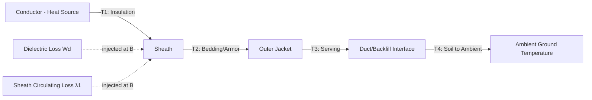

## Underground Cable Construction and Thermal Rating

### Overview

Underground transmission cable design combines electrical insulation engineering with heat transfer analysis. Unlike overhead conductors, which reject heat freely to ambient air, underground cables are thermally confined by surrounding soil, ducts, or backfill, making thermal rating (ampacity determination) as critical a design discipline as the electrical insulation itself. This topic covers cable construction layers, installation methods, and the thermal rating methodologies (Neher-McGrath and IEC 60287) used to determine safe continuous and emergency current ratings.

### Cable Construction — Layer by Layer

A modern extruded-dielectric transmission cable (XLPE) is built from the conductor outward:

1. **Conductor**: Stranded copper or aluminum, often compacted or segmental (Milliken-type) construction to reduce skin and proximity effect losses at high current.
2. **Conductor screen (semi-conducting layer)**: Extruded semi-conductive polymer that smooths the electric field at the conductor surface, eliminating stress concentrations and voids that would otherwise cause partial discharge.
3. **Insulation**: The dielectric layer, most commonly XLPE (cross-linked polyethylene) for transmission voltages up to 500 kV+, or EPR (ethylene propylene rubber) in some distribution/sub-transmission applications. Insulation thickness scales with voltage class and is a primary driver of cable cost and bending radius.
4. **Insulation screen (semi-conducting layer)**: Mirrors the conductor screen on the outside of the insulation, ensuring a uniform radial field and preventing discharge at the insulation-sheath interface.
5. **Metallic sheath/screen**: Copper wire screen, lead sheath, or corrugated aluminum sheath. Serves three purposes: fault current return path, radial water/moisture barrier, and electrostatic shielding.
6. **Bedding/cushioning layer**: Protects the metallic sheath from mechanical damage from the outer layers.
7. **Armor (optional)**: Steel wire or tape armor for mechanical protection, common in submarine cables and directly buried cables in high mechanical stress zones.
8. **Outer jacket (serving)**: HDPE or PVC outer covering providing corrosion resistance and a secondary moisture barrier; often includes a semi-conducting outer layer for sheath fault location via DC voltage withstand testing.

### Installation Configurations

**Direct Burial**

Cables are laid directly in a trench, surrounded by select backfill (often thermally stable sand or engineered thermal backfill) and native soil above. Lowest capital cost per unit length but hardest to access for future repair, and most sensitive to native soil thermal resistivity.

**Duct Bank**

Cables are pulled through PVC or HDPE conduits encased in concrete or thermal backfill, with accessible manholes/joint bays at intervals. Preferred in urban areas because it allows cable replacement without full re-excavation and provides mechanical protection from third-party digging. Duct banks introduce an air gap between cable and duct wall, which adds thermal resistance compared to direct burial.

**Tunnel Installation**

Cables are installed on racks or cleats inside a walkable or crawl-accessible tunnel, sometimes with forced ventilation or forced cooling (water-cooled pipes) for very high-capacity circuits. Highest capital cost but best long-term accessibility and highest achievable ampacity due to potential for active cooling.

**Trough/Shallow Surface Systems**

Precast concrete troughs at shallower depth, used in some utility and industrial contexts where full burial depth is impractical.

### Thermal Rating Fundamentals

The steady-state current rating of a cable is derived from a thermal-electrical analogy: heat generated in the cable (from conductor $I^2R$ losses, dielectric losses, and sheath losses) must be conducted through the surrounding materials to ambient without exceeding the conductor's maximum allowable operating temperature (typically 90°C for XLPE continuous, up to 105°C–130°C for short-term emergency ratings depending on cable design and aging considerations).

**Thermal-Electrical Analogy**

| Electrical Quantity | Thermal Equivalent |
| --- | --- |
| Current $I$ | Heat flow $Q$ |
| Voltage $V$ | Temperature difference $\Delta\theta$ |
| Resistance $R$ | Thermal resistance $T$ |

The generalized steady-state rating equation (IEC 60287 form):

$$I = \sqrt{\frac{\Delta\theta - W_d\left[0.5T_1 + n(T_2 + T_3 + T_4)\right]}{R\left[T_1 + n(1+\lambda_1)T_2 + n(1+\lambda_1+\lambda_2)(T_3+T_4)\right]}}$$

Where:

- $\Delta\theta$ = allowable conductor temperature rise above ambient
- $R$ = AC resistance per unit length at operating temperature
- $W_d$ = dielectric loss per unit length
- $T_1$ = thermal resistance of insulation
- $T_2$ = thermal resistance between sheath and armor
- $T_3$ = thermal resistance of outer serving/jacket
- $T_4$ = thermal resistance of the surrounding medium (soil, air, duct)
- $\lambda_1, \lambda_2$ = loss factors for sheath and armor circulating/eddy currents
- $n$ = number of load-carrying conductors

This equation, from IEC 60287, is the internationally standardized steady-state cable rating method. [Inference — the exact variable definitions can differ slightly across IEC 60287 parts (Part 2-1 covers thermal resistance calculation specifically); consult the current edition for precise subscripting conventions.]

**Neher-McGrath Method**

The Neher-McGrath method (IEEE/AIEE, originally published 1957) is the historically dominant thermal rating methodology in North America and remains widely referenced (embedded in the Insulated Cable Engineers Association, ICEA, and Neher-McGrath-based software such as CYMCAP). It uses a similar thermal-resistance-network approach but with different formulations for external thermal resistance, particularly for multiple circuits in duct banks, using the concept of a "geometric factor" for external thermal resistance and mutual heating between adjacent cables/ducts.

**Key differences between the two methods**: IEC 60287 is the internationally standardized method with well-defined loss factor formulas; Neher-McGrath is the traditional North American approach with somewhat different assumptions for duct bank geometry and mutual heating. Modern rating software (CYMCAP, ETAP cable ampacity modules) can often calculate using either method depending on regional practice. [Unverified — specific numeric divergence between the two methods for a given installation should be validated via rating software rather than assumed equivalent.]

### Thermal Resistivity of Soil and Backfill

Soil thermal resistivity ($\rho$, units °C·cm/W) is one of the most sensitive and most site-variable inputs to cable rating:

- Dry sandy soil: ρ ≈ 200–300 °C·cm/W (poor conductor, limits ampacity)
- Moist native soil: ρ ≈ 60–120 °C·cm/W
- Engineered Fluidized Thermal Backfill (FTB): ρ ≈ 40–60 °C·cm/W, specifically formulated to remain stable and low-resistivity even under moisture migration/drying cycles

**Moisture migration and thermal runaway**: Continuous heat flow from an energized cable can dry out surrounding soil, increasing its thermal resistivity, which further raises cable temperature — a positive feedback loop known as thermal runaway. This is a key reason engineered thermal backfill is specified for high-capacity urban transmission cable installations rather than relying on native soil.

### Load Factor and Cyclic Rating

Because soil has thermal mass (unlike air around overhead conductors), cables benefit from load cycling: if load varies daily rather than remaining constant, the cable's average temperature is lower than the temperature the peak current alone would suggest, because the soil doesn't fully reach steady-state before load drops again. This allows for a **cyclic rating** higher than the continuous (100% load factor) rating, calculated using a loss-factor/load-factor relationship and transient thermal response of the surrounding soil.

**Emergency (short-term) ratings** allow temporary operation above the continuous rating (e.g., 130% for a limited duration such as 24 or 100 hours) to accommodate contingency conditions, based on the thermal time constant of the cable-soil system, at the cost of accelerated insulation aging.

### Circulating Current and Sheath Bonding

In three-phase circuits with metallic sheaths, induced voltages from the magnetic field of the load current can drive circulating currents in the sheath if bonded at both ends, adding sheath losses ($\lambda_1$ term above) that reduce ampacity. Bonding strategies to mitigate this:

- **Single-point bonding**: Sheath grounded at only one end; eliminates circulating current but leaves standing voltage at the unbonded end, requiring sheath voltage limiters (SVLs).
- **Cross-bonding**: Sheaths transposed and cross-connected at joint bays (typically in three sections per "major section") so induced voltages cancel, allowing both-end grounding without significant circulating current. Standard practice for long extruded cable transmission circuits.
- **Solid (both-end) bonding**: Simplest but incurs full circulating current loss; typically only used for very short cable runs where the loss penalty is small.

### Illustrative Diagram — Thermal Resistance Network

### Cable Layer Cross-Section (svg_diagram)

<svg xmlns="http://www.w3.org/2000/svg" viewBox="0 0 500 500">
<text x="250" y="24" text-anchor="middle" font-size="16" font-weight="bold" fill="#1a1a1a">XLPE Cable Cross-Section (svg_diagram)</text>
<circle cx="250" cy="270" r="210" fill="#d9c9a3" stroke="#8b5a2b" stroke-width="2" />
<text x="250" y="480" text-anchor="middle" font-size="11" fill="#555">Outer jacket (HDPE/PVC)</text>
<circle cx="250" cy="270" r="185" fill="#c9b98a" stroke="#333" stroke-width="1" />
<text x="250" y="450" text-anchor="middle" font-size="11" fill="#333">Bedding layer</text>
<circle cx="250" cy="270" r="160" fill="#b0876a" stroke="#333" stroke-width="1" />
<text x="250" y="420" text-anchor="middle" font-size="11" fill="#fff">Metallic sheath (Cu wire/Al)</text>
<circle cx="250" cy="270" r="135" fill="#333" stroke="#000" stroke-width="1" />
<text x="250" y="150" text-anchor="middle" font-size="11" fill="#fff">Insulation screen</text>
<circle cx="250" cy="270" r="120" fill="#e8e4d8" stroke="#000" stroke-width="1" />
<text x="250" y="185" text-anchor="middle" font-size="12" fill="#000">XLPE Insulation (T1)</text>
<circle cx="250" cy="270" r="60" fill="#333" stroke="#000" stroke-width="1" />
<text x="250" y="240" text-anchor="middle" font-size="10" fill="#fff">Conductor screen</text>
<circle cx="250" cy="270" r="45" fill="#c0392b" stroke="#000" stroke-width="1" />
<text x="250" y="275" text-anchor="middle" font-size="12" fill="#fff" font-weight="bold">Cu/Al Conductor</text>
</svg>

### Practical Example

A 230 kV XLPE cable, 1200 mm² copper conductor, directly buried at 1.2 m depth in native soil (ρ = 100 °C·cm/W), rated to a maximum conductor temperature of 90°C with 25°C ambient soil temperature ($\Delta\theta = 65$°C). If soil thermal resistivity worsens due to seasonal drying to ρ = 200 °C·cm/W, the $T_4$ term in the rating equation increases substantially, and the continuous ampacity can drop meaningfully — this is why utilities specify engineered backfill for critical urban circuits rather than relying on native soil thermal properties, which vary seasonally and by rainfall pattern. [Inference — the quantitative ampacity reduction depends on the interacting values of all thermal resistance terms and must be computed via the full rating equation, not estimated by soil resistivity ratio alone.]

### Key Points

- Underground cable rating is governed by heat conduction through insulation, sheath, jacket, and surrounding soil — not by conductor resistance alone.
- IEC 60287 and Neher-McGrath are the two dominant thermal rating methodologies, using a resistance-network analogy between electrical and thermal quantities.
- Soil thermal resistivity is highly variable and a primary design risk; engineered thermal backfill mitigates thermal runaway from soil drying.
- Cyclic and emergency ratings exploit thermal inertia of soil to allow higher-than-continuous currents for limited durations.
- Sheath bonding strategy (single-point, cross-bonded, solid) directly affects achievable ampacity by controlling circulating current losses.

**Related Topics**

- Overhead versus Underground Transmission Tradeoffs
- Sheath Bonding and Cross-Bonding Design
- Cable Fault Location Techniques
- Submarine Cable Transmission Design
- Duct Bank Thermal Design and Fluidized Thermal Backfill
- HVDC Underground Cable Systems
- Partial Discharge Testing for Extruded Cable Insulation