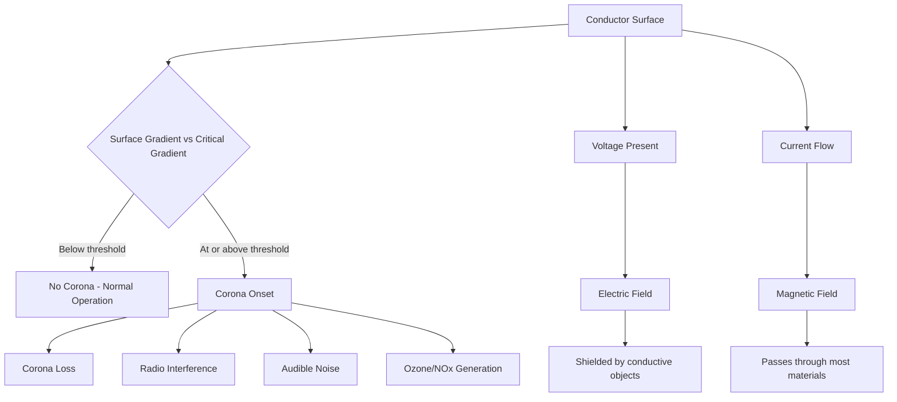

## Corona Effects and Electromagnetic Field Considerations

### Overview

Corona discharge occurs when the electric field gradient at a conductor surface exceeds the dielectric breakdown strength of the surrounding air, causing localized ionization without a complete flashover between phases or to ground. Alongside corona, transmission lines produce electromagnetic fields (EMF) — both electric and magnetic — that extend into the surrounding environment. Both phenomena are governed primarily by conductor geometry, surface condition, and operating voltage, and both have significant design, regulatory, and public-health-perception implications.

### Corona Discharge Fundamentals

**Critical Disruptive Voltage**

Corona onset is governed by the electric field at the conductor surface exceeding the critical disruptive gradient of air, approximately 21.1 kV/cm (peak) at standard atmospheric conditions, per Peek's empirical formula:

$$g_v = g_0 \, m \, \delta \left(1 + \frac{0.301}{\sqrt{\delta r}}\right)$$

Where:

- $g_v$ = critical disruptive voltage gradient
- $g_0$ = breakdown strength of air at standard conditions (≈ 21.1 kV/cm peak, ≈ 30 kV/cm for some formulations depending on convention)
- $m$ = surface irregularity factor (roughness factor), typically 0.8–0.87 for stranded conductors, lower for damaged/weathered conductors
- $\delta$ = relative air density factor (function of temperature and pressure)
- $r$ = conductor radius

Peek's Law for corona power loss:

$$P = \frac{244}{\delta}(f + 25)\sqrt{\frac{r}{D}}\,(V - V_0)^2 \times 10^{-5} \text{ kW/km/phase}$$

Where $f$ is system frequency, $D$ is conductor spacing, $V$ is phase-to-neutral operating voltage, and $V_0$ is the disruptive critical voltage. This formula, attributed to F.W. Peek's early 20th century empirical work, remains the standard reference for first-order corona loss estimation, though modern EHV/UHV line design increasingly relies on more refined empirical and computational models validated against test-line and operating-line measurement data. [Inference — Peek's formula is a widely cited historical baseline; contemporary EHV design work typically supplements it with utility-specific test data and more recent empirical corrections.]

**Factors Affecting Corona Onset**

- **Conductor diameter**: Larger diameter reduces surface field gradient for a given voltage — the primary reason EHV/UHV lines use large-diameter or bundled conductors.
- **Conductor surface condition**: Nicks, scratches, dirt, and water droplets create localized field enhancement points that trigger corona at lower voltages than a smooth conductor would.
- **Bundle configuration**: Multiple sub-conductors per phase (bundled conductors) reduce the effective surface gradient by increasing the geometric mean radius of the phase without proportionally increasing total conductor cost — standard practice above roughly 230 kV.
- **Weather conditions**: Corona loss increases sharply during rain, fog, and high humidity because water droplets on the conductor surface create field-enhancement points; corona-induced radio and audible noise is significantly worse in foul weather ("foul weather corona").
- **Altitude**: Lower air density at higher altitude reduces the breakdown strength of air, lowering the corona onset voltage — a critical design consideration for lines crossing mountainous terrain.

### Effects of Corona

**Corona Loss**

Represents a real power loss on the line, generally small compared to $I^2R$ losses at normal operating voltage but significant at EHV/UHV levels and during foul weather, where losses can increase severalfold compared to fair-weather conditions.

**Radio Interference (RI)**

Corona generates broadband electromagnetic noise that can interfere with AM radio reception near the line, typically specified and measured at a reference frequency (0.5–1.0 MHz) and reference distance from the outer phase conductor, with regulatory limits varying by jurisdiction.

**Audible Noise (AN)**

Corona produces an audible "crackling" or "hissing" sound, most noticeable in foul weather, and is a significant public-acceptance factor for EHV/UHV line siting near populated areas. Audible noise limits are typically specified in dBA at the edge of the right-of-way.

**Television Interference (TVI)**

Similar mechanism to RI but affecting VHF/UHF television bands; largely diminished in importance with the shift to digital and cable/satellite television but historically a significant EHV line siting concern.

**Ozone and NOx Production**

Corona ionizes air, producing small quantities of ozone (O₃) and nitrogen oxides near the conductor surface — generally considered a minor localized effect at line height but occasionally raised in environmental impact assessments.

### Corona Mitigation in Design

- Use of bundled conductors (2, 3, 4, or more sub-conductors per phase) to increase effective conductor diameter without a proportional increase in conductor material cost
- Larger conductor diameter selection driven by corona/RI/AN limits rather than ampacity alone at EHV levels (a phenomenon sometimes described as the line being "corona-limited" rather than "thermally limited")
- Corona rings (grading rings) on insulator hardware and dead-end/suspension assemblies to smooth field gradients at hardware connection points, which are common corona initiation sites due to sharp edges and small radii
- Smooth, defect-free conductor surface specification and careful stringing practices to avoid nicks and scratches during installation

### Electromagnetic Field (EMF) Fundamentals

Transmission lines produce two distinct field types with very different physical behavior:

**Electric Field**

Produced by the voltage on the conductors, present whenever the line is energized regardless of current flow. Electric field strength at ground level depends on conductor voltage, height above ground, phase spacing, and phase arrangement. Electric fields are effectively shielded by conductive objects (buildings, vehicles, vegetation, even human bodies to some degree), which is why measured field levels vary significantly with nearby obstructions.

**Magnetic Field**

Produced by current flow in the conductors, proportional to load current (varies throughout the day/year with line loading) rather than voltage. Magnetic fields pass largely unimpeded through most common building materials, making them harder to shield than electric fields. Field strength decreases with distance from the conductors and is strongly affected by phase configuration and conductor spacing.

$$B = \frac{\mu_0 I}{2\pi d}$$

for a single conductor at perpendicular distance $d$; for a three-phase circuit, the fields from each phase superpose vectorially, and with balanced currents and symmetric phasing, partial cancellation occurs — the degree of cancellation depends heavily on phase arrangement (flat, triangular, or transposed configurations).

**Phase Configuration and Field Cancellation**

Reducing net magnetic field at ground level is a common design objective, typically achieved through:

- **Low-reactance (compact) phase spacing**: Placing phases closer together increases the mutual cancellation of magnetic fields at a distance, at the cost of increased electric field stress and reduced clearance margins.
- **Optimal phasing on double-circuit towers**: Arranging phase conductors on double-circuit structures ("superbundle" or "reverse phasing" configurations) so that the magnetic fields from the two circuits partially cancel at ground level.
- **Delta versus vertical versus horizontal configurations**: Each geometric arrangement produces a distinct ground-level field profile; optimization is a standard part of EHV line design where field mitigation is a regulatory or public concern.

### Regulatory and Health Context

Regulatory limits on EMF exposure vary substantially by country and are generally expressed as maximum allowable field strength at the edge of right-of-way or at specific occupancy locations. The International Commission on Non-Ionizing Radiation Protection (ICNIRP) publishes widely referenced exposure guidelines for power-frequency fields. [Unverified — specific numeric limits vary by jurisdiction, are periodically revised, and should be sourced from the current applicable regulatory body (ICNIRP, IEEE C95.6, or national/local regulations) for any specific project.] Scientific consensus regarding long-term health effects of power-frequency EMF exposure at typical transmission line levels remains a subject of ongoing study and some public debate; engineering design practice generally follows applicable regulatory exposure limits as the design compliance benchmark rather than making independent health determinations.

### Illustrative Diagram — Corona and Field Zones Around a Conductor

### Field and Corona Zones Cross-Section (svg_diagram)

<svg xmlns="http://www.w3.org/2000/svg" viewBox="0 0 600 380">
<text x="300" y="24" text-anchor="middle" font-size="16" font-weight="bold" fill="#1a1a1a">Corona Zone and EMF Around Conductor (svg_diagram)</text>
<line x1="0" y1="330" x2="600" y2="330" stroke="#8b5a2b" stroke-width="4" />
<text x="300" y="350" text-anchor="middle" font-size="11" fill="#555">Ground level</text>
<circle cx="300" cy="150" r="12" fill="#c0392b" />
<text x="300" y="110" text-anchor="middle" font-size="11" fill="#333">Conductor</text>
<circle cx="300" cy="150" r="30" fill="none" stroke="#e67e22" stroke-width="2" stroke-dasharray="3,3" />
<text x="300" y="185" text-anchor="middle" font-size="10" fill="#e67e22">Corona ionization zone</text>
<circle cx="300" cy="150" r="90" fill="none" stroke="#2980b9" stroke-width="1.5" stroke-dasharray="6,4" />
<text x="300" y="255" text-anchor="middle" font-size="10" fill="#2980b9">Electric field (shielded by objects)</text>
<circle cx="300" cy="150" r="150" fill="none" stroke="#27ae60" stroke-width="1.5" stroke-dasharray="10,4" />
<text x="300" y="315" text-anchor="middle" font-size="10" fill="#27ae60">Magnetic field (passes through structures)</text>
</svg>

### Practical Example

A 500 kV line using a single conductor per phase versus a 4-conductor bundle (each sub-conductor smaller diameter, same total aluminum cross-section) at the same voltage: the bundled configuration significantly reduces maximum surface field gradient because the effective geometric radius of the bundle is much larger than a single equivalent-area conductor, pushing surface gradient below the corona-onset threshold under fair-weather conditions and reducing foul-weather corona loss, radio interference, and audible noise levels — the primary reason bundled conductors are standard practice at EHV and UHV voltage classes rather than being purely an ampacity or reactance optimization. [Inference — quantitative gradient reduction depends on specific bundle geometry, sub-conductor spacing, and number of sub-conductors, and should be calculated via standard field-gradient formulas (e.g., Mangoldt's method) for a specific design.]

### Key Points

- Corona onset is governed by surface electric field gradient exceeding air's dielectric breakdown strength, described empirically by Peek's Law.
- Bundled conductors and corona rings are the primary design mitigations, reducing surface field gradient without proportional cost increase.
- Foul weather (rain, fog, humidity) dramatically increases corona loss, radio interference, and audible noise compared to fair weather.
- Electric fields (voltage-driven) are shieldable by conductive objects; magnetic fields (current-driven) pass through most materials and are harder to mitigate.
- EMF regulatory limits and phase configuration optimization are standard design considerations, particularly for lines near populated areas.

**Related Topics**

- Bundled Conductor Design and Geometric Mean Radius
- Insulator String Design and Corona Ring Application
- Transmission Line Phase Configuration and Transposition
- Overhead versus Underground Transmission Tradeoffs
- Lightning Performance and Shield Wire Design
- EMF Regulatory Standards and Compliance Measurement