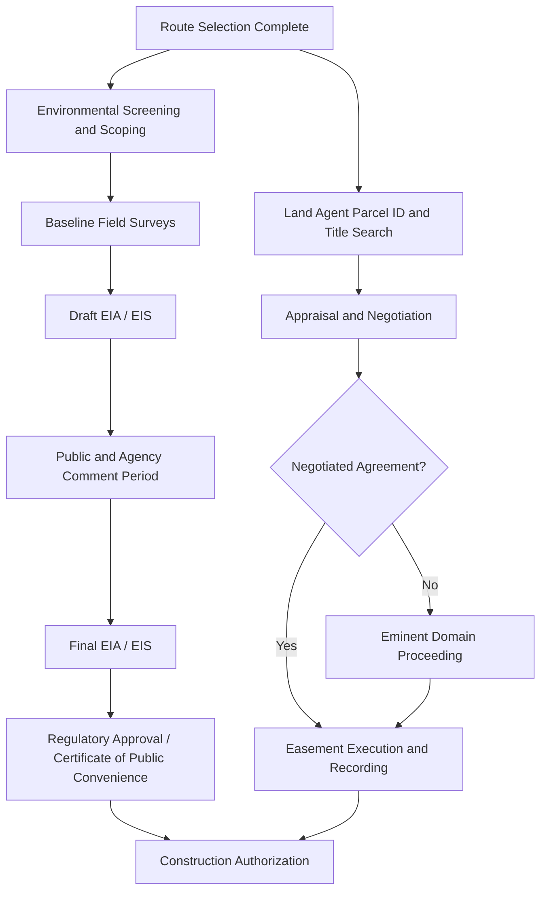

## Right-of-Way Acquisition and Environmental Permitting

### Overview

Right-of-way (ROW) acquisition and environmental permitting constitute the legal and regulatory groundwork required before a transmission line can be sited, constructed, and energized. This process governs how a utility or transmission developer obtains legal rights to occupy land and how it demonstrates compliance with environmental, cultural, and land-use regulations. Permitting timelines frequently exceed construction timelines and are a leading cause of project delay and cost overrun in transmission development.

### Right-of-Way Fundamentals

**Definition and Purpose**

A right-of-way is a legal easement or fee-simple property interest that grants a transmission owner the right to construct, operate, maintain, and access a linear corridor of land for conductors, structures, and associated equipment, while typically restricting the landowner's use of that corridor (e.g., prohibiting structures, restricting vegetation height).

**Forms of Land Interest**

- **Easement (most common)**: A non-possessory right to use land for a specific purpose; underlying fee title remains with the landowner. Easements may be perpetual or term-limited, exclusive or non-exclusive.
- **Fee simple acquisition**: Outright purchase of the land parcel, used less frequently, typically for substation sites or where exclusive control is required.
- **License/permit**: A revocable, non-property right to cross land, generally used for temporary construction access rather than the permanent line corridor.
- **Prescriptive easement**: An easement acquired through long-term, open, continuous use without formal grant, relevant in ROW disputes but not a planning strategy.

**ROW Width Determination**

ROW width is a function of conductor voltage, phase spacing, blowout under wind loading, minimum ground clearance, and any required buffer for vegetation management or fire risk. Typical widths:

| Voltage Class | Typical ROW Width |
| --- | --- |
| 69 kV | 15–23 m (50–75 ft) |
| 138 kV | 23–30 m (75–100 ft) |
| 230 kV | 30–46 m (100–150 ft) |
| 345 kV | 38–53 m (125–175 ft) |
| 500 kV | 46–61 m (150–200 ft) |
| 765 kV | 55–75 m (180–250 ft) |

[Inference] These figures are commonly cited industry ranges; actual widths vary by conductor configuration, tower type (lattice vs. monopole), circuit count, and jurisdictional clearance standards such as NESC or IEC equivalents.

### Acquisition Process

**1. Route Study and Parcel Identification**

Following the macro-corridor and route selection studies (typically completed in an earlier siting phase), the utility identifies individual parcels intersected by the preferred route and compiles ownership records from county/municipal land registries or cadastral databases.

**2. Title Search and Chain of Title**

A title company or in-house real estate group performs a title search to confirm current ownership, identify liens, existing easements, mineral rights severances, and any encumbrances that could affect the new easement's priority or enforceability.

**3. Appraisal and Valuation**

Land agents or independent appraisers determine just compensation, typically based on:

- Fair market value of the easement area (partial-interest valuation, not full fee value)
- Severance damages (diminution in value of the remaining property)
- Damages to improvements (fencing, irrigation, structures)
- Temporary construction easement compensation (time-limited, separate from permanent easement)

**4. Negotiation with Landowners**

Land agents negotiate directly with property owners, presenting the appraised value, easement terms, and construction/restoration commitments. Most transmission easements are acquired through voluntary negotiated settlement.

**5. Eminent Domain / Compulsory Purchase (Last Resort)**

Where negotiation fails, utilities with statutory condemnation authority (in jurisdictions granting such power to regulated utilities or public authorities) may pursue eminent domain proceedings. This requires:

- A judicial or administrative finding of "public use" or "public necessity"
- Formal condemnation filing
- Court-determined or jury-determined just compensation

  [Inference] The availability, procedural burden, and required "public convenience and necessity" findings for eminent domain vary substantially by country and, within countries, by state/province — this should be verified against the specific jurisdiction governing a given project.

**6. Recording**

Executed easements are recorded against the parcel's title at the relevant land registry, creating a public record binding on future owners of the servient estate.

### Environmental Permitting Framework

**Regulatory Drivers (Illustrative, US-Centric with Analogues Elsewhere)**

Permitting requirements depend heavily on jurisdiction. Representative frameworks include:

- **United States**: National Environmental Policy Act (NEPA) for federal actions/federal land crossings; Clean Water Act Section 404 (wetlands/waterway crossings, administered by the US Army Corps of Engineers); Endangered Species Act (ESA) Section 7 consultation; National Historic Preservation Act (NHPA) Section 106; state-level Certificate of Public Convenience and Necessity (CPCN) or Public Utility Commission siting approval.
- **European Union**: Environmental Impact Assessment (EIA) Directive, Habitats Directive, Birds Directive; national transposition varies by member state.
- **Other jurisdictions**: Analogous EIA statutes generally require an environmental assessment proportional to project scale before construction authorization is granted.

[Unverified] Specific statutory citations and agency names should be confirmed against the jurisdiction in force at project execution, as environmental statutes are amended periodically.

**Environmental Impact Assessment (EIA) Process**

1. **Screening**: Determines whether the project triggers a full EIA, an abbreviated assessment, or a categorical exclusion, based on size, location, and sensitivity.
2. **Scoping**: Identifies the environmental resources and impact categories to be studied (biological, cultural, water, air, noise, visual, socioeconomic, cumulative).
3. **Baseline Studies**: Field surveys and desktop analysis establishing pre-project conditions — vegetation mapping, wildlife surveys, wetland delineation, cultural/archaeological reconnaissance, noise and visual baseline.
4. **Impact Analysis**: Assessment of direct, indirect, and cumulative impacts of construction and operation, typically across a "no-action" alternative and one or more route/design alternatives.
5. **Mitigation Planning**: Development of avoidance, minimization, and compensatory mitigation measures (e.g., seasonal work windows to avoid nesting season, wetland mitigation banking, raptor-safe pole configurations).
6. **Draft EIA/EIS and Public Comment**: Publication of a draft environmental impact statement/report for public and agency review.
7. **Final EIA/EIS and Record of Decision**: Agency response to comments, issuance of final document, and formal decision authorizing (or denying) the project.

**Key Environmental Resource Areas**

**Wetlands and Waterways**

- Delineation per applicable methodology (e.g., US Army Corps of Engineers wetland delineation manual)
- Permitting for crossings (e.g., Section 404/401 permits in the US) governing fill, temporary access mats, and directional boring for cable crossings
- Best management practices (BMPs) for erosion and sediment control during in-water or near-water work

**Threatened and Endangered Species**

- Species habitat mapping and consultation with wildlife agencies
- Avian protection measures: raptor-safe pole spacing per APLIC (Avian Power Line Interaction Committee) guidelines, marking of overhead shield wires in high-collision-risk areas (e.g., near wetlands or migratory corridors) with flight diverters
- Seasonal timing restrictions to avoid breeding/nesting/migration windows

**Cultural and Historic Resources**

- Archaeological surveys (Phase I reconnaissance, Phase II evaluation, Phase III mitigation if significant sites are found)
- Tribal/Indigenous consultation processes, often statutorily mandated and distinct from general public consultation
- Historic structure and landscape assessments where the route crosses registered historic districts

**Visual and Land Use Impacts**

- Visual impact assessments using viewshed modeling and photo-simulations from key observation points
- Land use compatibility review against local zoning and comprehensive plans
- Aviation obstruction analysis near airports (obstruction lighting/marking requirements per civil aviation authority standards)

**Vegetation and Forestry**

- Timber/vegetation clearing permits
- Invasive species control protocols for equipment and access roads
- Long-term vegetation management plan for ROW maintenance (see also NERC FAC-003 in North America for transmission vegetation management compliance)

**Soils, Erosion, and Stormwater**

- Erosion and Sediment Control Plans (ESCPs) / Stormwater Pollution Prevention Plans (SWPPPs)
- Geotechnical assessment of access road and structure foundation impacts

**Air Quality and Noise**

- Construction-phase dust and emissions controls
- Corona-noise and audible noise modeling for operational-phase compliance, particularly relevant at EHV/UHV voltage levels

### Public and Stakeholder Consultation

Effective consultation is both a regulatory requirement and a practical risk-mitigation tool:

- **Open houses and public meetings**: Present route alternatives and gather early feedback
- **Landowner notification**: Direct mail/legal notice to all parcels within or adjacent to the study corridor
- **Indigenous/tribal consultation**: Government-to-government or nation-to-nation consultation processes distinct from general public engagement, often with specific legal standing
- **Comment tracking and response matrices**: Formal logging of public comments with documented agency/utility responses, typically appended to the environmental document

### Permitting Sequence and Interagency Coordination

**Interagency Coordination**

Large transmission projects often require concurrent permits from multiple agencies (federal land management agency, state environmental agency, water resources board, historic preservation office, aviation authority). Many jurisdictions establish a **lead agency** or **one-stop permitting** framework to coordinate concurrent review and avoid duplicative studies. [Inference] The degree of coordination efficiency varies widely by jurisdiction and is a frequently cited bottleneck in transmission development literature.

### Schedule and Risk Considerations

- Permitting and ROW acquisition frequently represent 40–70% of total project development time for greenfield transmission lines. [Inference] This proportion is commonly cited in industry planning literature but varies by project complexity and jurisdiction.
- Parallel-pathing ROW negotiation with environmental review (rather than sequential execution) is a common schedule-compression strategy, though it carries the risk of having to renegotiate easement terms if the environmentally cleared route shifts.
- Landowner holdouts on a small percentage of parcels can delay an entire linear project, since transmission ROW must be contiguous.
- Litigation risk from environmental groups or landowners challenging the adequacy of the EIA/EIS is a material schedule risk on contested projects.

### Documentation Deliverables

- Title reports and easement agreements (recorded instruments)
- Land acquisition tracking database/GIS parcel layer
- Environmental Impact Statement/Report (draft and final)
- Biological Assessment / Biological Opinion (species-specific)
- Cultural Resources Survey Report
- Wetland Delineation Report and permit approvals
- Public involvement plan and comment-response log
- Construction environmental compliance plan (conditions of approval to be implemented during construction)

**Related Topics**

- Transmission Route Selection and Corridor Siting Studies
- NESC/IEC Clearance Requirements and Their Influence on ROW Width
- Vegetation Management and NERC FAC-003 Compliance
- Avian Protection Plans and APLIC Guidelines
- Eminent Domain and Just Compensation Valuation Methods
- Construction Environmental Compliance and Monitoring
- Transmission Line Structure Siting within Approved ROW
- GIS-Based Land Management Systems for Utility Easements