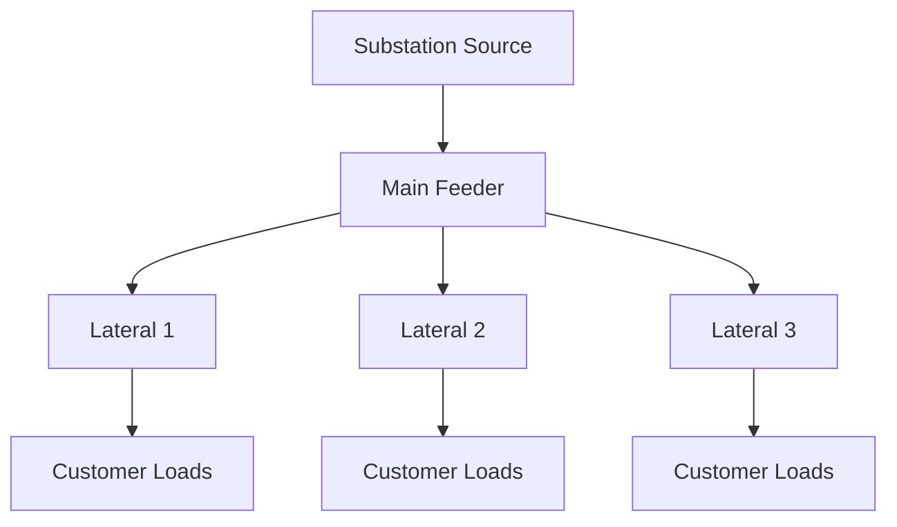
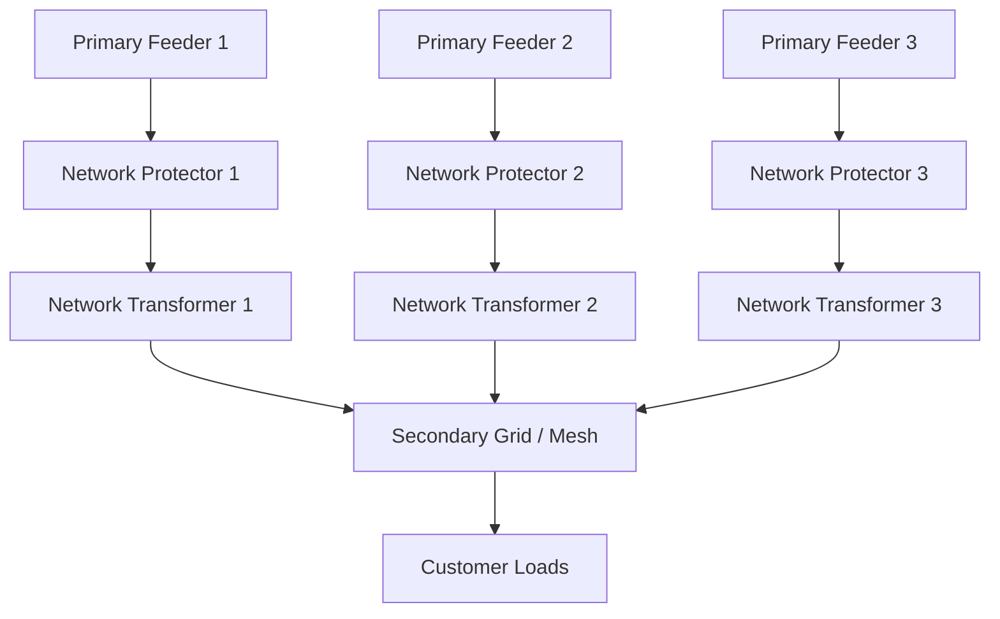

## Radial, Loop, and Networked Distribution Topologies

### Overview

Distribution system topology refers to the physical and electrical arrangement of feeders, switches, and interconnections between the substation and end-use customers. The choice of topology governs reliability, cost, fault isolation capability, voltage regulation complexity, and protection scheme design. The three principal topology classes — radial, loop, and networked — represent progressively higher levels of redundancy, complexity, and capital cost.

### Radial Distribution Topology

**Basic Configuration**

In a radial system, power flows in a single direction from the substation source through a main feeder to lateral branches and ultimately to individual customers, with no alternate path back to a source. Each load point is served by exactly one path.

**Structural Characteristics**

- Single source per feeder (one substation transformer/breaker feeding the circuit)
- Tree-like (radial) topology: main trunk with tapped laterals and sub-laterals
- Unidirectional power flow under normal operating conditions
- Fuses, reclosers, and sectionalizers used for fault isolation along the feeder

**Advantages**

- Lowest capital cost among the three topologies
- Simplest protection coordination (overcurrent protection with time-current coordination from substation breaker down through laterals)
- Straightforward voltage drop and fault current calculation due to unidirectional, single-source flow
- Easiest to plan, construct, and operate

**Disadvantages**

- Poor reliability: any fault or equipment failure upstream de-energizes all downstream customers until repaired
- No automatic restoration path without switching to an adjacent feeder (if tie points exist)
- Voltage drop increases with distance from the substation, requiring voltage regulators or capacitor banks at points along the feeder

**Typical Application**

Rural and low-density suburban distribution where reliability requirements are moderate and capital cost constraints dominate.

**Radial Topology Diagram**

### Loop (Ring Main) Distribution Topology

**Basic Configuration**

A loop system connects two ends of a feeder back to a source (either the same substation via two breakers, or two different substations), forming a closed ring. Under normal operation, the loop is typically operated **open** at one point (a normally-open tie switch), so that power still flows radially in practice, but the open point can be relocated to restore service to a section isolated by a fault.

**Structural Characteristics**

- Two feed paths to every load point, but only one energized at a time (open-loop operation) in most utility practice
- A normally-open (N.O.) tie switch or tie breaker at the midpoint or a strategic location in the loop
- Sectionalizing switches along the loop to isolate faulted segments

**Operating Principle**

1. Under normal conditions, the loop operates radially from each end toward the open point.
2. On a fault, protection isolates the faulted section using the nearest sectionalizing devices.
3. The tie switch closes (manually, or automatically via a distribution automation scheme) to restore power to the unfaulted downstream section from the opposite direction.
4. This reduces the number of customers experiencing sustained outage compared to a pure radial design, since only the faulted segment remains de-energized.

**Advantages**

- Improved reliability over radial: faster restoration and smaller outage footprint via switching
- Moderate incremental cost over radial (mainly additional switches/reclosers and a second source connection point)
- Compatible with distribution automation (automatic sectionalizing and restoration, sometimes called FLISR — Fault Location, Isolation, and Service Restoration)

**Disadvantages**

- Protection coordination is more complex than pure radial, since fault current direction and magnitude can vary depending on which end is feeding the loop and where the open point sits
- Still generally operated radially at any instant, so it does not provide continuous dual-fed redundancy — there is a brief interruption during switching (unless automated schemes achieve sub-cycle to few-second transfer)
- Requires coordinated planning between two source points/substations or two breakers at one substation

**Typical Application**

Urban and suburban feeders where reliability expectations are higher than rural service but full network redundancy is not economically justified. Common in medium-voltage (MV) distribution in many utilities worldwide.

**Loop Topology Diagram**

### Networked (Grid) Distribution Topology

**Basic Configuration**

A distribution network (secondary network or grid network) interconnects multiple sources feeding a common set of loads through multiple parallel paths, with all paths normally energized simultaneously. This is the highest-reliability, highest-cost topology, typically used for dense urban load centers.

**Secondary Network System**

The most common implementation is the **secondary network**, widely used in dense downtown areas of major cities:

- Multiple primary feeders (typically 3 or more) each feed a **network transformer** through a **network protector** (a specialized low-voltage circuit breaker with reverse-power and directional relaying).
- Network transformer secondaries are all connected to a common low-voltage grid (the secondary network grid), which directly serves customers.
- Network protectors automatically open if power attempts to flow backward from the secondary grid into a faulted primary feeder, isolating the faulted feeder without interrupting service to customers, since the remaining feeders continue supplying the grid.

**Structural Characteristics**

- N or more primary feeders (N typically 3 to 5+) from one or more substations feed the network area
- Network protectors at each transformer secondary provide automatic, high-speed fault isolation
- Secondary grid is meshed, allowing load to redistribute instantaneously among remaining in-service transformers when one path is lost
- No customer-visible outage occurs for a single primary feeder fault (N-1 contingency is inherently tolerated)

**Advantages**

- Highest reliability of the three topologies: capable of sustaining multiple contingencies (often N-1 or better) without customer interruption
- Automatic, near-instantaneous fault isolation via network protectors (no manual switching required)
- Well suited to high load density areas with high per-customer cost of interruption (e.g., financial districts, hospitals clusters, data center corridors)

**Disadvantages**

- Highest capital cost: multiple redundant feeders, network transformers, and network protectors per service area
- Complex protection engineering: network protector relaying must correctly discriminate between a primary-side fault and normal reverse power flow (relevant with distributed generation)
- Higher fault current levels due to multiple parallel sources, requiring higher equipment interrupting ratings
- Increasing penetration of customer-sited distributed generation (DG) complicates network protector coordination, since reverse power flow from DG can be misinterpreted as a feeder fault condition, causing nuisance tripping or, conversely, masking a real fault

**Spot Network vs. Grid (Area) Network**

- **Spot network**: Multiple primary feeders serve a single large customer or building (e.g., a high-rise) through dedicated network transformers/protectors, without a broader interconnected secondary grid.
- **Grid (area) network**: The secondary grid interconnects across an entire district, serving many customers from a shared meshed low-voltage system.

**Typical Application**

Dense urban cores, central business districts, and critical-load areas requiring the highest achievable reliability from the distribution system.

**Networked Topology Diagram**

### Comparative Summary

| Attribute | Radial | Loop | Networked |
| --- | --- | --- | --- |
| Sources per load point | 1 | 2 (one active) | 3+ (all active) |
| Redundancy | None | Switched redundancy | Inherent parallel redundancy |
| Restoration method | Manual repair | Switching (manual or automated) | Automatic (network protectors) |
| Outage on single fault | All downstream customers | Faulted section only, after switching | None (typically) |
| Protection complexity | Low | Moderate | High |
| Capital cost | Lowest | Moderate | Highest |
| Typical fault current levels | Lower | Moderate | Higher (multiple parallel sources) |
| Typical application | Rural/suburban | Urban/suburban feeders | Dense urban cores, critical loads |

### Protection Coordination Considerations by Topology

- **Radial**: Time-overcurrent coordination proceeds strictly from the substation breaker down to fuses/reclosers on laterals; fault current magnitude decreases with distance from source, simplifying coordination.
- **Loop**: Directional overcurrent relaying may be required at the tie point and adjacent sections, since fault current direction depends on which side of the open point is energized; coordination must account for both possible loop configurations (open point at various locations).
- **Networked**: Network protector relays use directional/reverse-power elements rather than conventional time-overcurrent coordination, since multiple sources feed the grid simultaneously; protection must discriminate a feeder-side fault from normal parallel operation. [Inference] Specific relay settings and protector response times are manufacturer- and utility-specific and should be verified against applicable equipment documentation.

### Reliability Metrics Context

Topology choice directly affects standard reliability indices tracked by utilities:

- **SAIFI** (System Average Interruption Frequency Index)
- **SAIDI** (System Average Interruption Duration Index)
- **CAIDI** (Customer Average Interruption Duration Index)

Networked systems minimize SAIFI/SAIDI contribution from primary-feeder faults; loop systems reduce SAIDI (faster restoration) relative to radial, though SAIFI may be similar since a fault still occurs; radial systems generally show the highest SAIDI due to reliance on manual repair before restoration.

### Emerging Considerations

- **Distributed Energy Resources (DER) Integration**: Bidirectional power flow from rooftop solar, battery storage, and other DERs challenges protection schemes designed around assumed unidirectional (radial) or simple bidirectional (loop) flow, and can create nuisance tripping or blinding of protection in networked systems.
- **Distribution Automation (DA) and FLISR**: Increasingly deployed on loop and radial-with-tie systems to automate the sectionalize-and-restore sequence that was historically manual, narrowing the reliability gap with networked systems at lower capital cost.
- **Microgrids**: Can be layered onto any of the three topologies to provide islanding capability during upstream outages, effectively adding a fourth source option at a localized level.

**Related Topics**

- Distribution Automation and FLISR Schemes
- Network Protector Relaying and Reverse-Power Protection
- Distributed Generation Interconnection Impacts on Protection Coordination
- Feeder Voltage Regulation and Capacitor Placement
- Distribution System Reliability Indices (SAIFI, SAIDI, CAIDI, MAIFI)
- Microgrid Integration with Distribution Topologies
- Sectionalizing Switch and Recloser Coordination
- Secondary Network Design for Urban Load Centers