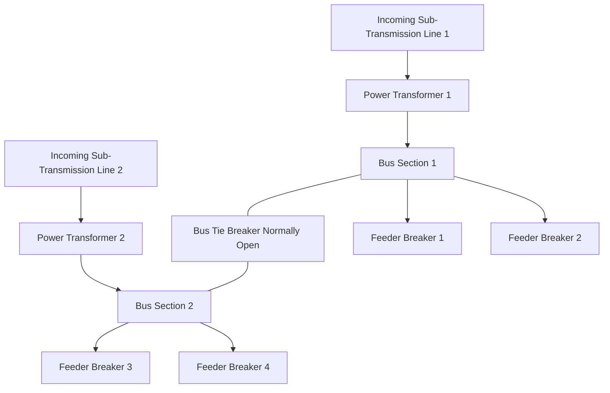

## Distribution Substation Design Principles

### Overview

A distribution substation transforms sub-transmission or transmission voltage down to primary distribution voltage and serves as the control, protection, and switching hub for the feeders radiating out to serve customers. Its design integrates electrical, civil, protection, and control engineering disciplines and must balance reliability, cost, safety, and future load growth.

### Functional Role

- Steps down voltage (typically 69–230 kV incoming) to primary distribution voltage (typically 4.16–34.5 kV)
- Provides metering, protection, and switching for outgoing distribution feeders
- Serves as a load-transfer and sectionalizing point between the transmission/sub-transmission system and the distribution network
- Houses voltage regulation equipment (transformer LTC, voltage regulators) to maintain feeder voltage within statutory limits across varying load conditions

### Substation Layout and Bus Configurations

**Single Bus**

The simplest configuration: all incoming lines and outgoing feeders connect to a single bus section.

- Lowest cost, simplest protection
- No redundancy: a bus fault or bus maintenance de-energizes the entire substation
- Suitable for small, non-critical substations

**Single Bus with Sectionalizing (Split Bus)**

A bus tie breaker divides the bus into two sections, each fed by its own transformer/source.

- Allows partial substation operation during maintenance or a source outage
- Bus tie can be normally open (independent sections) or normally closed (parallel operation) depending on utility practice and fault current considerations

**Main-and-Transfer Bus**

Adds a secondary "transfer" bus connected to all feeder positions through a transfer breaker, allowing any feeder breaker to be taken out of service for maintenance without de-energizing the feeder (service continues through the transfer bus).

- Improves maintainability without full breaker-and-a-half cost
- Still has a single main bus as a common-mode vulnerability

**Double Bus, Double Breaker**

Each circuit (transformer or feeder) connects to two independent buses through two dedicated breakers.

- High reliability and flexibility: either bus can be taken out of service without interrupting any circuit
- Highest cost due to doubled breaker count; typically reserved for higher-voltage or highly critical substations rather than typical distribution-class substations

**Ring Bus**

Breakers form a closed ring, with each circuit tapped between two adjacent breakers.

- Good reliability-to-cost ratio at the sub-transmission level feeding into distribution substations
- Breaker failure or maintenance can isolate more than one circuit depending on ring position, and the ring's reliability degrades as more circuits are added (dividing the number of breakers per circuit)

**Distribution Substation Bus Configuration Comparison**

| Configuration | Relative Cost | Reliability | Maintainability | Typical Use |
| --- | --- | --- | --- | --- |
| Single bus | Lowest | Low | Poor | Small/rural substations |
| Split bus | Low-moderate | Moderate | Moderate | Standard 2-transformer substations |
| Main-and-transfer | Moderate | Moderate | Good | Feeder-heavy distribution substations |
| Ring bus | Moderate-high | High | Good | Sub-transmission-fed substations |
| Double bus-double breaker | Highest | Highest | Excellent | Critical/high-voltage substations |

**Typical Split-Bus Distribution Substation Diagram**

### Power Transformer Design Considerations

**Sizing**

Transformer capacity is selected based on projected peak load, planning reserve margin (N-1 contingency capability — i.e., one transformer must be able to carry the full substation load with the other out of service, up to its emergency rating), and load growth forecast over the planning horizon (typically 10–20 years).

**Cooling Class**

Standard designations (per IEEE C57.12.00 / IEC 60076) indicate cooling method, e.g.:

- ONAN (Oil Natural, Air Natural) — self-cooled base rating
- ONAF (Oil Natural, Air Forced) — fan-assisted, increases rating typically 15–25% over ONAN
- OFAF/ODAF — forced oil circulation for higher-capacity units

**Tap Changing**

- **No-load tap changer (NLTC)**: Adjusted only while de-energized, used for coarse seasonal or long-term voltage adjustment
- **Load tap changer (LTC)**: Adjusts under load automatically via a voltage regulating relay, maintaining secondary bus voltage within a target band as primary voltage or load current varies

**Grounding (Winding Configuration)**

Common distribution substation transformer connections:

- **Delta-Wye grounded**: Most common for distribution substations; provides a grounded neutral on the secondary (distribution) side for four-wire multi-grounded neutral distribution systems, and the delta primary blocks zero-sequence current transfer from the transmission side.
- **Wye grounded-Wye grounded**: Used where zero-sequence continuity between transmission and distribution is acceptable or required, less common at distribution voltage due to ferroresonance and harmonic considerations.

### Protection Scheme Design

**Transformer Protection**

- Differential relaying (87T) for internal fault detection
- Sudden pressure relay / gas accumulation relay (mechanical protection for oil-filled units)
- Overcurrent backup protection (51/51N)
- Winding and oil temperature protection with alarm and trip stages

**Bus Protection**

- Bus differential relaying (87B) for high-speed bus fault clearing, common on higher-reliability configurations
- Time-overcurrent backup on incoming breakers where dedicated bus differential is not justified by substation criticality/cost

**Feeder Protection**

- Time-overcurrent relaying (50/51, 50N/51N) coordinated with downstream reclosers, sectionalizers, and fuses
- Reclosing relays (79) to automatically restore service following transient faults (a large majority of overhead distribution faults are transient)
- Directional elements where the feeder can be back-fed (e.g., loop-connected feeders, DG interconnection)

**Protection Coordination Principle**

Protection must be coordinated in a "zone of protection" hierarchy: each protective device's zone overlaps slightly with adjacent zones (via current transformer placement) so that no point in the system is left unprotected, while ensuring the device closest to a fault operates first (selectivity), minimizing the number of customers/equipment affected.

### Grounding and Site Design

**Substation Grounding Grid**

A buried grid of bare copper conductors bonded to all major equipment, structures, and fences, designed per IEEE Std 80 to limit:

- **Step potential**: voltage difference between a person's two feet during a ground fault
- **Touch potential**: voltage difference between a person's hand (touching grounded equipment) and feet
- **Ground potential rise (GPR)**: overall rise in substation ground potential during a fault, relevant for coordination with adjacent communication circuits and fences

Grid design inputs include soil resistivity (measured via Wenner four-point method), fault current magnitude and duration, and fault clearing time from protection settings.

**Site Layout Considerations**

- Clearances per applicable electrical safety code (e.g., IEEE C2 National Electrical Safety Code in North America, IEC 61936 internationally) for phase-to-ground and phase-to-phase spacing based on voltage class
- Equipment arrangement to allow safe maintenance access and future expansion
- Oil containment (spill containment berms/pits) for oil-filled transformers per environmental regulation
- Fire barriers or separation distance between adjacent oil-filled transformers
- Control building/enclosure housing protection relays, SCADA RTU, battery/DC system, and metering

### DC Auxiliary and Control Systems

- **Station battery system**: Provides DC control power for protective relays, breaker trip/close coils, and SCADA during AC supply loss; sized for a minimum reserve duration (commonly 4–8 hours) per utility standard
- **Battery charger**: Float-charges the battery from station service AC
- **SCADA Remote Terminal Unit (RTU)**: Provides real-time telemetry (voltage, current, breaker status) and remote control capability to the utility's distribution control center

### Voltage Regulation Equipment

- **Load tap changers** on the power transformer (primary voltage regulation method)
- **Line voltage regulators**: Autotransformer-based regulators installed on individual feeders downstream of the substation to compensate for voltage drop along long feeders
- **Capacitor banks**: Fixed or switched capacitor banks for reactive power compensation and voltage support, switched via time, temperature, voltage, or var-based controls

### Environmental and Community Design Considerations

- Noise mitigation (transformer hum, fan noise) via sound barriers or setback distance, particularly relevant for substations sited near residential areas
- Visual/aesthetic treatment (landscaping, architectural screening) in urban or aesthetically sensitive locations
- Stormwater management for the substation site, including oil-water separation for containment area drainage

### Design Standards Referenced (Representative)

- IEEE Std 80 — Guide for Safety in AC Substation Grounding
- IEEE C57.12.00 — General Requirements for Liquid-Immersed Distribution, Power, and Regulating Transformers
- IEEE C37 series — Standards for AC High-Voltage Circuit Breakers and Protective Relaying
- IEC 61936 — Power installations exceeding 1 kV AC
- National Electrical Safety Code (NESC) or equivalent national code for clearance and safety requirements

[Unverified] Specific standard revisions and numbering should be checked against current editions in force at the time of design, as standards are periodically revised.

**Related Topics**

- Substation Grounding Grid Design per IEEE Std 80
- Power Transformer Protection Schemes (Differential, Sudden Pressure)
- Distribution Feeder Voltage Regulation Techniques
- SCADA and Substation Automation Architecture
- Bus Configuration Selection for Sub-Transmission Substations
- Reclosing Schemes and Transient Fault Statistics on Overhead Feeders
- Station Battery Sizing and DC System Design
- Substation Siting and Environmental Permitting Considerations