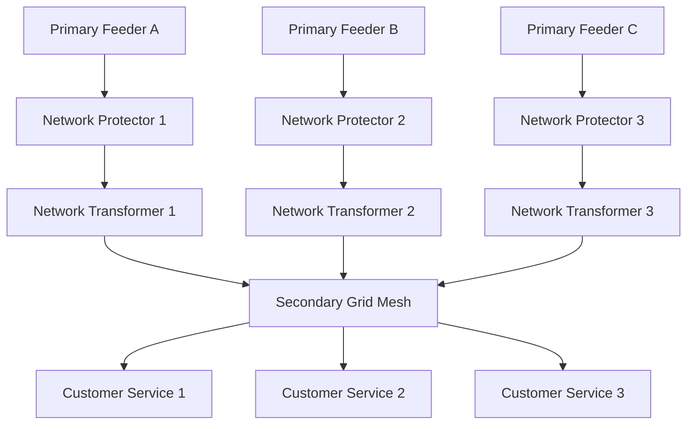

## Distribution Transformers and Secondary Networks

### Overview

Distribution transformers perform the final voltage transformation step in the power delivery chain, converting primary distribution voltage (typically 4.16–34.5 kV) down to utilization voltage (typically 120/240 V or 230/400 V) at or near the point of customer use. Secondary networks refer both to the low-voltage circuits fed by these transformers and, in dense urban contexts, to the meshed secondary-grid architecture that interconnects multiple transformers for high reliability.

### Distribution Transformer Fundamentals

**Function and Placement**

Distribution transformers are installed at the final step-down point closest to customers, mounted on poles (overhead), on pads at grade (padmount), or in vaults (underground/network). They convert primary voltage to secondary utilization voltage and typically serve a small cluster of customers (a few to several dozen) per unit.

**Core Construction Types**

- **Core-type**: Windings surround the core legs; common in smaller distribution units
- **Shell-type**: Core surrounds the windings; more common in larger power transformers, less typical at distribution scale

**Cooling and Insulation**

- **Liquid-filled (oil-filled)**: Mineral oil or less-flammable synthetic/natural ester fluids provide both insulation and cooling; most common for pole-mount and padmount units
- **Dry-type**: Air or cast-resin insulated, used indoors, in vaults, or where fire code/environmental concerns preclude liquid-filled units (e.g., network vaults beneath sidewalks, indoor commercial installations)

### Mounting Configurations

**Pole-Mounted (Overhead) Transformers**

- Single-phase units are most common for residential service, typically serving one to a few households from a single unit tapped off the primary lateral
- Three-phase banks (three single-phase units, or one integrated three-phase unit) serve larger commercial/industrial loads or three-phase secondary networks
- Standard connection: primary winding connects phase-to-neutral (single-bushing) on a multi-grounded wye system, or phase-to-phase on a delta primary

**Pad-Mounted Transformers**

- Ground-level, tamper-resistant steel enclosure used with underground primary and secondary cable
- Common in underground residential distribution (URD) subdivisions and commercial developments where overhead lines are undesirable or prohibited
- Requires clear working space in front of the enclosure doors per manufacturer/utility clearance standards for safe operation and maintenance

**Network (Vault-Type) Transformers**

- Installed in underground vaults beneath streets or building basements in dense urban secondary network areas
- Typically dry-type or less-flammable liquid-filled units due to the confined, often below-grade space and proximity to public areas
- Equipped with an integral network protector (see below) rather than conventional fuse protection

### Sizing and Loading

**Load Estimation**

Transformer sizing is based on the coincident peak demand of the connected customers, accounting for **diversity** — since individual customer peak loads rarely occur simultaneously, the transformer is sized well below the sum of individual customer connected loads.

$$S_{transformer} \geq \frac{\sum_{i=1}^{n} D_i \times DF}{PF}$$

Where $D_i$ is the individual customer demand, $DF$ is the diversity factor (typically less than 1, reflecting non-coincident peaks), and $PF$ is the system power factor.

**Standard Sizes**

Common distribution transformer kVA ratings (single-phase, residential/light commercial): 10, 15, 25, 37.5, 50, 75, 100, 167, 250 kVA. Larger three-phase padmount and network units range from 300 kVA up to 2500 kVA or more.

**Thermal Loading and Life**

Transformer insulation life is governed by hot-spot winding temperature, following an Arrhenius-type aging relationship; sustained loading above nameplate rating accelerates insulation aging, while transformers are commonly designed to tolerate emergency overloads for limited durations per IEEE C57.91 loading guides. [Inference] Specific overload duration/temperature tables are manufacturer- and standard-edition-specific and should be verified against the applicable IEEE C57.91 or IEC 60076-7 edition in force.

### Protection of Distribution Transformers

- **Primary fuse (fuse cutout)**: Overcurrent protection isolating a faulted transformer from the primary feeder; sized to coordinate with upstream feeder protection and to withstand transformer inrush current
- **Secondary breaker or fuse**: Protects the low-voltage secondary circuit and connected service drops
- **Surge arresters**: Installed at the transformer primary bushing to protect against lightning-induced and switching transient overvoltages

### Secondary Circuit Configurations

**Radial Secondary (Single Transformer)**

The most common residential/light-commercial arrangement: one transformer serves a small radial secondary circuit feeding individual services directly, with no interconnection to adjacent transformers' secondaries.

**Secondary Network (Grid) System**

In dense urban areas, multiple transformers' secondaries are interconnected into a common, meshed low-voltage grid (see also coverage in the topology chapter). Each transformer is fed from a separate primary feeder through a **network protector**.

**Network Protector Operation**

A network protector is a specialized electromechanical or solid-state-controlled low-voltage circuit breaker mounted at the transformer secondary, incorporating:

- **Reverse power relay**: Trips the protector open if power attempts to flow backward from the secondary grid into the transformer/primary feeder (indicating a fault or de-energization upstream on that feeder), preventing the healthy grid from back-feeding a faulted feeder
- **Master/phasing relay**: Permits automatic reclosing of the protector when voltage and phase conditions across the protector indicate it is safe to reconnect (i.e., the primary feeder has been restored and is in phase with the secondary grid)

**Secondary Network Diagram**

**Spot Network**

A dedicated variant serving a single large building or facility: two or more primary feeders supply dedicated network transformers/protectors feeding a common low-voltage bus within that building, without extending into a broader area-wide secondary grid.

### Secondary Voltage Systems

**Single-Phase Residential (North American Practice)**

- 120/240 V, single-phase, three-wire secondary from a center-tapped transformer secondary winding, providing 120 V line-to-neutral for lighting/receptacle loads and 240 V line-to-line for larger appliances

**Three-Phase Secondary (Commercial/Industrial)**

- 208Y/120 V (four-wire wye) — common in commercial buildings, derived from a three-phase transformer bank or unit
- 480Y/277 V — common for larger commercial/industrial facilities, with 277 V often used for lighting circuits
- 240 V delta (with or without a high-leg/wild-leg) — legacy configuration still found in some industrial contexts

**International Practice**

Many countries outside North America use 230/400 V three-phase four-wire secondary systems as the standard low-voltage distribution voltage.

### Transformer Bank Connections (Three-Phase from Single-Phase Units)

- **Delta-Delta**: Allows continued (reduced-capacity) operation as an "open delta" if one unit fails, useful for maintaining partial service
- **Delta-Wye grounded**: Common where a grounded neutral is required on the secondary for four-wire distribution
- **Open Delta (V-V)**: Two transformers provide three-phase service at reduced total capacity (86.6% of the equivalent closed-delta bank rating), often used as an interim or economical solution for light three-phase loads

### Losses and Efficiency

- **No-load (core/iron) losses**: Constant losses due to hysteresis and eddy currents in the core, present whenever the transformer is energized regardless of load
- **Load (copper) losses**: $I^2R$ losses in the windings, varying with the square of load current
- Distribution transformer efficiency and loss evaluation increasingly incorporate **Total Owning Cost (TOC)** methodologies, weighing purchase price against capitalized lifetime loss costs, particularly relevant given regulatory efficiency standards (e.g., US DOE distribution transformer efficiency regulations)

### Emerging Considerations

- **Distributed Generation Impact**: Customer-sited solar PV can cause reverse power flow through distribution transformers, affecting voltage regulation, protection coordination (fuse sizing, network protector reverse-power sensitivity), and transformer loading patterns
- **Electric Vehicle Charging Load**: Concentrated residential EV charging can create localized transformer overload conditions not anticipated in original diversity-based sizing, prompting utility programs for transformer capacity assessment and proactive upgrades
- **Smart/Connected Transformers**: Integration of sensors for real-time loading, temperature, and health monitoring (transformer condition monitoring) to support predictive maintenance and dynamic loading decisions

**Related Topics**

- Network Protector Relaying and Reverse-Power Protection
- Transformer Loss Evaluation and Total Owning Cost Methodology
- Underground Residential Distribution (URD) Design
- Distributed Generation Interconnection and Voltage Impact
- Electric Vehicle Charging Load Impact on Distribution Assets
- Transformer Sizing and Diversity/Demand Factor Application
- IEEE C57.91 Transformer Loading Guidelines
- Radial, Loop, and Networked Distribution Topologies