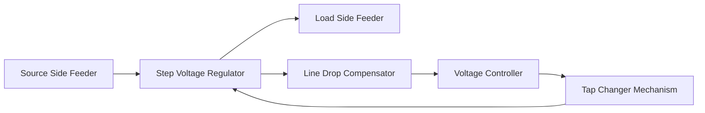
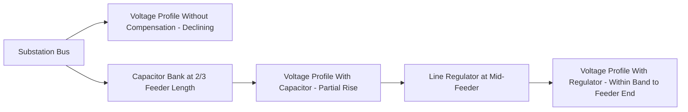

## Voltage Regulators and Capacitor Bank Placement

### Overview

Distribution feeders experience voltage drop as current flows through feeder impedance, with voltage falling progressively from the substation toward the end of the feeder as load increases. Voltage regulators and capacitor banks are the two principal devices used to maintain feeder voltage within statutory service limits under varying load conditions, using complementary mechanisms — series voltage boost versus reactive power compensation.

### Voltage Regulation Fundamentals

**Statutory Voltage Limits**

Most jurisdictions require utilization voltage to be maintained within a defined band around nominal, commonly referenced against ANSI C84.1 Range A (typically ±5% of nominal) for normal operating conditions in North American practice. [Inference] Exact percentage bands and applicable standards vary by jurisdiction and should be verified against the local regulatory/utility standard in force.

**Voltage Drop Along a Feeder**

For a feeder segment, approximate voltage drop is:

$$\Delta V \approx I(R\cos\theta + X\sin\theta)$$

Where $I$ is line current, $R$ and $X$ are the segment resistance and reactance, and $\theta$ is the load power factor angle. As load increases toward feeder capacity, cumulative drop along a long feeder can exceed acceptable limits at the far end, particularly for feeders with high R/X ratios common in overhead distribution conductors.

### Voltage Regulators

**Operating Principle**

A step-voltage regulator is an autotransformer with a tap-changing mechanism that adds or subtracts a small series voltage (typically ±10%, in 32 steps of 5/8% each per standard single-phase units) to boost or buck the line voltage, automatically adjusting in response to a sensed voltage at a defined regulation point.

**Construction**

- **Single-phase step regulators**: Three units (one per phase) installed at a regulation point on a three-phase feeder, each independently controlled
- **Three-phase regulators**: Single tank unit for smaller installations, less common for larger feeders where independent phase control is preferred

**Control Elements**

- **Line Drop Compensator (LDC)**: Simulates the voltage drop between the regulator location and a remote "regulation point" further down the feeder, using set $R$ and $X$ compensation values, so the regulator maintains target voltage at that downstream point rather than at its own terminals
- **Voltage relay/controller**: Compares compensated voltage against a target setpoint and bandwidth (deadband), initiating tap changes only when voltage deviates beyond the bandwidth for a defined time delay (to avoid excessive tap operations from transient fluctuations)
- **Time delay**: Typically several seconds to tens of seconds, balancing responsiveness against mechanical wear from excessive tap operations

**Placement Strategy**

- Regulators are typically installed at the substation (bus regulation) and/or at intermediate points along long feeders where calculated voltage drop under peak load would otherwise exceed the acceptable band
- Placement studies use feeder voltage profile analysis (via power flow simulation) to identify the point(s) along the feeder where regulation most effectively holds the entire feeder within limits with the fewest regulator installations
- Rule-of-thumb guidance for regulator spacing depends on feeder loading and conductor size. [Inference] Because siting depends on specific feeder length, load profile, and conductor impedance, actual placement is determined through load-flow studies rather than universal fixed distances.

**Regulator Bank Diagram (Single-Phase Unit Schematic)**

### Capacitor Banks

**Operating Principle**

Capacitor banks supply reactive power (VARs) locally at the point of installation, reducing the reactive current that would otherwise flow from the substation through the feeder impedance. Since voltage drop has a component proportional to reactive current ($I_x X$), locally supplied VARs reduce voltage drop and raise voltage at and downstream of the bank, in addition to improving power factor and reducing $I^2R$ losses upstream of the bank.

**Sizing Rationale**

Capacitor bank sizing is typically based on:

- Correcting feeder power factor toward a target (often near unity or a utility-specified target, e.g., 0.95–0.98 lagging)
- Providing sufficient voltage rise at the installation point under peak reactive loading, without causing overvoltage during light-load conditions

**Types of Capacitor Bank Control**

- **Fixed capacitor banks**: Permanently connected, sized to offset the minimum (base) reactive load so they do not cause overvoltage during light load periods
- **Switched capacitor banks**: Connected/disconnected automatically based on a control signal, sized to handle the variable portion of reactive load above the fixed bank's coverage

**Switching Control Methods**

- **Time clock control**: Switches based on time-of-day load patterns (least adaptive, used where load patterns are highly predictable)
- **Temperature control**: Correlates ambient temperature with air-conditioning-driven reactive load in relevant climates
- **Voltage control**: Switches in when voltage falls below a threshold (indicating heavy load) and switches out when voltage rises above a threshold
- **Var control**: Directly measures feeder reactive power flow and switches to maintain a target var flow or power factor at the measurement point
- **Current control**: Switches based on line current magnitude as a proxy for loading level

**Placement Strategy**

- **Loss reduction objective**: Optimal placement for minimizing $I^2R$ losses is generally at approximately two-thirds of the distance from the substation to the end of a uniformly distributed load feeder (a classical result from reactive power flow/loss minimization analysis), though real feeders with non-uniform load require load-flow-based optimization rather than this simplified rule
- **Voltage support objective**: Placement closer to the point of maximum voltage drop (often near the feeder end) more directly addresses voltage-band violations, even if not loss-optimal
- Multiple smaller banks distributed along a feeder are often more effective than a single large bank at a single point, both for loss reduction and voltage profile flattening

**Overvoltage and Resonance Risks**

- Fixed banks left connected during light-load periods can cause **overvoltage**, particularly at the far end of feeders with distributed generation reducing net current flow
- Switched capacitor banks require adequate control hysteresis (deadband) to prevent **hunting** (rapid cycling between switched-in and switched-out states)
- Capacitor banks can interact with system inductance to create **harmonic resonance** conditions, amplifying background harmonic distortion (particularly relevant with increasing non-linear loads and inverter-based DER); resonance risk assessment is a standard part of capacitor placement studies
- **Ferroresonance** risk during switching operations, particularly relevant when switching capacitor banks in combination with certain transformer configurations or during single-phase switching events

### Coordination Between Regulators and Capacitors

Voltage regulators and capacitor banks are typically coordinated so that:

1. Capacitor banks address the bulk reactive power flow and provide baseline voltage support/power factor correction
2. Voltage regulators fine-tune voltage at specific points to hold the full feeder length within the target band, compensating for whatever voltage profile remains after capacitor support
3. Control settings (regulator bandwidth/time delay, capacitor switching thresholds) are coordinated to avoid the two device types "fighting" each other — e.g., a capacitor switching in immediately after a regulator has already tapped up in response to the same load increase, potentially causing overvoltage requiring the regulator to tap back down

**Combined Feeder Profile Illustration**

### Analytical Methods

**Load Flow Studies**

Distribution power flow analysis (e.g., using forward-backward sweep methods common for radial distribution networks, given their high R/X ratio which limits applicability of transmission-style fast-decoupled methods) is used to model voltage profiles under peak, minimum, and typical load conditions, testing candidate regulator and capacitor placements against voltage band compliance and loss reduction targets.

**Optimal Capacitor Placement (OCP) Problem**

The classic OCP problem seeks to determine the number, size, and location of capacitor banks that minimize total cost (capital cost of banks plus capitalized cost of energy losses) subject to voltage constraints; solved historically via heuristic methods and increasingly via metaheuristic optimization algorithms (genetic algorithms, particle swarm optimization) in planning software. [Inference] Specific algorithmic approaches and their comparative performance are an active area of academic distribution planning literature rather than a single settled industry-standard method.

### Emerging Considerations with Distributed Generation

- High penetration of distributed PV can cause **reverse power flow** during high-generation, low-load periods, reversing the direction of voltage drop compensation assumptions embedded in conventional LDC settings (designed assuming unidirectional flow from substation to load)
- This has driven interest in **bidirectional/smart voltage regulators** and **advanced inverter functions** (e.g., Volt-VAR control per IEEE 1547) that allow inverter-based DER to provide local reactive power support, complementing or partially substituting for traditional capacitor banks
- Utilities increasingly evaluate **Volt-VAR Optimization (VVO)** as a coordinated, often centrally or distributed-intelligence-controlled scheme integrating regulator taps, capacitor switching, and DER reactive power output to minimize losses and maintain voltage band compliance across changing generation and load conditions

**Related Topics**

- Volt-VAR Optimization (VVO) and Conservation Voltage Reduction (CVR)
- IEEE 1547 Advanced Inverter Functions for DER
- Distribution Load Flow Analysis Methods (Forward-Backward Sweep)
- Harmonic Resonance and Power Quality Impacts of Capacitor Switching
- Distributed Generation Impact on Feeder Voltage Profiles
- Radial, Loop, and Networked Distribution Topologies
- Distribution Transformers and Secondary Networks
- Feeder Loss Reduction Planning Methods