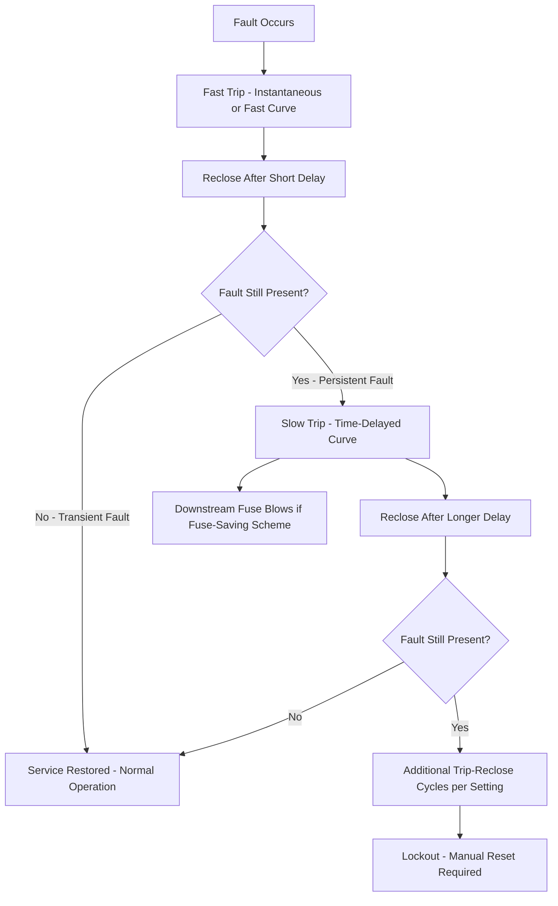
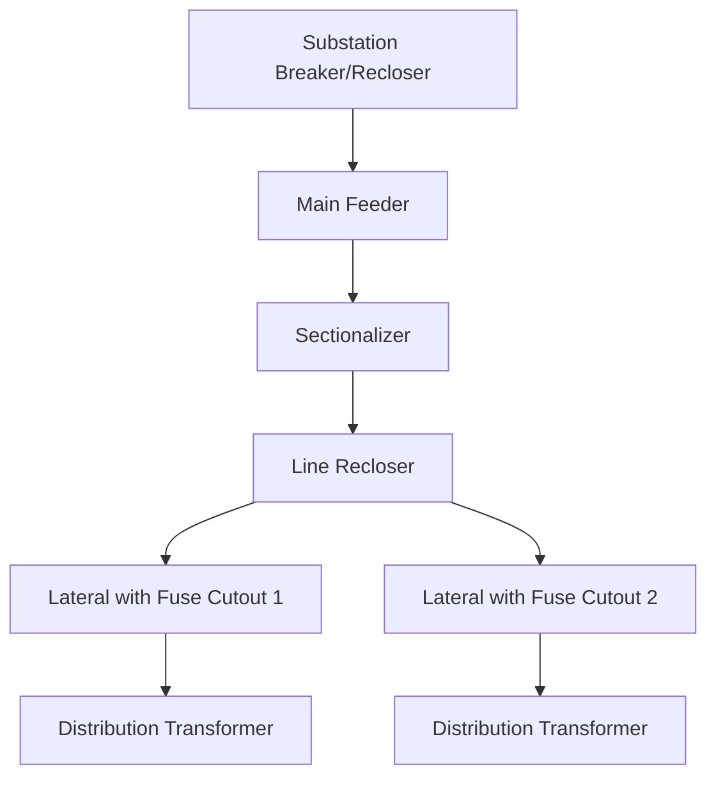

## Distribution Feeder Protection: Fuses, Reclosers, and Sectionalizers

### Overview

Distribution feeder protection uses a hierarchy of overcurrent devices — fuses, reclosers, and sectionalizers — coordinated to isolate faults with the smallest possible outage footprint, restore service automatically following transient faults, and protect equipment from thermal and mechanical damage during permanent faults. Because the large majority of overhead distribution faults are transient in nature (e.g., lightning-induced flashover, tree contact, animal contact), the coordination scheme is designed around giving faults a chance to clear themselves before permanently interrupting service.

### Fault Characteristics on Distribution Feeders

**Transient vs. Permanent Faults**

- **Transient faults**: Self-clearing once the arc is de-energized (e.g., a lightning flashover across an insulator, a tree branch brushing a conductor and then falling away); power can typically be restored immediately upon reclosing
- **Permanent faults**: Require physical repair before service can be restored (e.g., a broken conductor, a failed insulator, a fallen tree limb lodged on the line)

  [Inference] The commonly cited industry figure that a substantial majority (often quoted around 80-90%) of overhead distribution faults are transient is a widely used planning assumption; the precise percentage varies by geography, vegetation management practices, and weather exposure.

### Fuses

**Function**

A fuse is the simplest and least expensive protective device, providing one-time overcurrent interruption via a fusible element that melts when current exceeds its rated value for a duration determined by its time-current characteristic (TCC) curve.

**Fuse Cutout**

The standard distribution application is the **fuse cutout**: an assembly holding a replaceable fuse link, mounted on the pole at a lateral tap or transformer connection, which also provides a visible open point for isolation once the fuse has operated.

**Fuse Link Types (Time-Current Characteristics)**

- **K-link (fast)**: Faster response for a given current, used where fast fault clearing at the fuse location is prioritized
- **T-link (slow)**: Slower response, allowing better coordination margin with downstream devices or better tolerance of transformer inrush/cold-load pickup
- Ratings are standardized (e.g., 6K, 8K, 10K... or 6T, 8T, 10T...) with the number denoting a characteristic current rating

**Fuse Saving vs. Fuse Clearing Philosophy**

- **Fuse saving (fuse blowing avoidance)**: An upstream recloser is set to operate (open) faster than the fuse for a first fault-clearing attempt, then recloses; if the fault was transient, service to the fuse's downstream section is restored without the fuse ever blowing, avoiding a truck roll to replace the fuse link. If the fault persists after one or more fast recloser operations, the recloser switches to a slower curve allowing the fuse to blow and isolate the (evidently permanent) fault on that lateral.
- **Fuse clearing (fuse blowing philosophy)**: The recloser is coordinated so the fuse operates first on the initial fault, isolating only the faulted lateral immediately, at the cost of requiring a fuse replacement even for transient faults on that lateral.
- Trade-off: fuse saving minimizes truck rolls and momentary outage counts from transient lateral faults but exposes the whole feeder upstream of the recloser to repeated momentary interruptions (affecting MAIFI) for faults on any single lateral; fuse clearing localizes the outage to the faulted lateral immediately but increases sustained outage counts and fuse replacement costs for transient events.

**Coordination Principle**

Fuse-to-fuse and fuse-to-recloser coordination relies on comparing TCC curves: the protective device closer to the fault must operate before an upstream device for the same fault current, achieved by selecting fuse ratings/curves and recloser curves with adequate separation (coordination margin) across the expected fault current range.

### Reclosers

**Function**

A recloser is a self-contained overcurrent protective device capable of automatically interrupting and reclosing a circuit multiple times according to a preset sequence, giving transient faults repeated opportunities to clear before locking out.

**Construction**

- **Hydraulic reclosers**: Older technology using hydraulic mechanisms for timing and control, largely legacy equipment in modern installations
- **Electronically controlled reclosers**: Modern standard, using a microprocessor-based control with current transformers/sensors, offering flexible, field-programmable TCC curves, sequence settings, and communication capability (SCADA integration)

**Operating Sequence**

A typical recloser sequence includes 1 to 4 operations before lockout:

1. **First trip**: Fast curve (instantaneous or fast time-overcurrent), clearing the fault quickly to minimize thermal stress and (in fuse-saving schemes) to trip before a downstream fuse can blow
2. **Reclose after fast trip**: A short delay (often under 1-2 seconds), then recloses to test whether the fault has cleared
3. **Subsequent trip(s)**: If the fault persists, one or more further trips using a slower (time-delayed) curve, which — in fuse-saving schemes — allows a downstream fuse to blow and isolate a persistent lateral fault before the recloser itself locks out
4. **Lockout**: If the fault persists through all programmed operations, the recloser opens and remains open (locked out) rather than reclosing again, requiring manual investigation, repair, and reset

**Recloser Sequence Diagram**

**Placement**

Reclosers are installed at the substation feeder breaker position (often the primary feeder protection device itself is a recloser or a breaker with recloser-equivalent relaying) and at intermediate points along long feeders to sectionalize the feeder into smaller protective zones, reducing the number of customers affected by a fault on any given feeder section.

**Ground Fault (Sensitive Earth Fault) Protection**

In addition to phase overcurrent elements, reclosers typically include ground/residual overcurrent elements to detect single-line-to-ground faults, which are the most common fault type on multi-grounded wye distribution systems and may not produce sufficient phase overcurrent to be detected by phase elements alone, particularly for high-impedance faults (e.g., a conductor contacting dry ground or vegetation).

### Sectionalizers

**Function**

A sectionalizer is a switching device that does **not** have fault-interrupting capability of its own; instead, it counts the number of interruptions (voltage loss events) caused by an upstream protective device (recloser or breaker) during a fault sequence, and opens during the upstream device's open (de-energized) interval after a preset count, isolating the faulted section before the upstream device's final reclose attempt.

**Operating Principle**

1. A fault occurs downstream of the sectionalizer.
2. The upstream recloser trips (de-energizing the sectionalizer and everything downstream).
3. The sectionalizer "counts" this interruption (it senses the loss and restoration of voltage/current associated with each recloser operation).
4. If the fault persists through a preset number of upstream recloser operations (typically set to one less than the recloser's total operations to lockout), the sectionalizer opens during the recloser's next open interval — while the circuit is de-energized, so the sectionalizer itself never has to interrupt fault current.
5. The upstream recloser then recloses successfully (since the faulted section is now isolated by the open sectionalizer), restoring service to all unfaulted sections between the recloser and the sectionalizer, and to any downstream sections beyond the sectionalizer that are fed from another direction or unaffected.

**Key Distinction from Reclosers**

Because a sectionalizer has no interrupting rating for fault current, it must always be used in conjunction with, and downstream of, a device capable of actually clearing the fault (a recloser or breaker) — it cannot be used as a standalone protective device or coordinated purely against fuses without an upstream reclosing device providing the counted interruptions.

**Types**

- **Hydraulic/electronic count-based sectionalizers**: Count voltage interruptions as described above
- **Electronically controlled sectionalizers**: Modern versions often integrate current-sensing logic and communication capability, and in automated distribution schemes may be supplemented or replaced by remotely/automatically controlled switches operating under a distribution automation (FLISR) scheme rather than a purely local counting logic

### Coordination Hierarchy Example

In this arrangement: fuse cutouts protect individual laterals/transformers, the line recloser provides fast/slow reclosing coordinated with those fuses (fuse-saving or fuse-clearing per utility philosophy), the sectionalizer isolates a faulted feeder section between itself and the line recloser without itself interrupting fault current, and the substation breaker/recloser provides overall feeder backup protection and the final coordination step against upstream sub-transmission protection.

### Coordination Study Considerations

- **Time-Current Curve (TCC) analysis**: Overlaying device curves on a common current axis to verify adequate time separation (coordination margin, typically a minimum interval such as 0.2-0.4 seconds, though the specific margin is utility-standard-dependent) between devices at all expected fault current magnitudes
- **Fault current range**: Coordination must hold across the full range from minimum fault current (e.g., a high-impedance fault at the far end of a lateral) to maximum fault current (a bolted fault near the substation), since available fault current varies significantly with fault location and system configuration
- **Cold load pickup**: Protection settings must accommodate the transient current inrush when reclosing a feeder section after an extended outage (loss of load diversity — e.g., all air conditioning compressors/motors restarting simultaneously), which can exceed normal load current for a period, without causing nuisance protective operation
- **Recloser-to-recloser coordination**: When multiple reclosers exist in series along a feeder, their respective fast and slow curves and sequence counts must be coordinated so that the recloser closest to the fault operates through its full sequence before an upstream recloser begins its own sequence

### Distribution Automation Integration

Modern feeder protection increasingly integrates with **Fault Location, Isolation, and Service Restoration (FLISR)** schemes, where communicating reclosers and remotely controlled switches automatically detect a fault location, isolate the smallest faulted section, and restore service to unfaulted sections via alternate feed paths (tie switches) — extending the traditional local fuse/recloser/sectionalizer coordination logic with system-wide, communication-based decision-making. [Inference] Specific FLISR architectures (centralized vs. peer-to-peer distributed logic) and achievable restoration times are vendor- and utility-implementation-specific.

**Related Topics**

- Distribution Automation and FLISR Schemes
- Radial, Loop, and Networked Distribution Topologies
- Time-Current Curve (TCC) Coordination Studies
- Cold Load Pickup and Inrush Current Considerations
- Ground Fault Detection on Multi-Grounded Wye Systems
- Reliability Indices Impacted by Protection Philosophy (SAIFI, MAIFI, CAIDI)
- Vegetation Management and Its Effect on Transient Fault Rates
- Distribution Substation Design Principles