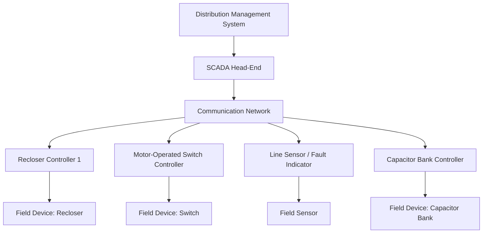
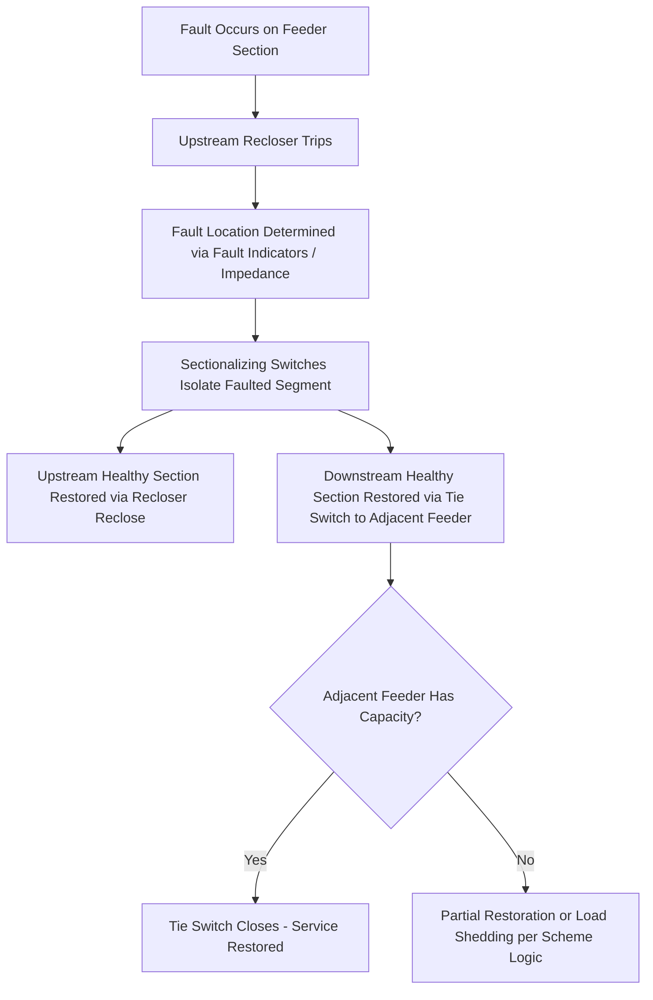

## Distribution Automation and Feeder Reconfiguration

### Overview

Distribution automation (DA) encompasses the sensing, communication, and control technologies that enable a distribution utility to monitor feeder conditions in real time and remotely or automatically operate switching devices, extending the traditional local, mechanically-coordinated protection scheme (fuses, reclosers, sectionalizers) into a system-wide, communication-enabled control architecture. Feeder reconfiguration — changing the normally-open/normally-closed status of switches to alter power flow paths — is one of DA's principal applications, used both for automated fault response and for planned optimization of feeder loading and losses.

### Distribution Automation Architecture

**Core Components**

- **Field devices**: Automated reclosers, motor-operated switches, sectionalizing switches, and capacitor bank controllers equipped with remote control and monitoring capability
- **Sensors**: Fault indicators, voltage/current sensors, and line sensors providing real-time telemetry from points along the feeder, not just at switching devices
- **Communication network**: The data backbone connecting field devices to control systems — options include utility-owned fiber, licensed/unlicensed radio (RF mesh), cellular (public carrier), and power line carrier, selected based on latency requirements, coverage, and cost
- **Distribution Management System (DMS)**: The central (or increasingly distributed) software platform that ingests telemetry, models the network, and issues control commands or provides operator decision support
- **SCADA (Supervisory Control and Data Acquisition)**: The underlying real-time monitoring and control layer connecting field RTUs/IEDs to the control center; DMS applications typically sit atop or alongside SCADA
- **Intelligent Electronic Devices (IEDs)**: Microprocessor-based relays/controllers at each automated device, capable of local decision logic in addition to remote command execution

**Architectural Approaches**

- **Centralized control**: The DMS at the control center receives all telemetry, computes the optimal switching response, and issues commands to field devices; requires reliable, sufficiently fast communication to all involved devices
- **Distributed (peer-to-peer) control**: Field devices communicate directly with neighboring devices and execute pre-engineered logic locally without requiring the central DMS to be in the loop for the immediate fault response, offering faster response and resilience to communication network outages to the control center, at the cost of more complex field engineering per automation scheme
- **Hybrid approaches**: Local automated logic executes the fast, time-critical restoration switching, while the central DMS handles broader system optimization, confirmation, and operator visibility

**Distribution Automation Architecture Diagram**

### Fault Location, Isolation, and Service Restoration (FLISR)

**Purpose**

FLISR is the flagship DA application for reliability improvement: automatically detecting a fault, determining its location within the feeder topology, isolating the smallest possible faulted section, and restoring service to unfaulted sections via alternate source paths — all with minimal or no operator intervention, executing in seconds rather than the tens of minutes to hours typical of manual crew-based restoration.

**FLISR Process Sequence**

1. **Fault detection**: An upstream protective device (recloser/breaker) trips on fault current; fault current magnitude and duration may also be captured for later fault location analysis
2. **Fault location**: Using fault indicator status, sectionalizing device response, and/or fault current magnitude analysis (impedance-based fault location), the system determines which feeder section contains the fault
3. **Isolation**: Automated switches on either side of the identified faulted section open, isolating it from the rest of the feeder
4. **Restoration**:
   - The upstream healthy section is restored by reclosing the substation breaker/recloser
   - The downstream healthy section (beyond the faulted segment) is restored by closing a normally-open tie switch connecting it to an alternate source (an adjacent feeder or the opposite end of a loop), subject to that alternate source having sufficient available capacity
5. **Confirmation and notification**: The DMS updates its network model to reflect the new switching state and notifies operators and outage management systems

**FLISR Sequence Diagram**

**Capacity Constraint Consideration**

Before closing a tie switch to restore load from an adjacent feeder, the automation logic (or operator, in supervisory schemes) must verify the adjacent feeder has sufficient thermal capacity margin to absorb the transferred load without exceeding its own rating — a key planning input for FLISR scheme design, since feeders are often planned with reserve capacity specifically to support this contingency transfer capability.

### Feeder Reconfiguration for Planned Optimization

Beyond fault response, feeder reconfiguration is used proactively to:

**Loss Minimization**

Changing the location of normally-open points across a meshed or looped feeder network to minimize total system $I^2R$ losses under current loading conditions — a classic distribution optimization problem, since the optimal open-point configuration shifts as load patterns change throughout the day and across seasons.

**Load Balancing**

Redistributing load among feeders to avoid overloading any single feeder while leaving others underutilized, particularly relevant as load growth or new large customer connections shift the loading pattern away from the configuration assumed at original design.

**Planned Maintenance Switching**

Reconfiguring feeders to de-energize a section for planned maintenance while maintaining service to unaffected customers via alternate feed, minimizing planned outage scope.

**Reconfiguration Constraints**

Any reconfiguration must respect:

- **Radial operating constraint**: Most distribution systems must remain radially operated (no closed loops energized simultaneously) even after reconfiguration, to preserve conventional protection coordination designed around radial fault current flow
- **Voltage limits**: The new configuration must not create voltage violations at any point on the affected feeders
- **Thermal limits**: No conductor or transformer section may exceed its rating under the new configuration
- **Protection coordination validity**: Fuse/recloser/sectionalizer coordination settings must remain valid (or be adjusted) for the new source and fault current flow direction

### Volt-VAR Optimization (VVO) and Conservation Voltage Reduction (CVR)

Closely related DA applications that coordinate voltage regulators, capacitor banks, and (increasingly) DER reactive power output:

- **VVO**: Optimizes voltage and reactive power flow across the feeder to minimize losses and maintain voltage band compliance
- **CVR**: Deliberately operates the feeder toward the lower end of the acceptable voltage band (within statutory limits) to reduce voltage-dependent customer energy consumption, a demand-side management strategy enabled by the same sensing/control infrastructure as VVO

  [Inference] Realized CVR energy savings (commonly cited CVR factors) are load-composition-dependent and vary by feeder and climate; specific savings percentages should be treated as illustrative rather than universally applicable.

### Communication Network Considerations

| Communication Medium | Typical Latency | Considerations |
| --- | --- | --- |
| Fiber optic | Low | High cost/right-of-way requirement, highest reliability and bandwidth |
| Licensed radio (point-to-point/mesh) | Low-moderate | Utility-controlled spectrum, moderate infrastructure cost |
| Unlicensed RF mesh | Moderate | Lower cost, potential interference from other unlicensed users |
| Cellular (public carrier) | Moderate-variable | Fast deployment, dependent on third-party network availability and coverage |
| Power line carrier | Variable | Uses existing conductors, can be affected by line conditions and switching transients |

[Inference] Specific latency figures and suitability depend on the vendor implementation and the criticality of the automation function; sub-second peer-to-peer FLISR schemes typically demand lower-latency, more deterministic communication than centralized DMS-based schemes that can tolerate longer round-trip times.

### Cybersecurity and Standards Considerations

Distribution automation systems, as operational technology (OT) connected to communication networks, require cybersecurity controls addressing device authentication, encrypted communication, and network segmentation from corporate IT systems. Relevant standards and protocols include:

- **DNP3 (Distributed Network Protocol)**: Widely used SCADA communication protocol in North American distribution automation, with DNP3 Secure Authentication extensions addressing cybersecurity
- **IEC 61850**: Substation and increasingly distribution automation communication standard, supporting interoperable modeling of IEDs
- **IEEE 1815**: The IEEE-adopted standard version of DNP3

[Unverified] Specific cybersecurity regulatory requirements (e.g., NERC CIP applicability thresholds) for distribution-level automation vary by jurisdiction and by whether the utility's distribution assets meet criteria that bring them into scope of bulk-power-system-focused regulations; this should be verified against the applicable regulatory framework.

### Outage Management System (OMS) Integration

DA and FLISR outcomes feed into the utility's Outage Management System, which tracks customer-level outage status, predicts outage location from customer calls and AMI (Advanced Metering Infrastructure) "last gasp" signals, and dispatches crews — increasingly integrated with the DMS so that automated switching actions are immediately reflected in outage records and estimated restoration times communicated to customers.

### Benefits and Limitations

**Benefits**

- Reduced SAIDI/SAIFI through faster fault isolation and restoration
- Reduced crew truck-rolls for switching operations previously requiring manual dispatch
- Improved visibility into feeder loading and power quality, supporting better planning decisions
- Enables higher DER hosting capacity through more responsive voltage/var management

**Limitations and Risks**

- Capital cost of field device automation (motor operators, communication equipment) across a large feeder population can be substantial, often prioritized on higher-criticality or higher-outage-frequency feeders first
- Communication network dependency: centralized schemes are vulnerable to communication outages coinciding with the same storm events that cause the faults being managed
- Increased system complexity requires updated protection coordination studies whenever automated reconfiguration changes the assumed source/fault-current-flow direction
- Cybersecurity exposure increases with the number of remotely controllable field devices

**Related Topics**

- Distribution Feeder Protection: Fuses, Reclosers, and Sectionalizers
- Volt-VAR Optimization and Conservation Voltage Reduction
- Outage Management Systems and AMI Integration
- DNP3 and IEC 61850 Communication Protocols
- Distribution Network Radial Operating Constraints
- Cybersecurity for Operational Technology in Distribution Systems
- Radial, Loop, and Networked Distribution Topologies
- Advanced Metering Infrastructure and Grid Sensing