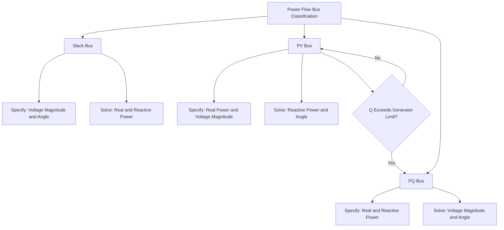

## Bus Classification: Slack, PV, and PQ Buses

### Overview

Power flow (load flow) analysis requires classifying each network bus according to which electrical quantities are known (specified) and which are unknown (to be solved for), since the number of unknowns must be reduced to match the number of independent equations available from the power flow formulation. The three standard bus types — slack, PV, and PQ — each fix a different pair of the four relevant quantities at a bus: voltage magnitude ($|V|$), voltage angle ($\theta$), real power ($P$), and reactive power ($Q$).

### The Four Bus Quantities

At every bus $i$ in a power system, four quantities are of interest:

- $|V_i|$ — voltage magnitude
- $\theta_i$ — voltage phase angle
- $P_i$ — net real power injection (generation minus load)
- $Q_i$ — net reactive power injection (generation minus load)

The power flow problem has two real equations per bus (derived from the real and reactive power balance equations using the network admittance matrix), meaning exactly two of the four quantities can be treated as unknowns to be solved at each bus, while the other two must be specified as known inputs. Bus classification determines which two are specified and which two are solved.

### Slack Bus (Reference / Swing Bus)

**Specified Quantities**: $|V|$ and $\theta$ (typically $\theta = 0°$ by convention, serving as the angular reference for the entire system)

**Solved Quantities**: $P$ and $Q$

**Purpose**

Exactly one bus in the system (in a standard single-area formulation) is designated the slack bus, serving two essential functions:

1. **Angular reference**: Since power flow equations depend only on angle *differences* between buses, the system of equations is otherwise indeterminate without fixing one bus's angle as the reference point (analogous to grounding a reference node in a DC circuit)
2. **Power balance absorption**: Total system generation must equal total system load plus total system losses, but losses cannot be known until the power flow is solved (a circular dependency). The slack bus resolves this by absorbing whatever real and reactive power imbalance remains after all other buses' generation and load are specified, effectively "making up the difference" including the yet-unknown transmission losses.

**Selection Criteria**

The slack bus is conventionally chosen at a bus with a large generator capable of absorbing the expected power balance mismatch, often the reference/reference generating station in the study area, or in constructed/textbook examples, arbitrarily bus 1.

**Physical Interpretation**

[Inference] The slack bus is a mathematical modeling convenience rather than a literal physical requirement that one generator alone balance the entire system in real-time operation; in practice, automatic generation control (AGC) across multiple generators shares real-time balancing duty, but the power flow model still requires a single mathematical reference/balancing bus for solution purposes.

### PV Bus (Voltage-Controlled / Generator Bus)

**Specified Quantities**: $P$ and $|V|$

**Solved Quantities**: $Q$ and $\theta$

**Purpose**

PV buses typically represent generator buses where:

- Real power output ($P$) is set by the plant's scheduled dispatch (economic dispatch or unit commitment decision)
- Voltage magnitude ($|V|$) is held constant by the generator's automatic voltage regulator (AVR), which adjusts field excitation (and therefore reactive power output $Q$) as needed to maintain the setpoint voltage

**Reactive Power Limits**

A generator's reactive power output is bounded by its capability curve ($Q_{min} \leq Q \leq Q_{max}$). During power flow solution, if the calculated $Q$ required to maintain the specified voltage exceeds these limits, the bus is typically converted (for that solution iteration or permanently for that case) to a PQ bus with $Q$ fixed at the violated limit, since the generator can no longer hold voltage once its reactive capability is exhausted — voltage at that bus then becomes an additional unknown determined by the network solution rather than a fixed input.

**Other PV Bus Applications**

- Buses with switched capacitor/reactor banks or static var compensators (SVCs) maintaining a voltage setpoint can also be modeled as PV buses within their reactive capability range
- Synchronous condensers (providing reactive support without real power injection, so $P = 0$) are modeled as PV buses with zero scheduled real power

### PQ Bus (Load Bus)

**Specified Quantities**: $P$ and $Q$

**Solved Quantities**: $|V|$ and $\theta$

**Purpose**

The majority of buses in a typical power system model are PQ buses, representing:

- Load buses where real and reactive power demand is known (or forecast) from load data, and the resulting voltage magnitude and angle are outputs of the power flow solution, indicating whether the bus is adequately served within acceptable voltage limits
- Buses with no generation or voltage control equipment, where net injection is simply the (possibly negative, i.e., net consuming) scheduled power

**Zero-Injection Buses**

A special case of PQ bus where $P = Q = 0$, representing a bus with no load or generation (e.g., a pure switching/junction point in the network model), still requires inclusion in the network admittance matrix even though it contributes no injection.

### Bus Type Summary Table

| Bus Type | Specified | Solved | Typical Representation |
| --- | --- | --- | --- |
| Slack | $\lvert V \rvert$, $\theta$ | $P$, $Q$ | Reference generator, angle/power balance reference |
| PV | $P$, $\lvert V \rvert$ | $Q$, $\theta$ | Generator with AVR, SVC, synchronous condenser |
| PQ | $P$, $Q$ | $\lvert V \rvert$, $\theta$ | Load bus, uncontrolled bus |

### Bus Classification Diagram

### Relationship to the Power Flow Equations

For a system with $n$ buses, the nodal power balance equations (derived from $S_i = V_i I_i^*$ and the bus admittance matrix $Y_{bus}$) yield:

$$P_i = |V_i| \sum_{j=1}^{n} |V_j|(G_{ij}\cos\theta_{ij} + B_{ij}\sin\theta_{ij})$$

$$Q_i = |V_i| \sum_{j=1}^{n} |V_j|(G_{ij}\sin\theta_{ij} - B_{ij}\cos\theta_{ij})$$

Where $\theta_{ij} = \theta_i - \theta_j$, and $G_{ij}$, $B_{ij}$ are the real and imaginary components of the bus admittance matrix. With one slack bus (2 equations not needed, since both unknowns are removed), $n_{PV}$ PV buses (1 unknown each: $\theta$), and $n_{PQ}$ PQ buses (2 unknowns each: $|V|$, $\theta$), the total unknown count is $n_{PV} + 2n_{PQ}$, matched by an equal number of independent nonlinear equations (one $P$ equation per PV and PQ bus, one $Q$ equation per PQ bus), solvable iteratively via methods such as Newton-Raphson or Gauss-Seidel.

### Practical Considerations in Distribution System Power Flow

[Inference] The slack/PV/PQ classification framework originates from transmission-system power flow analysis and applies most directly there; distribution system power flow, given the radial topology, high R/X ratio, and traditionally single-source-fed structure, more commonly designates the substation source as the slack bus with all other buses (including any distributed generation with local voltage control) modeled as PQ or, where DER voltage-control functions are active, as PV-like buses — though the specialized forward-backward sweep methods common in distribution analysis often reformulate the problem structure rather than directly applying the same generalized bus classification and Newton-Raphson solution machinery used at the transmission level.

**Related Topics**

- Newton-Raphson and Gauss-Seidel Power Flow Solution Methods
- Bus Admittance Matrix (Ybus) Formulation
- Generator Reactive Power Capability Curves
- Distribution Load Flow Analysis Methods (Forward-Backward Sweep)
- Automatic Voltage Regulator (AVR) Operation
- PV-to-PQ Bus Type Switching During Iterative Solution
- Static Var Compensators and Synchronous Condensers
- Power Flow Convergence Criteria and Numerical Stability