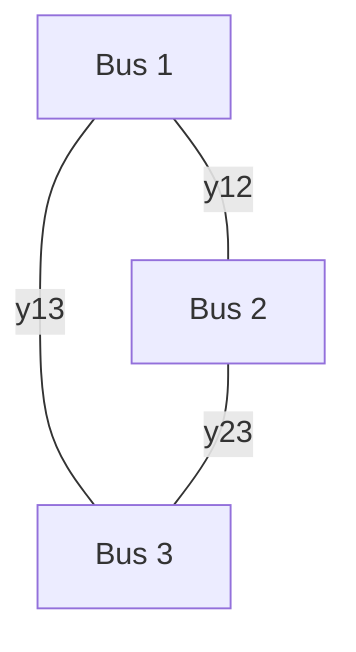
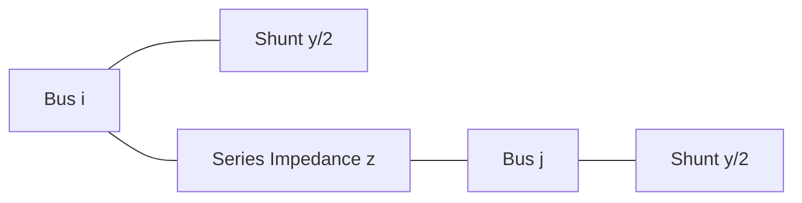

## Bus Admittance Matrix Formulation

### Overview

The bus admittance matrix ($Y_{bus}$) is the fundamental network model used in power flow, fault, and stability studies, expressing the relationship between nodal current injections and nodal voltages across an entire power network using Kirchhoff's Current Law applied at each bus. It compactly encodes the network topology and branch impedances into a single complex-valued matrix, forming the basis for the nonlinear power flow equations solved by Newton-Raphson, Gauss-Seidel, and related methods.

### Fundamental Relationship

The bus admittance matrix relates the vector of injected bus currents $\mathbf{I}$ to the vector of bus voltages $\mathbf{V}$ by:

$$\mathbf{I} = Y_{bus} \mathbf{V}$$

For a system with $n$ buses, $Y_{bus}$ is an $n \times n$ complex matrix, $\mathbf{I}$ is an $n \times 1$ vector of net current injections at each bus, and $\mathbf{V}$ is an $n \times 1$ vector of bus voltage phasors. Each element $Y_{ij}$ represents the admittance relating the current injected at bus $i$ to the voltage at bus $j$.

### Matrix Element Definitions

**Diagonal Elements ($Y_{ii}$) — Self-Admittance**

The diagonal element at bus $i$ equals the sum of all branch admittances directly connected to bus $i$ (including any shunt admittance at that bus, such as a shunt capacitor, reactor, or the shunt branches of a transmission line's pi-model):

$$Y_{ii} = \sum_{k \in \text{buses connected to } i} y_{ik} + y_{i,shunt}$$

**Off-Diagonal Elements ($Y_{ij}$, $i \neq j$) — Mutual Admittance**

The off-diagonal element between buses $i$ and $j$ equals the negative of the admittance of the branch directly connecting those two buses:

$$Y_{ij} = -y_{ij}$$

If no direct branch connects bus $i$ and bus $j$, then $Y_{ij} = 0$. This is the key property that makes $Y_{bus}$ **sparse** for realistic power networks: since any given bus is typically connected to only a handful of other buses (not all $n-1$ others), the vast majority of off-diagonal entries are zero.

### Construction by Inspection

For networks composed only of simple series branch admittances (ignoring line charging and transformer off-nominal effects for the basic case), $Y_{bus}$ can be built directly "by inspection" using the rule above: for each branch between buses $i$ and $j$ with admittance $y_{ij} = 1/z_{ij}$, add $y_{ij}$ to both $Y_{ii}$ and $Y_{jj}$, and subtract $y_{ij}$ from both $Y_{ij}$ and $Y_{ji}$ (the matrix is symmetric for passive, bilateral networks without phase-shifting transformers).

**Worked Example: 3-Bus System**

Consider a 3-bus network with branches: bus 1–2 ($y_{12}$), bus 1–3 ($y_{13}$), and bus 2–3 ($y_{23}$), with no shunt elements.

The resulting admittance matrix:

$$Y_{bus} = \begin{bmatrix} y_{12}+y_{13} & -y_{12} & -y_{13} \\ -y_{12} & y_{12}+y_{23} & -y_{23} \\ -y_{13} & -y_{23} & y_{13}+y_{23} \end{bmatrix}$$

Note bus 1's self-admittance sums only the branches touching bus 1 ($y_{12}$ and $y_{13}$), and the off-diagonal terms are the negated direct branch admittances — with a zero implied for any non-adjacent bus pair (not present in this fully-meshed 3-bus example, but relevant in larger sparse networks).

### Incorporating Transmission Line Models

**Pi-Model Representation**

Transmission lines are modeled using the equivalent pi-model, comprising a series impedance $z_{series} = R + jX$ and shunt admittance (line charging capacitance) split equally between both ends of the line, $y_{shunt}/2$ at each end.

When building $Y_{bus}$ for a line with series admittance $y_{series} = 1/z_{series}$ and total shunt admittance $y_{shunt}$:

- Off-diagonal: $Y_{ij} = Y_{ji} = -y_{series}$
- Diagonal contribution from this line: each end bus receives $y_{series} + y_{shunt}/2$ added to its self-admittance

The shunt (line-charging) contribution is why $Y_{ii}$ is **not** simply the negative sum of the row's off-diagonal elements for networks including line charging — an important distinction from the simplified series-only case.

### Incorporating Transformers

**Nominal-Ratio Transformers**

A transformer with a series leakage admittance $y_T$ and a 1:1 (nominal) turns ratio contributes to $Y_{bus}$ in the same manner as a simple series branch.

**Off-Nominal Tap Ratio Transformers**

Transformers with a tap ratio $a \neq 1$ (either a fixed off-nominal tap or a load-tap-changer setting away from nominal) require a modified admittance contribution, since the effective turns ratio breaks the simple symmetric branch model. Using a per-unit tap ratio $a$ between bus $i$ (tap side) and bus $j$:

$$Y_{ii} += \frac{y_T}{a^2}, \quad Y_{jj} += y_T, \quad Y_{ij} = Y_{ji} = -\frac{y_T}{a}$$

[Inference] The exact sign and placement convention (which bus is designated the tap side) varies slightly across textbook treatments, though the underlying physical result — an asymmetric contribution reflecting the transformer's voltage transformation — is standard and consistent across formulations.

**Phase-Shifting Transformers**

Where a transformer introduces a phase shift (complex tap ratio $a = |a|e^{j\phi}$) rather than a purely real magnitude tap, the resulting $Y_{bus}$ becomes **non-symmetric** ($Y_{ij} \neq Y_{ji}$), since $Y_{ij}$ and $Y_{ji}$ involve $a$ and its conjugate $a^*$ respectively, which differ when $a$ is complex.

### Properties of the Bus Admittance Matrix

- **Symmetry**: $Y_{bus}$ is symmetric ($Y_{ij} = Y_{ji}$) for networks without phase-shifting transformers; this halves the storage/computation required in practical implementations
- **Sparsity**: For realistic power networks, the matrix is highly sparse (typically well under 5% non-zero entries for large systems), since each bus connects to only a small number of neighboring buses — sparse matrix techniques (e.g., LU factorization exploiting sparsity, optimal ordering schemes) are essential for computational efficiency in large-scale power flow software
- **Singularity without reference**: $Y_{bus}$ built purely from branch admittances (no shunt-to-ground elements) is singular (its rows/columns sum to zero) unless at least one bus is referenced to ground or a slack bus reference is otherwise established, reflecting the fact that absolute voltage angle has no meaning without a reference — this is resolved in the power flow solution process by the slack bus formulation rather than by directly inverting a singular matrix
- **Complex-valued**: Each element is generally complex, $Y_{ij} = G_{ij} + jB_{ij}$, with $G_{ij}$ (conductance) and $B_{ij}$ (susceptance) both entering the power flow equations

### Modifications for Network Changes

A key practical advantage of the $Y_{bus}$ formulation is that adding or removing a branch (e.g., modeling a line outage in contingency analysis) requires only a local update to the four affected matrix elements ($Y_{ii}$, $Y_{jj}$, $Y_{ij}$, $Y_{ji}$) rather than rebuilding the entire matrix — subtracting the removed branch's admittance contribution (or adding a new branch's contribution) using the same by-inspection rule in reverse.

### Relationship to the Bus Impedance Matrix

The bus impedance matrix, $Z_{bus} = Y_{bus}^{-1}$, is the matrix inverse of $Y_{bus}$ and is used extensively in **short-circuit (fault) analysis**, since $Z_{bus}$ directly relates fault current at a bus to the pre-fault voltage and the diagonal driving-point impedance at that bus. Unlike $Y_{bus}$, $Z_{bus}$ is generally a **full (dense) matrix** even when $Y_{bus}$ is sparse, since a fault or injection at one bus theoretically affects voltage at every other bus in the network (reflecting real-world electrical coupling), which is why practical fault analysis and power flow implementations avoid explicitly computing $Z_{bus}$ via full matrix inversion, instead using sparse factorization techniques on $Y_{bus}$ directly or computing only the specific $Z_{bus}$ elements needed for a given fault study.

### Role in Power Flow Solution

$Y_{bus}$'s real ($G_{ij}$) and imaginary ($B_{ij}$) components feed directly into the nodal power balance equations solved iteratively during power flow analysis:

$$P_i = |V_i|\sum_{j=1}^{n}|V_j|(G_{ij}\cos\theta_{ij}+B_{ij}\sin\theta_{ij})$$

$$Q_i = |V_i|\sum_{j=1}^{n}|V_j|(G_{ij}\sin\theta_{ij}-B_{ij}\cos\theta_{ij})$$

The Jacobian matrix used in Newton-Raphson iteration is itself derived from partial derivatives of these equations with respect to $|V|$ and $\theta$, meaning $Y_{bus}$'s sparsity pattern directly propagates into the Jacobian's sparsity, which is exploited by sparse linear solvers at each iteration.

### Computational Considerations for Large Systems

- **Sparse storage formats**: Compressed sparse row/column (CSR/CSC) or similar formats store only non-zero elements, critical for systems with tens of thousands of buses where a dense matrix representation would be computationally prohibitive
- **Optimal ordering**: Bus numbering/reordering schemes (e.g., minimum degree ordering) minimize "fill-in" (new non-zero elements created during matrix factorization), preserving sparsity through the solution process
- **Per-unit system**: $Y_{bus}$ is conventionally built and solved in per-unit values rather than physical (ohms, siemens) units, simplifying calculations across a network with multiple voltage levels connected via transformers

**Related Topics**

- Bus Classification: Slack, PV, and PQ Buses
- Newton-Raphson Power Flow Solution Method
- Transmission Line Pi-Model and Line Charging
- Short-Circuit Analysis and the Bus Impedance Matrix
- Sparse Matrix Techniques in Power System Computation
- Per-Unit System and Base Value Selection
- Transformer Modeling with Off-Nominal Tap Ratios
- Contingency Analysis and N-1 Screening