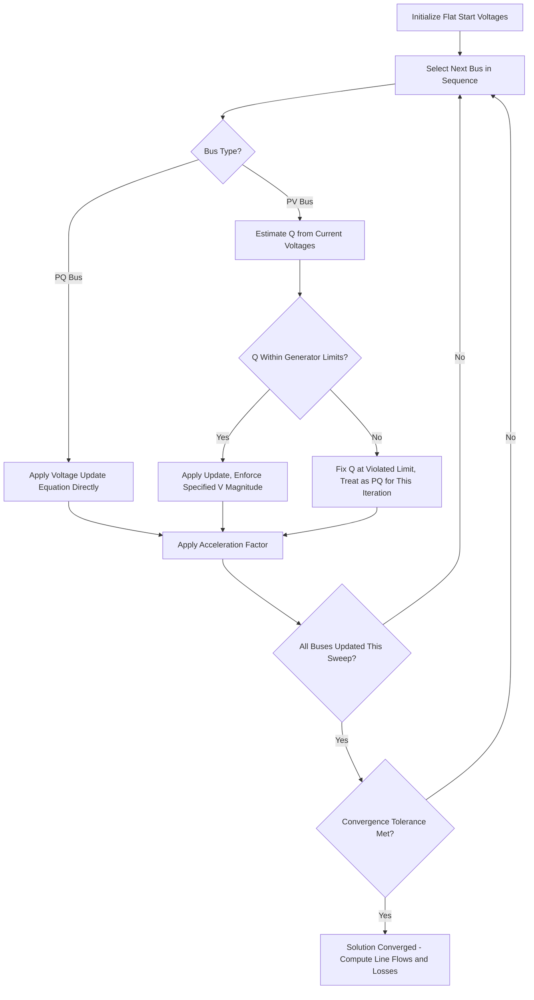

## Gauss-Seidel Load Flow Method

### Overview

The Gauss-Seidel method is an iterative numerical technique for solving the nonlinear power flow equations, historically significant as one of the earliest computational approaches applied to power system load flow studies. It solves for unknown bus voltages by repeatedly updating each bus's voltage estimate using the most recently available values of all other bus voltages, continuing until successive iterations converge within a specified tolerance.

### Mathematical Formulation

**Starting Point: Nodal Power Balance**

The complex power injected at bus $i$ relates to bus voltage and current by:

$$S_i = P_i + jQ_i = V_i I_i^*$$

Since $\mathbf{I} = Y_{bus}\mathbf{V}$, the current injected at bus $i$ can be expressed as:

$$I_i = \sum_{k=1}^{n} Y_{ik}V_k$$

Combining these and solving for $V_i$ yields the Gauss-Seidel update equation:

$$V_i^{(m+1)} = \frac{1}{Y_{ii}}\left[\frac{P_i - jQ_i}{(V_i^{(m)})^*} - \sum_{k \neq i} Y_{ik}V_k\right]$$

Where $(m)$ denotes the iteration count, $Y_{ii}$ and $Y_{ik}$ are elements of the bus admittance matrix, and the summation excludes the bus being updated ($k \neq i$).

### Iterative Solution Process

**Step-by-Step Algorithm**

1. **Initialize**: Assign a flat start to all unknown bus voltages, typically $V_i^{(0)} = 1.0\angle0°$ per unit for PQ buses, or the specified voltage magnitude for PV buses
2. **Update each bus in sequence**: For each PQ bus, apply the update equation above using the most recently computed voltage values available at that point in the sweep (this immediate use of updated values, rather than waiting for a full sweep to complete, is the defining "Gauss-Seidel" characteristic, distinguishing it from the related Jacobi method which uses only prior-iteration values throughout a full sweep)
3. **Handle PV buses**: Since $Q$ is not specified at a PV bus (only $P$ and $|V|$ are known), $Q_i$ must first be estimated from the current voltage values using the reactive power equation, then the standard update equation is applied using this estimated $Q_i$, after which the resulting voltage magnitude is forced back to the specified value (only the angle is retained from the calculated $V_i$, since $|V_i|$ is fixed at the PV bus)
4. **Check PV bus reactive limits**: If the estimated $Q_i$ at a PV bus violates its generator's reactive capability limits ($Q_{min}$ or $Q_{max}$), the bus is converted to a PQ bus for that iteration, with $Q_i$ fixed at the violated limit, and its voltage magnitude becomes free to deviate from the setpoint
5. **Apply acceleration factor (optional)**: A scalar acceleration factor $\alpha$ (commonly in the range 1.4–1.6 for typical systems) can be applied to the incremental change in each voltage update to speed convergence: $V_i^{(m+1),accelerated} = V_i^{(m)} + \alpha(V_i^{(m+1)} - V_i^{(m)})$
6. **Check convergence**: Compare the change in voltage magnitude (and/or angle) between successive iterations against a specified tolerance (e.g., $10^{-4}$ to $10^{-6}$ per unit); if all bus voltage changes fall below tolerance, the solution has converged
7. **Repeat**: If not converged, repeat steps 2–6 using the newly updated voltage values

**Gauss-Seidel Iteration Flow**

### Slack Bus Treatment

The slack bus voltage is fixed at its specified magnitude and angle (the reference, typically $1.0\angle0°$ per unit) throughout the iteration and is never updated by the Gauss-Seidel equation — it exists in the formulation as a known quantity feeding into other buses' update calculations, with its own $P$ and $Q$ computed only after the iterative process converges, using the final converged voltage solution across all other buses.

### Convergence Characteristics

**Linear Convergence Rate**

Gauss-Seidel exhibits **linear convergence**, meaning the error decreases by a roughly constant factor each iteration, in contrast to Newton-Raphson's quadratic convergence (where the number of correct digits roughly doubles each iteration near the solution). This translates to Gauss-Seidel typically requiring substantially more iterations to reach a comparable convergence tolerance, particularly as system size grows.

**Sensitivity to System Size**

Convergence behavior degrades as the number of buses increases; iteration counts can grow substantially for large systems, since each bus's update depends on values that propagate more slowly through a larger network per sweep. [Inference] The precise growth relationship between system size and required iterations is problem-dependent (influenced by network topology, R/X ratios, and loading conditions) rather than a fixed universal scaling law.

**Sensitivity to Choice of Slack Bus and Acceleration Factor**

- Convergence speed and reliability can be sensitive to which bus is designated as slack, particularly in poorly-conditioned networks
- Acceleration factors improve convergence speed but must be chosen carefully — an excessively large acceleration factor can cause oscillation or divergence rather than faster convergence

### Comparison with Newton-Raphson

| Characteristic | Gauss-Seidel | Newton-Raphson |
| --- | --- | --- |
| Convergence rate | Linear | Quadratic (near solution) |
| Iterations to converge (typical) | Higher, grows with system size | Lower, relatively insensitive to size |
| Computation per iteration | Low (no Jacobian required) | Higher (Jacobian formation and solution) |
| Memory requirements | Low | Higher (Jacobian storage) |
| Historical role | Early computational load flow (limited computer memory era) | Modern standard for large-scale systems |
| Robustness to poor initial conditions | Relatively robust | Can diverge from a poor starting point without safeguards |

[Inference] The relative robustness characterization is a commonly cited general tendency in power systems textbooks; specific convergence behavior in any given case depends on network conditioning, loading level, and implementation details rather than being an absolute guarantee for either method.

### Historical Context and Modern Relevance

Gauss-Seidel was among the first iterative methods practically applicable to power flow computation using the limited computer memory available in early digital computing applications to power systems (mid-20th century), since it requires storing only the admittance matrix and current voltage estimates rather than the additional Jacobian matrix structure required by Newton-Raphson. As computational memory and processing power increased, Newton-Raphson (and its computationally efficient variant, the Fast Decoupled Load Flow) became the dominant methods for large-scale transmission system power flow studies due to superior convergence properties. [Inference] Gauss-Seidel retains pedagogical value for teaching load flow fundamentals and may still see use in specific smaller-scale or specialized applications, but is not the primary method in most modern commercial transmission power flow software.

### Worked Example Structure (Two-Bus Illustration)

For a simple two-bus system with bus 1 as slack ($V_1 = 1.0\angle0°$ per unit) and bus 2 as a PQ bus with specified load $P_2, Q_2$, connected by a line admittance $y_{12}$:

$$Y_{bus} = \begin{bmatrix} y_{12} & -y_{12} \\ -y_{12} & y_{12} \end{bmatrix}$$

The Gauss-Seidel update for bus 2 voltage at iteration $(m+1)$:

$$V_2^{(m+1)} = \frac{1}{Y_{22}}\left[\frac{P_2 - jQ_2}{(V_2^{(m)})^*} - Y_{21}V_1\right]$$

Starting from a flat start $V_2^{(0)} = 1.0\angle0°$, this equation is applied repeatedly, with $V_2$ converging toward its true value as the iteration count increases, at which point line flow and loss calculations can be performed using the converged voltage solution.

### Limitations

- Slow convergence for large or heavily loaded systems, sometimes requiring hundreds of iterations for high-precision tolerance, compared to typically single-digit iteration counts for Newton-Raphson on the same system
- Convergence is not guaranteed for all system conditions, particularly for systems with high R/X ratios (relevant for distribution-level analysis) or unusual network configurations, without careful acceleration factor tuning
- Does not scale computationally as favorably to very large modern interconnected transmission systems compared to sparse Newton-Raphson implementations

**Related Topics**

- Newton-Raphson Power Flow Solution Method
- Bus Admittance Matrix Formulation
- Bus Classification: Slack, PV, and PQ Buses
- Fast Decoupled Load Flow Method
- Power Flow Convergence Criteria and Numerical Stability
- Distribution Load Flow Analysis Methods (Forward-Backward Sweep)
- Acceleration Factor Selection in Iterative Power Flow Methods
- Per-Unit System and Base Value Selection