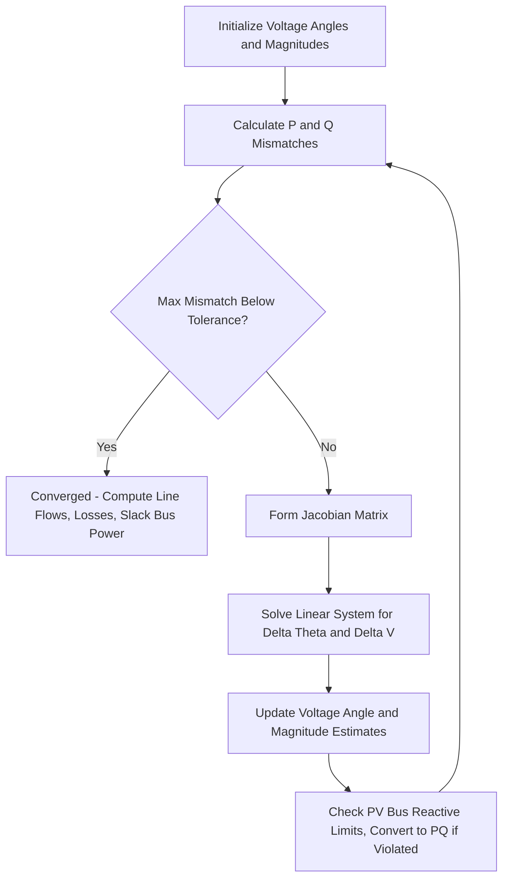

## Newton-Raphson Load Flow Method

### Overview

The Newton-Raphson method is the dominant iterative technique for solving power flow equations in modern transmission system analysis, prized for its quadratic convergence rate and robustness on large, well-conditioned systems. It linearizes the nonlinear power balance equations at each iteration using a Jacobian matrix of partial derivatives, solving the resulting linear system to successively refine estimates of unknown bus voltage magnitudes and angles.

### Mathematical Foundation

**General Newton-Raphson Principle**

For a system of nonlinear equations $f(x) = 0$, Newton-Raphson iterates using:

$$x^{(m+1)} = x^{(m)} - [J(x^{(m)})]^{-1} f(x^{(m)})$$

Where $J$ is the Jacobian matrix of partial derivatives of $f$ with respect to $x$. Applied to power flow, $x$ represents the vector of unknown bus voltage angles and magnitudes, and $f(x)$ represents the mismatch between specified and calculated power injections.

**Power Flow Equations**

The real and reactive power injected at bus $i$, expressed in terms of all bus voltages and the bus admittance matrix elements $G_{ij}$, $B_{ij}$:

$$P_i = |V_i|\sum_{j=1}^{n}|V_j|(G_{ij}\cos\theta_{ij}+B_{ij}\sin\theta_{ij})$$

$$Q_i = |V_i|\sum_{j=1}^{n}|V_j|(G_{ij}\sin\theta_{ij}-B_{ij}\cos\theta_{ij})$$

Where $\theta_{ij} = \theta_i - \theta_j$.

**Power Mismatch Equations**

At each bus (excluding the slack bus for $P$, and excluding both slack and PV buses for $Q$), a mismatch is defined between the specified (scheduled) power and the calculated power based on current voltage estimates:

$$\Delta P_i = P_i^{specified} - P_i^{calculated}(\theta, |V|)$$

$$\Delta Q_i = Q_i^{specified} - Q_i^{calculated}(\theta, |V|)$$

The iterative solution seeks voltage angles and magnitudes that drive these mismatches to zero within tolerance.

### The Jacobian Matrix

**Structure**

The Jacobian relates small changes in power mismatch to small changes in voltage angle and magnitude:

$$\begin{bmatrix} \Delta P \\ \Delta Q \end{bmatrix} = \begin{bmatrix} J_{11} & J_{12} \\ J_{21} & J_{22} \end{bmatrix} \begin{bmatrix} \Delta \theta \\ \Delta |V| \end{bmatrix}$$

Where the four sub-matrices are partial derivative blocks:

- $J_{11} = \partial P / \partial \theta$
- $J_{12} = \partial P / \partial |V|$
- $J_{21} = \partial Q / \partial \theta$
- $J_{22} = \partial Q / \partial |V|$

**Dimension**

For a system with one slack bus, $n_{PV}$ PV buses, and $n_{PQ}$ PQ buses, the Jacobian has dimension $(n_{PV}+2n_{PQ}) \times (n_{PV}+2n_{PQ})$: $\theta$ is unknown at all non-slack buses ($n_{PV}+n_{PQ}$ angles), while $|V|$ is unknown only at PQ buses ($n_{PQ}$ magnitudes), consistent with the bus classification framework.

**Sparsity**

The Jacobian inherits the sparsity pattern of the underlying bus admittance matrix, since $\partial P_i/\partial \theta_j$ and related derivatives are non-zero only when buses $i$ and $j$ are directly connected (or $i=j$) — this sparsity is essential to computational efficiency for large networks and is exploited via sparse LU factorization at each iteration.

### Iterative Algorithm

**Step-by-Step Process**

1. **Initialize**: Flat start ($\theta_i = 0$, $|V_i| = 1.0$ per unit for unknowns), or a warm start from a previous solved case (common in real-time applications for faster convergence)
2. **Calculate power mismatches**: Using current voltage estimates, compute $P_i^{calculated}$ and $Q_i^{calculated}$ at each relevant bus, and form $\Delta P$, $\Delta Q$
3. **Check convergence**: If the maximum absolute mismatch across all buses is below a specified tolerance (e.g., 0.1 MW / 0.1 MVAr, or a per-unit equivalent), stop — the solution has converged
4. **Form the Jacobian**: Compute the partial derivative elements based on current voltage estimates
5. **Solve the linear system**: Solve $\begin{bmatrix}\Delta P \\ \Delta Q\end{bmatrix} = J \begin{bmatrix}\Delta\theta \\ \Delta|V|\end{bmatrix}$ for $\Delta\theta$ and $\Delta|V|$ (via sparse LU factorization/forward-backward substitution rather than explicit matrix inversion, for computational efficiency)
6. **Update voltage estimates**: $\theta^{(m+1)} = \theta^{(m)} + \Delta\theta$, $|V|^{(m+1)} = |V|^{(m)} + \Delta|V|$
7. **Handle PV bus reactive limits**: Check whether the reactive power required at each PV bus to maintain its specified voltage remains within generator capability limits; if violated, convert that bus to PQ for subsequent iterations as described in the bus classification framework
8. **Repeat**: Return to step 2 with updated voltage estimates, continuing until convergence

**Newton-Raphson Iteration Flow**

### Convergence Characteristics

**Quadratic Convergence**

Near the solution, Newton-Raphson exhibits quadratic convergence: the number of accurate digits in the solution roughly doubles with each iteration, meaning well-conditioned power flow cases typically converge within 3–5 iterations regardless of system size, in sharp contrast to Gauss-Seidel's linear convergence and iteration counts that grow with system size.

**Sensitivity to Starting Point**

Newton-Raphson's quadratic convergence property holds only in the neighborhood of the true solution; from a poor initial estimate, the method can converge slowly, oscillate, or diverge entirely. Flat-start initialization works well for most well-behaved transmission cases, but heavily stressed systems (near voltage collapse conditions) or systems with unusual configurations may require safeguards.

**Divergence Safeguards**

Practical implementations incorporate safeguards against divergence, such as:

- Step-size limiting (damping) on voltage magnitude and angle updates per iteration
- Maximum iteration count with diagnostic reporting if convergence is not achieved
- Alternative initialization strategies (e.g., using a previously solved similar case as a starting point) for difficult cases

[Inference] Specific safeguard implementations and their default parameters vary across commercial and open-source power flow software packages and are generally configurable by the analyst.

### Fast Decoupled Load Flow (Related Method)

A widely used variant, the **Fast Decoupled Load Flow (FDLF)**, exploits the physical observation that in high-voltage transmission networks (where line reactance $X$ dominates over resistance $R$), real power flow is predominantly sensitive to voltage angle differences while reactive power flow is predominantly sensitive to voltage magnitude differences. This allows the full Jacobian's off-diagonal coupling blocks ($J_{12}$ and $J_{21}$) to be approximated as negligible, decoupling the $P$-$\theta$ and $Q$-$|V|$ sub-problems into two smaller, constant (non-updated per iteration) matrices that can be factorized once and reused, substantially reducing per-iteration computational cost at the expense of the full method's quadratic convergence rate (FDLF instead exhibits fast linear/geometric convergence, typically requiring more iterations than full Newton-Raphson but at much lower cost per iteration). [Inference] FDLF's underlying $R \ll X$ assumption is generally valid for transmission networks but breaks down for distribution-level networks, which is why distribution power flow typically uses different solution methods (e.g., forward-backward sweep) rather than FDLF.

### Comparison with Gauss-Seidel

| Characteristic | Newton-Raphson | Gauss-Seidel |
| --- | --- | --- |
| Convergence rate | Quadratic | Linear |
| Typical iterations (large system) | 3–5 | Can be dozens to hundreds |
| Computation per iteration | Higher (Jacobian formation/solution) | Lower (no Jacobian) |
| Scalability to large systems | Favorable (iterations stay low) | Unfavorable (iterations grow with size) |
| Sensitivity to starting point | More sensitive near non-convergent cases | Generally more tolerant, but slower regardless |
| Modern industry standard status | Yes, for transmission-level studies | Largely superseded, retained for pedagogy |

### Computational Implementation Considerations

- **Sparse matrix techniques**: Given the Jacobian's sparsity (inherited from $Y_{bus}$), practical implementations use sparse LU factorization with optimal bus ordering (e.g., minimum degree or nested dissection ordering) to minimize fill-in during factorization, essential for tractable solution of systems with tens of thousands of buses
- **Per-unit system**: Calculations are performed in per-unit values to normalize quantities across the multiple voltage levels present in a real network connected via transformers
- **Mismatch tolerance selection**: Tolerance is typically expressed in either per-unit power or absolute MW/MVAr terms; tighter tolerances increase confidence in the solution's numerical precision at the cost of additional iterations
- **PV-to-PQ bus switching logic**: Care must be taken in the iterative implementation to avoid oscillatory switching of a bus between PV and PQ status across successive iterations when the reactive power estimate hovers near a capability limit; practical codes typically incorporate logic to prevent excessive switching (e.g., limiting switches per solution or applying a switching deadband)

### Application in Power System Studies

Newton-Raphson power flow forms the computational core of:

- **Steady-state planning studies**: Base-case and contingency (N-1, N-2) power flow analysis for transmission planning
- **Real-time operations**: State estimation and real-time power flow monitoring in energy management systems (EMS), often using a warm-start from the previous solved state for fast re-convergence
- **Optimal power flow (OPF)**: Extended formulations building on the same underlying power flow equations, adding an objective function (e.g., cost minimization) and operational constraints, solved via related nonlinear optimization techniques
- **Voltage stability analysis**: Continuation power flow methods (tracing the P-V curve toward the voltage collapse point) build on Newton-Raphson's underlying equation structure with modified parameterization near the singular Jacobian point at collapse

**Related Topics**

- Bus Admittance Matrix Formulation
- Bus Classification: Slack, PV, and PQ Buses
- Gauss-Seidel Load Flow Method
- Fast Decoupled Load Flow Method
- Optimal Power Flow (OPF) Formulation
- Contingency Analysis and N-1 Screening
- Voltage Stability Analysis and P-V Curves
- Sparse Matrix Techniques in Power System Computation