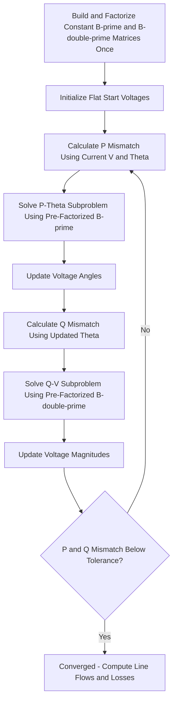

## Fast Decoupled Load Flow

### Overview

The Fast Decoupled Load Flow (FDLF) method is a computationally efficient variant of Newton-Raphson power flow that exploits the physical characteristics of high-voltage transmission networks to simplify and accelerate the iterative solution. By approximating the weak coupling between real power/voltage angle and reactive power/voltage magnitude as negligible, FDLF reduces the per-iteration computational burden substantially while retaining acceptable convergence behavior for transmission-level studies.

### Physical Basis for Decoupling

**The R/X Ratio Observation**

In transmission networks, line reactance $X$ is typically much larger than line resistance $R$ (high X/R ratio), a consequence of transmission conductors and voltage levels being selected to minimize losses relative to reactive impedance. This physical characteristic produces two well-known engineering approximations:

- **Real power flow ($P$) is primarily governed by voltage angle differences** ($\theta$) between buses, with relatively weak sensitivity to voltage magnitude differences
- **Reactive power flow ($Q$) is primarily governed by voltage magnitude differences** ($|V|$) between buses, with relatively weak sensitivity to angle differences

This decoupling is analogous to the simplified DC power flow relationship $P \approx \frac{|V_i||V_j|}{X}\sin\theta_{ij}$ (dominant angle sensitivity) and the reactive power relationship $Q \approx \frac{|V_i|(|V_i|-|V_j|)}{X}$ (dominant magnitude sensitivity), both derived assuming $R \ll X$ and small angle differences.

[Inference] This approximation holds well for typical transmission networks but degrades for networks with comparable R and X values (lower X/R ratios), which is why FDLF is generally unsuitable for distribution-level power flow, where line R/X ratios are often close to or exceeding 1.

### Mathematical Derivation

**From the Full Newton-Raphson Jacobian**

The full Newton-Raphson Jacobian relates power mismatches to voltage corrections via four sub-matrices:

$$\begin{bmatrix} \Delta P \\ \Delta Q \end{bmatrix} = \begin{bmatrix} J_{11} & J_{12} \\ J_{21} & J_{22} \end{bmatrix} \begin{bmatrix} \Delta \theta \\ \Delta |V| \end{bmatrix}$$

FDLF approximates the off-diagonal coupling blocks $J_{12}$ ($\partial P/\partial|V|$) and $J_{21}$ ($\partial Q/\partial\theta$) as negligible (set to zero), decoupling the system into two independent, smaller sub-problems:

$$\Delta P = J_{11} \, \Delta\theta$$

$$\Delta Q = J_{22} \, \Delta|V|$$

**Further Simplifying Assumptions**

Beyond decoupling, the standard FDLF formulation applies additional simplifications derived under typical transmission operating conditions (voltage magnitudes near 1.0 per unit, small angle differences, line conductance $G$ small relative to susceptance $B$):

- $\cos\theta_{ij} \approx 1$
- $G_{ij}\sin\theta_{ij}$ terms are neglected relative to $B_{ij}$ terms
- Voltage magnitudes in certain coefficient terms are set to approximately 1.0 per unit

These simplifications yield the characteristic FDLF update equations, commonly expressed as:

$$\frac{\Delta P_i}{|V_i|} = -\sum_j B'_{ij} \, \Delta\theta_j$$

$$\frac{\Delta Q_i}{|V_i|} = -\sum_j B''_{ij} \, \Delta|V_j|$$

Where $B'$ and $B''$ are simplified, constant susceptance matrices derived from the network's $Y_{bus}$ (with $B'$ typically excluding shunt elements and off-nominal transformer taps that primarily affect reactive flow, and $B''$ typically excluding line charging and other elements primarily relevant to the angle-dominant sub-problem). [Inference] The precise construction rules for $B'$ and $B''$ (which elements are included or excluded) vary somewhat across published formulations (e.g., the original Stott-Alsaç formulation versus later variants), reflecting different simplification choices that trade off convergence speed against robustness for specific network characteristics.

### The Key Computational Advantage: Constant Matrices

**Fixed Sub-Jacobians**

Unlike the full Newton-Raphson Jacobian, which must be recalculated (its entries depend on current voltage angle and magnitude estimates) and refactorized at every iteration, the $B'$ and $B''$ matrices in FDLF are **constant** — built once from the network admittance data at the start of the solution and reused, unchanged, across all iterations.

**Practical Implication**

This allows $B'$ and $B''$ to be factorized (e.g., via sparse LU decomposition) **only once** at the beginning of the solution process, with each subsequent iteration requiring only fast forward-backward substitution using the pre-computed factorization, rather than a full matrix factorization at every step. This is the primary source of FDLF's computational speed advantage over full Newton-Raphson on a per-iteration basis.

### Iterative Algorithm

**Step-by-Step Process**

1. **Build constant matrices**: Construct $B'$ and $B''$ once from network admittance data, and factorize each (e.g., sparse LU) a single time
2. **Initialize**: Flat start for unknown angles and magnitudes, as in standard Newton-Raphson
3. **Calculate P mismatches**: Compute $\Delta P_i/|V_i|$ at all non-slack buses using current voltage estimates
4. **Solve for angle correction**: Solve $\Delta P/|V| = -B'\Delta\theta$ using the pre-factorized $B'$, update $\theta$
5. **Calculate Q mismatches**: Compute $\Delta Q_i/|V_i|$ at all PQ buses using the newly updated angles
6. **Solve for magnitude correction**: Solve $\Delta Q/|V| = -B''\Delta|V|$ using the pre-factorized $B''$, update $|V|$
7. **Check convergence**: If both $P$ and $Q$ mismatches fall below tolerance, stop; otherwise repeat from step 3
8. **Handle PV bus reactive limits**: As in full Newton-Raphson, convert violating PV buses to PQ during iteration as needed

**Alternating P-θ and Q-V Solution Structure**

Note the alternating structure: angle correction uses the most recently updated angles when computing the subsequent $Q$ mismatch (a Gauss-Seidel-like immediate-use pattern within the overall Newton-type framework), which is standard in most practical FDLF implementations.

### Convergence Characteristics

**Geometric (Linear) Convergence with Fast Practical Performance**

FDLF does not retain full Newton-Raphson's quadratic convergence rate near the solution — the decoupling approximation introduces an error that prevents the doubling-of-accuracy behavior. Instead, FDLF exhibits geometric (linear) convergence, typically requiring more iterations than full Newton-Raphson to reach the same tolerance. However, because each FDLF iteration is computationally much cheaper (no Jacobian reformation/refactorization), FDLF frequently achieves faster **total** solution time for large transmission networks despite the higher iteration count. [Inference] Whether FDLF or full Newton-Raphson is faster in total solution time depends on the specific system size, sparsity structure, and software implementation; this should be verified empirically for a given application rather than assumed universally.

**Sensitivity to R/X Ratio**

FDLF convergence degrades on networks with lower X/R ratios (higher relative resistance), since the core decoupling assumption weakens; this is a primary reason FDLF is well suited to bulk transmission studies but poorly suited to distribution-level or networks containing series-compensated lines with unusual R/X characteristics without modification.

### Comparison Table

| Characteristic | Full Newton-Raphson | Fast Decoupled Load Flow |
| --- | --- | --- |
| Convergence rate | Quadratic | Geometric (linear), slower per-iteration accuracy gain |
| Jacobian/sub-matrix update | Recalculated and refactorized every iteration | Built and factorized once, reused |
| Per-iteration computational cost | Higher | Lower |
| Typical iteration count | Fewer (3–5 typical) | More (often roughly double or more, problem-dependent) |
| Suitability for high R/X networks | Good | Degraded |
| Memory requirements per iteration | Higher (full Jacobian) | Lower (smaller decoupled matrices, reused factorization) |
| Common application | General transmission and distribution-adaptable studies, OPF | Large bulk transmission systems, real-time/repeated studies |

### Practical Applications

**Real-Time and Repeated Studies**

FDLF's one-time matrix factorization makes it particularly attractive for applications requiring many repeated power flow solutions with only small parameter changes between runs, such as:

- **Contingency analysis**: Screening large numbers of N-1 (or N-2) contingency cases, where the constant $B'$/$B''$ factorization can be reused across many contingency scenarios with only localized network changes
- **Real-time state estimation and monitoring**: Where computational speed is prioritized to keep pace with the operational time frame of energy management systems
- **Security-constrained analysis**: Screening tools that require evaluating many "what-if" scenarios quickly, using FDLF as a fast approximate solver, sometimes followed by a full Newton-Raphson solution for final verification of critical cases

**Limitations for Certain Studies**

FDLF's approximations can produce less accurate results (or slower/non-convergence) for:

- Systems under severe stress (heavily loaded, near voltage collapse), where the small-angle and decoupling assumptions become less valid
- Networks with significant series compensation or unusual R/X characteristics
- Distribution networks, where the fundamental R/X assumption underlying the method does not hold

### Variants and Extensions

Multiple published FDLF formulations exist, differing in exactly which terms are retained or dropped when constructing $B'$ and $B''$ (e.g., the original Stott-Alsaç version versus later modifications addressing convergence robustness for specific network conditions such as high R/X branches or systems with significant phase-shifting transformers). [Unverified] Selecting among these variants for a specific implementation is a software/methodology choice that should be verified against the specific power flow software's documentation rather than assumed to follow one universal standard formulation.

**Related Topics**

- Newton-Raphson Load Flow Method
- Bus Admittance Matrix Formulation
- Bus Classification: Slack, PV, and PQ Buses
- Contingency Analysis and N-1 Screening
- DC Power Flow Approximation
- Distribution Load Flow Analysis Methods (Forward-Backward Sweep)
- Sparse Matrix Techniques in Power System Computation
- Voltage Stability Analysis and P-V Curves