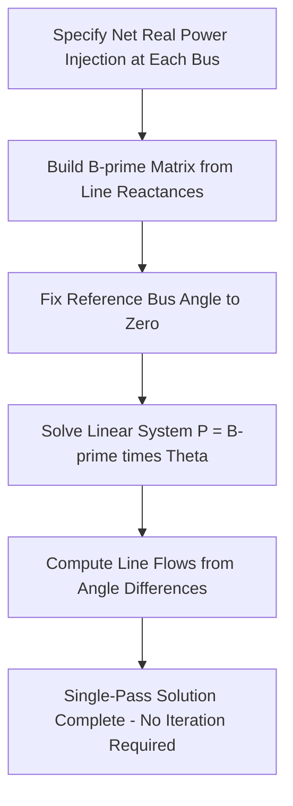

## DC Power Flow Approximation

### Overview

The DC power flow approximation is a linearized simplification of the full AC power flow equations, used extensively in transmission planning, market operations, and contingency screening where computational speed and solution robustness are prioritized over the precision of a full AC solution. Despite its name, DC power flow models an AC system — the "DC" label refers to the mathematical analogy between the resulting linear equations and those governing a resistive DC circuit, not to actual direct-current transmission.

### Underlying Simplifying Assumptions

The DC power flow derivation applies four simplifications to the full nonlinear AC power flow equations, each justified by typical transmission-level operating conditions:

**1. Neglect Line Resistance ($R \ll X$)**

Transmission lines are assumed purely reactive (resistance $R = 0$), consistent with the generally high X/R ratio of transmission conductors. This eliminates $I^2R$ losses from the model entirely — DC power flow is a **lossless** approximation.

**2. Small Angle Approximation**

Voltage angle differences between adjacent buses are assumed small enough that:

$$\sin\theta_{ij} \approx \theta_{ij} \text{ (in radians)}$$

$$\cos\theta_{ij} \approx 1$$

**3. Flat Voltage Profile**

All bus voltage magnitudes are assumed equal to 1.0 per unit (nominal voltage), eliminating voltage magnitude as a variable entirely — DC power flow solves only for voltage angles, not magnitudes.

**4. Reactive Power Neglected**

Since voltage magnitude is fixed at 1.0 per unit everywhere, reactive power flow (which depends primarily on voltage magnitude differences) is not modeled at all. DC power flow produces **real power flow only**.

### Derivation of the DC Power Flow Equation

**From the Full AC Real Power Equation**

Starting from the AC real power flow equation for a line between buses $i$ and $j$ with series reactance $X_{ij}$ (resistance neglected):

$$P_{ij} = \frac{|V_i||V_j|}{X_{ij}}\sin\theta_{ij}$$

Applying the flat voltage assumption ($|V_i| = |V_j| = 1.0$ per unit) and small angle approximation ($\sin\theta_{ij} \approx \theta_{ij}$):

$$P_{ij} \approx \frac{\theta_i - \theta_j}{X_{ij}}$$

This is directly analogous to Ohm's law for a resistive DC circuit ($I = V/R$), with real power flow $P_{ij}$ playing the role of current, voltage angle difference $(\theta_i - \theta_j)$ playing the role of voltage difference, and line reactance $X_{ij}$ playing the role of resistance — the origin of the "DC power flow" terminology.

**Matrix Form**

For the full network, the DC power flow relationship is expressed as:

$$\mathbf{P} = B' \boldsymbol{\theta}$$

Where $\mathbf{P}$ is the vector of net bus real power injections, $\boldsymbol{\theta}$ is the vector of bus voltage angles, and $B'$ is a matrix built from line susceptances ($B_{ij} = -1/X_{ij}$ for each branch), structurally similar to the bus admittance matrix's imaginary part but excluding resistance and shunt elements entirely. This system is solved directly (a single linear solve, no iteration required) for $\boldsymbol{\theta}$, given one bus's angle fixed as reference (analogous to the slack bus in AC power flow).

### Solution Characteristics

**Direct (Non-Iterative) Solution**

Because the DC power flow equations are linear (unlike the nonlinear AC equations), the solution requires only a single matrix solve — no Newton-Raphson or Gauss-Seidel iteration is needed. This is the primary source of DC power flow's substantial computational speed advantage over any AC power flow method.

**Speed and Robustness**

- Solution time is dramatically faster than any iterative AC method, since only one linear system solve is required per case
- Convergence is guaranteed (subject to the linear system being non-singular), eliminating the divergence risk present in iterative AC methods for stressed or poorly-conditioned systems
- This robustness and speed make DC power flow the standard tool for applications requiring very large numbers of repeated solutions

**DC Power Flow Solution Process**

### Line Flow Calculation

Once bus angles $\theta_i$ are solved, real power flow on any line between buses $i$ and $j$ is computed directly:

$$P_{ij} = \frac{\theta_i - \theta_j}{X_{ij}}$$

This direct, linear relationship between angle difference and line flow is what makes DC power flow especially convenient for **sensitivity analysis**, since the linear relationship allows straightforward computation of how a change in injection at one bus affects flow on any line throughout the network, without re-solving the full system from scratch (see Power Transfer Distribution Factors below).

### Power Transfer Distribution Factors (PTDFs)

**Definition**

A Power Transfer Distribution Factor quantifies the fraction of a hypothetical power transfer from a source bus to a sink bus that flows over a specific transmission line, derived directly from the linear DC power flow relationship:

$$PTDF_{ij,k} = \frac{\partial P_{ij}}{\partial P_k}$$

Representing the sensitivity of flow on line $i$-$j$ to a change in injection at bus $k$ (with a corresponding offsetting withdrawal typically assumed at a reference/slack bus).

**Application**

PTDFs are foundational to transmission system operations and electricity market analysis, used for:

- **Available Transfer Capability (ATC) calculation**: Determining how much additional power transfer a specific line can accommodate before reaching its thermal limit
- **Congestion management and locational marginal pricing (LMP)**: Many electricity market clearing engines use DC power flow-based PTDFs as the underlying network model for computing how generation dispatch affects line flows and, consequently, nodal energy prices
- **Contingency screening**: Line Outage Distribution Factors (LODFs), a related linear sensitivity derived from the same DC power flow framework, estimate how flow redistributes across the network if a specific line is taken out of service, without re-solving the full network — a critical tool for fast N-1 contingency screening across thousands of cases

### Comparison with Full AC Power Flow

| Characteristic | DC Power Flow | Full AC Power Flow |
| --- | --- | --- |
| Solution method | Single linear solve | Iterative (Newton-Raphson, Gauss-Seidel, FDLF) |
| Voltage magnitude | Fixed at 1.0 per unit (not modeled) | Solved as an output variable |
| Reactive power | Not modeled | Solved as an output variable |
| Losses | Not modeled (lossless approximation) | Modeled explicitly |
| Convergence guarantee | Yes (linear system) | Not guaranteed (nonlinear iteration) |
| Computational speed | Very fast | Slower, especially for large-scale repeated studies |
| Accuracy | Approximate (real power flow only) | Accurate representation of both P and Q, voltage magnitude |
| Typical use case | Market operations, large-scale contingency screening, transmission planning screening | Detailed voltage/reactive studies, final-stage verification, voltage stability analysis |

### Accuracy Limitations

**Where DC Power Flow Diverges from AC Reality**

- **No voltage magnitude information**: Cannot identify voltage violations (over/under-voltage conditions), which are often the binding constraint in real system operation, particularly under stressed conditions
- **No reactive power or loss representation**: Cannot assess reactive power adequacy, capacitor/reactor switching needs, or represent the effect of losses on generation dispatch requirements
- **Degraded accuracy under large angle differences or heavily loaded conditions**: The small-angle approximation weakens as systems approach thermal or stability limits, precisely the conditions where accurate analysis often matters most
- **Degraded accuracy for lines with significant resistance**: Distribution-level networks or specific transmission lines with atypically low X/R ratios violate the core lossless assumption

[Inference] The specific magnitude of DC power flow error relative to full AC solution is case-dependent (varying with loading level, angle spread, and network R/X characteristics), and is generally treated in practice as acceptable for the screening and market applications described above, with full AC power flow reserved for detailed voltage/reactive verification — this is standard industry practice rather than a claim that DC power flow error is negligible in all cases.

### Applications Summary

**Where DC Power Flow Is Standard Practice**

- Transmission expansion planning screening studies, evaluating large numbers of candidate network topologies or contingencies
- Electricity market clearing engines (many Independent System Operator/Regional Transmission Organization markets use DC-based optimal power flow, often termed "DCOPF," for day-ahead and real-time market clearing, given the need to solve very large optimization problems within tight operational time windows)
- N-1/N-2 contingency screening across large contingency lists, using PTDF/LODF sensitivity factors rather than re-solving full AC power flow for every contingency
- Preliminary transmission planning and interconnection studies, often followed by detailed full AC power flow verification for cases identified as potentially binding

**Where Full AC Power Flow Remains Necessary**

- Voltage and reactive power adequacy studies
- Detailed loss calculations for economic dispatch refinement
- Voltage stability and reactive margin analysis
- Final verification of any critical planning or operational case identified through DC-based screening

**Related Topics**

- Newton-Raphson Load Flow Method
- Fast Decoupled Load Flow Method
- Power Transfer Distribution Factors and Line Outage Distribution Factors
- Locational Marginal Pricing and Congestion Management
- Contingency Analysis and N-1 Screening
- Available Transfer Capability Calculation
- Optimal Power Flow (OPF) Formulation
- Bus Admittance Matrix Formulation