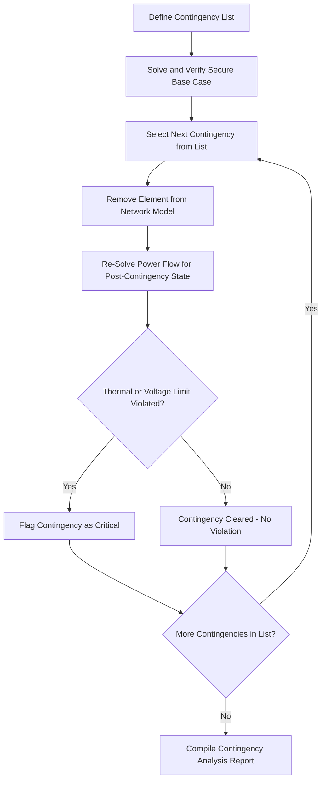

## Contingency Analysis and N-1 Screening

### Overview

Contingency analysis evaluates how a power system would respond to the unexpected loss of individual (or combinations of) network elements — generators, transmission lines, transformers — assessing whether such losses would produce thermal overloads, voltage violations, or system instability. N-1 screening, the foundational form of contingency analysis, tests the system's ability to withstand the loss of any single element while continuing to serve load within operating limits, forming the basis of the deterministic reliability criterion underlying transmission planning and real-time operations worldwide.

### The N-1 Criterion

**Definition**

The N-1 criterion requires that a power system, starting from a secure base-case operating condition with all $N$ elements in service, must be able to withstand the loss of any single element (the "-1") without violating thermal, voltage, or stability limits on the remaining elements. This is a deterministic (not probabilistic) reliability standard: it does not depend on the likelihood of any specific outage, only on whether the post-contingency system state remains within defined limits.

**Extensions: N-1-1 and N-2**

- **N-2**: Requires the system to withstand the simultaneous loss of any two elements, a more stringent criterion typically applied to especially critical facilities or in specific regulatory contexts
- **N-1-1**: Requires the system to withstand a second contingency occurring after the system has already adjusted to (and is operating in) a post-first-contingency state, reflecting sequential rather than simultaneous outages, and often incorporating the time available for operator corrective action between the two events

  [Inference] The specific criteria applied (N-1, N-1-1, N-2) and their precise definitions vary by regulatory jurisdiction and system operator (e.g., NERC reliability standards in North America, ENTSO-E operational security standards in Europe); the applicable standard for a given system should be verified against the relevant regulatory framework.

### Contingency Analysis Process

**1. Define the Contingency List**

Enumerate all credible single-element outages to be screened: transmission lines, transformers, generators, and potentially other elements (reactive devices, HVDC links) depending on the study scope. For large systems, this list can include many thousands of individual contingencies.

**2. Establish the Base Case**

Solve a power flow (typically representing a specific system condition — peak load, off-peak, seasonal case, or a specific projected future year for planning studies) representing normal, pre-contingency operation, confirming the base case itself is secure (within limits) before contingency screening begins.

**3. Simulate Each Contingency**

For each contingency in the list, remove the affected element from the network model and re-solve the power flow to determine the resulting post-contingency system state (line flows, bus voltages).

**4. Evaluate Against Limits**

Compare each post-contingency solution against applicable limits:

- **Thermal limits**: Line and transformer loading against normal and emergency (short-term overload) ratings
- **Voltage limits**: Bus voltage magnitudes against acceptable operating bands
- **Stability limits**: Where applicable, transient or voltage stability margins (typically assessed via separate, more detailed dynamic simulation for critical contingencies flagged by the steady-state screening)

**5. Flag and Report Violations**

Contingencies producing limit violations are flagged for further analysis, potential system reinforcement, or operational mitigation (e.g., re-dispatch, switching actions, or operating limit adjustments to prevent the contingency from ever being approached in real-time operation).

**Contingency Analysis Process Flow**

### Computational Approaches

**Full AC Power Flow Re-Solution**

The most accurate approach re-solves a full AC power flow (Newton-Raphson or equivalent) for every contingency, capturing voltage and reactive power effects precisely, but at significant computational cost when the contingency list numbers in the thousands, particularly for large interconnected systems.

**DC Power Flow-Based Screening**

Given the computational burden of full AC re-solution across large contingency lists, many practical screening applications use the DC power flow approximation and its associated linear sensitivity factors:

- **Line Outage Distribution Factors (LODFs)**: Quantify how the outage of one line redistributes its pre-contingency flow across all remaining lines in the network, computed once from the base case's network topology and reused across the contingency list without re-solving the full network for each case
- **Power Transfer Distribution Factors (PTDFs)**: Used in conjunction with LODFs to assess sensitivity of flows to injection changes, relevant when contingency screening is combined with dispatch/re-dispatch evaluation

This linear-sensitivity approach allows extremely fast screening of large contingency lists (identifying thermal violations in particular), with full AC power flow reserved for detailed verification of contingencies flagged as potentially critical, or for voltage-related assessment that DC methods cannot capture.

**Contingency Screening and Ranking**

Given practical computational limits even with fast linear methods, large systems often apply a two-stage approach:

1. **Fast screening** (DC-based or simplified) across the full contingency list to identify a subset of potentially severe contingencies
2. **Detailed AC analysis** on the flagged subset for accurate voltage/reactive assessment and confirmation of the screening result

**Contingency ranking** techniques (e.g., performance indices summarizing the severity of overloads/violations across a contingency) help prioritize which flagged contingencies warrant the most detailed follow-up analysis when resources or time do not permit full detailed study of every flagged case.

### Automatic Contingency Analysis in Real-Time Operations

**Energy Management System (EMS) Integration**

Modern control centers run contingency analysis continuously (or at frequent intervals, e.g., every few minutes) as part of the EMS, using the current real-time state estimator solution as the base case, automatically screening the full contingency list against current operating conditions and alerting operators to any contingency that would produce a violation if it occurred at that moment.

**Security-Constrained Operations**

The results of real-time contingency analysis feed into:

- **Security-Constrained Economic Dispatch (SCED)**: Generation dispatch is optimized not only to meet current demand at minimum cost, but to ensure the resulting dispatch remains secure against all N-1 contingencies (i.e., no contingency would cause a violation), typically formulated as a security-constrained optimal power flow (SCOPF)
- **Operating limit determination**: Where a contingency analysis reveals that current loading is approaching an N-1 violation threshold, operators may be directed to adjust dispatch, switching configuration, or in extreme cases curtail transactions to restore adequate contingency margin

### Contingency-Constrained Transfer Limits

**Available Transfer Capability (ATC)**

The maximum additional power transfer that can be accommodated across a defined transmission path without violating any contingency's post-outage limits — ATC calculations inherently incorporate N-1 contingency screening, since the binding constraint on transfer capability is often not the base-case thermal limit but the post-contingency limit under the worst credible single outage affecting that path.

**Total Transfer Capability (TTC) and Transmission Reliability Margin (TRM)**

Related concepts in transfer capability calculation that incorporate contingency analysis results alongside margins for uncertainty in system conditions. [Inference] Specific ATC/TTC calculation methodologies and margin components vary by system operator and regulatory framework (e.g., differing practices among North American Reliability Coordinators or other regional system operators).

### Handling Special Contingency Types

**Generator Contingencies**

Loss of a generating unit requires the power flow model to redistribute the lost real power output among remaining generators (governed by the assumed re-dispatch or governor droop response allocation used in the study), in addition to assessing the reactive power/voltage support impact of losing that unit's voltage regulation capability.

**Common-Mode and Common-Structure Contingencies**

Some contingency lists include outages affecting multiple elements simultaneously due to a shared cause — for example, multiple circuits on the same transmission tower structure, or elements connected through a common substation bus/breaker configuration — recognizing that certain "single" physical events (e.g., a tower failure) can remove more than one nominal "N-1" element from the network simultaneously. These are sometimes formally distinguished from independent N-2 contingencies given their non-negligible likelihood relative to two unrelated simultaneous single-element failures.

**Protection System Misoperation Contingencies**

More comprehensive contingency analysis (sometimes required under specific reliability standards) may also screen for the effect of a protection system failing to operate correctly (e.g., breaker failure requiring backup clearing of additional elements), extending beyond the simple single-element removal of a basic N-1 contingency.

### Relationship to Transmission Planning

Contingency analysis is a core analytical tool in the transmission planning process:

- Identifying thermal or voltage violations under N-1 (or more stringent) criteria across projected future system conditions drives the justification for new transmission lines, transformers, or reactive support equipment
- Planning-horizon contingency studies are typically performed across multiple projected load levels, generation dispatch scenarios, and future years to ensure reinforcements remain adequate under a range of plausible future conditions, not just a single anticipated case

### Limitations and Considerations

- Steady-state N-1 contingency analysis (thermal/voltage screening) does not by itself assess dynamic stability (transient stability, small-signal oscillatory stability) following a contingency; separate time-domain dynamic simulation is required for stability-critical contingencies
- DC power flow-based screening, while fast, does not capture voltage violations or reactive power effects, requiring supplementary AC-based assessment for those aspects
- The credibility and completeness of the contingency list itself is a critical, sometimes underappreciated, input — an incomplete list (omitting a genuinely credible contingency) undermines the entire analysis regardless of solution method accuracy

**Related Topics**

- DC Power Flow Approximation
- Power Transfer Distribution Factors and Line Outage Distribution Factors
- Newton-Raphson Load Flow Method
- Security-Constrained Economic Dispatch and Optimal Power Flow
- Available Transfer Capability Calculation
- Transient Stability and Dynamic Security Assessment
- Transmission Planning Criteria and Reliability Standards
- State Estimation in Energy Management Systems