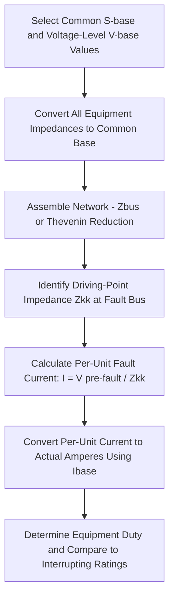

## Per-Unit Short-Circuit Calculation Methods

### Overview

Per-unit short-circuit calculation methods provide a standardized framework for computing fault currents in power systems containing multiple voltage levels connected through transformers. By normalizing all impedances and quantities to a common per-unit base, the per-unit system eliminates the need to repeatedly refer impedances across transformer turns ratios, simplifying network reduction and fault current computation for symmetrical (three-phase) faults.

### The Per-Unit System Fundamentals

**Definition**

The per-unit value of any quantity is its actual value divided by a chosen base value of the same dimension:

$$\text{Per-unit value} = \frac{\text{Actual value}}{\text{Base value}}$$

**Base Quantities**

Four base quantities are related by fundamental circuit equations, meaning only two can be chosen independently (typically base power $S_{base}$ and base voltage $V_{base}$), with base current and base impedance derived from them:

$$I_{base} = \frac{S_{base}}{\sqrt{3} \, V_{base}} \text{ (three-phase systems, line quantities)}$$

$$Z_{base} = \frac{V_{base}^2}{S_{base}}$$

**Common Base Selection**

A single system-wide base power (commonly 100 MVA, though any convenient value works) is selected, while base voltage is set to match the nominal voltage of each system section (changing across transformers according to their turns ratio) — this is the key mechanism that allows per-unit impedances to be combined directly across voltage levels without explicit turns-ratio referral.

### Why Per-Unit Simplifies Multi-Voltage Fault Studies

**The Transformer Referral Problem in Actual Units**

In actual (ohmic) units, an impedance on one side of a transformer must be multiplied by the square of the turns ratio to refer it to the other side before it can be combined with impedances on that side — a bookkeeping burden that compounds across networks with multiple transformers and voltage levels.

**Per-Unit Elimination of Referral**

When base voltages on each side of a transformer are selected in the same ratio as the transformer's nominal turns ratio, the transformer's per-unit impedance is **the same value viewed from either side** — eliminating the need for explicit referral calculations. This property is what makes per-unit the standard framework for fault studies on realistic networks spanning generation (low voltage), transmission (high voltage), and distribution (medium/low voltage) sections.

**Base Conversion Formula**

Where equipment impedance is given in per-unit on its own nameplate base (e.g., a transformer's impedance on its own MVA and voltage rating) and must be converted to the selected system base:

$$Z_{pu,new} = Z_{pu,old} \times \left(\frac{S_{base,new}}{S_{base,old}}\right) \times \left(\frac{V_{base,old}}{V_{base,new}}\right)^2$$

This conversion is applied to every piece of equipment (generators, transformers, lines) before assembling the network model for fault analysis.

### Symmetrical Fault Calculation Procedure

**1. Select System Base Values**

Choose a common $S_{base}$ and a set of $V_{base}$ values appropriate to each voltage level, respecting transformer turns ratios between sections.

**2. Convert All Impedances to the Common Base**

Convert generator subtransient reactances, transformer impedances, and line impedances (given in ohms or on equipment nameplate base) to per-unit values on the selected common base using the conversion formula above.

**3. Build the Network Model**

Assemble the per-unit impedance network, typically represented via the bus impedance matrix ($Z_{bus}$) or via network reduction (series/parallel combination, Thevenin equivalent reduction) to a simplified equivalent as seen from the fault location.

**4. Determine the Fault Point Driving-Point Impedance**

For a three-phase symmetrical fault at bus $k$, the relevant quantity is the Thevenin equivalent impedance at that bus, which corresponds directly to the diagonal element $Z_{kk}$ of the bus impedance matrix.

**5. Calculate Fault Current**

For a bolted three-phase fault (zero fault impedance) at bus $k$, with pre-fault voltage $V_{k}^{pre-fault}$ (commonly assumed as 1.0 per unit in the absence of a pre-fault load flow solution):

$$I_{fault,pu} = \frac{V_k^{pre-fault}}{Z_{kk}}$$

**6. Convert Back to Actual Units**

Convert the per-unit fault current back to actual amperes using the base current at the fault location's voltage level:

$$I_{fault,actual} = I_{fault,pu} \times I_{base}$$

**Per-Unit Fault Calculation Process**

### Network Reduction Techniques

**Series and Parallel Combination**

For simple radial networks, per-unit impedances between the source and fault point can be combined directly using standard series ($Z_1 + Z_2$) and parallel ($1/(1/Z_1 + 1/Z_2)$) combination rules, since per-unit impedances behave identically to ohmic impedances in these combination rules once on a common base.

**Thevenin Equivalent Reduction**

For more complex meshed networks, the network is reduced to a single Thevenin equivalent impedance as seen from the fault bus, using systematic network reduction (star-delta/delta-star transformations, or matrix-based reduction techniques) — conceptually equivalent to extracting the relevant diagonal element from a full bus impedance matrix solution.

**Bus Impedance Matrix ($Z_{bus}$) Method**

For larger networks with multiple potential fault locations, building the full $Z_{bus} = Y_{bus}^{-1}$ matrix (or computing it via incremental building algorithms rather than direct inversion) allows fault current calculation at any bus directly from the corresponding diagonal element, without needing to perform a separate network reduction for each fault location under study.

### Generator Reactance Considerations

**Subtransient, Transient, and Synchronous Reactance**

Synchronous generator impedance is not a single fixed value for fault calculation purposes — it varies with time following fault inception, due to the electromagnetic transient response of the machine's field and damper windings:

- **Subtransient reactance ($X''_d$)**: The lowest reactance value, applicable during the first few cycles after fault inception (typically used for calculating the initial fault current magnitude relevant to circuit breaker interrupting duty and instantaneous protection settings)
- **Transient reactance ($X'_d$)**: A higher value applicable during an intermediate period (tens of milliseconds to a few seconds), relevant for some protection coordination and stability studies
- **Synchronous reactance ($X_d$)**: The highest, steady-state value applicable only after all transient effects have decayed, generally not the relevant value for short-circuit protection studies since protective devices act well before steady-state is reached

[Inference] The specific numerical selection of which reactance value to use depends on the study's purpose (e.g., breaker duty studies conventionally use subtransient reactance with an appropriate multiplying factor per applicable breaker standard, while other studies may specify transient reactance) and should be verified against the applicable standard (e.g., IEEE/ANSI or IEC breaker rating standards) for the specific calculation being performed.

### Fault Current Asymmetry and DC Offset

**AC and DC Components**

The actual fault current waveform immediately following fault inception contains both a symmetrical AC component (calculated via the per-unit method above, based on the relevant reactance value) and a decaying DC offset component, whose magnitude depends on the point on the voltage waveform at which the fault occurs and the network X/R ratio at the fault location.

**RMS Asymmetrical Current**

Equipment interrupting and momentary/close-and-latch ratings are often expressed in terms of asymmetrical RMS current (combining the symmetrical AC component with the DC offset), calculated using multiplying factors applied to the symmetrical per-unit calculation result, with the specific multiplying factor dependent on the X/R ratio at the fault location and the applicable equipment rating standard. [Inference] The exact multiplying factor methodology differs between IEEE/ANSI and IEC breaker rating standards, and the correct approach should be selected based on which standard governs the equipment being evaluated.

### Application to Equipment Rating Verification

**Interrupting Duty**

Calculated fault current (using appropriate reactance values and asymmetry factors per the relevant standard) is compared against circuit breaker interrupting ratings to confirm adequacy — a breaker must be rated to safely interrupt the maximum fault current it could be called upon to clear.

**Momentary/Close-and-Latch Duty**

Equipment (breakers, bus, switchgear) must also withstand the mechanical and thermal stress of the first-cycle peak asymmetrical current, evaluated against momentary or close-and-latch ratings, generally the highest-magnitude current the equipment must withstand in the fault sequence.

**Protective Relay Coordination**

Per-unit fault current calculations at multiple locations across the network (both maximum, for breaker duty, and minimum, for relay sensitivity verification — e.g., a fault through some fault resistance, or with some generation sources out of service) underpin protective relay setting studies, ensuring relays are sensitive enough to detect the minimum expected fault current while remaining properly coordinated (selective) across the full range of possible fault current magnitudes.

### Symmetrical vs. Unsymmetrical Fault Context

Per-unit short-circuit methods as described here specifically address the **three-phase symmetrical fault** case, which is analytically the simplest fault type since the network remains balanced (identical positive-sequence impedance network analysis suffices, without requiring the sequence network combination techniques needed for unsymmetrical faults such as single-line-to-ground, line-to-line, or double-line-to-ground faults). Three-phase faults, while typically less frequent in occurrence than single-line-to-ground faults on most systems, are conventionally used to establish the maximum symmetrical fault current for equipment rating purposes, since they generally (though not universally, depending on specific system grounding and impedance characteristics) produce the highest fault current magnitude among fault types.

### Software Implementation Considerations

Modern short-circuit analysis software automates the per-unit conversion, network assembly, and $Z_{bus}$ computation processes described above, allowing engineers to input equipment nameplate data directly (in actual or manufacturer-specified per-unit values) with the software handling base conversion internally; however, understanding the underlying per-unit methodology remains essential for verifying software results, troubleshooting unexpected outputs, and performing manual spot-checks or simplified hand calculations for preliminary studies.

**Related Topics**

- Bus Admittance Matrix Formulation
- Symmetrical Components and Sequence Networks
- Generator Subtransient, Transient, and Synchronous Reactance
- Circuit Breaker Interrupting and Momentary Rating Standards (IEEE/ANSI and IEC)
- Unsymmetrical Fault Analysis (Line-to-Ground, Line-to-Line, Double Line-to-Ground)
- Protective Relay Coordination Studies
- Bus Impedance Matrix (Zbus) Construction Methods
- DC Offset and Asymmetrical Fault Current Calculation