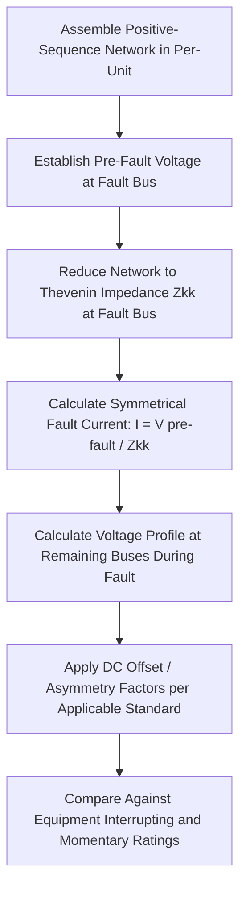

## Three-Phase Symmetrical Fault Analysis

### Overview

Three-phase symmetrical fault analysis examines the balanced short-circuit condition where all three phases are simultaneously connected to each other (and/or to ground), producing a fault current that remains balanced and symmetrical across all three phases. Despite occurring less frequently than unsymmetrical fault types on most systems, the three-phase fault is the standard basis for calculating maximum fault current for equipment rating purposes, precisely because its balanced nature allows analysis using only the positive-sequence network, without the added complexity of sequence network interconnection required for unsymmetrical faults.

### Fault Types and the Role of the Three-Phase Fault

**Symmetrical vs. Unsymmetrical Faults**

- **Three-phase fault (symmetrical)**: All three phases short-circuited together (with or without ground involvement), producing balanced currents and voltages
- **Unsymmetrical faults**: Single-line-to-ground, line-to-line, and double-line-to-ground faults, which produce unbalanced conditions requiring symmetrical component (sequence network) analysis

**Frequency vs. Severity**

[Inference] Single-line-to-ground faults are generally the most common fault type on most power systems, with three-phase faults occurring comparatively rarely; however, three-phase faults typically (though not universally — the relative severity depends on system grounding practice and specific impedance values) produce the highest fault current magnitude among fault types, which is why they are conventionally used to establish maximum equipment duty ratings even though they are not the most frequently occurring fault type.

### Network Model for Three-Phase Fault Analysis

**Positive-Sequence Network Only**

Because the three-phase fault preserves balanced (symmetrical) conditions across all three phases, the entire fault analysis can be performed using only the **positive-sequence network** — the standard per-phase equivalent circuit used throughout balanced power system analysis (the same network used for power flow studies) — without needing to construct or interconnect negative-sequence or zero-sequence networks, which are required only for unsymmetrical fault types.

**Network Elements**

- **Generators**: Represented by their internal EMF (typically assumed at pre-fault voltage, often 1.0 per unit in the absence of a detailed pre-fault load flow) behind the appropriate reactance (subtransient $X''_d$ for initial fault current calculations)
- **Transformers**: Represented by their leakage impedance (their magnetizing branch is typically neglected for fault studies given its high impedance relative to fault current paths)
- **Transmission lines and cables**: Represented by their series impedance (shunt charging capacitance is typically neglected for fault current magnitude calculations, being a comparatively minor factor relative to fault current paths)
- **Loads**: Often neglected in typical maximum-fault-current studies (their impedance is large relative to the fault path, having comparatively small effect on fault current magnitude), though more detailed studies may include load impedance or an equivalent load current contribution assumption where relevant to the specific study objective

### Calculation Procedure

**1. Per-Unit Network Assembly**

Convert all generator, transformer, and line impedances to a common per-unit base as described in per-unit short-circuit calculation methodology, and assemble the positive-sequence network.

**2. Determine Pre-Fault Voltage**

Establish the pre-fault voltage at the fault location, either from a solved pre-fault power flow (for detailed studies accounting for actual pre-fault loading conditions) or, for standard maximum-fault-current studies, assumed at 1.0 per unit (representing rated voltage with no-load conditions, a conservative assumption tending toward the maximum fault current case since fault current is directly proportional to pre-fault voltage).

**3. Calculate the Thevenin (Driving-Point) Impedance at the Fault Bus**

Reduce the network (via series/parallel combination, network reduction techniques, or by extracting the relevant diagonal element $Z_{kk}$ from a computed bus impedance matrix $Z_{bus}$) to determine the Thevenin equivalent impedance as seen from the fault location.

**4. Calculate Fault Current**

For a bolted three-phase fault (zero fault impedance) at bus $k$:

$$I''_{fault} = \frac{V_k^{pre-fault}}{Z_{kk}}$$

Where $I''_{fault}$ denotes the initial symmetrical (subtransient) fault current when calculated using generator subtransient reactance, per unit convention.

**5. Determine Voltage Profile During the Fault**

Once fault current is known, voltage at every other bus in the network during the fault can be calculated using the bus impedance matrix:

$$V_i^{fault} = V_i^{pre-fault} - Z_{ik} \, I_{fault}$$

Revealing the voltage sag experienced throughout the network during the fault, relevant for voltage sag/dip studies and protection coordination (e.g., verifying protective relays elsewhere in the network see sufficient voltage depression to detect and respond to the fault appropriately).

**Three-Phase Fault Analysis Process**

### Fault Current Time Variation

**Subtransient, Transient, and Steady-State Periods**

Following fault inception, the AC symmetrical component of fault current decays through three characteristic periods, driven by the electromagnetic behavior of synchronous generators contributing to the fault:

- **Subtransient period** (first few cycles): Fault current calculated using generator subtransient reactance $X''_d$, representing the highest initial current magnitude, relevant for instantaneous protection and initial breaker duty
- **Transient period** (extending to several cycles/seconds): Fault current calculated using transient reactance $X'_d$, an intermediate value as the generator's damper winding effects decay while field winding effects persist
- **Steady-state period**: Fault current calculated using synchronous reactance $X_d$, the lowest fault current magnitude, representing the fully decayed condition — generally not directly relevant to protection studies since breakers interrupt the fault well before this period is reached

**Envelope of Decaying Fault Current**

[Inference] The overall symmetrical fault current envelope over time is often approximated in textbook treatments as a smooth exponential-type decay through these three characteristic reactance values, though the precise decay behavior for any specific machine depends on its detailed time constants ($T''_d$, $T'_d$) as provided by the generator manufacturer, rather than following one universal decay curve shape.

### DC Offset and Asymmetrical Current

**Origin of DC Offset**

In addition to the symmetrical AC fault current component, the actual instantaneous fault current waveform contains a decaying DC offset component whose initial magnitude depends on the point on the voltage waveform at which the fault initiates — a fault occurring at a voltage zero-crossing produces maximum DC offset, while a fault at voltage peak produces minimal or no DC offset, reflecting the physical requirement that current through an inductive circuit cannot change instantaneously.

**DC Offset Decay Rate**

The DC component decays exponentially with a time constant determined by the X/R ratio of the network as seen from the fault location:

$$\tau = \frac{X}{\omega R}$$

Higher X/R ratios (more inductive, less resistive networks — typical of higher-voltage transmission systems) produce slower DC offset decay, resulting in more prolonged asymmetry in the fault current waveform.

**Total Asymmetrical Current**

The instantaneous total fault current combines both components:

$$i(t) = \sqrt{2}\,I''_{fault}\left[\sin(\omega t + \alpha - \theta) - \sin(\alpha - \theta)e^{-t/\tau}\right]$$

Where $\alpha$ is the voltage angle at fault inception and $\theta$ is the network impedance angle — this expression captures both the symmetrical AC component and the decaying DC offset term.

### Application to Equipment Rating Verification

**Breaker Interrupting Duty**

Circuit breaker interrupting capability must be verified against the calculated symmetrical (or, per applicable standard methodology, asymmetrical) fault current at the breaker's location, using the appropriate reactance value and timing convention specified by the relevant equipment rating standard (IEEE/ANSI C37 series or IEC 62271 series, which differ somewhat in their specific calculation conventions).

**Momentary/Close-and-Latch Duty**

The first-cycle peak current (capturing maximum asymmetry) determines the mechanical stress equipment must withstand, generally the highest-magnitude value in the fault current time sequence, evaluated against momentary or close-and-latch equipment ratings.

**Bus and Structural Bracing**

Fault current magnitude and its associated electromagnetic forces (proportional to the square of instantaneous current) inform the mechanical bracing requirements for busbars and structural supports in switchgear and substations, using the peak asymmetrical current as the relevant design basis.

### Maximum vs. Minimum Fault Current Studies

**Maximum Fault Current**

Used for equipment rating verification (breakers, bus, protective device instantaneous settings must be adequate for the highest current they might need to withstand or interrupt), typically calculated with all generation sources in service and using subtransient reactance values.

**Minimum Fault Current**

Used for protective relay sensitivity verification (relays must reliably detect even the smallest expected fault current for a given fault type/location), typically calculated with a reduced generation scenario (some sources out of service, representing a credible minimum-generation operating condition) and potentially incorporating fault resistance (a bolted, zero-impedance fault assumption is not always the worst case for relay sensitivity, since some fault resistance reduces fault current below the bolted-fault value).

### Limitations of Three-Phase Fault Analysis Alone

While foundational for equipment rating, three-phase fault analysis alone does not characterize:

- Unbalanced fault conditions (the more common single-line-to-ground and line-to-line faults), which require symmetrical component analysis incorporating negative- and zero-sequence networks
- Detailed relay coordination for ground fault protection, which depends specifically on zero-sequence network characteristics not present in the positive-sequence-only three-phase fault model
- System grounding-dependent fault current magnitudes (three-phase fault current is largely independent of system grounding practice, unlike single-line-to-ground fault current, which is strongly influenced by zero-sequence impedance and grounding method)

**Related Topics**

- Per-Unit Short-Circuit Calculation Methods
- Symmetrical Components and Sequence Networks
- Unsymmetrical Fault Analysis (Line-to-Ground, Line-to-Line, Double Line-to-Ground)
- Generator Subtransient, Transient, and Synchronous Reactance
- Circuit Breaker Interrupting and Momentary Rating Standards (IEEE/ANSI and IEC)
- DC Offset and X/R Ratio Effects on Fault Current Asymmetry
- Bus Impedance Matrix (Zbus) Construction Methods
- Protective Relay Coordination Studies