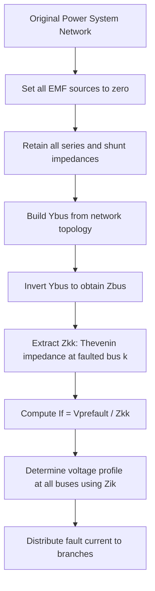

## Thevenin Equivalent Fault Calculations

### Overview

Thevenin equivalent fault calculation is the standard method for computing short-circuit currents at any bus in a power system by reducing the entire network, as seen from the fault point, to a single voltage source in series with a single equivalent impedance. This technique underlies symmetrical (three-phase balanced) fault analysis and forms the basis for protective relay coordination, circuit breaker rating selection, and arc-flash studies.

The method rests on Thevenin's theorem from linear circuit theory: any linear, bilateral network viewed from two terminals can be replaced by an equivalent voltage source $V_{th}$ in series with an equivalent impedance $Z_{th}$. In power systems, the "terminals" are the faulted bus and the reference (ground/neutral) node, and the network is assumed linear because pre-fault loading is neglected and machines are represented by fixed internal reactances during the sub-transient or transient period.

### Physical Basis and Assumptions

**Key Points**

- The pre-fault system is assumed to be operating at rated voltage with no load current flowing (the "flat voltage profile" assumption), so $V_{th}$ equals the pre-fault voltage at the fault bus, typically taken as $1.0\angle0°$ per unit.
- All synchronous machines, induction machines, and other rotating equipment are modeled as fixed EMF sources behind an appropriate reactance (sub-transient $X_d''$, transient $X_d'$, or synchronous $X_d$, depending on the time frame of interest).
- Transmission lines, transformers, and cables are modeled by their series impedance only; shunt admittances (line charging, magnetizing branches) are usually neglected for fault current magnitude calculations, since they carry negligible current compared to fault current.
- The network is assumed balanced and analyzed per-phase using the positive-sequence network for three-phase symmetrical faults.

[Inference] Neglecting pre-fault load currents introduces a small error relative to a full load-flow-based fault study; utilities performing high-precision studies (e.g., for relay setting coordination near thermal limits) sometimes superimpose the fault current calculated from the Thevenin method onto the pre-fault load flow solution.

### Constructing the Thevenin Equivalent

The general procedure to find $Z_{th}$ at a faulted bus $k$:

1. **Set all independent voltage sources to zero** (short-circuit all generator EMFs, since only their internal impedance remains), and set all independent current sources to open circuit.
2. **Retain all series and shunt impedances** in the network (generator reactances, transformer leakage reactances, line impedances, load impedances if modeled as constant impedance).
3. **Compute the driving-point impedance** at bus $k$, i.e., $Z_{th} = Z_{kk}$, the $k$-th diagonal element of the bus impedance matrix $Z_{bus}$.
4. **The Thevenin voltage** $V_{th}$ is the pre-fault open-circuit voltage at bus $k$ (commonly $1.0$ pu in the absence of a load-flow study).

For systems with more than a handful of buses, $Z_{th}$ is obtained not by manual series-parallel reduction but by building the system $Z_{bus}$ matrix, whose diagonal entries directly give the Thevenin impedance at each bus, and whose off-diagonal entries give the transfer impedances needed for fault current distribution to remote branches.

$$Z_{bus} = Y_{bus}^{-1}$$

where $Y_{bus}$ is the system admittance matrix built from the positive-sequence network.

### Three-Phase Symmetrical Fault Current

Once $Z_{th}$ (denoted $Z_{kk}$ for bus $k$) is known, the symmetrical fault current for a bolted three-phase fault at bus $k$ is:

$$I_{f,k}'' = \frac{V_{th}}{Z_{th}} = \frac{V_{pre-fault}}{Z_{kk}}$$

In per-unit terms with $V_{pre-fault} = 1.0\angle0°$ pu:

$$I_{f,k}'' = \frac{1.0}{Z_{kk}}\ \text{pu}$$

This current is then converted to actual amperes using the system's base current at that voltage level:

$$I_{base} = \frac{S_{base}}{\sqrt{3}\,V_{L-L,base}}$$

$$I_{f,k}''\ (\text{A}) = I_{f,k}''\ (\text{pu}) \times I_{base}$$

**Example**

Consider a bus with $S_{base} = 100$ MVA, $V_{L-L,base} = 13.8$ kV, and a calculated Thevenin reactance $X_{kk} = 0.10$ pu (resistance neglected).

$$I_{f}'' = \frac{1.0}{0.10} = 10.0\ \text{pu}$$

$$I_{base} = \frac{100 \times 10^6}{\sqrt{3} \times 13800} \approx 4184\ \text{A}$$

$$I_{f}'' = 10.0 \times 4184 \approx 41{,}840\ \text{A} \approx 41.84\ \text{kA}$$

### Voltage Profile During Fault

Beyond the fault current itself, the Thevenin framework yields the voltage at every other bus $i$ during the fault at bus $k$:

$$V_i = V_{pre-fault} - Z_{ik}\, I_{f,k}''$$

where $Z_{ik}$ is the transfer impedance between bus $i$ and the faulted bus $k$, taken from the $Z_{bus}$ matrix. This relationship is essential for voltage-sag studies and for determining relay sensing quantities at remote buses during a fault elsewhere in the network.

### Fault Current Contribution from Multiple Sources

When several generation sources or interconnections feed the fault, the total fault current divides among the branches according to a current-divider relationship derived from the network topology. For a simple case of two parallel branches (impedances $Z_1$ and $Z_2$) feeding the same faulted bus:

$$I_1 = I_f'' \times \frac{Z_2}{Z_1+Z_2}, \qquad I_2 = I_f'' \times \frac{Z_1}{Z_1+Z_2}$$

For meshed networks, current distribution factors are derived systematically from the $Z_{bus}$ matrix or by network reduction, since simple current-divider formulas only apply to radial or simple parallel topologies.

### Network Reduction Techniques

For hand calculations or smaller systems, $Z_{th}$ can be found by classical series-parallel and star-delta (wye-delta) reduction of the impedance diagram down to a single impedance between the fault point and reference:

- **Series combination:** $Z_{eq} = Z_1 + Z_2$
- **Parallel combination:** $Z_{eq} = \dfrac{Z_1 Z_2}{Z_1+Z_2}$
- **Wye-delta transformation:** used to eliminate a node when three or more branches meet in a way that resists simple series-parallel reduction, converting a wye-connected set of impedances to an equivalent delta (or vice versa).

$$Z_{a} = \frac{Z_{12}Z_{13}}{Z_{12}+Z_{13}+Z_{23}}, \quad Z_{b} = \frac{Z_{12}Z_{23}}{Z_{12}+Z_{13}+Z_{23}}, \quad Z_{c} = \frac{Z_{13}Z_{23}}{Z_{12}+Z_{13}+Z_{23}}$$

(delta-to-wye direction shown; the reverse wye-to-delta transformation is also standard.)

[Inference] Manual network reduction remains pedagogically valuable for building intuition but is largely superseded in practice by digital $Z_{bus}$ building algorithms once system size exceeds a handful of buses, since reduction order and topology tracking become error-prone by hand.

### Building the Z-bus Matrix by Direct Methods

Two standard approaches are used to build or obtain $Z_{bus}$:

1. **Matrix inversion:** Form $Y_{bus}$ by inspection (summing admittances at each node, with off-diagonal terms as negative mutual admittances), then invert: $Z_{bus} = Y_{bus}^{-1}$. This is straightforward for small systems or in software but scales poorly by hand for large networks.
2. **Z-bus building algorithm:** An incremental algorithm that adds one element (branch or new bus) at a time to a partially built $Z_{bus}$, updating all matrix entries using defined rules for four cases: adding a branch from a new bus to the reference, adding a branch from a new bus to an existing bus, adding a branch between two existing buses (a "link"), and adding a branch from an existing bus to the reference. This method is the traditional basis for many commercial short-circuit programs because it avoids explicit matrix inversion and naturally accommodates network topology changes.

### Mermaid Diagram: Thevenin Reduction Process

### SVG Diagram: Thevenin Equivalent Circuit for Fault Calculation

<svg xmlns="http://www.w3.org/2000/svg" viewBox="0 0 640 300" font-family="Helvetica, Arial, sans-serif">
<text x="200" y="24" font-size="16" font-weight="bold" fill="#1a1a1a">Thevenin Equivalent at Faulted Bus k (svg_diagram)</text>

<rect x="30" y="60" width="220" height="160" fill="none" stroke="#333" stroke-width="2" rx="8" />
<text x="140" y="85" font-size="13" text-anchor="middle" fill="#333">Original Network</text>
<circle cx="90" cy="130" r="18" fill="none" stroke="#0057b7" stroke-width="2" />
<text x="90" y="135" font-size="12" text-anchor="middle" fill="#0057b7">G1</text>
<circle cx="150" cy="160" r="18" fill="none" stroke="#0057b7" stroke-width="2" />
<text x="150" y="165" font-size="12" text-anchor="middle" fill="#0057b7">G2</text>
<line x1="90" y1="148" x2="210" y2="185" stroke="#333" stroke-width="1.5" />
<line x1="150" y1="178" x2="210" y2="185" stroke="#333" stroke-width="1.5" />
<circle cx="215" cy="188" r="6" fill="#d62728" />
<text x="200" y="210" font-size="12" text-anchor="middle" fill="#d62728">Bus k (fault)</text>

<line x1="260" y1="140" x2="330" y2="140" stroke="#1a1a1a" stroke-width="2" marker-end="url(#arrow)" />
<text x="295" y="128" font-size="12" text-anchor="middle" fill="#1a1a1a">reduce</text>
<rect x="360" y="60" width="240" height="160" fill="none" stroke="#333" stroke-width="2" rx="8" />
<text x="480" y="85" font-size="13" text-anchor="middle" fill="#333">Thevenin Equivalent</text>

<circle cx="420" cy="150" r="22" fill="none" stroke="#0057b7" stroke-width="2" />
<line x1="420" y1="135" x2="420" y2="165" stroke="#0057b7" stroke-width="2" />
<text x="420" y="185" font-size="11" text-anchor="middle" fill="#0057b7">Vth = 1.0∠0°</text>

<line x1="442" y1="150" x2="470" y2="150" stroke="#333" stroke-width="2" />
<rect x="470" y="140" width="50" height="20" fill="none" stroke="#333" stroke-width="2" />
<text x="495" y="135" font-size="11" text-anchor="middle" fill="#333">Zth = Zkk</text>
<line x1="520" y1="150" x2="555" y2="150" stroke="#333" stroke-width="2" />

<circle cx="560" cy="150" r="6" fill="#d62728" />
<text x="560" y="175" font-size="12" text-anchor="middle" fill="#d62728">Bus k</text>
<line x1="420" y1="172" x2="420" y2="195" stroke="#0057b7" stroke-width="2" />
<line x1="420" y1="195" x2="560" y2="195" stroke="#333" stroke-width="2" />
<line x1="560" y1="156" x2="560" y2="195" stroke="#333" stroke-width="2" />

<text x="480" y="215" font-size="12" text-anchor="middle" fill="`#1a1a1a`">If'' = Vth / Zth</text>

</svg>

### Worked Multi-Source Example

**Example**

A 34.5 kV bus is fed by two sources: a utility grid equivalent with $X_1 = 0.08$ pu and a local generator with $X_2 = 0.20$ pu (both on a 50 MVA base), connected in parallel directly to the fault bus.

Step 1 — Combine in parallel to get $Z_{th}$:

$$Z_{th} = \frac{(j0.08)(j0.20)}{j0.08+j0.20} = \frac{-0.016}{j0.28} = j0.0571\ \text{pu}$$

Step 2 — Total fault current:

$$I_f'' = \frac{1.0}{j0.0571} = -j17.51\ \text{pu} \quad (\text{magnitude } 17.51\ \text{pu})$$

Step 3 — Current division between sources:

$$I_{grid} = I_f'' \times \frac{X_2}{X_1+X_2} = 17.51 \times \frac{0.20}{0.28} = 12.51\ \text{pu}$$

$$I_{gen} = I_f'' \times \frac{X_1}{X_1+X_2} = 17.51 \times \frac{0.08}{0.28} = 5.00\ \text{pu}$$

Step 4 — Convert to amperes with $I_{base} = \dfrac{50\times10^6}{\sqrt{3}\times34{,}500} \approx 837$ A:

$$I_f'' \approx 17.51 \times 837 \approx 14{,}658\ \text{A}$$

### Relationship to Sequence Networks

For three-phase symmetrical faults specifically, only the positive-sequence network is needed because the fault is balanced and does not excite negative- or zero-sequence quantities. This is what allows the single-source, single-impedance Thevenin reduction described above to fully characterize the fault. Unbalanced faults (line-to-ground, line-to-line, double-line-to-ground) require interconnecting the positive-, negative-, and zero-sequence Thevenin equivalents, but the positive-sequence Thevenin impedance computed here remains the common building block for all fault types.

### Time-Varying Nature of Fault Current and Reactance Selection

**Key Points**

- Synchronous machine reactance is not constant during a fault; it evolves from sub-transient ($X_d''$, valid for the first 1–2 cycles) to transient ($X_d'$, valid up to several hundred milliseconds) to synchronous ($X_d$, steady-state) values as armature reaction develops.
- Using $X_d''$ in the Thevenin calculation gives the highest (initial) fault current, appropriate for breaker interrupting/momentary duty and instantaneous relay elements.
- Using $X_d'$ or $X_d$ gives progressively lower fault current estimates, relevant for time-delayed relay coordination or thermal withstand studies over longer fault clearing times.

[Unverified] The exact multiplying factors between sub-transient, transient, and synchronous fault current magnitudes are machine-specific and should be obtained from manufacturer data or standard reactance tables (e.g., IEEE Std 399, IEC 60909) rather than assumed as universal ratios.

### Standards and Software Context

Two major standards govern practical Thevenin-based fault calculations:

- **ANSI/IEEE C37.010 and IEEE Std 399 ("Brown Book"):** used predominantly in North America, applying multiplying factors to the E/X (or E/Z) calculation to account for AC and DC decay when rating breakers.
- **IEC 60909:** used internationally, applying a voltage factor $c$ to the nominal voltage ($V_{th} = c \times V_n$) to account for voltage variations and other simplifying assumptions, with $c$ differing for maximum and minimum fault current calculations.

[Inference] Most commercial short-circuit analysis packages (e.g., ETAP, SKM PowerTools, DIgSILENT PowerFactory, PSS/E) implement both ANSI and IEC methodologies as selectable calculation engines, since utility and industrial studies in different regions are typically required to comply with one standard or the other.

### Common Pitfalls

- **Ignoring pre-fault loading entirely** when a more refined estimate is needed near voltage-sensitive equipment; the flat 1.0 pu assumption is usually conservative for maximum fault duty but may understate or overstate current at specific buses in heavily loaded networks. [Inference]
- **Mixing reactance bases** (sub-transient vs. transient) inconsistently across machines in the same study, which skews current distribution among parallel sources.
- **Neglecting fault resistance/arc impedance** when a bolted (zero-impedance) fault assumption is not representative of the actual fault type being studied (e.g., arcing faults in switchgear, which are better handled by dedicated arc-flash/arcing-fault current methods).
- **Forgetting to update $Z_{bus}$** after network topology changes (breaker openings, tie-line switching), leading to fault duty studies that do not reflect actual operating configurations.

### Conclusion

The Thevenin equivalent method transforms an arbitrarily complex power network into a single-source, single-impedance model at the point of interest, making three-phase symmetrical fault current calculation a direct application of Ohm's law once $Z_{th}$ is known. Its practical implementation centers on building and inverting (or incrementally constructing) the $Z_{bus}$ matrix, selecting an appropriate machine reactance for the time frame of interest, and applying standard multiplying factors per ANSI or IEC methodology for equipment rating and protection coordination studies.

**Related Topics**

- Symmetrical Components and Sequence Networks
- Unbalanced Fault Analysis (Line-to-Ground, Line-to-Line, Double-Line-to-Ground)
- Z-bus Building Algorithm (Step-by-Step Derivation)
- ANSI/IEEE C37.010 Breaker Duty Calculation Method
- IEC 60909 Short-Circuit Calculation Method
- Sub-transient, Transient, and Synchronous Reactance Modeling
- Arc-Flash Hazard Analysis (IEEE 1584)
- Protective Relay Coordination Using Fault Current Magnitudes
- Per-Unit System and Base Value Conversion
- Fault Current Contribution from Induction Motors and Inverter-Based Resources