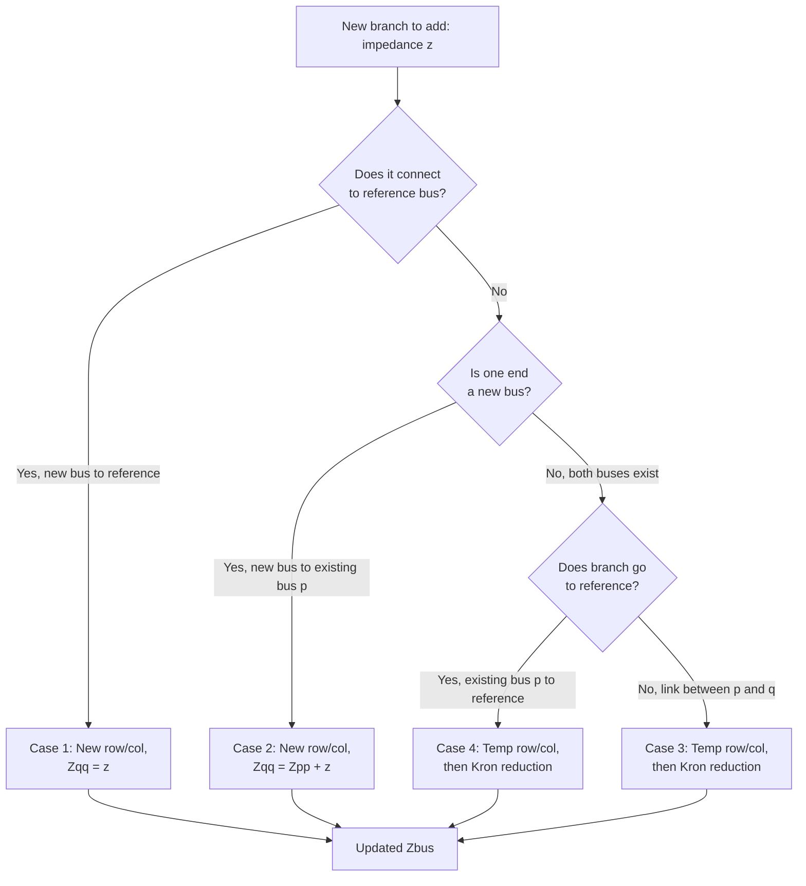

## Zbus Method for Fault Analysis

### Overview

The Zbus method is the systematic, matrix-based approach for computing symmetrical three-phase fault currents and post-fault voltages at every bus of a power system simultaneously. Rather than reducing the network to a single Thevenin impedance for one fault location at a time, the Zbus method builds the complete bus impedance matrix once, after which fault calculations at any bus (or combination of buses) become simple matrix lookups and algebraic substitutions. This makes it the standard computational backbone of virtually all commercial short-circuit analysis software.

### The Bus Impedance Matrix

For an $n$-bus positive-sequence network, the bus admittance matrix $Y_{bus}$ relates injected currents to bus voltages:

$$I_{bus} = Y_{bus}\,V_{bus}$$

Inverting this relationship gives the bus impedance matrix:

$$V_{bus} = Y_{bus}^{-1} I_{bus} = Z_{bus}\, I_{bus}$$

$Z_{bus}$ is generally a full (non-sparse) matrix even when $Y_{bus}$ is sparse, because impedance couples every bus to every other bus through the network. Each element carries distinct physical meaning:

- **Diagonal elements $Z_{ii}$:** the Thevenin (driving-point) impedance at bus $i$, used directly for fault current magnitude at that bus.
- **Off-diagonal elements $Z_{ij}$:** the transfer impedance between buses $i$ and $j$, used to compute voltage changes at bus $j$ caused by a fault at bus $i$ (and vice versa, since the network is reciprocal and $Z_{ij}=Z_{ji}$).

### Formulating Ybus for Zbus Construction

**Key Points**

- Generator/source branches are represented by their internal reactance connected between the internal EMF node (often folded into system buses) and the reference (ground) node.
- Transmission lines and cables contribute their series impedance between the two buses they connect; shunt charging is typically neglected for fault studies.
- Transformers contribute their leakage impedance, referred to a common base, between the buses on either side.
- Loads are normally excluded (treated as open circuits) for classical fault studies, since load current is negligible next to fault current under the standard assumptions.

The admittance matrix is built by inspection:

$$Y_{ii} = \sum \text{(admittances connected to bus } i\text{)}, \qquad Y_{ij} = -\text{(admittance directly connecting bus } i \text{ and } j\text{)}$$

### Building Zbus: Matrix Inversion vs. Incremental Algorithm

Two standard construction approaches exist:

1. **Direct inversion:** Assemble $Y_{bus}$, then compute $Z_{bus} = Y_{bus}^{-1}$ numerically. Conceptually simple and universally used inside modern software (LU decomposition or sparse solvers avoid ever forming a dense inverse explicitly, but the logical result is equivalent).
2. **Zbus building algorithm:** A classical, hand-computable method that grows $Z_{bus}$ one branch at a time, avoiding matrix inversion altogether. This is historically important both for hand analysis and because early short-circuit programs used it for computational efficiency on sparse networks.

The building algorithm has four standard cases when adding a new element with impedance $z$:

**Case 1 — Adding a branch from a new bus $q$ to the reference (ground):**

A new row/column $q$ is added; $Z_{qq} = z$, and all other new cross terms $Z_{qi} = Z_{iq} = 0$.

**Case 2 — Adding a branch from a new bus $q$ to an existing bus $p$:**

A new row/column $q$ is added: $Z_{qq} = Z_{pp} + z$, and $Z_{qi} = Z_{iq} = Z_{pi}$ for all existing buses $i$.

**Case 3 — Adding a branch (a "link") between two existing buses $p$ and $q$:**

No new bus is created; instead, an intermediate matrix is formed by adding a temporary row/column $\ell$, then that row/column is eliminated via Kron reduction:

$$Z_{\ell\ell} = Z_{pp} + Z_{qq} - 2Z_{pq} + z$$

$$Z_{ij}^{new} = Z_{ij}^{old} - \frac{Z_{i\ell}\,Z_{\ell j}}{Z_{\ell\ell}} \quad \text{for all existing } i,j$$

**Case 4 — Adding a branch from an existing bus $p$ to the reference:**

Handled as a special case of Case 3, treating the reference as a fictitious existing bus with all impedances to it equal to zero, then eliminating the temporary row/column in the same Kron reduction manner.

[Inference] The building algorithm's main practical value today is pedagogical and for validating software output on small test systems; production-grade tools rely on sparse LU factorization of $Y_{bus}$ for computational efficiency on networks with thousands of buses.

### Mermaid Diagram: Zbus Building Algorithm Decision Flow

### Fault Current Calculation Using Zbus

For a bolted three-phase fault at bus $k$, with pre-fault voltage $V_k^{(0)}$ (commonly $1.0\angle0°$ pu under the no-load assumption):

$$I_{f,k}'' = \frac{V_k^{(0)}}{Z_{kk}}$$

The current injected at the fault is treated as a fictitious negative current injection $-I_{f,k}''$ at bus $k$, and superposition gives the voltage at every other bus $i$ during the fault:

$$V_i^{fault} = V_i^{(0)} - Z_{ik}\, I_{f,k}'' = V_i^{(0)} - \frac{Z_{ik}}{Z_{kk}}V_k^{(0)}$$

This single pass through the $Z_{bus}$ matrix yields the complete post-fault voltage profile of the entire system — a major advantage over repeated Thevenin reductions when multiple fault locations must be studied.

**Example**

Consider a 4-bus system with the following (illustrative) positive-sequence $Z_{bus}$ matrix, all values in per-unit reactance (resistance neglected):

$$Z_{bus} = j\begin{bmatrix} 0.15 & 0.10 & 0.08 & 0.05 \\ 0.10 & 0.25 & 0.12 & 0.07 \\ 0.08 & 0.12 & 0.20 & 0.09 \\ 0.05 & 0.07 & 0.09 & 0.18 \end{bmatrix}$$

For a bolted three-phase fault at bus 2, with pre-fault voltage 1.0 pu at all buses:

$$I_{f,2}'' = \frac{1.0}{j0.25} = -j4.0\ \text{pu} \quad (\text{magnitude } 4.0\ \text{pu})$$

Post-fault voltages at the other buses:

$$V_1 = 1.0 - \frac{Z_{12}}{Z_{22}}(1.0) = 1.0 - \frac{0.10}{0.25} = 1.0 - 0.40 = 0.60\ \text{pu}$$

$$V_3 = 1.0 - \frac{Z_{32}}{Z_{22}}(1.0) = 1.0 - \frac{0.12}{0.25} = 1.0 - 0.48 = 0.52\ \text{pu}$$

$$V_4 = 1.0 - \frac{Z_{42}}{Z_{22}}(1.0) = 1.0 - \frac{0.07}{0.25} = 1.0 - 0.28 = 0.72\ \text{pu}$$

$$V_2 = 0\ \text{pu (bolted fault, no fault impedance)}$$

This single row/column of $Z_{bus}$ (row/column 2) fully characterizes both the fault current and the entire voltage sag profile for a fault at bus 2 — no re-reduction of the network is required.

### Branch Current (Fault Current Flow) Calculation

Once bus voltages during the fault are known, the current flowing in any branch connecting buses $i$ and $j$ (with series impedance $z_{ij}$) is found from the voltage difference across it:

$$I_{ij} = \frac{V_i^{fault} - V_j^{fault}}{z_{ij}}$$

This is essential for determining how much fault current flows through each individual line, transformer, or breaker — the quantity actually needed for breaker duty and protection coordination, as opposed to the total fault current at the bus.

### Faults with Non-Zero Fault Impedance $Z_f$

A more general form accommodates fault impedance (e.g., arcing faults, faults through a tower footing resistance) by modifying the driving-point term:

$$I_{f,k}'' = \frac{V_k^{(0)}}{Z_{kk} + Z_f}$$

$$V_i^{fault} = V_i^{(0)} - \frac{Z_{ik}}{Z_{kk}+Z_f}V_k^{(0)}$$

Setting $Z_f = 0$ recovers the bolted-fault case shown above.

### SVG Diagram: Zbus Fault Injection Model

<svg xmlns="http://www.w3.org/2000/svg" viewBox="0 0 640 320" font-family="Helvetica, Arial, sans-serif">
<text x="180" y="24" font-size="16" font-weight="bold" fill="#1a1a1a">Zbus Fault Current Injection Model (svg_diagram)</text>

<ellipse cx="320" cy="140" rx="260" ry="100" fill="none" stroke="#333" stroke-width="2" stroke-dasharray="6,4" />
<text x="320" y="70" font-size="13" text-anchor="middle" fill="#333">Linear Passive Network (Zbus)</text>

<circle cx="180" cy="120" r="8" fill="#0057b7" />
<text x="180" y="105" font-size="12" text-anchor="middle" fill="#0057b7">Bus 1</text>
<circle cx="320" cy="180" r="8" fill="#d62728" />
<text x="320" y="205" font-size="12" text-anchor="middle" fill="#d62728">Bus k (fault)</text>
<circle cx="440" cy="110" r="8" fill="#0057b7" />
<text x="440" y="95" font-size="12" text-anchor="middle" fill="#0057b7">Bus i</text>
<circle cx="380" cy="230" r="8" fill="#0057b7" />
<text x="380" y="250" font-size="12" text-anchor="middle" fill="#0057b7">Bus j</text>

<line x1="320" y1="240" x2="320" y2="188" stroke="#d62728" stroke-width="2" marker-end="url(#arrow2)" />
<text x="320" y="265" font-size="12" text-anchor="middle" fill="#d62728">-If'' injected</text>
<text x="320" y="300" font-size="12" text-anchor="middle" fill="`#1a1a1a`">Vi = Vi(0) - Zik · If'' for every bus i</text>

</svg>

### Sequence Networks and the Zbus Method

For pure three-phase symmetrical faults, only the positive-sequence $Z_{bus}$ is required, as demonstrated above. For unbalanced faults, the method extends naturally: separate $Z_{bus}^{(1)}$, $Z_{bus}^{(2)}$, and $Z_{bus}^{(0)}$ matrices (positive, negative, zero sequence) are built independently, and their diagonal elements at the fault bus are interconnected according to the specific fault type (single-line-to-ground, line-to-line, double-line-to-ground) via standard sequence-network connection diagrams.

### Advantages Over Repeated Thevenin Reduction

**Key Points**

- **Multi-bus fault studies:** once $Z_{bus}$ is built, faults at any or all buses can be evaluated by simply reading diagonal and relevant off-diagonal elements — no network re-reduction per fault location.
- **System-wide voltage profile:** the method inherently produces the voltage at every bus during any single fault, valuable for voltage-sag and ride-through studies without additional computation.
- **Topology changes:** the Zbus building algorithm allows incremental updates (adding/removing a branch) without rebuilding the entire matrix from scratch, useful for contingency and switching studies.
- **Natural fit for digital computation:** matrix inversion (or sparse factorization) parallelizes and scales far better computationally than symbolic series-parallel network reduction for large systems.

[Inference] For very large transmission networks (thousands of buses), commercial tools typically avoid explicitly forming the dense $Z_{bus}$ matrix and instead factorize the sparse $Y_{bus}$ (via sparse LU or similar techniques), solving for only the specific rows/columns of $Z_{bus}$ needed for a given study, since storing a full dense $Z_{bus}$ for a large system can be memory-intensive.

### Common Pitfalls

- **Confusing $Z_{bus}$ with $Y_{bus}$ sparsity patterns:** $Y_{bus}$ is sparse (reflects direct physical connections), but its inverse $Z_{bus}$ is generally dense — every bus is electrically coupled to every other bus through the network.
- **Applying the no-load assumption where it does not hold:** heavily loaded systems or systems with significant pre-fault voltage deviation may need superposition with a load-flow solution for higher accuracy.
- **Neglecting mutual coupling between parallel transmission lines:** if physically parallel lines share a right-of-way, zero-sequence mutual coupling especially can materially affect fault studies; this is captured by including mutual impedance terms in the network model, not by the simple series-impedance-only representation.
- **Reusing an outdated $Z_{bus}$ after topology changes** (breaker operations, new lines in service) without applying the appropriate branch-addition/removal update, leading to inaccurate fault duty results.
- **Ignoring machine reactance time frame:** as with the Thevenin method, whether $Z_{bus}$ is built from sub-transient, transient, or synchronous reactances determines whether the resulting fault currents represent initial, intermediate, or steady-state fault duty.

### Relationship to Software Implementation

[Inference] Commercial power system analysis tools (ETAP, SKM PowerTools, DIgSILONT PowerFactory, PSS/E, PSCAD, CYME) implement the Zbus method internally, typically presenting the user with per-bus fault current and voltage results rather than exposing the matrix directly, though most also allow export of the underlying $Z_{bus}$/$Y_{bus}$ matrices for verification or further study, since exact feature sets vary by vendor and product version.

### Conclusion

The Zbus method generalizes single-fault Thevenin analysis into a comprehensive, matrix-based framework capable of characterizing fault current and system-wide voltage behavior for any fault location with a single matrix build. Its combination of the incremental building algorithm (useful for topology updates and hand verification) and direct matrix inversion (used internally by software) makes it the practical standard for symmetrical fault studies in systems of any significant size.

**Related Topics**

- Thevenin Equivalent Fault Calculations
- Symmetrical Components and Sequence Networks
- Unbalanced Fault Analysis Using Sequence Zbus Matrices
- Kron Reduction Technique
- Sparse Matrix Techniques for Large-Scale Power System Studies
- Mutual Coupling Between Parallel Transmission Lines
- Breaker Duty and Interrupting Rating Calculations (ANSI/IEC)
- Fault Current Contribution from Distributed and Inverter-Based Resources
- Network Topology Processing for Real-Time Fault Studies
- Load Flow Superposition with Fault Analysis