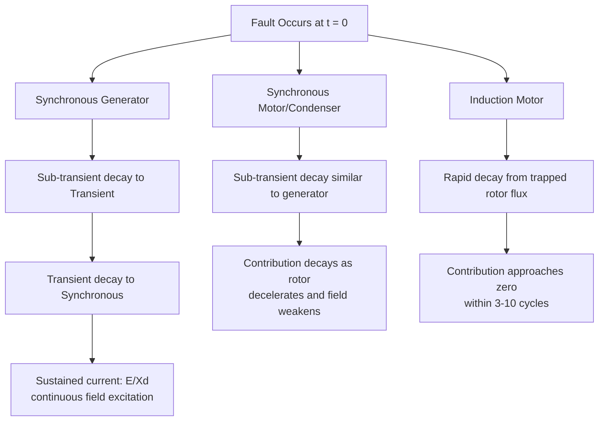

## Fault Current Contribution from Generators and Motors

### Overview

When a short circuit occurs on a power system, every rotating machine electromagnetically coupled to the fault point contributes current — not only utility-connected synchronous generators, but also synchronous motors/condensers and induction motors, all of which behave as decaying EMF sources immediately after the fault. Correctly accounting for these contributions is essential because each machine type decays at a different rate and dies out over a different time span, directly affecting breaker interrupting duty, relay coordination, and arc-flash incident energy calculations.

### Physical Origin of Machine Fault Current

**Key Points**

- Prior to the fault, a rotating machine's air-gap flux is established by a combination of field excitation (synchronous machines) or induced rotor currents (induction machines) and armature reaction.
- At the instant of a short circuit, the flux linkage in the machine's windings cannot change instantaneously (a consequence of the constant-flux-linkage theorem for inductive circuits), so the machine initially behaves as if it retains its pre-fault internal flux, producing a large initial EMF-driven current.
- As induced eddy currents in damper windings, rotor iron, or (for induction motors) the rotor cage decay, the effective internal reactance of the machine increases over time, causing the fault current contribution to decay from an initial high value toward a lower sustained value (or to zero, for machines with no sustained excitation source).

This decaying behavior is why synchronous machines are represented by a *sequence* of increasing reactances (sub-transient, transient, synchronous) rather than a single fixed impedance when precise time-domain fault current magnitude is required.

### Synchronous Generator Contribution

**Reactance progression during a fault:**

$$X_d'' < X_d' < X_d$$

| Parameter | Typical Range (pu, machine base) | Valid Time Frame |
| --- | --- | --- |
| Sub-transient reactance $X_d''$ | 0.07 – 0.20 | First 1–2 cycles (~0.02–0.05 s) |
| Transient reactance $X_d'$ | 0.15 – 0.35 | Up to several hundred ms |
| Synchronous reactance $X_d$ | 1.0 – 2.5 | Steady-state (sustained fault) |

[Unverified] These ranges are broadly representative of typical utility and industrial synchronous machines but vary significantly by machine design, rating, and manufacturer; actual values should always be taken from generator nameplate data or manufacturer test reports for a specific study.

**Initial (sub-transient) symmetrical fault current contribution:**

$$I_g'' = \frac{E_g''}{X_d''}$$

where $E_g''$ is the internal sub-transient EMF, approximately equal to the pre-fault terminal voltage plus the pre-fault reactive drop across $X_d''$, and is commonly approximated as $1.0$ pu under the no-load pre-fault assumption.

**Decay envelope:** The AC component of generator fault current decays approximately as a sum of exponential terms:

$$i_{ac}(t) \approx \sqrt{2}\,E \left[ \frac{1}{X_d} + \left(\frac{1}{X_d'}-\frac{1}{X_d}\right)e^{-t/T_d'} + \left(\frac{1}{X_d''}-\frac{1}{X_d'}\right)e^{-t/T_d''}\right]\sin(\omega t + \theta)$$

where $T_d'$ and $T_d''$ are the transient and sub-transient short-circuit time constants, respectively. Because synchronous generators maintain field excitation continuously, their fault contribution does not decay to zero but settles toward the synchronous (steady-state) value $E/X_d$, unless the excitation system loses field current or the machine is tripped offline.

**DC offset component:** Superimposed on the decaying AC component is an exponentially decaying DC offset, whose magnitude depends on the point-on-wave of fault initiation and whose decay time constant $T_a$ (the armature time constant) governs how quickly it dies out — relevant for asymmetrical (momentary/closing) duty ratings of breakers rather than symmetrical interrupting duty.

### Synchronous Motor and Synchronous Condenser Contribution

Synchronous motors and synchronous condensers behave essentially identically to generators during a fault, because they also carry continuous field excitation and stored rotational kinetic energy that is converted to electrical fault current contribution.

**Key Points**

- At the instant of fault, a synchronous motor's terminal voltage collapses, but its rotor continues to rotate momentarily due to mechanical inertia, driving the machine to act as a generator feeding current *into* the fault.
- The same sub-transient/transient/synchronous reactance framework applies, using the motor's own $X_d''$, $X_d'$, $X_d$ values.
- Synchronous motor contribution is often comparable in magnitude to generator contribution of similar rating and is not negligible in industrial plants with large synchronous motor loads (e.g., synchronous motor-driven compressors).

$$I_{sm}'' = \frac{E_{sm}''}{X_{d,sm}''}$$

### Induction Motor Contribution

Induction motors present a distinct case because they have no independent field excitation source; their rotor flux is induced by the stator field through the air gap (transformer action) and is sustained only by residual rotor currents after the fault.

**Key Points**

- At the fault instant, trapped flux in the rotor (from pre-fault operation) drives a transient EMF that produces an initial fault current contribution comparable in magnitude to a synchronous machine's sub-transient contribution.
- Because there is no sustained excitation, this contribution decays rapidly — typically within 3–10 cycles — governed by the rotor's electrical time constant, as the trapped flux dissipates.
- The induction motor sub-transient reactance is commonly approximated by the locked-rotor (starting) reactance:

$$X_{lr} \approx \frac{1}{I_{LR}/I_{FL}} \quad \text{(in per unit on motor base, from the motor's locked-rotor current multiplier)}$$

$$I_m'' = \frac{E_m''}{X_{lr}}$$

- [Inference] Small induction motors (typically below roughly 50 hp, though thresholds vary by standard and study practice) are frequently neglected in fault studies because their individual and aggregate contribution is small relative to total fault current and their current decays extremely quickly; larger motors and motor groups are usually retained explicitly.

### Comparative Decay Behavior

### SVG Diagram: Fault Current Decay Comparison by Machine Type

<svg xmlns="http://www.w3.org/2000/svg" viewBox="0 0 640 340" font-family="Helvetica, Arial, sans-serif">
<text x="180" y="24" font-size="16" font-weight="bold" fill="#1a1a1a">Fault Current Decay by Machine Type (svg_diagram)</text>

<line x1="70" y1="290" x2="600" y2="290" stroke="#333" stroke-width="1.5" />
<line x1="70" y1="290" x2="70" y2="50" stroke="#333" stroke-width="1.5" />
<text x="330" y="315" font-size="12" text-anchor="middle" fill="#333">Time (cycles)</text>
<text x="30" y="170" font-size="12" text-anchor="middle" fill="#333" transform="rotate(-90 30 170)">Current Magnitude (pu)</text>

<text x="70" y="305" font-size="10" text-anchor="middle" fill="#666">0</text>

<text x="200" y="305" font-size="10" text-anchor="middle" fill="#666">5</text>

<text x="330" y="305" font-size="10" text-anchor="middle" fill="#666">10</text>

<text x="460" y="305" font-size="10" text-anchor="middle" fill="#666">20</text>

<text x="590" y="305" font-size="10" text-anchor="middle" fill="#666">30+</text>

<path d="M 70,80 C 150,100 200,140 260,160 C 340,180 420,185 590,188" fill="none" stroke="#0057b7" stroke-width="2.5" />
<text x="500" y="175" font-size="11" fill="#0057b7">Synchronous Generator</text>

<path d="M 70,95 C 150,125 220,175 280,205 C 360,230 440,238 590,240" fill="none" stroke="#2ca02c" stroke-width="2.5" />
<text x="440" y="255" font-size="11" fill="#2ca02c">Synchronous Motor</text>

<path d="M 70,90 C 110,140 140,200 170,240 C 210,270 260,285 350,289" fill="none" stroke="#d62728" stroke-width="2.5" />
<text x="200" y="265" font-size="11" fill="#d62728">Induction Motor</text>

<text x="330" y="45" font-size="11" text-anchor="middle" fill="#666">(Illustrative decay envelopes — actual curves are machine- and study-specific)</text>

</svg>

### Combining Contributions at the Fault Point

For a fault fed by multiple machine types simultaneously, the total fault current at any instant is the phasor (or, for magnitude estimation, algebraic) sum of each machine's contribution at that instant, each evaluated using its own appropriate reactance for the time frame of interest:

$$I_{f,total}''(t) = I_{gen}''(t) + I_{sync\ motor}''(t) + I_{induction\ motor}''(t)$$

**Example**

A 13.8 kV industrial substation fault is fed by:

- A generator contributing $I_{gen}'' = 8.0$ pu (sub-transient)
- A synchronous motor contributing $I_{sm}'' = 3.5$ pu (sub-transient)
- An induction motor group contributing $I_{im}'' = 2.0$ pu (sub-transient)

**First-cycle (momentary/closing) duty:**

$$I_f''(0) = 8.0 + 3.5 + 2.0 = 13.5\ \text{pu}$$

**After 5 cycles**, assuming the induction motor contribution has decayed to roughly 20% of its initial value and the synchronous machines have decayed toward their transient values (illustrative multipliers of 0.85 and 0.80 respectively for this example):

$$I_f''(5\ \text{cyc}) \approx (8.0 \times 0.85) + (3.5 \times 0.80) + (2.0 \times 0.20) = 6.8 + 2.8 + 0.4 = 10.0\ \text{pu}$$

[Inference] This example uses illustrative decay multipliers for demonstration; actual decay factors depend on specific machine time constants and should be computed from manufacturer data or standard multiplying-factor tables (e.g., IEEE Std 141/399, ANSI C37.010) rather than assumed generically.

### Standard Treatment in ANSI and IEC Methodologies

- **ANSI/IEEE C37.010 / IEEE Std 399:** classifies machine contributions and applies specific multiplying factors depending on machine type, size, and the breaker's rated interrupting time (e.g., distinguishing "first-cycle," "interrupting," and contribution categories for generators, synchronous motors, and induction motors of varying size).
- **IEC 60909:** applies motor contribution factors and specific reactance multipliers for induction and synchronous motors, along with a voltage factor $c$ applied to the source, treating motor contributions through defined equivalent impedances and decay assumptions distinct from generator treatment.

[Inference] Because the exact multiplying factors and machine-size thresholds differ between these standards and are periodically revised, practitioners performing formal breaker duty or protection studies should consult the current edition of the applicable standard directly rather than relying on generalized summaries.

### Practical Modeling Considerations

**Key Points**

- **Motor contribution aggregation:** in large industrial or commercial facilities with many small motors, individual motor modeling is often impractical; a common practice is to lump motor loads into equivalent motor contribution reactances at each bus based on total connected motor horsepower/kVA, rather than modeling every motor discretely. [Inference]
- **Inverter-based resources (wind, solar, battery storage):** unlike traditional rotating machines, power-electronic-interfaced generation sources typically limit fault current contribution to a value at or near rated current (often around 1.0–1.2 pu of rated current) due to inverter current-limiting control, fundamentally changing fault analysis assumptions where such resources are present in significant quantity. [Inference — inverter fault-ride-through behavior is highly manufacturer- and control-scheme-dependent and should be verified against specific equipment documentation for accurate studies.]
- **Motor contribution to remote faults:** motors electrically distant from the fault (behind significant impedance) contribute proportionally less current; contribution magnitude depends on the impedance path from each motor to the fault point, computed via the same $Z_{bus}$ transfer impedance framework used for generator contributions.

### Common Pitfalls

- **Neglecting motor contribution entirely** in industrial plants with large motor loads, which can significantly understate first-cycle fault duty and arc-flash incident energy near motor-heavy switchgear.
- **Using synchronous reactance for interrupting-duty calculations** instead of the appropriate transient or sub-transient value for the breaker's actual interrupting time, understating required breaker rating.
- **Failing to decay induction motor contribution** appropriately for time-delayed protection studies, since induction motor current vanishes quickly and should not be included in fault current available beyond roughly 3–10 cycles for most machines. [Inference]
- **Applying generator-style sustained contribution logic to inverter-based resources**, which do not behave like rotating machines and instead exhibit fundamentally different, often current-limited, fault response. [Inference]

### Conclusion

Total fault current at any point in a power system is the superposition of contributions from every electromagnetically coupled rotating machine, each governed by its own decay characteristics: synchronous generators and motors sustain contribution indefinitely (bounded by field excitation), while induction motors contribute a rapidly decaying transient current from trapped rotor flux alone. Properly time-framing each machine's reactance — sub-transient for first-cycle duty, transient or synchronous for later time frames — combined with standard ANSI/IEC multiplying factor methodology, is essential for accurate breaker rating, relay coordination, and arc-flash studies.

**Related Topics**

- Thevenin Equivalent Fault Calculations
- Zbus Method for Fault Analysis
- Synchronous Machine Reactance Models ($X_d''$, $X_d'$, $X_d$)
- ANSI/IEEE C37.010 Breaker Duty Multiplying Factors
- IEC 60909 Motor Contribution Factors
- DC Offset and Asymmetrical Fault Current
- Fault Ride-Through Behavior of Inverter-Based Resources
- Arc-Flash Incident Energy Calculation (IEEE 1584)
- Motor Starting and Locked-Rotor Current Studies
- Aggregated Motor Load Modeling for Short-Circuit Studies