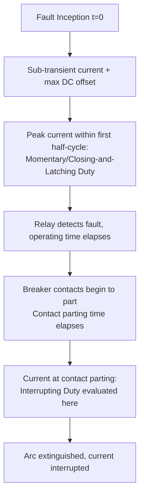

## Circuit Breaker Interrupting and Momentary Ratings

### Overview

Circuit breaker ratings for fault duty are not single numbers but a set of interrelated quantities that describe how much current a breaker must safely close onto, carry momentarily, and interrupt, at different points in time after a fault occurs. These ratings connect directly to the time-varying fault current behavior established by generator, motor, and network Thevenin/Zbus analysis: the breaker must be selected so that its capability envelope exceeds the calculated fault duty at every relevant instant, from the first half-cycle through final interruption.

### Why Fault Current Timing Matters for Breaker Ratings

**Key Points**

- Fault current is highest immediately after fault inception (sub-transient period, including DC offset) and decays over time as machine reactances increase and DC offset decays.
- A breaker's mechanical parts must physically withstand the highest instantaneous current (momentary/closing duty) without damage, even though the breaker is not yet required to interrupt at that instant.
- A breaker's interrupting rating applies at the specific time its contacts actually part and clear the arc, which occurs after a defined relay/breaker operating time delay — meaning interrupting duty is evaluated at a *later, lower* point on the current decay curve than momentary duty.

This time separation is why the same breaker has a higher momentary/closing rating than its interrupting rating when expressed in equivalent terms, and why fault studies must calculate current magnitude at multiple time points (first cycle, interrupting time) rather than a single number.

### Momentary (Closing and Latching) Rating

The momentary rating — termed "closing and latching capability" in modern IEEE standards — defines the maximum current a breaker must be able to close onto and mechanically withstand without contact welding, mechanical damage, or failure to latch closed, even though it is not required to interrupt at this current level.

**Key characteristics:**

- Evaluated at the first current peak after fault inception, capturing both the AC sub-transient component and the maximum DC offset (occurring when the fault initiates near a voltage zero-crossing).
- Historically expressed as an RMS asymmetrical value or as a crest (peak) value; modern standards commonly reference the **peak (crest) closing and latching capability**.
- A traditional approximation relates the peak momentary current to the symmetrical sub-transient RMS current using a standard multiplying factor to account for the maximum possible DC offset and asymmetry:

$$I_{momentary,peak} \approx K \times \sqrt{2} \times I_{sym}''$$

where $K$ is a standard multiplying factor (historically often cited around 1.6 for the peak/crest duty, though the applicable factor depends on the specific standard, breaker type, and X/R ratio of the system).

[Unverified] Exact multiplying factors for momentary/closing-and-latching duty differ between older ANSI breaker standards (which used separate momentary and interrupting ratings) and the harmonized ANSI/IEEE C37.06 / IEC 62271-100 framework, and depend on the system X/R ratio; the specific factor to apply should be taken from the current edition of the governing standard rather than a single fixed number.

### Interrupting Rating

The interrupting rating defines the maximum current a breaker can safely interrupt at the moment its contacts part, expressed as an RMS symmetrical (or, in older methodology, asymmetrical) value at the breaker's rated interrupting time.

**Key characteristics:**

- Evaluated at the fault current magnitude present at the *contact parting time* — the sum of the protective relay operating time plus the breaker's own contact parting time (mechanism travel time), not at fault inception.
- Because fault current has decayed somewhat by this time (from sub-transient toward transient levels, and DC offset has partially decayed), the interrupting duty current is generally lower than the first-cycle/momentary current for the same fault.
- Standard breaker interrupting times are commonly categorized by breaker speed class (e.g., 3-cycle, 5-cycle breakers, referring to the total clearing time including contact parting and arc extinction), which determines which point on the decay curve is used for the interrupting duty calculation.

$$I_{interrupting} = I_f''(t_{contact\ parting})$$

where $t_{contact\ parting} = t_{relay} + t_{breaker\ parting}$.

### Relationship Between the Ratings and the Decay Curve

### SVG Diagram: Fault Current Decay with Rating Points Marked

<svg xmlns="http://www.w3.org/2000/svg" viewBox="0 0 640 340" font-family="Helvetica, Arial, sans-serif">
<text x="150" y="24" font-size="16" font-weight="bold" fill="#1a1a1a">Breaker Duty Points on the Fault Current Curve (svg_diagram)</text>

<line x1="70" y1="290" x2="600" y2="290" stroke="#333" stroke-width="1.5" />
<line x1="70" y1="290" x2="70" y2="50" stroke="#333" stroke-width="1.5" />
<text x="330" y="315" font-size="12" text-anchor="middle" fill="#333">Time after fault inception (cycles)</text>
<text x="30" y="170" font-size="12" text-anchor="middle" fill="#333" transform="rotate(-90 30 170)">Current Magnitude</text>

<path d="M 70,70 C 100,75 130,110 160,140 C 220,190 300,220 400,235 C 470,244 540,248 590,250" fill="none" stroke="#999" stroke-width="1.5" stroke-dasharray="4,3" />
<text x="480" y="228" font-size="10" fill="#999">Asymmetrical envelope</text>

<path d="M 70,130 C 130,150 200,175 280,190 C 360,205 460,212 590,215" fill="none" stroke="#0057b7" stroke-width="2.5" />
<text x="450" y="205" font-size="11" fill="#0057b7">Symmetrical AC component</text>

<circle cx="90" cy="85" r="6" fill="#d62728" />
<line x1="90" y1="85" x2="90" y2="290" stroke="#d62728" stroke-width="1" stroke-dasharray="3,2" />
<text x="90" y="60" font-size="11" text-anchor="middle" fill="#d62728">Momentary/</text>
<text x="90" y="45" font-size="11" text-anchor="middle" fill="#d62728">Closing-Latching</text>

<circle cx="280" cy="190" r="6" fill="#2ca02c" />
<line x1="280" y1="190" x2="280" y2="290" stroke="#2ca02c" stroke-width="1" stroke-dasharray="3,2" />
<text x="280" y="270" font-size="11" text-anchor="middle" fill="#2ca02c">Contact parting</text>
<text x="280" y="283" font-size="11" text-anchor="middle" fill="#2ca02c">= Interrupting duty</text>

<text x="90" y="305" font-size="10" text-anchor="middle" fill="#666">~0.5</text>

<text x="280" y="305" font-size="10" text-anchor="middle" fill="#666">~3-5</text>

</svg>

### Rated Short-Circuit Current and the Modern Harmonized Standard

Under the harmonized ANSI/IEEE C37.06 and IEC 62271-100 framework, high-voltage circuit breaker ratings are commonly expressed using a consistent set of parameters:

| Rating Parameter | Description |
| --- | --- |
| Rated short-circuit breaking current | RMS symmetrical current the breaker can interrupt at rated voltage |
| Rated peak withstand current | Peak current the breaker must withstand without damage (closing and latching duty) |
| Rated short-time withstand current | RMS current the breaker can carry for a specified short duration (e.g., 1–3 seconds) without interrupting, relevant for breakers that may need to remain closed during a fault cleared elsewhere |
| Rated duration of short circuit | The time duration associated with the short-time withstand rating |
| First-pole-to-clear factor | Accounts for the fact that, in a three-phase interruption, the first pole to clear sees a higher transient recovery voltage than the remaining poles |

[Inference] The historical distinction between separate "momentary" and "interrupting" ratings used in older ANSI breaker standards (pre-harmonization) has been largely superseded by the peak withstand current and rated short-circuit breaking current terminology in the current harmonized standard, though older equipment still in service may be labeled per the legacy convention, so terminology should be cross-checked against the nameplate and applicable edition of the standard for existing equipment.

### Total Current Multiplying Factors and X/R Ratio Dependence

The relationship between symmetrical RMS fault current and the asymmetrical/peak values used for breaker duty depends on the system X/R ratio at the fault point, because X/R governs the DC offset's magnitude and decay rate.

**Key Points**

- A higher X/R ratio (more inductive, less resistive network) produces a larger initial DC offset and a slower DC decay, requiring a larger multiplying factor to convert symmetrical RMS current to peak or asymmetrical RMS current.
- Standard tables (in IEEE C37.010, IEC 60909, and manufacturer application guides) provide multiplying factors as a function of X/R ratio for both peak (closing/latching) and asymmetrical interrupting duty calculations.
- Simplified generic multiplying factors (e.g., a flat 1.6 peak factor) are sometimes used for preliminary studies, but rigorous studies should use X/R-dependent factors from the applicable standard's tables. [Inference]

$$\text{X/R} = \frac{X_{th}}{R_{th}} \quad \text{(Thevenin reactance and resistance at the fault point)}$$

### Worked Example: Rating Verification

**Example**

A calculated three-phase symmetrical sub-transient fault current at a 13.8 kV switchgear bus is $I_{sym}'' = 25.0$ kA RMS, with a system X/R ratio of 15 at the fault point. A candidate breaker is rated:

- Rated short-circuit breaking current (symmetrical): 31.5 kA
- Rated peak withstand current: 82 kA

**Step 1 — Check symmetrical interrupting duty:**

$$I_{sym}'' = 25.0\ \text{kA} < 31.5\ \text{kA rated} \quad \checkmark \text{Adequate}$$

**Step 2 — Estimate peak (closing/latching) duty** using an illustrative multiplying factor appropriate for this X/R ratio (for demonstration, a factor of approximately 2.6 relating peak current to symmetrical RMS current at this X/R level):

$$I_{peak} \approx 2.6 \times 25.0\ \text{kA} = 65.0\ \text{kA}$$

$$65.0\ \text{kA} < 82\ \text{kA rated} \quad \checkmark \text{Adequate}$$

[Inference] The multiplying factor of 2.6 used here is illustrative for demonstration purposes; the actual factor must be obtained from the applicable standard's X/R-dependent table (e.g., IEEE C37.010 Figure/Table for peak multiplying factor vs. X/R ratio) rather than assumed.

Since both the symmetrical interrupting duty and the peak withstand duty calculated fault current are below the breaker's respective ratings, the breaker is adequately rated for this application — subject to full verification against the complete applicable standard, including voltage rating, short-time withstand duration, and any derating factors.

### Voltage Range Factor (Legacy ANSI Methodology)

Older ANSI breaker standards (pre-harmonization, generally applicable to breakers rated below a defined voltage/K-factor threshold) incorporated a voltage range factor $K$ that allowed the interrupting rating to be adjusted (increased) when the actual system operating voltage was below the breaker's maximum rated voltage:

$$I_{interrupting,adjusted} = I_{rated} \times \frac{K \times V_{rated}}{V_{operating}}$$

subject to a maximum multiplier cap defined by the standard. [Inference] This legacy voltage-range-factor methodology applies mainly to older breaker designs and standards editions; the current harmonized ANSI/IEEE C37.06 standard for many breaker classes has moved toward constant-MVA or constant-kA rating structures without this adjustable K-factor for newer equipment, so applicability should be confirmed against the specific standard edition governing the breaker in question.

### Short-Time Withstand Rating

Distinct from interrupting duty, the short-time withstand rating applies to breakers (or other switchgear components like bus and disconnect switches) that must remain closed and carry fault current for a defined period without interrupting — for example, a tie breaker that must ride through a fault cleared by other protection before it is called upon to operate, or main bus structures during a downstream fault.

$$I^2 t_{withstand} \geq I_f''^2 \times t_{fault\ duration}$$

This thermal withstand criterion ensures conductors, bus bars, and non-interrupting switchgear components do not overheat during the fault-clearing time, independent of the interrupting duty calculation.

### Common Pitfalls

- **Comparing calculated symmetrical fault current directly against a breaker's asymmetrical or peak rating** (or vice versa) without applying the correct multiplying factor, leading to incorrect adequacy conclusions.
- **Neglecting X/R ratio dependence** and using a single generic multiplying factor across widely varying system stiffness, understating peak/asymmetrical duty on very reactive (high X/R) systems.
- **Evaluating interrupting duty using first-cycle (sub-transient) current** instead of the current at actual contact parting time, which overstates required breaker capability, or conversely using overly decayed current, which understates it. [Inference]
- **Ignoring motor contribution decay timing** (see fault current contribution from generators and motors) when determining the interrupting-duty current at the specific contact-parting time, since induction motor contribution may have already decayed substantially by that point while generator contribution has not.
- **Applying legacy voltage-range-factor adjustments to modern harmonized-standard breakers**, or vice versa, without confirming which rating framework actually governs the specific equipment. [Inference]

### Conclusion

Circuit breaker fault duty ratings translate the time-varying fault current curve — established through Thevenin/Zbus network analysis and machine contribution decay behavior — into discrete, standardized capability checkpoints: a peak/momentary closing-and-latching capability evaluated at the first current peak, and an interrupting rating evaluated at the current magnitude present when contacts actually part. Proper breaker application requires calculating fault current at both relevant time points, applying X/R-appropriate multiplying factors, and verifying against the specific rating structure (legacy ANSI or harmonized ANSI/IEC) governing the equipment in question.

**Related Topics**

- Thevenin Equivalent Fault Calculations
- Zbus Method for Fault Analysis
- Fault Current Contribution from Generators and Motors
- DC Offset and Asymmetrical Fault Current Decay
- ANSI/IEEE C37.010 Application Guide for AC High-Voltage Circuit Breakers
- ANSI/IEEE C37.06 Preferred Ratings for AC High-Voltage Circuit Breakers
- IEC 62271-100 High-Voltage Alternating-Current Circuit Breakers
- X/R Ratio Calculation and System Stiffness
- Transient Recovery Voltage (TRV) and First-Pole-to-Clear Factor
- Short-Time Withstand and Thermal Duty of Switchgear