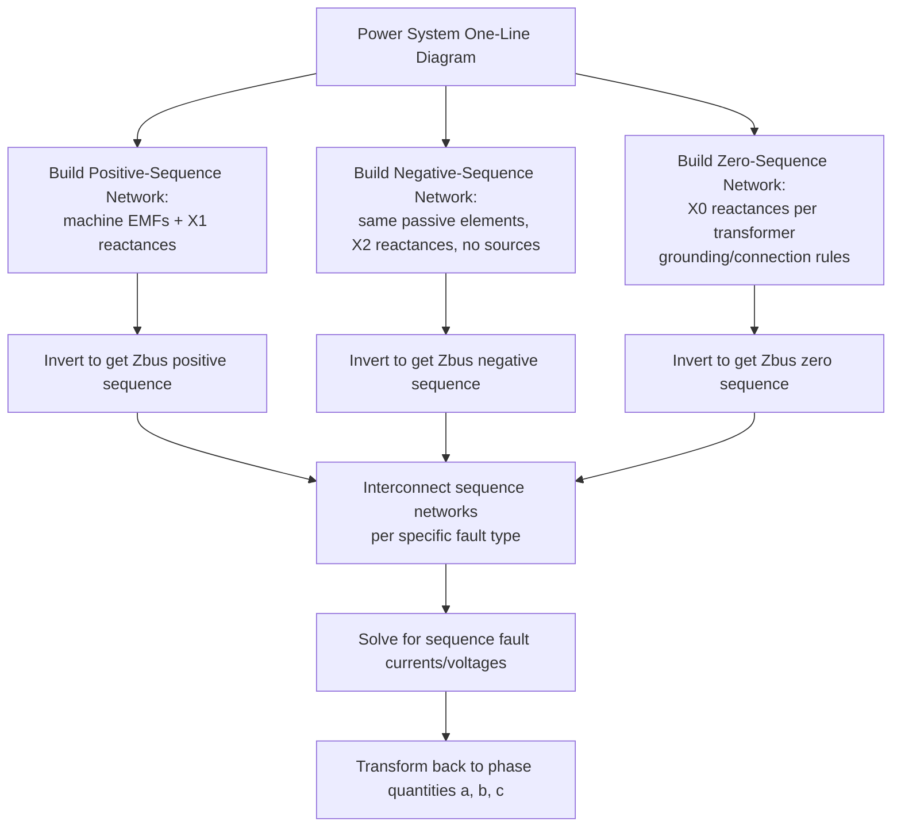

## Symmetrical Component Sequence Networks

### Overview

Symmetrical component theory decomposes any unbalanced set of three-phase phasors — voltages or currents — into three balanced sequence sets: positive, negative, and zero sequence. This transformation converts an otherwise intractable unbalanced three-phase network problem into three independent, single-phase sequence networks that can each be solved using the same Thevenin/Zbus techniques developed for symmetrical faults. Sequence networks are the essential bridge between symmetrical fault analysis and the analysis of unsymmetrical (unbalanced) faults such as line-to-ground, line-to-line, and double-line-to-ground faults.

### The Symmetrical Component Transformation

Any unbalanced set of three-phase phasors $V_a, V_b, V_c$ can be expressed as the sum of three symmetrical sets:

$$V_a = V_a^{(0)} + V_a^{(1)} + V_a^{(2)}$$

$$V_b = V_a^{(0)} + a^2 V_a^{(1)} + a\, V_a^{(2)}$$

$$V_c = V_a^{(0)} + a\, V_a^{(1)} + a^2 V_a^{(2)}$$

where $a = 1\angle120°$ is the complex operator, and the superscripts $(0)$, $(1)$, $(2)$ denote zero-, positive-, and negative-sequence components respectively, all referenced to phase $a$.

The inverse transformation (extracting sequence components from phase quantities) is:

$$V_a^{(0)} = \frac{1}{3}\left(V_a + V_b + V_c\right)$$

$$V_a^{(1)} = \frac{1}{3}\left(V_a + a\,V_b + a^2 V_c\right)$$

$$V_a^{(2)} = \frac{1}{3}\left(V_a + a^2 V_b + a\, V_c\right)$$

In matrix form:

$$\begin{bmatrix} V_a^{(0)} \\ V_a^{(1)} \\ V_a^{(2)} \end{bmatrix} = \frac{1}{3}\begin{bmatrix} 1 & 1 & 1 \\ 1 & a & a^2 \\ 1 & a^2 & a \end{bmatrix}\begin{bmatrix} V_a \\ V_b \\ V_c \end{bmatrix}$$

The identical transformation applies to currents ($I_a$, $I_b$, $I_c$ and their sequence components).

### Physical Interpretation of Each Sequence

**Key Points**

- **Positive sequence** ($V^{(1)}$): three phasors of equal magnitude, $120°$ apart, in the same phase rotation ($a$-$b$-$c$) as the normal system. This is the only sequence present during balanced, normal operation and during balanced three-phase faults.
- **Negative sequence** ($V^{(2)}$): three phasors of equal magnitude, $120°$ apart, but in the *reverse* phase rotation ($a$-$c$-$b$). Negative sequence appears whenever the system is unbalanced (unsymmetrical faults, unbalanced loading, single-phasing) and produces reverse-rotating flux in rotating machines, causing additional heating.
- **Zero sequence** ($V^{(0)}$): three phasors of equal magnitude, all *in phase* with each other (no phase displacement). Zero sequence exists only when there is a path for ground/neutral current to flow (e.g., grounded-wye transformer windings, solidly grounded generators) and is the sequence primarily associated with ground faults.

### Sequence Network Independence for Symmetrical Systems

**Key Points**

- Because power system elements (generators, transformers, transmission lines) are normally designed and constructed to be symmetrical (balanced) in their own internal impedance structure, the positive-, negative-, and zero-sequence networks are electrically *decoupled* from one another under balanced network conditions.
- This decoupling means each sequence network can be analyzed as an independent single-phase circuit, using its own Thevenin/Zbus impedance representation, and the three networks are only connected together (interconnected) at the specific point and in the specific manner dictated by the type of fault or unbalance present.
- [Inference] This independence assumption holds well for the vast majority of practical power system studies; genuinely asymmetrical network elements (e.g., untransposed transmission lines with significant asymmetry, some specialized equipment) can introduce sequence coupling, but this is typically neglected in standard fault studies unless the specific asymmetry is deemed significant enough to model explicitly.

### Positive-Sequence Network

The positive-sequence network is identical to the network used for standard symmetrical (three-phase) fault studies covered under Thevenin equivalent and Zbus methods: generator internal EMFs behind sub-transient/transient/synchronous reactance, transformer leakage impedances, and line series impedances, all referenced to a common reference (neutral) bus.

$$Z_{bus}^{(1)} = \left(Y_{bus}^{(1)}\right)^{-1}$$

This is the only sequence network containing active voltage sources (the machine EMFs), since generators inherently produce only positive-sequence voltage under normal balanced design.

### Negative-Sequence Network

The negative-sequence network has the same topology as the positive-sequence network for passive elements (lines, transformers, cables use the same impedance in both sequences, since these are static, symmetrical devices), but contains **no independent voltage sources** — rotating machines do not generate negative-sequence EMF internally.

**Key Points**

- Synchronous machines present a distinct negative-sequence reactance $X_2$, generally close to the average of $X_d''$ and $X_q''$ (sub-transient reactances in the direct and quadrature axes), because negative-sequence currents induce a doubly-rotating-frequency flux pattern in the rotor.
- Induction motors present negative-sequence impedance approximately equal to their locked-rotor (starting) impedance, since negative-sequence currents effectively appear to the rotor as a doubled-slip condition.
- The negative-sequence network is passive (source-free); it is driven entirely by the negative-sequence voltage/current imposed at the fault point through the interconnection with the other sequence networks.

$$Z_{bus}^{(2)} = \left(Y_{bus}^{(2)}\right)^{-1}$$

### Zero-Sequence Network

The zero-sequence network differs most significantly from the other two, because zero-sequence current requires a physical path to ground/neutral, and this path depends entirely on transformer winding connections and grounding practices.

**Key Points**

- **Grounded-wye windings** provide a path for zero-sequence current to flow to ground and are represented as connected to the reference bus through the winding's zero-sequence impedance (often including any neutral grounding impedance $Z_n$, multiplied by 3 in the equivalent circuit due to the way neutral current relates to zero-sequence current: $I_n = 3I_0$).
- **Delta windings** trap zero-sequence current circulating within the delta (it cannot escape to the line side), effectively presenting an open circuit to zero-sequence flow beyond the delta winding, while still allowing zero-sequence magnetizing current to circulate internally.
- **Ungrounded-wye windings** present an open circuit to zero-sequence current entirely, since there is no neutral path to ground.
- Transmission line zero-sequence impedance is typically significantly higher than positive-sequence impedance (commonly cited as roughly 2 to 3.5 times $Z_1$ for typical overhead lines, though this varies with conductor configuration, ground resistivity, and presence of shield wires), because the zero-sequence current return path involves the earth and/or shield wires rather than balanced phase conductors. [Unverified — exact multiplier is configuration-specific and should be calculated or obtained from line constants data for precise studies.]

$$Z_{bus}^{(0)} = \left(Y_{bus}^{(0)}\right)^{-1}$$

### Standard Zero-Sequence Equivalent Circuits by Transformer Connection

| Winding Connection (Primary–Secondary) | Zero-Sequence Equivalent Circuit Behavior |
| --- | --- |
| Grounded Wye – Grounded Wye | Zero-sequence path exists straight through both sides |
| Grounded Wye – Delta | Zero-sequence path to ground on wye side only; delta blocks transfer to the other side, circulating current within delta |
| Delta – Delta | No zero-sequence path on either side (both blocked) |
| Ungrounded Wye – (any) | No zero-sequence path (open circuit) on the ungrounded wye side |
| Grounded Wye – Grounded Wye (three-winding, with tertiary delta) | Additional zero-sequence path in parallel through tertiary delta magnetizing branch |

[Inference] These are the standard textbook equivalent circuit topologies; specific per-unit zero-sequence impedance values for transformers should be obtained from nameplate data or manufacturer test reports, as they are not simply derivable from the positive-sequence impedance alone.

### SVG Diagram: Three Sequence Networks

<svg xmlns="http://www.w3.org/2000/svg" viewBox="0 0 680 380" font-family="Helvetica, Arial, sans-serif">
<text x="180" y="24" font-size="16" font-weight="bold" fill="#1a1a1a">Positive, Negative, Zero Sequence Networks (svg_diagram)</text>

<rect x="30" y="55" width="190" height="280" fill="none" stroke="#0057b7" stroke-width="2" rx="8" />
<text x="125" y="80" font-size="13" text-anchor="middle" fill="#0057b7" font-weight="bold">Positive Sequence</text>
<circle cx="90" cy="130" r="18" fill="none" stroke="#0057b7" stroke-width="2" />
<line x1="90" y1="115" x2="90" y2="145" stroke="#0057b7" stroke-width="2" />
<text x="90" y="160" font-size="10" text-anchor="middle" fill="#0057b7">E (EMF source)</text>
<line x1="108" y1="130" x2="150" y2="130" stroke="#333" stroke-width="2" />
<rect x="150" y="120" width="35" height="20" fill="none" stroke="#333" stroke-width="2" />
<text x="167" y="115" font-size="9" text-anchor="middle" fill="#333">Z1</text>
<line x1="185" y1="130" x2="200" y2="130" stroke="#333" stroke-width="2" />
<circle cx="200" cy="130" r="5" fill="#d62728" />
<text x="200" y="225" font-size="11" text-anchor="middle" fill="#1a1a1a">N1 (fault bus)</text>
<line x1="200" y1="135" x2="200" y2="200" stroke="#333" stroke-width="2" stroke-dasharray="4,3" />
<text x="125" y="300" font-size="10" text-anchor="middle" fill="#333">Contains EMF sources</text>
<text x="125" y="315" font-size="10" text-anchor="middle" fill="#333">Same topology as</text>
<text x="125" y="330" font-size="10" text-anchor="middle" fill="#333">symmetrical fault network</text>

<rect x="245" y="55" width="190" height="280" fill="none" stroke="#2ca02c" stroke-width="2" rx="8" />
<text x="340" y="80" font-size="13" text-anchor="middle" fill="#2ca02c" font-weight="bold">Negative Sequence</text>
<line x1="305" y1="130" x2="305" y2="130" stroke="#2ca02c" stroke-width="2" />
<line x1="270" y1="200" x2="270" y2="130" stroke="#2ca02c" stroke-width="2" />
<line x1="270" y1="130" x2="330" y2="130" stroke="#333" stroke-width="2" />
<rect x="330" y="120" width="35" height="20" fill="none" stroke="#333" stroke-width="2" />
<text x="347" y="115" font-size="9" text-anchor="middle" fill="#333">Z2</text>
<line x1="365" y1="130" x2="380" y2="130" stroke="#333" stroke-width="2" />
<circle cx="380" cy="130" r="5" fill="#d62728" />
<text x="380" y="225" font-size="11" text-anchor="middle" fill="#1a1a1a">N2 (fault bus)</text>
<line x1="380" y1="135" x2="380" y2="200" stroke="#333" stroke-width="2" stroke-dasharray="4,3" />
<text x="340" y="300" font-size="10" text-anchor="middle" fill="#333">No EMF sources</text>
<text x="340" y="315" font-size="10" text-anchor="middle" fill="#333">(passive network)</text>
<text x="340" y="330" font-size="10" text-anchor="middle" fill="#333">Same lines/xfmr topology</text>

<rect x="460" y="55" width="190" height="280" fill="none" stroke="#d62728" stroke-width="2" rx="8" />
<text x="555" y="80" font-size="13" text-anchor="middle" fill="#d62728" font-weight="bold">Zero Sequence</text>
<line x1="490" y1="200" x2="490" y2="130" stroke="#d62728" stroke-width="2" />
<line x1="490" y1="130" x2="550" y2="130" stroke="#333" stroke-width="2" />
<rect x="550" y="120" width="35" height="20" fill="none" stroke="#333" stroke-width="2" />
<text x="567" y="115" font-size="9" text-anchor="middle" fill="#333">Z0</text>
<line x1="585" y1="130" x2="600" y2="130" stroke="#333" stroke-width="2" />
<circle cx="600" cy="130" r="5" fill="#d62728" />
<text x="600" y="225" font-size="11" text-anchor="middle" fill="#1a1a1a">N0 (fault bus)</text>
<line x1="600" y1="135" x2="600" y2="200" stroke="#333" stroke-width="2" stroke-dasharray="4,3" />
<text x="555" y="300" font-size="10" text-anchor="middle" fill="#333">Topology depends on</text>
<text x="555" y="315" font-size="10" text-anchor="middle" fill="#333">transformer grounding</text>
<text x="555" y="330" font-size="10" text-anchor="middle" fill="#333">and winding connections</text>
</svg>

### Building Each Sequence Zbus Independently

### Generic Interconnection Concept (Preview of Unbalanced Fault Analysis)

While the specific interconnection pattern differs by fault type (covered in dedicated unbalanced fault topics), the general principle is that at the fault point, boundary conditions dictated by the physical fault (e.g., "phase $a$ voltage is zero for a line-to-ground fault," or "phase $b$ and $c$ currents are equal and opposite for a line-to-line fault") translate into specific series or parallel connections between the positive-, negative-, and zero-sequence Thevenin equivalents at that bus.

**Example (conceptual, single-line-to-ground fault):**

For a bolted single-line-to-ground fault on phase $a$ at bus $k$, the standard sequence network interconnection is a **series connection** of all three sequence networks' Thevenin impedances at bus $k$:

$$I_a^{(1)} = I_a^{(2)} = I_a^{(0)} = \frac{V_{a}^{(0),pre-fault}}{Z_{kk}^{(1)} + Z_{kk}^{(2)} + Z_{kk}^{(0)} + 3Z_f}$$

This equation is introduced here only to illustrate *why* having independently-built sequence Zbus matrices is the essential prerequisite; the full derivation and interconnection diagrams for each unbalanced fault type are developed in their own dedicated topics.

### Sequence Impedance Value Ranges (Typical Order-of-Magnitude Reference)

| Element | $Z_1$ (positive) | $Z_2$ (negative) | $Z_0$ (zero) |
| --- | --- | --- | --- |
| Synchronous generator | $X_d''$ (0.07–0.20 pu) | ≈ $X_2$, close to $X_d''$ | Typically lower than $X_1$; highly design-dependent |
| Transformer (two-winding) | Leakage reactance | Equal to $Z_1$ | Equal to $Z_1$ if both sides grounded wye; otherwise open/blocked per connection |
| Transmission line | Series impedance | Equal to $Z_1$ | Roughly 2–3.5× $Z_1$ (typical overhead line) |
| Induction motor | Locked-rotor impedance | ≈ equal to $Z_1$ (locked-rotor) | N/A (motors typically not grounded-wye connected to system) |

[Unverified] These ranges are broadly illustrative and vary considerably by specific equipment design, voltage class, and construction; actual sequence impedance values for a specific study must come from manufacturer data, nameplate information, or standard line-constant calculations rather than the generic ranges shown.

### Common Pitfalls

- **Assuming negative-sequence impedance equals positive-sequence impedance for synchronous machines**, which is a reasonable approximation for static equipment (lines, transformers) but is generally inaccurate for rotating machines, where $X_2$ differs from $X_1$ due to the double-frequency rotor flux pattern induced by negative-sequence currents.
- **Forgetting the factor of 3 relating neutral current to zero-sequence current** ($I_n = 3I_0$) when incorporating neutral grounding impedance into the zero-sequence network, leading to a threefold error in the grounding impedance term.
- **Misapplying transformer zero-sequence blocking rules**, particularly forgetting that a delta winding blocks zero-sequence transfer to the other side while still allowing circulating zero-sequence current within the delta itself.
- **Applying a single generic zero-sequence-to-positive-sequence impedance ratio** for transmission lines without accounting for the specific conductor configuration, tower geometry, ground resistivity, and shield wire presence, which materially affects the actual ratio. [Inference]
- **Attempting sequence network coupling** where none is warranted (assuming full decoupling always holds) on genuinely asymmetrical elements without checking whether the asymmetry is significant enough to require explicit modeling. [Inference]

### Conclusion

Symmetrical component sequence networks decompose the intractable unbalanced fault problem into three independently solvable single-phase networks, each with its own distinct physical character: positive sequence carries the machine EMFs and mirrors the standard symmetrical fault network, negative sequence is a passive mirror of positive sequence with machine-specific reactance differences, and zero sequence is fundamentally shaped by transformer grounding and winding connections. Building each sequence's Zbus matrix independently is the essential prerequisite step before applying the fault-specific interconnection rules that yield unbalanced fault currents and voltages.

**Related Topics**

- Thevenin Equivalent Fault Calculations
- Zbus Method for Fault Analysis
- Single Line-to-Ground Fault Analysis
- Line-to-Line Fault Analysis
- Double Line-to-Ground Fault Analysis
- Transformer Zero-Sequence Equivalent Circuits by Connection Type
- Transmission Line Zero-Sequence Impedance Calculation
- Neutral Grounding Methods and Grounding Impedance
- Negative-Sequence Heating Effects on Rotating Machines
- Sequence Network Interconnection Diagrams for Fault Types