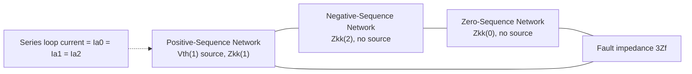

## Single Line-to-Ground Fault Analysis

### Overview

The single line-to-ground (SLG) fault — one phase conductor contacting ground or a grounded structure — is the most common fault type on power systems, accounting for the large majority of faults on overhead transmission and distribution networks. Unlike the balanced three-phase fault, an SLG fault is inherently unbalanced and requires all three sequence networks (positive, negative, and zero) interconnected together to solve for fault current and post-fault voltages, building directly on the sequence network framework.

### Physical Description and Boundary Conditions

Consider a bolted (zero fault impedance) SLG fault on phase $a$ at bus $k$. The physical fault imposes two boundary conditions at the fault point:

$$V_a = 0$$

$$I_b = 0, \quad I_c = 0$$

Phase $a$ voltage collapses to zero (ground potential) at the fault point, while no fault current flows in the unfaulted phases $b$ and $c$ — all fault current returns to the source through phase $a$ and the ground/earth return path.

### Deriving the Sequence Current Relationship

Applying the symmetrical component transformation to the boundary condition $I_b = I_c = 0$:

$$I_a^{(0)} = \frac{1}{3}(I_a + I_b + I_c) = \frac{1}{3}I_a$$

$$I_a^{(1)} = \frac{1}{3}(I_a + a\,I_b + a^2 I_c) = \frac{1}{3}I_a$$

$$I_a^{(2)} = \frac{1}{3}(I_a + a^2 I_b + a\, I_c) = \frac{1}{3}I_a$$

Since $I_b = I_c = 0$, all three sequence current expressions reduce to the same value:

$$I_a^{(0)} = I_a^{(1)} = I_a^{(2)} = \frac{I_a}{3}$$

This equality of all three sequence currents is the defining signature of an SLG fault and is what dictates a **series connection** of the three sequence networks at the fault point.

### Applying the Voltage Boundary Condition

The voltage condition $V_a = 0$ expressed in terms of sequence voltages:

$$V_a = V_a^{(0)} + V_a^{(1)} + V_a^{(2)} = 0$$

Combined with the standard sequence network relationships (each sequence network expressed as its own Thevenin source and impedance driven by the sequence current flowing into the fault):

$$V_a^{(1)} = V_{th}^{(1)} - Z_{kk}^{(1)} I_a^{(1)}$$

$$V_a^{(2)} = 0 - Z_{kk}^{(2)} I_a^{(2)}$$

$$V_a^{(0)} = 0 - Z_{kk}^{(0)} I_a^{(0)} - 3Z_f I_a^{(0)}$$

where $V_{th}^{(1)}$ is the pre-fault positive-sequence voltage (commonly $1.0\angle0°$ pu), $Z_{kk}^{(1)}$, $Z_{kk}^{(2)}$, $Z_{kk}^{(0)}$ are the driving-point (Thevenin) impedances of each sequence network at the fault bus, and $Z_f$ is any fault impedance (zero for a bolted fault). Substituting and using $I_a^{(0)} = I_a^{(1)} = I_a^{(2)}$:

$$V_{th}^{(1)} - I_a^{(1)}\left(Z_{kk}^{(1)} + Z_{kk}^{(2)} + Z_{kk}^{(0)} + 3Z_f\right) = 0$$

### The SLG Fault Current Equation

Solving for the sequence current:

$$I_a^{(0)} = I_a^{(1)} = I_a^{(2)} = \frac{V_{th}^{(1)}}{Z_{kk}^{(1)} + Z_{kk}^{(2)} + Z_{kk}^{(0)} + 3Z_f}$$

The actual physical fault current in phase $a$ (the total current flowing into the fault) is:

$$I_a = 3 I_a^{(0)} = \frac{3\,V_{th}^{(1)}}{Z_{kk}^{(1)} + Z_{kk}^{(2)} + Z_{kk}^{(0)} + 3Z_f}$$

This is the single most important formula in unbalanced fault analysis: the SLG fault current depends on the **sum** of all three sequence impedances, in contrast to the three-phase symmetrical fault, which depends only on the positive-sequence impedance.

### Sequence Network Interconnection Diagram

**Key Points**

- Physically, the interconnection places the positive-, negative-, and zero-sequence Thevenin networks in **series**, with the loop closed through the fault impedance $3Z_f$.
- Current $I_a^{(1)} = I_a^{(2)} = I_a^{(0)}$ circulates around this single series loop, consistent with the derived equality of the three sequence currents.
- Only the positive-sequence network contains the driving EMF source ($V_{th}^{(1)}$); the negative- and zero-sequence networks are passive and are driven purely by this series-loop current.

### SVG Diagram: SLG Fault Sequence Network Interconnection

<svg xmlns="http://www.w3.org/2000/svg" viewBox="0 0 680 300" font-family="Helvetica, Arial, sans-serif">
<text x="150" y="24" font-size="16" font-weight="bold" fill="#1a1a1a">SLG Fault: Series Sequence Network Connection (svg_diagram)</text>

<rect x="40" y="90" width="150" height="90" fill="none" stroke="#0057b7" stroke-width="2" rx="6" />
<text x="115" y="110" font-size="12" text-anchor="middle" fill="#0057b7" font-weight="bold">Positive Seq.</text>
<circle cx="80" cy="140" r="14" fill="none" stroke="#0057b7" stroke-width="2" />
<line x1="80" y1="130" x2="80" y2="150" stroke="#0057b7" stroke-width="2" />
<text x="80" y="165" font-size="9" text-anchor="middle" fill="#0057b7">Vth(1)</text>
<rect x="120" y="132" width="30" height="16" fill="none" stroke="#333" stroke-width="2" />
<text x="135" y="128" font-size="9" text-anchor="middle" fill="#333">Z1</text>

<line x1="190" y1="140" x2="250" y2="140" stroke="#333" stroke-width="2" />

<rect x="250" y="90" width="150" height="90" fill="none" stroke="#2ca02c" stroke-width="2" rx="6" />
<text x="325" y="110" font-size="12" text-anchor="middle" fill="#2ca02c" font-weight="bold">Negative Seq.</text>
<rect x="290" y="132" width="30" height="16" fill="none" stroke="#333" stroke-width="2" />
<text x="305" y="128" font-size="9" text-anchor="middle" fill="#333">Z2</text>
<line x1="270" y1="140" x2="290" y2="140" stroke="#333" stroke-width="2" />
<line x1="320" y1="140" x2="360" y2="140" stroke="#333" stroke-width="2" />
<line x1="400" y1="140" x2="460" y2="140" stroke="#333" stroke-width="2" />

<rect x="460" y="90" width="150" height="90" fill="none" stroke="#d62728" stroke-width="2" rx="6" />
<text x="535" y="110" font-size="12" text-anchor="middle" fill="#d62728" font-weight="bold">Zero Seq.</text>
<rect x="500" y="132" width="30" height="16" fill="none" stroke="#333" stroke-width="2" />
<text x="515" y="128" font-size="9" text-anchor="middle" fill="#333">Z0</text>
<line x1="480" y1="140" x2="500" y2="140" stroke="#333" stroke-width="2" />
<line x1="530" y1="140" x2="570" y2="140" stroke="#333" stroke-width="2" />

<line x1="80" y1="154" x2="80" y2="240" stroke="#333" stroke-width="2" />
<line x1="80" y1="240" x2="300" y2="240" stroke="#333" stroke-width="2" />
<rect x="300" y="230" width="50" height="20" fill="none" stroke="#333" stroke-width="2" />
<text x="325" y="225" font-size="10" text-anchor="middle" fill="#333">3Zf</text>
<line x1="350" y1="240" x2="570" y2="240" stroke="#333" stroke-width="2" />
<line x1="570" y1="240" x2="570" y2="154" stroke="#333" stroke-width="2" />

<text x="325" y="270" font-size="11" text-anchor="middle" fill="`#1a1a1a`">Series loop current: Ia0 = Ia1 = Ia2</text>

</svg>

### Reconstructing Phase Quantities

Once the sequence currents and voltages are found, they are transformed back to actual phase values using the standard symmetrical component reconstruction:

$$I_a = I_a^{(0)} + I_a^{(1)} + I_a^{(2)} = 3I_a^{(0)}$$

$$I_b = I_a^{(0)} + a^2 I_a^{(1)} + a\, I_a^{(2)} = 0 \quad \text{(confirms boundary condition)}$$

$$I_c = I_a^{(0)} + a\, I_a^{(1)} + a^2 I_a^{(2)} = 0 \quad \text{(confirms boundary condition)}$$

$$V_a = V_a^{(0)} + V_a^{(1)} + V_a^{(2)} = 0 \quad \text{(confirms boundary condition)}$$

$$V_b = V_a^{(0)} + a^2 V_a^{(1)} + a\, V_a^{(2)}$$

$$V_c = V_a^{(0)} + a\, V_a^{(1)} + a^2 V_a^{(2)}$$

The unfaulted-phase voltages $V_b$ and $V_c$ generally rise above their normal pre-fault magnitude during an SLG fault on an ungrounded or high-impedance-grounded system, a phenomenon of direct relevance to insulation coordination and ground fault overvoltage studies. [Inference] The degree of this overvoltage rise depends strongly on the system's grounding method (solidly grounded vs. resistance/reactance grounded vs. ungrounded), which shapes $Z_{kk}^{(0)}$.

### Worked Numerical Example

**Example**

At a 34.5 kV bus, the sequence Thevenin impedances (per unit, on a 50 MVA base) are:

$$Z_{kk}^{(1)} = j0.10\ \text{pu}, \quad Z_{kk}^{(2)} = j0.12\ \text{pu}, \quad Z_{kk}^{(0)} = j0.25\ \text{pu}$$

Pre-fault voltage $V_{th}^{(1)} = 1.0\angle0°$ pu; bolted fault ($Z_f = 0$).

**Step 1 — Sequence current:**

$$I_a^{(1)} = I_a^{(2)} = I_a^{(0)} = \frac{1.0}{j0.10+j0.12+j0.25} = \frac{1.0}{j0.47} = -j2.128\ \text{pu}$$

**Step 2 — Total fault current in phase a:**

$$I_a = 3 \times (-j2.128) = -j6.383\ \text{pu}$$

**Step 3 — Convert to amperes** with $I_{base} = \dfrac{50\times10^6}{\sqrt{3}\times34{,}500} \approx 837$ A:

$$I_a \approx 6.383 \times 837 \approx 5343\ \text{A}$$

**Comparison to a three-phase fault at the same bus** (using $Z_{kk}^{(1)}$ alone, $I_{3\phi}'' = 1.0/0.10 = 10.0$ pu): the SLG fault current (6.38 pu) is lower than the three-phase fault current (10.0 pu) at this bus — a common outcome when $Z_{kk}^{(0)}$ is significantly larger than $Z_{kk}^{(1)}$, though the reverse can occur on solidly grounded systems close to a grounding source where $Z_{kk}^{(0)}$ is small. [Inference]

### Effect of Neutral Grounding Impedance

If the system neutral is grounded through an impedance $Z_n$ (resistance or reactance grounding) rather than solidly, this impedance enters the zero-sequence network multiplied by 3 (reflecting the fact that neutral current equals $3I_0$):

$$Z_{kk}^{(0),effective} = Z_{kk}^{(0),network} + 3Z_n$$

**Key Points**

- **Solidly grounded systems** ($Z_n = 0$): tend to produce the highest SLG fault currents relative to three-phase fault current at that bus, since $Z_{kk}^{(0)}$ is not artificially inflated.
- **Resistance-grounded systems**: deliberately insert $Z_n$ to limit SLG fault current magnitude, commonly used in industrial distribution systems to reduce equipment damage and step/touch voltage hazards.
- **Ungrounded or high-impedance-grounded systems**: $Z_{kk}^{(0)}$ becomes very large (approaching infinite for a truly isolated neutral), driving SLG fault current toward a small value dominated by system capacitance to ground rather than the simple inductive network model shown here. [Inference] Truly ungrounded system fault behavior is dominated by distributed shunt capacitance to ground, which the simplified series-impedance-only sequence network in this analysis does not capture; specialized ground-fault-current calculation methods accounting for system charging capacitance are used for such systems.

### Relationship to Ground Fault Protection

The SLG fault current equation directly underlies ground fault (zero-sequence) protective relaying:

- **Residually connected ground overcurrent relays** measure $3I_0$ (via a residual CT connection or a dedicated zero-sequence CT), directly sensing the quantity derived here.
- **Ground fault current magnitude and sensitivity** are strongly influenced by grounding method: solidly grounded systems allow sensitive, fast ground fault detection because fault current is high and well-defined, whereas high-impedance grounded systems require more sensitive relaying schemes (or alarm-only philosophies) because fault current is deliberately limited to low values.

### Common Pitfalls

- **Forgetting the factor of 3** when relating sequence current $I_a^{(0)}$ to actual phase fault current $I_a$, or when relating neutral grounding impedance $Z_n$ to its zero-sequence network representation $3Z_n$ — both are frequent sources of calculation error.
- **Using positive-sequence impedance alone** (as in three-phase fault analysis) for SLG fault studies, which produces an incorrect result since SLG fault current depends on the sum of all three sequence impedances.
- **Neglecting zero-sequence mutual coupling between parallel transmission lines** sharing a right-of-way, which can meaningfully affect $Z_{kk}^{(0)}$ and thus SLG fault current on double-circuit lines. [Inference]
- **Applying the standard bolted zero-sequence network model to ungrounded systems** without recognizing that system capacitance, not just inductive network impedance, governs actual ground fault current on such systems. [Inference]
- **Mixing sequence impedance bases** (using positive-sequence machine reactance in place of the machine's actual negative-sequence reactance $X_2$), producing inaccurate results for negative-sequence-sensitive equipment behavior.

### Conclusion

Single line-to-ground fault analysis extends symmetrical component theory into practical fault current calculation by imposing the physical boundary conditions of a one-phase-to-ground fault, which mathematically force the positive-, negative-, and zero-sequence networks into a series interconnection. The resulting fault current formula, $I_a = 3V_{th}^{(1)}/(Z_1+Z_2+Z_0+3Z_f)$, is foundational to ground fault protection design, grounding system engineering, and insulation coordination studies, and its dependence on all three sequence impedances — rather than positive sequence alone — is what fundamentally distinguishes unbalanced fault analysis from the symmetrical three-phase case.

**Related Topics**

- Symmetrical Component Sequence Networks
- Line-to-Line Fault Analysis
- Double Line-to-Ground Fault Analysis
- Neutral Grounding Methods (Solid, Resistance, Reactance, Ungrounded)
- Ground Fault Protective Relaying (Residual and Zero-Sequence CT Schemes)
- Zero-Sequence Impedance of Transmission Lines and Transformers
- Transient Overvoltage on Unfaulted Phases During Ground Faults
- Zbus Method for Fault Analysis
- Mutual Coupling Between Parallel Transmission Lines
- Insulation Coordination and System Grounding Practice