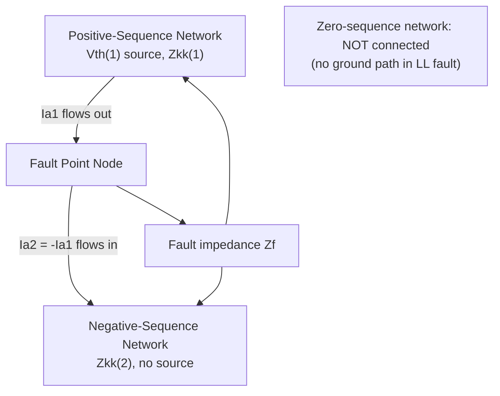

## Line-to-Line Fault Analysis

### Overview

The line-to-line (LL) fault — a direct short circuit between two phase conductors without ground involvement — is the second most common unbalanced fault type on power systems. Unlike the single line-to-ground fault, an LL fault involves only the positive- and negative-sequence networks; the zero-sequence network plays no role because no path to ground is involved and no zero-sequence current can flow. This makes LL fault analysis structurally simpler than SLG analysis while still requiring the full symmetrical component framework.

### Physical Description and Boundary Conditions

Consider a bolted LL fault between phases $b$ and $c$ at bus $k$ (phase $a$ is chosen as the reference/healthy phase by convention, since the symmetrical component transformation is defined relative to phase $a$). The physical fault imposes:

$$I_a = 0$$

$$V_b = V_c$$

$$I_b = -I_c$$

No current flows in the unfaulted phase $a$; the two faulted phases are shorted together (equal voltage) and carry equal-magnitude, opposite-direction current between them.

### Deriving the Sequence Relationships

**Current boundary conditions.** Applying the symmetrical component transformation with $I_a = 0$ and $I_b = -I_c$:

$$I_a^{(0)} = \frac{1}{3}(I_a + I_b + I_c) = \frac{1}{3}(0 + I_b - I_b) = 0$$

Zero-sequence current is absent entirely, confirming that the zero-sequence network is not involved in an LL fault.

$$I_a^{(1)} = \frac{1}{3}(I_a + a\,I_b + a^2 I_c) = \frac{1}{3}(a - a^2)I_b$$

$$I_a^{(2)} = \frac{1}{3}(I_a + a^2 I_b + a\, I_c) = \frac{1}{3}(a^2 - a)I_b$$

Since $(a - a^2) = -(a^2-a)$, this yields the defining relationship:

$$I_a^{(1)} = -I_a^{(2)}$$

**Voltage boundary condition.** From $V_b = V_c$, applying the inverse transformation and subtracting:

$$V_b - V_c = (a^2-a)V_a^{(1)} + (a-a^2)V_a^{(2)} = (a^2-a)\left(V_a^{(1)} - V_a^{(2)}\right) = 0$$

Since $(a^2-a) \neq 0$, this requires:

$$V_a^{(1)} = V_a^{(2)}$$

### The Sequence Network Interconnection: Parallel Connection

The two derived relationships — $I_a^{(1)} = -I_a^{(2)}$ and $V_a^{(1)} = V_a^{(2)}$ — together describe a **parallel connection** between the positive- and negative-sequence networks at the fault bus, with the zero-sequence network entirely excluded from the circuit.

### Deriving the LL Fault Current Equation

With $I_a^{(1)} = -I_a^{(2)}$ and $V_a^{(1)} = V_a^{(2)}$, and using the standard sequence network Thevenin relationships:

$$V_a^{(1)} = V_{th}^{(1)} - Z_{kk}^{(1)} I_a^{(1)}$$

$$V_a^{(2)} = -Z_{kk}^{(2)} I_a^{(2)} = Z_{kk}^{(2)} I_a^{(1)}$$

Setting these equal (per the voltage boundary condition) and including fault impedance $Z_f$ between the two faulted phases:

$$V_{th}^{(1)} - Z_{kk}^{(1)} I_a^{(1)} = Z_{kk}^{(2)} I_a^{(1)} + Z_f I_a^{(1)}$$

Solving for the positive-sequence fault current:

$$I_a^{(1)} = \frac{V_{th}^{(1)}}{Z_{kk}^{(1)} + Z_{kk}^{(2)} + Z_f}$$

$$I_a^{(2)} = -I_a^{(1)} = \frac{-V_{th}^{(1)}}{Z_{kk}^{(1)} + Z_{kk}^{(2)} + Z_f}$$

### Physical Phase Fault Current

Transforming back to phase quantities using $I_a = I_a^{(0)} + I_a^{(1)} + I_a^{(2)} = 0$ (confirmed) and computing $I_b$:

$$I_b = I_a^{(0)} + a^2 I_a^{(1)} + a\, I_a^{(2)} = a^2 I_a^{(1)} - a\, I_a^{(1)} = (a^2-a)I_a^{(1)}$$

Since $(a^2 - a) = -j\sqrt{3}$, this gives:

$$I_b = -j\sqrt{3}\, I_a^{(1)} = \frac{-j\sqrt{3}\,V_{th}^{(1)}}{Z_{kk}^{(1)}+Z_{kk}^{(2)}+Z_f}$$

$$I_c = -I_b$$

**Magnitude comparison to three-phase fault:** if $Z_{kk}^{(1)} \approx Z_{kk}^{(2)}$ (a common approximation for static network elements, though not for rotating machines), the LL fault current magnitude is approximately:

$$|I_b|_{LL} = \sqrt{3}\,|I_a^{(1)}| \approx \sqrt{3} \times \frac{V_{th}^{(1)}}{2Z_{kk}^{(1)}} = \frac{\sqrt{3}}{2}\times\frac{V_{th}^{(1)}}{Z_{kk}^{(1)}} \approx 0.866 \times I_{3\phi}''$$

This is the well-known approximate rule of thumb that **LL fault current is roughly 86.6% of the three-phase symmetrical fault current** at the same bus, valid specifically under the approximation $Z_{kk}^{(1)} \approx Z_{kk}^{(2)}$. [Inference] This 86.6% figure is a commonly cited approximation rather than an exact universal result; it depends on how closely $Z_{kk}^{(2)}$ actually matches $Z_{kk}^{(1)}$ at the specific bus, which in turn depends on the mix of static versus rotating equipment contributing to the fault.

### SVG Diagram: LL Fault Sequence Network Interconnection

<svg xmlns="http://www.w3.org/2000/svg" viewBox="0 0 640 300" font-family="Helvetica, Arial, sans-serif">
<text x="150" y="24" font-size="16" font-weight="bold" fill="#1a1a1a">LL Fault: Parallel Sequence Network Connection (svg_diagram)</text>

<rect x="60" y="70" width="180" height="110" fill="none" stroke="#0057b7" stroke-width="2" rx="6" />
<text x="150" y="92" font-size="12" text-anchor="middle" fill="#0057b7" font-weight="bold">Positive Sequence</text>
<circle cx="100" cy="140" r="16" fill="none" stroke="#0057b7" stroke-width="2" />
<line x1="100" y1="128" x2="100" y2="152" stroke="#0057b7" stroke-width="2" />
<text x="100" y="168" font-size="9" text-anchor="middle" fill="#0057b7">Vth(1)</text>
<rect x="140" y="130" width="35" height="20" fill="none" stroke="#333" stroke-width="2" />
<text x="157" y="125" font-size="9" text-anchor="middle" fill="#333">Z1</text>
<line x1="175" y1="140" x2="220" y2="140" stroke="#333" stroke-width="2" />

<line x1="220" y1="140" x2="340" y2="140" stroke="#333" stroke-width="2" />
<circle cx="340" cy="140" r="6" fill="#d62728" />
<text x="340" y="120" font-size="11" text-anchor="middle" fill="#d62728">Fault node N</text>

<rect x="400" y="70" width="180" height="110" fill="none" stroke="#2ca02c" stroke-width="2" rx="6" />
<text x="490" y="92" font-size="12" text-anchor="middle" fill="#2ca02c" font-weight="bold">Negative Sequence</text>
<rect x="440" y="130" width="35" height="20" fill="none" stroke="#333" stroke-width="2" />
<text x="457" y="125" font-size="9" text-anchor="middle" fill="#333">Z2</text>
<line x1="340" y1="140" x2="440" y2="140" stroke="#333" stroke-width="2" />
<line x1="475" y1="140" x2="560" y2="140" stroke="#333" stroke-width="2" />
<line x1="560" y1="140" x2="560" y2="180" stroke="#333" stroke-width="2" />

<line x1="100" y1="152" x2="100" y2="220" stroke="#0057b7" stroke-width="2" />
<line x1="100" y1="220" x2="280" y2="220" stroke="#333" stroke-width="2" />
<rect x="280" y="210" width="40" height="20" fill="none" stroke="#333" stroke-width="2" />
<text x="300" y="205" font-size="9" text-anchor="middle" fill="#333">Zf</text>
<line x1="320" y1="220" x2="560" y2="220" stroke="#333" stroke-width="2" />
<line x1="560" y1="220" x2="560" y2="180" stroke="#333" stroke-width="2" />

<text x="330" y="260" font-size="11" text-anchor="middle" fill="`#1a1a1a`">Ia1 = -Ia2, circulating between the two networks</text>

<text x="330" y="278" font-size="11" text-anchor="middle" fill="`#1a1a1a`">Zero-sequence network: excluded (open)</text>

</svg>

### Worked Numerical Example

**Example**

At a 13.8 kV industrial bus, sequence Thevenin impedances (per unit, 25 MVA base) are:

$$Z_{kk}^{(1)} = j0.15\ \text{pu}, \quad Z_{kk}^{(2)} = j0.17\ \text{pu}$$

Pre-fault voltage $V_{th}^{(1)} = 1.0\angle0°$ pu; bolted fault ($Z_f = 0$) between phases $b$ and $c$.

**Step 1 — Positive-sequence current:**

$$I_a^{(1)} = \frac{1.0}{j0.15+j0.17} = \frac{1.0}{j0.32} = -j3.125\ \text{pu}$$

**Step 2 — Negative-sequence current:**

$$I_a^{(2)} = -I_a^{(1)} = j3.125\ \text{pu}$$

**Step 3 — Phase $b$ fault current:**

$$I_b = -j\sqrt{3}\,I_a^{(1)} = -j\sqrt{3}\times(-j3.125) = -\sqrt{3}\times 3.125 = -5.413\ \text{pu}$$

(magnitude 5.413 pu; $I_c = -I_b = 5.413$ pu at $180°$ from $I_b$)

**Step 4 — Convert to amperes** with $I_{base} = \dfrac{25\times10^6}{\sqrt{3}\times13{,}800} \approx 1046$ A:

$$|I_b| \approx 5.413 \times 1046 \approx 5662\ \text{A}$$

**Comparison:** the equivalent three-phase fault current at this bus would be $I_{3\phi}'' = 1.0/0.15 = 6.667$ pu; the LL fault current (5.413 pu) is $5.413/6.667 \approx 0.812$, or about 81.2% of the three-phase value — close to, but not exactly, the 86.6% rule-of-thumb, reflecting the fact that $Z_{kk}^{(2)}$ (0.17 pu) is somewhat larger than $Z_{kk}^{(1)}$ (0.15 pu) at this particular bus.

### Post-Fault Voltage at the Fault Point

The sequence voltages at the fault bus:

$$V_a^{(1)} = V_a^{(2)} = V_{th}^{(1)} - Z_{kk}^{(1)}I_a^{(1)} = 1.0 - (j0.15)(-j3.125) = 1.0 - 0.469 = 0.531\ \text{pu}$$

Transforming to phase voltages (with $V_a^{(0)} = 0$, since no zero-sequence component exists in an LL fault):

$$V_a = V_a^{(0)} + V_a^{(1)} + V_a^{(2)} = 0 + 0.531 + 0.531 = 1.062\ \text{pu}$$

$$V_b = V_c = V_a^{(0)} + a^2V_a^{(1)} + a\,V_a^{(2)} = (a^2+a)(0.531) = -0.531\ \text{pu}$$

(using $a^2 + a = -1$), confirming $V_b = V_c$ as required by the boundary condition. The healthy phase $a$ voltage rises somewhat above 1.0 pu at the fault point in this example, illustrating that unfaulted-phase voltage behavior during unbalanced faults is not simply "unaffected" but shifts according to the specific sequence network values involved. [Inference] The exact magnitude and direction of this shift is case-specific and depends on the relative sizes of $Z_{kk}^{(1)}$ and $Z_{kk}^{(2)}$ at the bus in question.

### Contrast with Other Fault Types

| Fault Type | Sequence Networks Involved | Connection Pattern | Zero-Sequence Role |
| --- | --- | --- | --- |
| Three-phase symmetrical | Positive only | N/A (single network) | None |
| Single line-to-ground | Positive, negative, zero | Series | Essential — determines fault current magnitude |
| Line-to-line | Positive, negative | Parallel | None — entirely excluded |
| Double line-to-ground | Positive, negative, zero | Parallel (negative and zero in parallel, combined in series with positive) | Present but in parallel combination, not simple series |

### Relevance to Protection and System Behavior

**Key Points**

- Because LL faults produce **no zero-sequence current**, ground fault (zero-sequence) protective relays do not respond to line-to-line faults; phase overcurrent or negative-sequence relay elements must be relied upon for LL fault detection.
- LL faults generate substantial **negative-sequence current** ($I_a^{(2)} = -I_a^{(1)}$), which is the basis for negative-sequence protection schemes used to detect unbalanced fault conditions, particularly valuable for detecting faults that phase overcurrent relays might not reliably distinguish from normal load unbalance.
- Rotating machines are particularly sensitive to negative-sequence current because it induces double-system-frequency currents in the rotor, causing rapid, potentially damaging heating; this is why negative-sequence time-overcurrent relaying ($46$ device function) is standard generator protection. [Inference] Specific thermal withstand limits for negative-sequence current are machine-specific and defined by standards such as IEEE Std C50.13 for large synchronous generators.

### Common Pitfalls

- **Assuming $Z_{kk}^{(1)} = Z_{kk}^{(2)}$ universally** to apply the 86.6% rule of thumb, when rotating machines (especially generators near the fault) can have meaningfully different positive- and negative-sequence reactances, making the approximation less accurate near machine-dominated buses.
- **Expecting zero-sequence relays to detect LL faults**, which is a protection coordination error since LL faults produce no zero-sequence current by definition.
- **Confusing phase assignment convention**: the standard LL fault derivation is typically presented for a fault between phases $b$ and $c$ (with $a$ as the healthy reference phase); applying the resulting formulas to a differently labeled fault pair without adjusting the phase reference introduces sign/rotation errors.
- **Neglecting fault impedance $Z_f$** in arcing LL fault studies where the fault is not a bolted metallic short, which can meaningfully reduce calculated fault current relative to the bolted-fault assumption.

### Conclusion

Line-to-line fault analysis demonstrates that not every unbalanced fault type involves the zero-sequence network: because no ground path is present, the physical boundary conditions of an LL fault force only the positive- and negative-sequence networks into a parallel interconnection, yielding a comparatively simpler fault current formula than the SLG case. The resulting emphasis on negative-sequence current makes LL fault behavior the primary driver behind negative-sequence protective relaying practice, distinct from the zero-sequence-based ground fault protection associated with SLG faults.

**Related Topics**

- Symmetrical Component Sequence Networks
- Single Line-to-Ground Fault Analysis
- Double Line-to-Ground Fault Analysis
- Negative-Sequence Protection (Device 46) for Generators
- Zbus Method for Fault Analysis
- Sequence Impedance Differences in Synchronous Machines ($X_1$ vs $X_2$)
- Phase Overcurrent Protection Coordination
- Arc Impedance Modeling in Unbalanced Faults
- Generator Negative-Sequence Thermal Withstand Limits (IEEE C50.13)
- Fault Type Comparison and Screening for Protection Studies