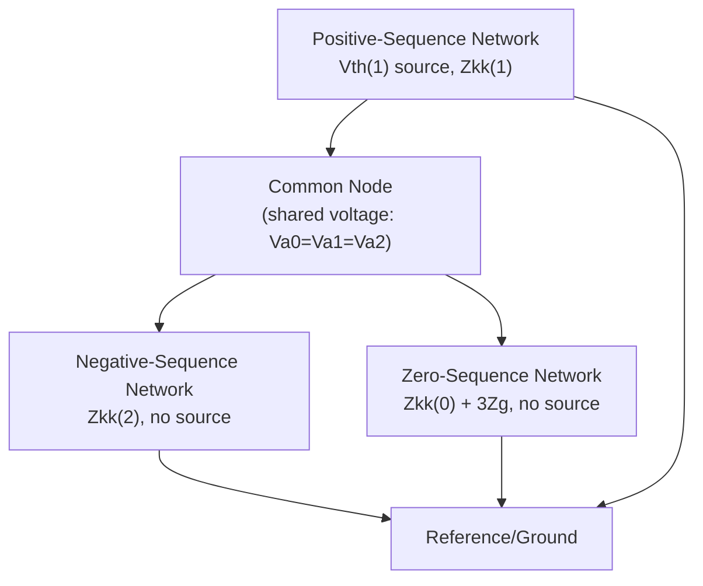

## Double Line-to-Ground Fault Analysis

### Overview

The double line-to-ground (DLG or LLG) fault — two phase conductors simultaneously contacting each other and ground — is the most mathematically involved of the standard unbalanced fault types. It combines characteristics of both the single line-to-ground fault (ground involvement, zero-sequence current present) and the line-to-line fault (two phases shorted together), requiring all three sequence networks interconnected in a combined series-parallel arrangement rather than the simple series or parallel connections seen in SLG and LL faults respectively.

### Physical Description and Boundary Conditions

Consider a bolted DLG fault involving phases $b$ and $c$, both shorted to ground, at bus $k$ (phase $a$ remains the healthy reference phase). The physical fault imposes:

$$I_a = 0$$

$$V_b = 0, \quad V_c = 0$$

No current flows in the healthy phase $a$; both faulted phases collapse to ground potential (zero voltage), while current is free to flow from both faulted phases into the fault and to ground in whatever combination the network dictates.

### Deriving the Sequence Voltage Relationship

Applying the symmetrical component transformation to the voltage boundary conditions $V_b = V_c = 0$:

$$V_a^{(0)} = \frac{1}{3}(V_a + V_b + V_c) = \frac{1}{3}V_a$$

$$V_a^{(1)} = \frac{1}{3}(V_a + a\,V_b + a^2 V_c) = \frac{1}{3}V_a$$

$$V_a^{(2)} = \frac{1}{3}(V_a + a^2 V_b + a\, V_c) = \frac{1}{3}V_a$$

Since $V_b = V_c = 0$, all three sequence voltages reduce to the same value:

$$V_a^{(0)} = V_a^{(1)} = V_a^{(2)} = \frac{V_a}{3}$$

This equality of all three sequence voltages is the defining signature of a DLG fault, dictating a connection where the three sequence networks share a common voltage — implemented as a **parallel connection of all three sequence networks**.

### Current Boundary Condition

The condition $I_a = 0$ translates directly to the sum of sequence currents:

$$I_a = I_a^{(0)} + I_a^{(1)} + I_a^{(2)} = 0$$

This is satisfied automatically by the parallel interconnection of the three sequence networks (since currents flowing into a shared node/loop from three parallel branches driven toward a common voltage naturally sum according to circuit laws) and does not need to be separately enforced as an additional constraint beyond correctly wiring the parallel network.

### The Sequence Network Interconnection: Parallel Combination of All Three

**Key Points**

- The positive-sequence network (containing the source $V_{th}^{(1)}$) connects to a **parallel combination of the negative- and zero-sequence networks**, which in turn are connected together in parallel with each other.
- This differs from the SLG fault (all three in series) and the LL fault (positive and negative only, in parallel, zero excluded) — DLG is the only standard fault type where all three networks appear together in a series-parallel combination.
- Fault impedance $Z_f$ (between the two faulted phases and ground) and ground impedance $Z_g$ (in the ground return path itself) can both be incorporated into the zero-sequence branch as $3Z_g$ terms, analogous to the neutral grounding impedance treatment in SLG fault analysis.

### Deriving the DLG Fault Current Equations

Starting from the sequence network Thevenin relationships, with $V_a^{(0)} = V_a^{(1)} = V_a^{(2)}$:

$$V_a^{(1)} = V_{th}^{(1)} - Z_{kk}^{(1)} I_a^{(1)}$$

$$V_a^{(2)} = -Z_{kk}^{(2)} I_a^{(2)}$$

$$V_a^{(0)} = -\left(Z_{kk}^{(0)} + 3Z_g\right) I_a^{(0)}$$

The positive-sequence current is found by treating the negative- and zero-sequence networks as impedances in **parallel** with each other, and that parallel combination in **series** with the positive-sequence Thevenin impedance:

$$I_a^{(1)} = \frac{V_{th}^{(1)}}{Z_{kk}^{(1)} + \dfrac{Z_{kk}^{(2)}\left(Z_{kk}^{(0)}+3Z_g\right)}{Z_{kk}^{(2)}+Z_{kk}^{(0)}+3Z_g}}$$

Once $I_a^{(1)}$ is known, the negative- and zero-sequence currents are found by current division across the parallel branches:

$$I_a^{(2)} = -I_a^{(1)} \times \frac{Z_{kk}^{(0)}+3Z_g}{Z_{kk}^{(2)}+Z_{kk}^{(0)}+3Z_g}$$

$$I_a^{(0)} = -I_a^{(1)} \times \frac{Z_{kk}^{(2)}}{Z_{kk}^{(2)}+Z_{kk}^{(0)}+3Z_g}$$

(the negative signs on $I_a^{(2)}$ and $I_a^{(0)}$ reflect current flowing away from the common node into the passive branches, consistent with $I_a^{(0)}+I_a^{(1)}+I_a^{(2)}=0$).

### SVG Diagram: DLG Fault Sequence Network Interconnection

<svg xmlns="http://www.w3.org/2000/svg" viewBox="0 0 640 340" font-family="Helvetica, Arial, sans-serif">
<text x="140" y="24" font-size="16" font-weight="bold" fill="#1a1a1a">DLG Fault: Series-Parallel Sequence Connection (svg_diagram)</text>

<rect x="40" y="60" width="170" height="100" fill="none" stroke="#0057b7" stroke-width="2" rx="6" />
<text x="125" y="82" font-size="12" text-anchor="middle" fill="#0057b7" font-weight="bold">Positive Sequence</text>
<circle cx="80" cy="125" r="15" fill="none" stroke="#0057b7" stroke-width="2" />
<line x1="80" y1="113" x2="80" y2="137" stroke="#0057b7" stroke-width="2" />
<text x="80" y="152" font-size="9" text-anchor="middle" fill="#0057b7">Vth(1)</text>
<rect x="120" y="115" width="35" height="20" fill="none" stroke="#333" stroke-width="2" />
<text x="137" y="110" font-size="9" text-anchor="middle" fill="#333">Z1</text>
<line x1="155" y1="125" x2="200" y2="125" stroke="#333" stroke-width="2" />

<line x1="200" y1="125" x2="320" y2="125" stroke="#333" stroke-width="2" />
<circle cx="320" cy="125" r="6" fill="#d62728" />
<text x="320" y="105" font-size="11" text-anchor="middle" fill="#d62728">Node N</text>

<line x1="320" y1="125" x2="450" y2="125" stroke="#333" stroke-width="2" />
<rect x="450" y="70" width="150" height="90" fill="none" stroke="#2ca02c" stroke-width="2" rx="6" />
<text x="525" y="90" font-size="11" text-anchor="middle" fill="#2ca02c" font-weight="bold">Negative Seq.</text>
<rect x="490" y="110" width="35" height="20" fill="none" stroke="#333" stroke-width="2" />
<text x="507" y="105" font-size="9" text-anchor="middle" fill="#333">Z2</text>
<line x1="490" y1="125" x2="470" y2="125" stroke="#333" stroke-width="2" />
<line x1="525" y1="125" x2="560" y2="125" stroke="#333" stroke-width="2" />
<line x1="560" y1="125" x2="560" y2="160" stroke="#333" stroke-width="2" />
<line x1="560" y1="160" x2="320" y2="160" stroke="#333" stroke-width="2" />

<rect x="450" y="190" width="150" height="90" fill="none" stroke="#d62728" stroke-width="2" rx="6" />
<text x="525" y="210" font-size="11" text-anchor="middle" fill="#d62728" font-weight="bold">Zero Seq. (+3Zg)</text>
<rect x="490" y="230" width="35" height="20" fill="none" stroke="#333" stroke-width="2" />
<text x="507" y="225" font-size="9" text-anchor="middle" fill="#333">Z0</text>
<line x1="320" y1="160" x2="320" y2="245" stroke="#333" stroke-width="2" />
<line x1="320" y1="245" x2="490" y2="245" stroke="#333" stroke-width="2" />
<line x1="525" y1="245" x2="560" y2="245" stroke="#333" stroke-width="2" />
<line x1="560" y1="245" x2="560" y2="160" stroke="#333" stroke-width="2" />

<line x1="80" y1="140" x2="80" y2="300" stroke="#0057b7" stroke-width="2" />
<line x1="80" y1="300" x2="560" y2="300" stroke="#333" stroke-width="2" />
<line x1="560" y1="300" x2="560" y2="245" stroke="#333" stroke-width="2" />

<text x="320" y="325" font-size="11" text-anchor="middle" fill="`#1a1a1a`">Va0 = Va1 = Va2 at Node N (shared voltage)</text>

</svg>

### Worked Numerical Example

**Example**

At a 4.16 kV industrial bus, sequence Thevenin impedances (per unit, 10 MVA base) are:

$$Z_{kk}^{(1)} = j0.20\ \text{pu}, \quad Z_{kk}^{(2)} = j0.22\ \text{pu}, \quad Z_{kk}^{(0)} = j0.30\ \text{pu}$$

Pre-fault voltage $V_{th}^{(1)} = 1.0\angle0°$ pu; bolted fault ($Z_g = 0$) between phases $b$, $c$, and ground.

**Step 1 — Parallel combination of negative and zero sequence:**

$$Z_{parallel} = \frac{(j0.22)(j0.30)}{j0.22+j0.30} = \frac{-0.066}{j0.52} = j0.1269\ \text{pu}$$

**Step 2 — Positive-sequence current:**

$$I_a^{(1)} = \frac{1.0}{j0.20+j0.1269} = \frac{1.0}{j0.3269} = -j3.059\ \text{pu}$$

**Step 3 — Current division into negative and zero sequence:**

$$I_a^{(2)} = -(-j3.059)\times\frac{j0.30}{j0.52} = j3.059 \times 0.577 = j1.765\ \text{pu}$$

$$I_a^{(0)} = -(-j3.059)\times\frac{j0.22}{j0.52} = j3.059 \times 0.423 = j1.294\ \text{pu}$$

**Check:** $I_a^{(0)}+I_a^{(1)}+I_a^{(2)} = j1.294 - j3.059 + j1.765 = 0.000$ ✓ (confirms $I_a = 0$ as required)

**Step 4 — Ground fault current** (the current actually flowing into the earth, relevant for ground fault relay sensing) is $3I_a^{(0)}$:

$$I_{ground} = 3 \times 1.294 = 3.882\ \text{pu}$$

**Step 5 — Convert to amperes** with $I_{base} = \dfrac{10\times10^6}{\sqrt{3}\times4160} \approx 1388$ A:

$$I_{ground} \approx 3.882 \times 1388 \approx 5388\ \text{A}$$

### Comparison of Fault Current Magnitudes Across Fault Types

For a given bus, the four fault types generally produce different fault current magnitudes, and their relative ranking depends on the specific ratio of $Z_{kk}^{(0)}$ to $Z_{kk}^{(1)}$ and $Z_{kk}^{(2)}$ at that location.

| Fault Type | General Tendency (relative to 3-phase fault) |
| --- | --- |
| Three-phase symmetrical | Reference (typically the highest, though not universally) |
| Single line-to-ground | Can exceed the three-phase value if $Z_{kk}^{(0)} < Z_{kk}^{(1)}$ (common very near solidly-grounded sources); otherwise lower |
| Line-to-line | Typically around 87% of three-phase value (when $Z_1 \approx Z_2$) |
| Double line-to-ground | Typically between the LL and SLG values, but exact ranking is case-dependent |

[Inference] The common textbook generalization that "three-phase faults produce the highest current" holds in many but not all cases; specifically, an SLG fault can exceed three-phase fault current magnitude when the zero-sequence impedance at the bus is smaller than the positive-sequence impedance, which occurs near solidly grounded generator/transformer neutrals. Because of this case dependence, all four fault types are typically calculated explicitly in a thorough protection study rather than assuming a fixed ranking.

### Ground Fault Current Distinction: Total Phase Current vs. Ground Return Current

**Key Points**

- Unlike the SLG fault (where all current returning through the fault also returns through ground, since only one phase is involved), a DLG fault splits current between the two faulted phases $b$ and $c$, with only a portion of the total fault current actually returning through the ground path.
- The ground return current is specifically $3I_a^{(0)}$, the same relationship used in SLG analysis, but here $I_a^{(0)}$ is determined by the current-divider relationship between the zero- and negative-sequence branches, not by a simple series-loop calculation.
- This distinction matters directly for ground fault relay sensitivity settings, since the relay senses only the ground-return portion of the total fault current, not the full phase-to-phase-to-ground fault magnitude. [Inference]

### Effect of Grounding Impedance on DLG Fault Behavior

**Key Points**

- As neutral/ground impedance $Z_g$ increases (moving toward high-impedance or resistance grounding), the zero-sequence branch impedance $(Z_{kk}^{(0)}+3Z_g)$ grows, which reduces the fraction of current diverted into the zero-sequence branch and correspondingly reduces the ground-return fault current $3I_a^{(0)}$.
- In the limiting case of an ungrounded system ($Z_g \to \infty$), the zero-sequence branch becomes an open circuit, effectively removing it from the parallel combination — at which point the DLG fault reduces mathematically to behaving like an LL fault (positive and negative sequence only), since no ground path exists for zero-sequence current to flow. [Inference] This limiting-case equivalence is a useful sanity check on the DLG formula but the actual behavior of ungrounded systems under phase-to-phase-to-ground contact also involves system capacitance effects not captured by the simple series-impedance-only network model.

### Common Pitfalls

- **Forgetting to combine $Z_{kk}^{(2)}$ and $(Z_{kk}^{(0)}+3Z_g)$ in parallel before adding to $Z_{kk}^{(1)}$ in series**, a structurally different combination rule than either the SLG (all series) or LL (only two in parallel) cases, and a common source of calculation errors when practitioners default to a memorized formula from a different fault type.
- **Conflating total phase fault current with ground-return current**: for DLG faults, $3I_a^{(0)}$ (ground-sensed current) is generally less than the full fault current in the faulted phases, unlike the SLG case where they are more directly related.
- **Applying the LL fault's 86.6% rule of thumb to DLG faults**, which is not applicable since DLG fault current depends on all three sequence impedances in a distinct series-parallel arrangement.
- **Neglecting the effect of increasing ground impedance on ground relay sensitivity** for DLG faults specifically, since the current-divider effect (not just a simple series addition) governs how much fault current is actually visible to ground-sensing protection as $Z_g$ changes. [Inference]

### Conclusion

Double line-to-ground fault analysis requires the most complete application of symmetrical component theory among the standard fault types, connecting all three sequence networks in a combined series-parallel arrangement: positive sequence in series with the parallel combination of negative and zero sequence. This structure reflects the fault's dual nature — phase-to-phase contact (like an LL fault) combined with a ground path (like an SLG fault) — and produces fault current and ground-return current values that must be calculated through explicit current-division analysis rather than a simple closed-form ratio to the three-phase fault current.

**Related Topics**

- Symmetrical Component Sequence Networks
- Single Line-to-Ground Fault Analysis
- Line-to-Line Fault Analysis
- Zbus Method for Fault Analysis
- Neutral Grounding Methods and Ground Fault Current Limiting
- Ground Fault Relay Sensitivity and Coordination
- Fault Type Screening for Maximum/Minimum Fault Current Studies
- Sequence Impedance Data for Synchronous Machines
- System Grounding Practice for Industrial Power Systems
- Comparative Fault Current Magnitude Analysis Across Fault Types