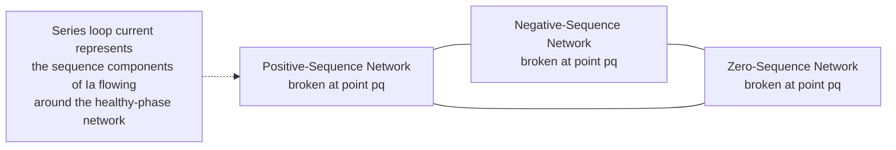
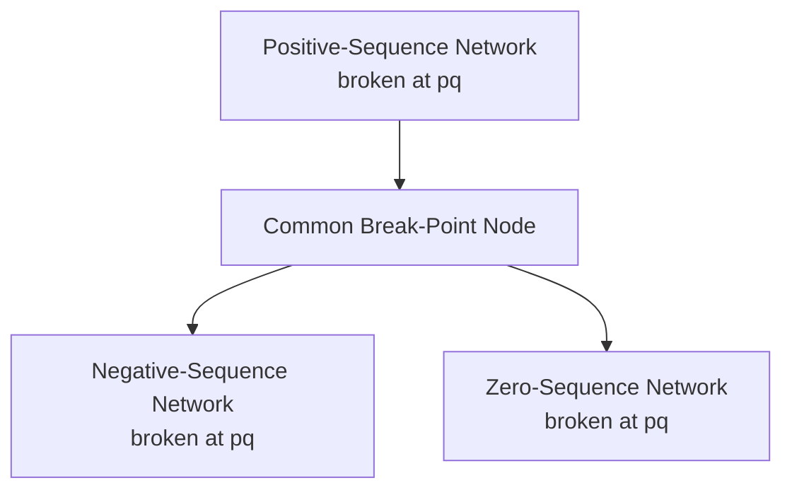

## Open-Conductor Fault Analysis

### Overview

Open-conductor faults — a broken or open phase conductor, a blown fuse on one phase, or a single-phase or two-phase recloser/breaker operation — represent a fundamentally different category of unbalanced fault from the shunt faults (SLG, LL, DLG) covered previously. Rather than an unwanted low-impedance connection *between* conductors or to ground, an open-conductor fault is a **series** unbalance: an abnormally high impedance (ideally infinite) inserted *in series* with one or two phases at a specific point in the circuit. This requires a distinct symmetrical component formulation using series (rather than shunt) sequence network interconnections.

### Series vs. Shunt Fault Distinction

**Key Points**

- **Shunt faults** (SLG, LL, DLG, three-phase) connect sequence networks in parallel branches feeding a common fault point, representing an unwanted low-impedance path between phases or to ground.
- **Series faults** (open conductor, single-phase or two-phase open) connect sequence networks by breaking the connection at a specific point in a specific phase, representing an unwanted high impedance interrupting normal current flow.
- The two fault categories require different boundary conditions and different physical placement of the sequence network interconnection — at a break point *within* a line/branch rather than at a bus connected to ground.

### One Line Open (Single-Phase Open Conductor)

Consider phase $a$ open at a point $pq$ between buses $p$ and $q$, with phases $b$ and $c$ intact. Define $V_{pq}$ as the voltage drop across the break point (the voltage that appears across the open gap) and $I_a$, $I_b$, $I_c$ as the currents that would flow through the point if it were closed.

**Boundary conditions:**

$$I_a = 0 \quad \text{(current cannot flow through the open phase)}$$

$$V_{pq,b} = 0, \quad V_{pq,c} = 0 \quad \text{(no impedance discontinuity in the intact phases)}$$

**Deriving the sequence relationship.** Applying the symmetrical component transformation to the voltage-drop conditions $V_{pq,b} = V_{pq,c} = 0$ across the break point:

$$V_{pq}^{(0)} = V_{pq}^{(1)} = V_{pq}^{(2)} = \frac{V_{pq,a}}{3}$$

This equality of the three sequence voltage-drops mirrors the structure of the SLG shunt fault, but here it applies to voltage *across a series break* rather than voltage *at a fault bus to ground* — dictating a **series connection of the three sequence networks, each broken at the same point $pq$**, in a manner analogous to (but topologically distinct from) the SLG interconnection.

### Fault Current/Voltage for Single Open Conductor

The Thevenin impedances used here, $Z_{pq}^{(1)}$, $Z_{pq}^{(2)}$, $Z_{pq}^{(0)}$, represent the driving-point impedance of each sequence network **as seen looking into the break point from one side**, computed with the network on both sides of the break otherwise intact and interconnected normally (a distinct network reduction from the shunt-fault Thevenin impedances used in SLG/LL/DLG analysis).

The resulting voltage appearing across the open phase $a$ gap is derived by solving the series sequence-network loop (structurally parallel to the SLG derivation, with $Z_{pq}$ terms replacing $Z_{kk}$ terms):

$$I_{pq}^{(0)} = I_{pq}^{(1)} = I_{pq}^{(2)} = \frac{V_{th,pq}^{(1)}}{Z_{pq}^{(1)}+Z_{pq}^{(2)}+Z_{pq}^{(0)}}$$

where $V_{th,pq}^{(1)}$ is the pre-open-circuit positive-sequence voltage difference that would exist across the break point if closed. The currents that actually flow in the intact phases $b$ and $c$, and the voltage appearing across the open phase $a$, are then found by transforming these sequence quantities back to phase values using the same reconstruction procedure used in shunt fault analysis.

[Inference] The exact sign conventions and circuit orientation for the series-fault Thevenin impedance calculation differ in detail from standard textbook treatment to textbook treatment; the essential structural result — a series interconnection of all three sequence networks at the break point — is the consistently agreed-upon core result, while specific worked formulas benefit from following a single consistent reference derivation (e.g., Stevenson, Grainger & Stevenson, or Blackburn's protective relaying texts) rather than mixing formulas from different sources.

### Two Lines Open (Two-Phase Open Conductor)

Consider phases $b$ and $c$ open at point $pq$, with phase $a$ intact. This is the series-fault analog of the LL shunt fault.

**Boundary conditions:**

$$I_b = 0, \quad I_c = 0$$

$$V_{pq,a} = 0$$

The two open phases carry no current; the intact phase experiences no voltage discontinuity across the break.

**Sequence relationship.** Following an analogous derivation to the single-open-conductor case (structurally parallel to how the LL shunt fault mirrors the SLG derivation with a parallel rather than series connection), the two-phase-open condition results in the three sequence networks at the break point being connected in **parallel** rather than series — the series-fault analog of the LL shunt-fault topology.

### SVG Diagram: Open-Conductor Fault Concept (Single Phase Open)

<svg xmlns="http://www.w3.org/2000/svg" viewBox="0 0 640 280" font-family="Helvetica, Arial, sans-serif">
<text x="130" y="24" font-size="16" font-weight="bold" fill="#1a1a1a">Single-Phase Open Conductor at Point pq (svg_diagram)</text>

<text x="40" y="80" font-size="12" fill="#333">Phase a</text>

<line x1="90" y1="75" x2="280" y2="75" stroke="`#d62728`" stroke-width="3" />

<line x1="360" y1="75" x2="550" y2="75" stroke="`#d62728`" stroke-width="3" />

<text x="300" y="65" font-size="20" fill="`#d62728`" text-anchor="middle">✕</text>

<text x="320" y="95" font-size="10" fill="`#d62728`" text-anchor="middle">open (break pq)</text>

<text x="40" y="150" font-size="12" fill="#333">Phase b</text>

<line x1="90" y1="145" x2="550" y2="145" stroke="`#0057b7`" stroke-width="3" />

<text x="40" y="220" font-size="12" fill="#333">Phase c</text>

<line x1="90" y1="215" x2="550" y2="215" stroke="`#2ca02c`" stroke-width="3" />

<circle cx="90" cy="75" r="5" fill="#333" />
<circle cx="90" cy="145" r="5" fill="#333" />
<circle cx="90" cy="215" r="5" fill="#333" />
<text x="90" y="245" font-size="11" text-anchor="middle" fill="#333">Bus p</text>
<circle cx="550" cy="75" r="5" fill="#333" />
<circle cx="550" cy="145" r="5" fill="#333" />
<circle cx="550" cy="215" r="5" fill="#333" />
<text x="550" y="245" font-size="11" text-anchor="middle" fill="#333">Bus q</text>

<text x="320" y="270" font-size="11" text-anchor="middle" fill="`#1a1a1a`">Ia = 0 through break; Vpq,b = Vpq,c = 0 (no discontinuity in healthy phases)</text>

</svg>

### Worked Conceptual Example

**Example**

A distribution feeder experiences a broken phase-$a$ conductor between two poles, with phases $b$ and $c$ remaining intact and continuing to carry load current to a downstream transformer bank. Using the driving-point sequence impedances at the break point (illustrative values, per unit):

$$Z_{pq}^{(1)} = j0.08\ \text{pu}, \quad Z_{pq}^{(2)} = j0.08\ \text{pu}, \quad Z_{pq}^{(0)} = j0.25\ \text{pu}$$

$$V_{th,pq}^{(1)} = 1.0\ \text{pu (illustrative pre-open-circuit voltage difference)}$$

Sequence current:

$$I_{pq}^{(1)} = I_{pq}^{(2)} = I_{pq}^{(0)} = \frac{1.0}{j0.08+j0.08+j0.25} = \frac{1.0}{j0.41} = -j2.439\ \text{pu}$$

This sequence current, when transformed back to phase quantities, characterizes both the reduced/unbalanced current now flowing in the intact phases $b$ and $c$ and the voltage stress appearing across the open phase-$a$ gap — the latter being of particular importance because it represents a potential re-energization or arcing hazard if the gap is not electrically isolated. [Inference] The specific numeric outcome depends heavily on the actual network configuration and load connected downstream of the break, so this example is illustrative of method only, not representative of a typical real-world open-conductor event.

### Practical Significance: Downstream Load and Transformer Connections

**Key Points**

- The impact of an open-conductor condition on downstream equipment depends critically on the connection of transformers and loads beyond the break point — a delta-connected or ungrounded-wye load bank fed by only two intact phases will experience a fundamentally different (and often less severe) unbalance than a solidly grounded-wye load, because the available return paths differ.
- **Single-phasing** of a three-phase induction motor (resulting from an open conductor upstream) is a well-documented, damaging condition: the motor continues to attempt to run on the remaining two phases, drawing highly unbalanced (and often elevated) current, producing severe negative-sequence heating that can destroy the motor windings within a short time if not detected and the motor is not tripped. [Inference] Specific single-phasing withstand time depends on motor design, loading at the time of the event, and thermal protection settings; NEMA MG-1 and manufacturer data provide relevant guidance for motor protection sizing.
- Standard time-overcurrent phase relays may fail to detect an open-conductor condition promptly (since total current may not rise dramatically, or may even fall, depending on load and configuration), which is why dedicated **open-phase detection** schemes (voltage-based negative-sequence detection, current-balance relays) are used specifically to catch this fault type. [Inference]

### Relationship to Negative-Sequence Protection

Because open-conductor conditions inherently produce negative-sequence current and voltage (the system becomes unbalanced by the very nature of losing one or two phases), negative-sequence-based protection schemes — the same device (46) function relevant to LL and DLG shunt faults — are also a primary detection method for open-conductor conditions, particularly valuable because:

- Open-conductor events do not necessarily produce a large **increase** in total current (unlike shunt faults), so traditional overcurrent protection is often ineffective or slow to respond.
- Negative-sequence voltage and current, however, appear reliably whenever any degree of phase unbalance exists, making sensitive negative-sequence relaying (voltage- or current-based) the standard tool purpose-built for this fault category. [Inference]

### Common Pitfalls

- **Applying shunt-fault sequence network reduction techniques (finding $Z_{kk}$ at a bus) to a series/open-conductor fault**, which requires instead the driving-point impedance looking into a *break point within a branch*, a structurally different network reduction problem.
- **Assuming total current magnitude will clearly indicate an open-conductor condition**, when in fact total current may remain within normal ranges or even decrease, depending on downstream load and connection type — this is precisely why dedicated open-phase/negative-sequence detection is needed rather than relying on standard overcurrent protection. [Inference]
- **Underestimating single-phasing damage risk to induction motors** downstream of an open conductor, given that motors can sustain severe negative-sequence heating well before conventional thermal overload protection (sized for balanced conditions) operates. [Inference]
- **Confusing the series connection topology of the single-open-conductor case with the series connection of the SLG shunt fault** — while both use a series interconnection of all three sequence networks, the physical meaning (voltage across a fault to ground vs. voltage across an open gap in a line) and the impedances used ($Z_{kk}$ at a bus vs. $Z_{pq}$ at a break point) are fundamentally different and not interchangeable.

### Conclusion

Open-conductor (series) fault analysis extends symmetrical component theory to a distinct fault category defined by an interruption in current flow rather than an unwanted connection between conductors or to ground. The single-open-conductor case connects all three sequence networks in series at the break point (structurally paralleling the SLG shunt fault), while the two-open-conductor case connects them in parallel (paralleling the LL shunt fault) — but in both cases, the governing impedances are driving-point impedances looking into the break point within a branch, not bus impedances to ground. This fault category's practical importance lies chiefly in motor single-phasing protection and the necessity of negative-sequence-based detection schemes, since conventional overcurrent protection is often poorly suited to catching this fault type promptly.

**Related Topics**

- Symmetrical Component Sequence Networks
- Single Line-to-Ground Fault Analysis
- Line-to-Line Fault Analysis
- Double Line-to-Ground Fault Analysis
- Negative-Sequence Protection (Device 46) and Open-Phase Detection Schemes
- Motor Single-Phasing Protection and NEMA MG-1 Withstand Guidance
- Series vs. Shunt Fault Classification in Power Systems
- Broken Conductor Detection on Distribution Feeders
- Sequence Network Reduction for Series Faults (Driving-Point Impedance at a Break)
- Simultaneous Fault Analysis (Combined Series and Shunt Faults)