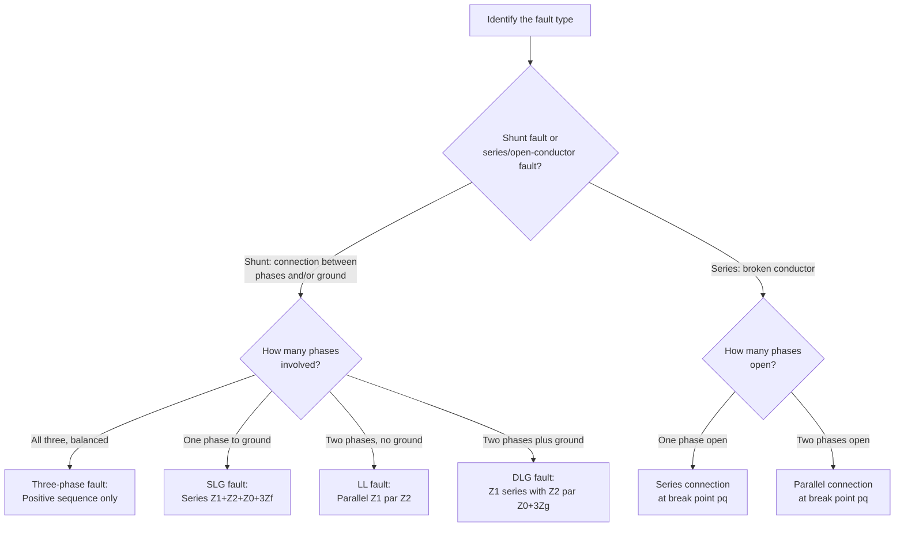

## Sequence Network Interconnection by Fault Type

### Overview

Each unbalanced fault type imposes a distinct set of physical boundary conditions at the fault point, and these boundary conditions — when passed through the symmetrical component transformation — dictate a specific topology for connecting the positive-, negative-, and zero-sequence Thevenin networks together. This topic consolidates and compares the interconnection patterns across all standard fault types, serving as a unified reference and diagnostic checklist for selecting the correct sequence network configuration once a fault type has been identified.

### The General Principle

**Key Points**

- Every fault type's boundary conditions (which phase voltages are zero, which phase currents are zero or equal) translate into an equality or ratio between sequence components.
- An equality of sequence **currents** across networks corresponds to a **series** interconnection of those networks.
- An equality of sequence **voltages** across networks corresponds to a **parallel** interconnection of those networks.
- Networks that carry no current under a given fault type (e.g., zero-sequence during an LL fault, all sequences except positive during a three-phase fault) are simply excluded from the interconnection entirely.

This principle — current equality implies series, voltage equality implies parallel — is the unifying thread that explains why each fault type's derivation, despite differing in algebraic detail, follows the same underlying logic.

### Summary Table: Boundary Conditions and Interconnection by Fault Type

| Fault Type | Physical Boundary Conditions | Sequence Relationship | Network Connection | Zero-Seq. Involved? |
| --- | --- | --- | --- | --- |
| Three-phase symmetrical | $V_a=V_b=V_c=0$ (bolted) at fault, balanced | Only $I_a^{(1)}$ exists | Positive sequence only | No |
| Single line-to-ground (SLG) | $V_a=0$; $I_b=I_c=0$ | $I_a^{(0)}=I_a^{(1)}=I_a^{(2)}$ | Series: $Z_1+Z_2+Z_0+3Z_f$ | Yes — essential |
| Line-to-line (LL) | $I_a=0$; $V_b=V_c$; $I_b=-I_c$ | $I_a^{(1)}=-I_a^{(2)}$; $V_a^{(1)}=V_a^{(2)}$ | Parallel: $Z_1 \parallel Z_2$ | No — excluded |
| Double line-to-ground (DLG) | $I_a=0$; $V_b=V_c=0$ | $V_a^{(0)}=V_a^{(1)}=V_a^{(2)}$ | Series-parallel: $Z_1$ in series with $(Z_2 \parallel (Z_0+3Z_g))$ | Yes — in parallel branch |
| Single conductor open | $I_a=0$ (through break); $V_{pq,b}=V_{pq,c}=0$ | $I_{pq}^{(0)}=I_{pq}^{(1)}=I_{pq}^{(2)}$ | Series (at break point): $Z_{pq}^{(1)}+Z_{pq}^{(2)}+Z_{pq}^{(0)}$ | Yes — series |
| Two conductors open | $I_b=I_c=0$ (through break); $V_{pq,a}=0$ | Voltage equality across break | Parallel (at break point) | Yes — parallel |

### Diagnostic Flowchart for Selecting the Interconnection

### SVG Diagram: Side-by-Side Comparison of All Shunt Fault Topologies

<svg xmlns="http://www.w3.org/2000/svg" viewBox="0 0 700 420" font-family="Helvetica, Arial, sans-serif">
<text x="180" y="24" font-size="16" font-weight="bold" fill="#1a1a1a">Sequence Network Topologies by Fault Type (svg_diagram)</text>

<rect x="20" y="50" width="150" height="100" fill="none" stroke="#333" stroke-width="2" rx="6" />
<text x="95" y="70" font-size="12" text-anchor="middle" fill="#1a1a1a" font-weight="bold">Three-Phase</text>
<rect x="45" y="95" width="100" height="30" fill="none" stroke="#0057b7" stroke-width="2" />
<text x="95" y="114" font-size="10" text-anchor="middle" fill="#0057b7">Positive Seq. Only</text>
<text x="95" y="140" font-size="9" text-anchor="middle" fill="#666">Z1 alone</text>

<rect x="190" y="50" width="150" height="100" fill="none" stroke="#333" stroke-width="2" rx="6" />
<text x="265" y="70" font-size="12" text-anchor="middle" fill="#1a1a1a" font-weight="bold">SLG</text>
<rect x="205" y="90" width="35" height="20" fill="none" stroke="#0057b7" stroke-width="2" />
<text x="222" y="104" font-size="8" text-anchor="middle" fill="#0057b7">Z1</text>
<rect x="248" y="90" width="35" height="20" fill="none" stroke="#2ca02c" stroke-width="2" />
<text x="265" y="104" font-size="8" text-anchor="middle" fill="#2ca02c">Z2</text>
<rect x="291" y="90" width="35" height="20" fill="none" stroke="#d62728" stroke-width="2" />
<text x="308" y="104" font-size="8" text-anchor="middle" fill="#d62728">Z0</text>
<line x1="240" y1="100" x2="248" y2="100" stroke="#333" stroke-width="1.5" />
<line x1="283" y1="100" x2="291" y2="100" stroke="#333" stroke-width="1.5" />
<text x="265" y="130" font-size="9" text-anchor="middle" fill="#666">All three in series</text>

<rect x="360" y="50" width="150" height="100" fill="none" stroke="#333" stroke-width="2" rx="6" />
<text x="435" y="70" font-size="12" text-anchor="middle" fill="#1a1a1a" font-weight="bold">Line-to-Line</text>
<rect x="390" y="88" width="35" height="18" fill="none" stroke="#0057b7" stroke-width="2" />
<text x="407" y="100" font-size="8" text-anchor="middle" fill="#0057b7">Z1</text>
<rect x="390" y="112" width="35" height="18" fill="none" stroke="#2ca02c" stroke-width="2" />
<text x="407" y="124" font-size="8" text-anchor="middle" fill="#2ca02c">Z2</text>
<line x1="425" y1="97" x2="440" y2="97" stroke="#333" stroke-width="1.5" />
<line x1="425" y1="121" x2="440" y2="121" stroke="#333" stroke-width="1.5" />
<line x1="440" y1="97" x2="440" y2="121" stroke="#333" stroke-width="1.5" />
<text x="440" y="140" font-size="9" text-anchor="middle" fill="#666">Z1 parallel Z2, Z0 excluded</text>

<rect x="530" y="50" width="150" height="100" fill="none" stroke="#333" stroke-width="2" rx="6" />
<text x="605" y="70" font-size="12" text-anchor="middle" fill="#1a1a1a" font-weight="bold">Double LG</text>
<rect x="555" y="97" width="30" height="18" fill="none" stroke="#0057b7" stroke-width="2" />
<text x="570" y="109" font-size="8" text-anchor="middle" fill="#0057b7">Z1</text>
<line x1="585" y1="106" x2="600" y2="106" stroke="#333" stroke-width="1.5" />
<rect x="600" y="85" width="30" height="16" fill="none" stroke="#2ca02c" stroke-width="2" />
<text x="615" y="97" font-size="8" text-anchor="middle" fill="#2ca02c">Z2</text>
<rect x="600" y="110" width="30" height="16" fill="none" stroke="#d62728" stroke-width="2" />
<text x="615" y="122" font-size="8" text-anchor="middle" fill="#d62728">Z0</text>
<line x1="630" y1="93" x2="640" y2="93" stroke="#333" stroke-width="1.5" />
<line x1="630" y1="118" x2="640" y2="118" stroke="#333" stroke-width="1.5" />
<line x1="640" y1="93" x2="640" y2="118" stroke="#333" stroke-width="1.5" />
<text x="605" y="140" font-size="9" text-anchor="middle" fill="#666">Z1 series with (Z2 par Z0)</text>

<text x="350" y="180" font-size="11" text-anchor="middle" fill="`#1a1a1a`" font-weight="bold">Key Rule: Equal sequence CURRENTS → series | Equal sequence VOLTAGES → parallel</text>

<rect x="60" y="220" width="580" height="170" fill="none" stroke="#666" stroke-width="1.5" stroke-dasharray="5,3" rx="6" />
<text x="350" y="245" font-size="12" text-anchor="middle" fill="#333" font-weight="bold">Fault Current Formulas (bolted, Vth(1) pre-fault)</text>
<text x="90" y="275" font-size="11" fill="#1a1a1a">3-Phase: If'' = Vth(1) / Z1</text>
<text x="90" y="300" font-size="11" fill="#1a1a1a">SLG: Ia = 3·Vth(1) / (Z1 + Z2 + Z0 + 3Zf)</text>
<text x="90" y="325" font-size="11" fill="#1a1a1a">LL: Ib = -j√3·Vth(1) / (Z1 + Z2 + Zf)</text>
<text x="90" y="350" font-size="11" fill="#1a1a1a">DLG: Ia1 = Vth(1) / [Z1 + (Z2·(Z0+3Zg))/(Z2+Z0+3Zg)]</text>
<text x="90" y="375" font-size="11" fill="#1a1a1a">Ground return in DLG: Ig = 3·Ia0 (found via current division)</text>
</svg>

### Detailed Walkthrough of the Series/Parallel Logic

**Three-phase fault:** Only the positive-sequence network is energized and involved because the fault is balanced by definition — no negative- or zero-sequence quantities are created, so there is no "interconnection" to speak of; the positive-sequence network stands alone.

**SLG fault:** The boundary conditions force $I_a^{(0)} = I_a^{(1)} = I_a^{(2)}$ — a single common current value shared by all three networks. A single current flowing through multiple elements in a loop is, by definition, a series connection. Hence: series.

**LL fault:** The boundary conditions force $I_a^{(1)} = -I_a^{(2)}$ (a fixed current *ratio*, not full equality across all three, and only between two of the three networks) together with $V_a^{(1)} = V_a^{(2)}$ (equal voltage across those same two networks). Equal voltage across two elements carrying related currents is the signature of a parallel connection — hence: parallel, and only between positive and negative sequence, with zero sequence excluded because no ground path exists (confirmed independently by $I_a^{(0)}=0$).

**DLG fault:** The boundary conditions force $V_a^{(0)} = V_a^{(1)} = V_a^{(2)}$ — equal voltage shared by all three networks. Equal voltage across multiple elements is a parallel connection — but since the positive-sequence network is the only one containing a source, it is conventionally drawn as feeding a node from which the (source-free) negative- and zero-sequence networks branch off in parallel with each other, with the positive-sequence source's own impedance necessarily in series with that parallel combination as current returns to the source.

### Extending the Principle to Series (Open-Conductor) Faults

The same current-equals-series / voltage-equals-parallel logic applies to open-conductor faults, but with sequence quantities defined *across a break point* rather than *at a fault-to-ground bus*:

- **Single conductor open:** boundary condition $V_{pq,b}=V_{pq,c}=0$ leads to $V_{pq}^{(0)}=V_{pq}^{(1)}=V_{pq}^{(2)}$ — but note this is a voltage-drop equality across each network's own break point, and (following the standard derivation) resolves structurally into a *series* connection of the three networks' driving-point impedances at the break — the series-fault counterpart to the SLG topology.
- **Two conductors open:** boundary condition $I_b=I_c=0$ leads to a current-based condition that resolves into a *parallel* connection at the break point — the series-fault counterpart to the LL topology.

[Inference] The apparent inversion (voltage equality leading to a series connection in the single-open-conductor case, rather than parallel as the general principle above would suggest) reflects the fact that series-fault sequence networks are interconnected through a break in the current path itself, not through a shared bus-to-ground node; the general "current equality → series, voltage equality → parallel" heuristic is most directly and reliably applicable to shunt faults, while series-fault topologies are more safely determined by working through the specific derivation (as shown in dedicated open-conductor fault analysis) rather than applying the shunt-fault heuristic mechanically.

### Practical Use as a Verification Checklist

**Key Points**

- When performing a fault study, confirming which sequence networks are involved and how they are connected (before plugging in Zbus values) helps catch modeling errors before they propagate into a wrong fault current answer.
- A quick sanity check: does the fault involve ground? If not (LL fault), zero sequence should not appear in the final formula at all. If it does (SLG, DLG), zero sequence must appear.
- Another sanity check: for a bolted fault, does the final current formula reduce to the expected simpler case in a limiting scenario? For example, DLG fault current with $Z_g \to \infty$ (open ground path) should reduce to look structurally like the LL fault result, since the zero-sequence branch becomes an open circuit and drops out of the parallel combination.

### Common Pitfalls

- **Mechanically memorizing formulas without understanding which sequence networks apply**, leading to accidentally including zero-sequence impedance in an LL fault calculation (where it should be entirely absent) or omitting it from an SLG or DLG calculation (where it is essential).
- **Confusing the DLG parallel-branch structure with a simple three-way parallel of all sequence networks**, when in fact the positive-sequence network's source and impedance remain in series with the parallel combination of the other two, not simply lumped into the same parallel group.
- **Applying the shunt-fault series/parallel heuristic directly and unmodified to series/open-conductor faults**, without recognizing that the physical setup (break point within a branch vs. bus-to-ground) changes how the boundary conditions map onto network topology, as noted in the open-conductor derivation. [Inference]
- **Forgetting to exclude non-participating sequence networks entirely** (e.g., leaving zero-sequence impedance in an LL fault formula by habit, or including negative-sequence in a purely three-phase symmetrical fault calculation) rather than recognizing these networks carry no current under fault types where they are not required.

### Conclusion

The interconnection topology for each unbalanced fault type is not an arbitrary set of separate formulas to memorize, but a direct and derivable consequence of that fault type's physical boundary conditions passed through the symmetrical component transformation: shared sequence currents produce series connections, shared sequence voltages produce parallel connections, and networks carrying no sequence current under a given fault type are simply excluded. Keeping this underlying logic in view — rather than treating SLG, LL, and DLG formulas as unrelated results — provides both a faster path to deriving fault current equations from first principles and a reliable checklist for verifying that a fault study has been set up correctly before Zbus values are substituted in.

**Related Topics**

- Symmetrical Component Sequence Networks
- Single Line-to-Ground Fault Analysis
- Line-to-Line Fault Analysis
- Double Line-to-Ground Fault Analysis
- Open-Conductor Fault Analysis
- Thevenin Equivalent Fault Calculations
- Zbus Method for Fault Analysis
- Fault Type Screening for Protection Coordination Studies
- Generalized Sequence Network Fault Analysis Using Fault-Type Connection Matrices
- Simultaneous Fault Analysis (Combined Series and Shunt Unbalances)