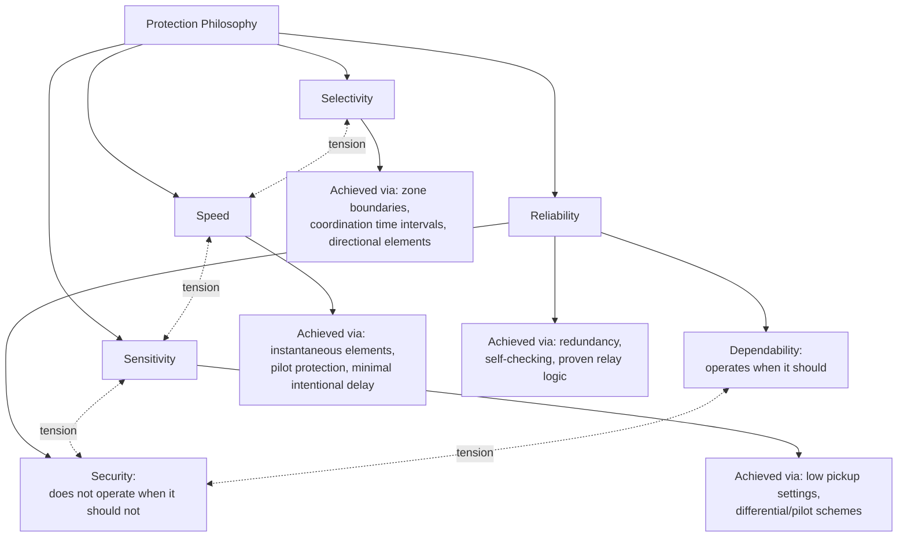

## Protection Philosophy: Selectivity, Sensitivity, Speed, and Reliability

### Overview

Power system protection design is governed by a small set of core performance attributes that are frequently in tension with one another: selectivity, sensitivity, speed, and reliability. No single protection scheme optimizes all four simultaneously — every design decision represents a deliberate trade-off among them, informed by the specific consequences of misoperation at that point in the system. Understanding these four attributes, and the natural conflicts between them, is foundational to interpreting why real protection schemes look the way they do.

### The Four Core Attributes

**Key Points**

- **Selectivity (Discrimination):** the ability of a protection scheme to isolate only the faulted element, disconnecting the minimum necessary portion of the system while leaving healthy equipment in service.
- **Sensitivity:** the ability to detect and respond to fault conditions at the lowest fault current magnitude that could realistically occur, including faults through significant fault impedance or at the far end of a protected zone.
- **Speed:** the ability to clear a fault as quickly as possible, minimizing equipment damage, thermal stress, and the duration of system disturbance (voltage sag, stability impact).
- **Reliability:** the combination of **dependability** (the protection operates correctly when it should) and **security** (the protection does not operate when it should not) — together ensuring the scheme performs its intended function without unwanted or missed operations.

### Reliability: Dependability and Security

Reliability is often decomposed into two distinct, and sometimes opposing, sub-attributes:

| Sub-Attribute | Definition | Failure Mode if Deficient |
| --- | --- | --- |
| Dependability | Relay operates correctly for all faults within its intended zone of protection | **Failure to trip** — fault persists, equipment damage escalates |
| Security | Relay does not operate for conditions outside its intended zone (normal load, faults elsewhere, transients) | **False trip** — unnecessary outage, reduced system availability |

**Key Points**

- Increasing dependability (e.g., by lowering pickup thresholds or removing restraint/blocking logic) generally reduces security, since the relay becomes more prone to operating on conditions that merely resemble a fault.
- Increasing security (e.g., by adding restraint, higher thresholds, or additional confirming logic) generally reduces dependability, since genuine faults closer to the detection threshold may go undetected or be cleared more slowly.
- [Inference] The relative emphasis placed on dependability versus security is a deliberate engineering and business decision that varies by application — critical transmission protection often favors dependability (accepting occasional false trips as the lesser risk) while distribution feeder protection may favor security (accepting some risk of delayed clearing to avoid nuisance outages), though specific utility philosophies vary.

### Mermaid Diagram: The Four Attributes and Their Interdependencies

### Selectivity in Practice

**Key Points**

- Selectivity is achieved primarily through **zone of protection** design (each protective device has a clearly defined boundary of responsibility) combined with **coordination** between devices in series (upstream devices given progressively longer operating times than downstream devices, so the closest device to a fault operates first).
- Overlapping zones of protection (achieved by placing current transformers appropriately relative to circuit breakers) ensure no "blind spot" exists between adjacent protection zones, at the cost of a small region where a fault may cause two zones to see the fault simultaneously — a deliberate, bounded trade-off rather than a flaw.
- Directional relay elements add selectivity in networks with multiple potential fault current paths (loops, parallel feeders) by ensuring a relay only operates for fault current flowing in the direction consistent with a fault in its own protected zone.

[Inference] Perfect selectivity — disconnecting only the exact faulted component and nothing else — is the theoretical ideal; real schemes accept a bounded, deliberately engineered amount of imperfection (overlap zones, backup protection reach) in exchange for guaranteed fault clearing even if a primary device fails.

### Sensitivity in Practice

**Key Points**

- Sensitivity requirements are driven by the need to detect the **minimum fault current** expected for the fault type and location that produces the least current — often a high-impedance fault at the remote end of a long line, or a fault through significant fault resistance (e.g., arcing faults, faults through vegetation contact).
- Overly sensitive settings risk operating on normal system conditions such as inrush current, load unbalance, or through-fault conditions meant to be seen by other devices — directly trading against security.
- Differential protection schemes (comparing current entering and leaving a protected zone) offer inherently high sensitivity within their zone because they respond to internal faults regardless of the fault's connection to the rest of the system, though they require reliable communication or wiring between CTs at each end of the zone.

### Speed in Practice

**Key Points**

- Fast fault clearing limits thermal damage to conductors and equipment, reduces arc-flash energy exposure, and — critically for transmission systems — helps preserve transient stability by minimizing the duration during which synchronous generators are subjected to the disturbance.
- Speed and selectivity are often in direct tension: the fastest possible clearing (instantaneous, zero intentional delay) is easiest to achieve for a device closest to the fault, but coordinating multiple devices in series for selectivity inherently requires progressively longer delays moving upstream (the coordination time interval), meaning upstream backup protection is deliberately slower.
- **Pilot protection schemes** (using a communication channel between relays at each end of a protected line) are specifically designed to resolve this tension, providing both high-speed tripping *and* full selectivity across the entire protected line length, at the cost of dependence on a reliable communication channel. [Inference] Communication channel dependency introduces its own reliability considerations (loss-of-channel logic, security against spurious signals) that must be engineered into the pilot scheme itself.

### SVG Diagram: The Selectivity-Speed Trade-off via Coordination Time Intervals

<svg xmlns="http://www.w3.org/2000/svg" viewBox="0 0 680 320" font-family="Helvetica, Arial, sans-serif">
<text x="140" y="24" font-size="16" font-weight="bold" fill="#1a1a1a">Selectivity vs. Speed: Time-Current Coordination (svg_diagram)</text>

<line x1="80" y1="270" x2="620" y2="270" stroke="#333" stroke-width="1.5" />
<line x1="80" y1="270" x2="80" y2="50" stroke="#333" stroke-width="1.5" />
<text x="350" y="295" font-size="12" text-anchor="middle" fill="#333">Fault Current Magnitude (log scale)</text>
<text x="35" y="160" font-size="12" text-anchor="middle" fill="#333" transform="rotate(-90 35 160)">Operating Time</text>

<path d="M 100,80 C 130,90 180,150 250,220 C 300,250 400,260 600,262" fill="none" stroke="#0057b7" stroke-width="2.5" />
<text x="180" y="100" font-size="11" fill="#0057b7">Device A (downstream, fastest)</text>

<path d="M 150,130 C 190,145 240,200 310,240 C 360,258 450,265 600,267" fill="none" stroke="#2ca02c" stroke-width="2.5" />
<text x="260" y="150" font-size="11" fill="#2ca02c">Device B (upstream backup)</text>

<line x1="250" y1="220" x2="250" y2="240" stroke="#d62728" stroke-width="2" />
<text x="250" y="200" font-size="10" text-anchor="middle" fill="#d62728">CTI (coordination</text>
<text x="250" y="215" font-size="10" text-anchor="middle" fill="#d62728">time interval)</text>

<text x="350" y="40" font-size="11" text-anchor="middle" fill="#666">Downstream device must clear first; upstream backup waits CTI longer</text>

</svg>

### Interdependency Table: How Improving One Attribute Affects Others

| Action Taken | Selectivity | Sensitivity | Speed | Reliability (Security) |
| --- | --- | --- | --- | --- |
| Lower relay pickup threshold | Neutral | Improves | Neutral | Degrades (more false trips) |
| Add coordination time delay | Improves | Neutral | Degrades | Improves (fewer misoperations from transients) |
| Add pilot/communication scheme | Improves | Improves | Improves | Depends on channel reliability |
| Add differential protection | Improves (zone-limited) | Improves | Improves (no coordination delay needed) | Depends on CT/communication integrity |
| Add redundant relay (duplicate scheme) | Neutral | Neutral | Neutral | Improves (dependability, via backup) |

[Inference] This table illustrates typical directional tendencies of each design action rather than universal, quantified rules; actual impact on each attribute depends on the specific relay technology, communication infrastructure, and system configuration involved.

### Backup Protection as a Reliability Mechanism

**Key Points**

- Because no primary protection scheme is perfectly dependable (relay failure, breaker failure, CT/PT failure, loss of DC control power), **backup protection** — either local (redundant relay/breaker at the same location) or remote (upstream device configured to see through the primary zone) — is standard practice to maintain overall system dependability.
- Remote backup inherently sacrifices some selectivity and speed (a wider zone of the system is disconnected, after a longer delay) in exchange for dependability when local primary protection fails.
- **Breaker failure protection** is a specific, dedicated scheme addressing the case where a relay operates correctly (dependability satisfied) but the breaker itself fails to interrupt, requiring a backup timer-initiated trip of surrounding breakers to isolate the fault.

### Sensitivity vs. Security: A Frequent Point of Design Tension

**Example**

A distribution feeder ground overcurrent relay is set very sensitively to detect high-impedance faults (e.g., a downed conductor on dry ground, producing only a few amps of fault current). This same sensitive setting, however, makes the relay more susceptible to operating on:

- Normal system unbalance from unevenly distributed single-phase loads
- Transformer inrush current with a zero-sequence component
- CT saturation during nearby heavy through-faults, which can produce spurious zero-sequence signal

Resolving this tension typically involves adding restraint or blocking logic (e.g., harmonic restraint for inrush, or coordination with an upstream device) rather than simply choosing a single "correct" sensitivity level — illustrating that real protection settings emerge from balancing sensitivity against security rather than maximizing either independently. [Inference] The specific restraint techniques applied (harmonic blocking, negative-sequence supervision, directional supervision) depend on the relay technology and the specific nuisance-operation mechanism being guarded against.

### Prioritization Varies by System Location and Consequence

**Key Points**

- **Transmission-level protection** (especially near large generating stations or critical interconnections) often prioritizes speed and dependability highly, because slow fault clearing risks loss of synchronism and cascading instability — the cost of an occasional unnecessary trip is generally judged less severe than the cost of a slow-cleared fault causing a wider blackout. [Inference]
- **Distribution feeder protection** often has more latitude to prioritize security and selectivity over absolute speed, since individual faults typically affect a smaller, more localized customer base and stability concerns are less acute, though public safety (downed conductor energization time) remains a speed-relevant driver regardless. [Inference]
- **Generator protection** typically emphasizes sensitivity and dependability strongly for internal fault detection (given the high cost and long repair/replacement time for generator winding damage), even at some cost to security, since a generator internal fault left undetected can escalate catastrophically. [Inference]

[Inference] These prioritization tendencies reflect commonly cited protection engineering principles rather than a fixed, universal rule; specific utility and industrial protection philosophies, informed by their own risk tolerance, regulatory requirements, and system characteristics, may weight these attributes differently even within the same broad system category.

### Common Pitfalls

- **Treating the four attributes as independently optimizable** rather than recognizing that improving one frequently degrades another — protection setting decisions are trade-off decisions, not simple maximization exercises.
- **Conflating dependability and security as a single "reliability" concept** without distinguishing which failure mode (missed trip vs. false trip) a given design choice actually addresses.
- **Applying a uniform sensitivity/security balance across all protection zones** without considering that the appropriate balance point differs meaningfully between, for example, a critical transmission tie line and a low-priority distribution lateral. [Inference]
- **Underestimating the reliability dependency introduced by communication-based pilot schemes**, treating them as a pure speed/selectivity improvement without adequately engineering channel-failure and channel-security logic. [Inference]
- **Assuming faster is always better** without recognizing that excessive speed (e.g., ultra-fast instantaneous elements with no restraint) can compromise security against transient conditions that are not actually faults.

### Conclusion

Selectivity, sensitivity, speed, and reliability form the foundational vocabulary for evaluating and designing power system protection schemes, and their inherent tensions — faster often means less selective, more sensitive often means less secure, more dependable often means less secure — explain why practical protection schemes are the product of deliberate engineering trade-offs rather than simultaneous maximization of every attribute. Recognizing which attribute is being prioritized, and why, for a given protection zone is the essential first step to understanding the specific relay types, settings philosophies, and coordination schemes covered in subsequent protection topics.

**Related Topics**

- Zones of Protection and Overlap Design
- Protection Coordination and Time-Current Curves
- Primary and Backup Protection Schemes
- Breaker Failure Protection
- Pilot Protection Schemes (Communication-Assisted Tripping)
- Differential Protection Principles
- Directional Overcurrent Relaying
- Relay Dependability and Security Testing Methods
- CT and PT Accuracy Requirements for Protection
- Protection Philosophy Differences: Transmission vs. Distribution vs. Generator Protection