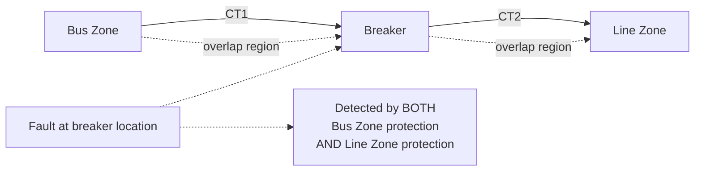

## Protection Zones and Overlapping Coverage

### Overview

A zone of protection defines the specific portion of the power system for which a given protective relay scheme is responsible — the boundary within which the relay must operate for internal faults and outside of which it must remain restrained. Zones of protection are the structural foundation upon which selectivity is built: by dividing the entire power system into a series of adjacent, clearly bounded zones, each with its own dedicated protection, a fault anywhere in the system can in principle be isolated by disconnecting only the minimum necessary equipment. Overlapping coverage between adjacent zones is a deliberate design technique that eliminates unprotected "blind spots" at zone boundaries.

### Defining a Zone of Protection

**Key Points**

- A zone of protection is physically bounded by current transformer (CT) locations, not by circuit breaker locations directly — the CT is what actually delivers the current signal a relay uses to determine whether a fault is inside or outside its zone.
- Typical zones correspond to major power system elements: generators, transformers, buses, transmission/distribution lines, and motors, each typically served by its own dedicated primary protection scheme.
- Every point in the power system should ideally fall within at least one zone of protection (usually within two adjacent zones' overlap region), ensuring no fault location exists that is inherently invisible to all protection. [Inference] While this is the ideal design principle, practical systems occasionally have limited exposure gaps addressed through backup protection reach rather than a dedicated overlapping primary zone.

### Why Zones Are Bounded by CTs, Not Breakers

**Key Points**

- A relay's decision of "fault inside my zone" versus "fault outside my zone" is made entirely from the current (and, for some schemes, voltage) signals delivered by CTs; the relay has no direct knowledge of breaker position independent of what its CT-derived measurements indicate.
- Since a CT is normally installed physically adjacent to (but not exactly coincident with) its associated breaker, a small region of conductor exists between the CT and the breaker contacts — this region is the source of the "blind spot" that overlapping zone design is specifically intended to address.
- Placing CTs on both sides of a breaker where physically practical (a "breaker-and-a-half" or double-CT arrangement) is one direct way to minimize or eliminate this blind spot, at increased cost and complexity. [Inference] The specific CT placement approach used varies by substation configuration, voltage class, and the utility's or facility's design standards.

### The Overlap Region

**Key Points**

- Two adjacent zones of protection are deliberately designed to overlap over a small region — typically spanning the breaker between them — so that a fault occurring anywhere, including exactly at or very near the breaker itself, falls within at least one (and often both) zones' primary protection.
- A fault within the overlap region will typically cause **both** adjacent zones' protection schemes to detect the fault and initiate tripping, resulting in a slightly larger disconnection than a fault clearly within a single zone — this is an accepted, bounded trade-off rather than a design flaw.
- Without any overlap, a fault occurring in the small gap between two zone boundaries would be invisible to both adjacent protection schemes, potentially persisting until slower backup protection (further upstream, with correspondingly longer delay and wider disconnection) eventually clears it.

### Mermaid Diagram: Adjacent Zones with Overlap at a Breaker

### SVG Diagram: Overlapping Zones of Protection Along a Feeder

<svg xmlns="http://www.w3.org/2000/svg" viewBox="0 0 700 320" font-family="Helvetica, Arial, sans-serif">
<text x="150" y="24" font-size="16" font-weight="bold" fill="#1a1a1a">Overlapping Zones of Protection (svg_diagram)</text>

<line x1="60" y1="160" x2="640" y2="160" stroke="#333" stroke-width="3" />

<circle cx="90" cy="160" r="20" fill="none" stroke="#0057b7" stroke-width="2" />
<text x="90" y="165" font-size="11" text-anchor="middle" fill="#0057b7">G</text>
<rect x="150" y="145" width="20" height="30" fill="#333" />
<text x="160" y="200" font-size="9" text-anchor="middle" fill="#333">CB1</text>
<rect x="220" y="140" width="50" height="40" fill="none" stroke="#2ca02c" stroke-width="2" />
<text x="245" y="165" font-size="10" text-anchor="middle" fill="#2ca02c">XFMR</text>
<rect x="320" y="145" width="20" height="30" fill="#333" />
<text x="330" y="200" font-size="9" text-anchor="middle" fill="#333">CB2</text>
<rect x="380" y="150" width="60" height="20" fill="none" stroke="#d62728" stroke-width="2" />
<text x="410" y="165" font-size="9" text-anchor="middle" fill="#d62728">BUS</text>
<rect x="480" y="145" width="20" height="30" fill="#333" />
<text x="490" y="200" font-size="9" text-anchor="middle" fill="#333">CB3</text>
<line x1="530" y1="160" x2="630" y2="160" stroke="#0057b7" stroke-width="3" />
<text x="580" y="145" font-size="10" text-anchor="middle" fill="#0057b7">LINE</text>

<circle cx="145" cy="160" r="4" fill="#d62728" />
<circle cx="175" cy="160" r="4" fill="#d62728" />
<circle cx="315" cy="160" r="4" fill="#d62728" />
<circle cx="345" cy="160" r="4" fill="#d62728" />
<circle cx="475" cy="160" r="4" fill="#d62728" />
<circle cx="505" cy="160" r="4" fill="#d62728" />

<path d="M 145,220 L 145,235 L 315,235 L 315,220" fill="none" stroke="#0057b7" stroke-width="1.5" />
<text x="230" y="250" font-size="10" text-anchor="middle" fill="#0057b7">Zone 1: Generator-Transformer Unit</text>
<path d="M 175,255 L 175,270 L 345,270 L 345,255" fill="none" stroke="#2ca02c" stroke-width="1.5" />
<text x="260" y="285" font-size="10" text-anchor="middle" fill="#2ca02c">Overlap at CB2</text>
<path d="M 345,220 L 345,235 L 475,235 L 475,220" fill="none" stroke="#d62728" stroke-width="1.5" />
<text x="410" y="212" font-size="10" text-anchor="middle" fill="#d62728">Zone 2: Bus</text>
<path d="M 475,255 L 475,270 L 630,270 L 630,255" fill="none" stroke="#9467bd" stroke-width="1.5" />
<text x="550" y="285" font-size="10" text-anchor="middle" fill="#9467bd">Zone 3: Line</text>

<text x="350" y="305" font-size="10" text-anchor="middle" fill="#666">Adjacent zones overlap at each breaker's CT pair, eliminating blind spots</text>

</svg>

### Standard Zone Types by Power System Element

| Zone Type | Typical Bounding Points | Common Protection Scheme |
| --- | --- | --- |
| Generator zone | Generator neutral/terminal CTs to unit breaker CTs | Generator differential, loss-of-field, other generator-specific elements |
| Generator-transformer unit zone | Generator terminal CTs through transformer high-side CTs (often treated as one combined zone) | Unit (overall) differential protection spanning generator and transformer |
| Transformer zone | High-side CTs to low-side CTs | Transformer differential protection |
| Bus zone | CTs of all breakers connected to the bus | Bus differential protection |
| Line (transmission/distribution) zone | Line-terminal CTs at each end | Line differential, distance, or pilot protection |
| Motor zone | Motor terminal CTs (and neutral CTs, if accessible) | Motor differential (for larger motors), thermal/overload protection |

[Inference] Exact zone boundary practice and which elements are combined into a single zone (e.g., generator and step-up transformer treated as one unit vs. two separate zones) vary by utility/industrial design standard, generator/transformer size, and specific protection philosophy.

### Overlap and Differential Protection Zone Boundaries

**Key Points**

- Differential protection schemes are the clearest illustration of zone-of-protection principles in practice: the "zone" is precisely the region between the two (or more) sets of CTs whose currents are compared, and the scheme is inherently blind to anything outside that region by design — a fault just outside the CT boundary produces a balanced (non-operating) differential signal.
- Because differential zones are so precisely and tightly bounded by CT location, the overlap between a differential zone and an adjacent zone (e.g., between a transformer differential zone and an adjacent bus differential zone) is typically confined to a very small region right at the shared breaker, minimizing the extent of double-tripping for a fault in that overlap.
- [Inference] The precision of differential zone boundaries is one of the reasons differential protection is often favored for critical equipment (generators, transformers, buses) where both high sensitivity and tight selectivity are simultaneously required.

### Consequences of Insufficient Overlap (Design Failure Mode)

**Example**

Consider a substation where, due to a CT wiring or specification error, the bus differential zone's CT is placed on the source side of a breaker while the adjacent line differential zone's CT is also effectively referenced to the same side (rather than the breaker's far side), leaving a small stretch of bus/connection between the CTs and the breaker itself outside both differential zones' coverage.

A fault occurring in this uncovered stretch would not be detected by either differential scheme, since it lies outside both zones' current-comparison boundary. The fault would persist until a slower backup protection scheme (e.g., an upstream time-overcurrent relay with a longer coordination delay) eventually cleared it — resulting in a longer fault duration, greater equipment stress, and a wider disconnection than intended, illustrating why deliberate overlap design (not merely adjacent, touching zones) is standard practice rather than an optional refinement. [Inference] This example illustrates a conceptual design-failure mechanism; the specific consequences (duration, extent of disconnection) depend on the actual backup protection scheme and coordination settings in place at that installation.

### Breaker Failure Protection as a Zone-Boundary Safety Net

**Key Points**

- Even with well-designed overlapping zones, a fault at or very near a breaker that operates correctly at the relay level but fails to mechanically interrupt current requires a distinct backup mechanism — breaker failure protection — rather than relying on zone overlap alone.
- Breaker failure schemes typically initiate a timer when a trip signal is issued to a breaker; if current through that breaker has not been interrupted within an expected time, the scheme trips all other breakers necessary to isolate the fault from all remaining sources, effectively expanding the "zone" disconnected for that specific failure scenario.
- This illustrates that zone-of-protection design and overlap alone address CT-blind-spot and fault-location coverage, while breaker failure protection separately addresses the distinct risk of a breaker mechanism itself failing to respond to a correct trip command.

### Common Pitfalls

- **Defining zone boundaries by breaker location rather than CT location**, which can lead to a mistaken assumption that adjacent zones automatically touch with no gap, when the actual electrical boundary (set by CT placement) may not align exactly with the breaker.
- **Assuming any physical adjacency between zones constitutes adequate overlap**, without verifying that CT placement genuinely produces a shared, overlapping detection region rather than a boundary gap.
- **Treating double-tripping in an overlap region as an unintended malfunction** rather than recognizing it as the deliberate, accepted cost of eliminating a blind spot — operators and protection engineers should expect and account for this behavior rather than treating it as a coordination failure.
- **Neglecting breaker failure protection** under the assumption that well-overlapped zones alone guarantee fault clearing, when a mechanically failed breaker requires a distinct backup-tripping mechanism regardless of how well the zones themselves are designed.
- **Applying a one-size-fits-all overlap width assumption** across very different equipment types (e.g., assuming the same overlap margin used for a bus zone applies identically to a long transmission line's pilot-protected zone), when the appropriate overlap approach is equipment- and scheme-specific. [Inference]

### Conclusion

Zones of protection, bounded precisely by current transformer locations rather than breaker positions, provide the structural framework that makes selective fault isolation possible across a power system. Deliberately overlapping adjacent zones at each shared breaker eliminates the blind spots that would otherwise exist at zone boundaries, accepting a small, bounded region of intentional double-coverage (and occasional double-tripping) as the necessary cost of guaranteeing that every fault location is detected by at least one — and ideally two — protection schemes. This zone-and-overlap framework underlies differential protection design specifically and works alongside, but is functionally distinct from, breaker failure protection, which separately addresses the risk of a mechanically unresponsive breaker.

**Related Topics**

- Protection Philosophy: Selectivity, Sensitivity, Speed, and Reliability
- Differential Protection Principles
- Breaker Failure Protection
- Primary and Backup Protection Schemes
- Current Transformer (CT) Accuracy and Placement for Protection
- Bus Differential Protection Schemes
- Transformer Differential Protection and Inrush Restraint
- Generator Differential and Unit Protection Schemes
- Pilot Protection Schemes for Transmission Lines
- Substation Physical Layout and Breaker Arrangements (Single Bus, Ring Bus, Breaker-and-a-Half)