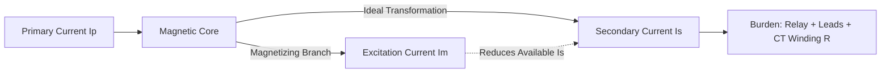
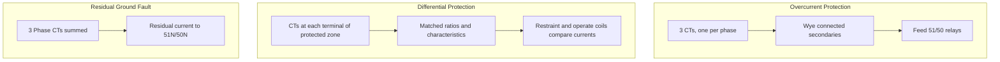
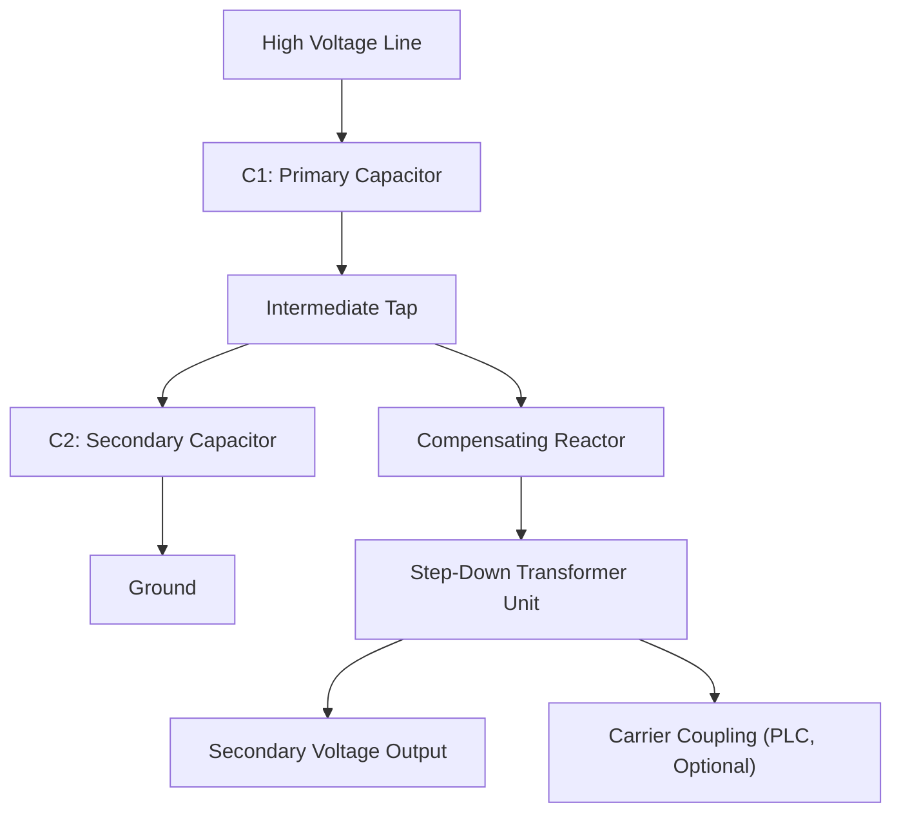
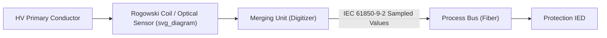

## Instrument Transformers for Protection Applications

### Overview

Instrument transformers step down high-magnitude primary voltages and currents to standardized, low-magnitude secondary values that protective relays, meters, and control equipment can safely process. Two families exist: current transformers (CTs) and voltage transformers (VTs, also called potential transformers or PTs). For protection applications, CTs and VTs must maintain accuracy not only under normal load but during severe fault conditions, which distinguishes protection-class instrument transformers from metering-class devices.

### Current Transformers (CTs)

#### Basic Principle

A CT is a series-connected transformer whose primary winding (often just the busbar or cable passing through the core) carries full line current, and whose secondary winding delivers a proportionally scaled current, typically standardized to 5 A or 1 A.

$$I_s = \frac{N_p}{N_s} I_p$$

where $I_s$ is secondary current, $I_p$ is primary current, and $N_p$, $N_s$ are the primary and secondary turns.

**Key Points**

- CT secondaries must never be open-circuited while the primary is energized; an open secondary allows the core to saturate deeply, producing dangerously high voltage spikes across the open terminals.
- CT secondary burden (the impedance connected to the secondary, including relay coils, wiring, and meters) directly affects accuracy; higher burden pushes the CT toward saturation at lower fault currents.
- Polarity (dot markings, H1/X1 convention) must be respected for correct directional and differential protection operation.

#### CT Equivalent Circuit

The magnetizing (excitation) branch draws a portion of the ideal secondary current, which is why actual CT output deviates from the ideal ratio, especially near saturation.

#### Accuracy Classes for Protection

- **Metering CTs**: accurate over normal load range (5–120% of rated current), designed to saturate during faults to protect meters.
- **Protection CTs**: must remain reasonably accurate up to many times rated current (e.g., 20 times rated) so relays see a faithful current image during faults.

Common protection-class standards:

| Standard | Class Designation | Description |
| --- | --- | --- |
| IEC 61869-2 | 5P, 10P | Accuracy limit factor (ALF) of 5 or 10 times rated current, with 5% or 10% composite error limit |
| IEC 61869-2 | PR, PX | PX (formerly "Class X") defined by knee-point voltage, turns ratio, and winding resistance for differential/unit protection |
| IEEE C57.13 | C, T classes | C-class (calculated) e.g., C100, C200, C400 denotes secondary terminal voltage the CT sustains at 20x rated current with ≤10% ratio error |

#### Knee-Point Voltage and Saturation

The knee-point voltage $V_k$ is the secondary excitation voltage at which a 10% increase produces a 50% increase in excitation current (per IEC/BS definition). It characterizes when the CT core saturates.

$$V_k \geq K \cdot I_f \cdot (R_{ct} + R_l + R_r)$$

where $I_f$ is the maximum fault current referred to secondary, $R_{ct}$ is CT winding resistance, $R_l$ is lead resistance, $R_r$ is relay burden resistance, and $K$ is a design/dimensioning factor (varies by application, typically 1.5–2 for many differential schemes, with specific factors defined per relay manufacturer and scheme).

**[Inference]** Exact $K$ factors and saturation-avoidance criteria vary by protection scheme (differential, distance, overcurrent) and by relay manufacturer guidance, so specific numeric factors should be confirmed against the applied relay's technical manual.

#### CT Connections for Protection Schemes

- **Overcurrent/distance protection**: standard wye or delta CT connections feed phase and ground relay elements.
- **Differential protection**: requires CTs with matched characteristics at all boundary points of the protected zone (transformer, bus, line, generator); CT mismatch or unequal saturation during external faults can cause false tripping, addressed via percentage-restraint differential relays or high-impedance differential schemes.
- **Residual (ground) connection**: three phase CTs paralleled to derive $3I_0$ for ground fault detection; alternatively, a core-balance CT (zero-sequence CT) directly senses the vector sum.

#### CT Saturation Effects on Protection

Saturation distorts the secondary waveform, reducing the effective RMS current and introducing harmonics. Consequences include:

- Delayed or failed operation of overcurrent relays during high fault currents.
- Spurious operation of differential relays during external faults with asymmetrical DC offset (addressed by using high-impedance differential relays, harmonic restraint, or CTs with adequate knee-point margin).
- Reduced reach accuracy in distance relays.

**Example**

For a feeder with maximum through-fault current of 20 kA symmetrical primary, a CT ratio of 2000:5 (ratio 400:1), the secondary fault current would be 50 A. If total secondary burden (CT resistance + lead resistance + relay burden) is 2 Ω, the required secondary voltage is:

$$V_s = I_s \times Z_{burden} = 50 \, \text{A} \times 2\, \Omega = 100\, \text{V}$$

If the CT's knee-point voltage is only 80 V, the CT will saturate before reaching full fault current, distorting the relay's input and potentially delaying trip.

### Voltage Transformers (VTs/PTs)

#### Electromagnetic Voltage Transformers (EMVTs)

Conventional wound VTs use a shunt-connected primary winding across the line-to-ground or line-to-line voltage, stepping down to standardized secondary values (commonly 110 V, 115 V, or 120 V line-to-line, or 63.5/66.4/69.3 V line-to-neutral).

$$V_s = \frac{N_s}{N_p} V_p$$

**Key Points**

- VT secondaries must never be short-circuited; unlike CTs, VTs are voltage sources and a short circuit produces damaging overcurrent.
- Burden is expressed in VA rather than ohms and must stay within rated burden range for accuracy.
- VT accuracy classes (e.g., IEC 0.2, 0.5, 1.0, 3P, 6P) define permissible ratio and phase errors at specified burden and voltage ranges.

#### Capacitor Voltage Transformers (CVTs)

For transmission voltages (above ~72.5 kV), capacitor voltage transformers (CVTs) are typically more economical than EMVTs. A capacitive divider steps voltage down to an intermediate level (typically 5–20 kV), then an electromagnetic unit further reduces it to secondary voltage.

**Key Points**

- CVTs can exhibit transient overreach or underreach in distance protection due to the energy stored in the capacitive divider and compensating reactor, causing a delayed or distorted response to sudden voltage collapse during close-in faults.
- IEC 61869-5 defines CVT transient response classes to limit this ferroresonance and transient error behavior for protection use.
- Ferroresonance (a nonlinear resonant interaction between the CVT's compensating reactor/EMU and system capacitance) can produce sustained overvoltages or waveform distortion; ferroresonance-suppression circuits (passive or active) are commonly integrated.

#### Capacitive Divider Voltage Equation

$$V_{tap} = \frac{C_1}{C_1 + C_2} V_{primary}$$

### Comparison: CT vs VT for Protection

| Aspect | Current Transformer (CT) | Voltage Transformer (VT) |
| --- | --- | --- |
| Primary Connection | Series (in line) | Shunt (across line) |
| Secondary Hazard | Never open-circuit | Never short-circuit |
| Rated Secondary | 5 A or 1 A | 110/115/120 V (typical) |
| Key Protection Parameter | Knee-point voltage, ALF | Accuracy class, transient response (CVT) |
| Saturation Concern | Core saturation during high fault current | Ferroresonance, transient response (CVT only) |

### Non-Conventional Instrument Transformers (NCITs)

Modern substations increasingly deploy optical and electronic instrument transformers per IEC 61869-9/61869-13, using Rogowski coils or optical sensors (Faraday effect) for current, and capacitive/resistive dividers or Pockels-effect sensors for voltage, digitizing the signal near the primary conductor and transmitting via sampled values (IEC 61850-9-2) over fiber to protection IEDs.

**Key Points**

- Eliminates CT saturation concerns since Rogowski coils are inherently linear (no ferromagnetic core).
- Requires process bus architecture (IEC 61850-9-2 or 9-2LE) and precise time synchronization (IEEE 1588 PTP) for sampled value alignment across merging units.
- **[Unverified]** Long-term field reliability data for optical CTs/VTs versus conventional electromagnetic units varies by manufacturer and installation environment, and should be evaluated against specific vendor track records.

### CT/VT Ratio Selection Considerations

- **CT ratio**: chosen so maximum expected fault current does not exceed the accuracy limit factor, while normal load current remains within the linear metering range if dual-use; typically sized so rated primary current is 100–150% of maximum expected continuous load.
- **VT ratio**: chosen based on system nominal voltage and standard secondary voltage, with attention to burden VA at minimum and maximum expected system voltage (for undervoltage/overvoltage protection accuracy).

### Testing and Commissioning

- **CT polarity test**: DC "kick test" or dedicated polarity tester confirms dot-marked terminal relationships.
- **CT ratio test**: primary injection or ratio test set verifies actual transformation ratio against nameplate.
- **Excitation (saturation) test**: applies increasing AC voltage to the secondary (open primary) and plots the excitation curve to determine knee-point voltage and confirm it meets design requirements.
- **VT ratio and polarity test**: similar principle, applying known primary voltage and measuring secondary output, or using a calibrated VT test set.
- **Burden verification**: measured or calculated total connected burden compared against rated burden to confirm accuracy class is maintained.

### Common Protection Application Pitfalls

- **CT saturation on external faults** causing differential relay maloperation — mitigated with high-impedance differential schemes or percentage-restraint relays with harmonic blocking.
- **Mismatched CT ratios** across a differential zone requiring auxiliary matching CTs or software ratio-correction in numerical relays.
- **Shared CT cores** between protection and metering, where metering-class saturation during faults can be acceptable, but using a metering-class CT for protection is not, due to insufficient accuracy at high fault currents.
- **VT fuse/MCB failures** ("blown fuse" condition) causing false operation of distance or directional relays; addressed via voltage transformer supervision (fuse-failure detection) logic.

**Related Topics**

- Protective Relay Types (Overcurrent, Differential, Distance)
- CT Saturation Analysis and Transient Performance (IEEE C37.110)
- High-Impedance vs Low-Impedance Differential Protection
- IEC 61850 Process Bus and Sampled Value Architecture
- Voltage Transformer Fuse-Failure (Supervision) Schemes
- Zero-Sequence (Core-Balance) Current Transformers for Ground Fault Protection
- Relay Testing and Commissioning Methods