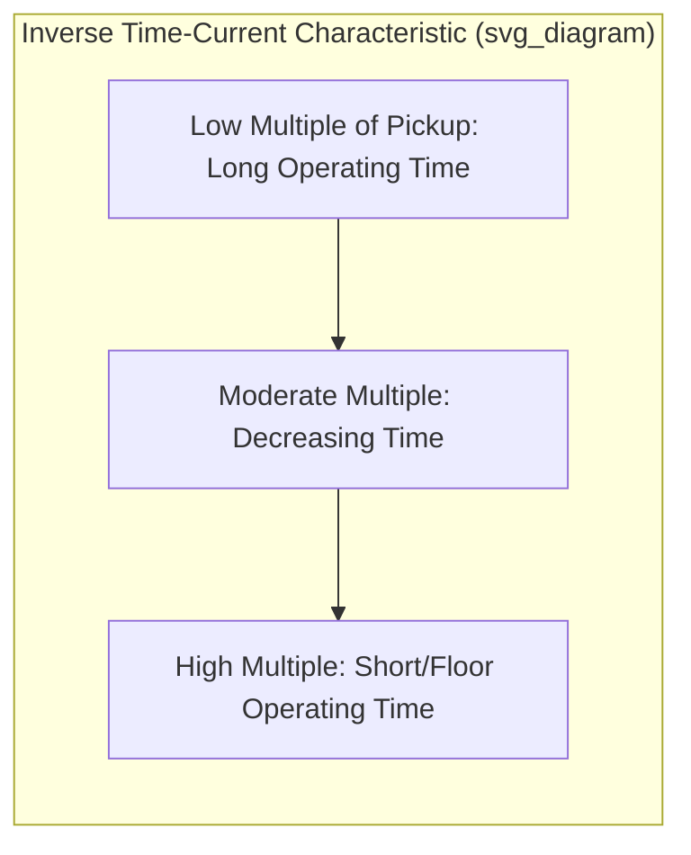
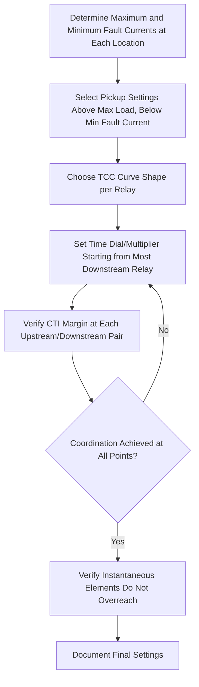

## Overcurrent and Time-Overcurrent Relay Coordination

### Overview

Overcurrent protection detects fault conditions by monitoring current magnitude and operates when current exceeds a preset threshold (pickup value). Time-overcurrent coordination is the discipline of setting multiple relays along a power system so that the relay closest to a fault operates first, isolating the smallest possible section, while upstream (backup) relays remain restrained unless the primary relay fails to clear the fault. This is foundational to radial and networked system selectivity.

### Overcurrent Relay Types

#### Instantaneous Overcurrent (Device 50)

Operates with no intentional time delay once current exceeds the pickup setting. Used for high-current, close-in faults where fast clearing is desired and coordination with downstream devices is not required (because instantaneous elements are set above the maximum fault current downstream devices would see).

#### Time-Overcurrent (Device 51)

Operates with an inverse time-current characteristic: the higher the fault current, the faster the operation. This inherent inverse relationship enables coordination — relays closer to the fault see higher current and operate faster.

#### Directional Overcurrent (Device 67)

Adds a directional element so the relay only operates for fault current flowing in a specified direction, essential in networks with multiple sources or loop configurations where non-directional relays cannot achieve selectivity.

### Time-Current Characteristic (TCC) Curves

The relay's operating time is a function of the multiple of pickup current $M$:

$$M = \frac{I_{fault}}{I_{pickup}}$$

Standard inverse-time curve families (IEEE C37.112 and IEC 60255-151) define operating time as:

$$t = TDS \times \left( \frac{A}{M^p - 1} + B \right)$$

where $TDS$ (or TMS in IEC terminology) is the time dial setting (or time multiplier setting), and $A$, $B$, $p$ are curve-specific constants.

**IEEE Standard Inverse Curve Constants (C37.112)**

| Curve Type | A | B | p |
| --- | --- | --- | --- |
| Moderately Inverse | 0.0515 | 0.1140 | 0.02 |
| Very Inverse | 19.61 | 0.491 | 2.0 |
| Extremely Inverse | 28.2 | 0.1217 | 2.0 |

**IEC Standard Curve Constants (60255-151)**

| Curve Type | K | α | c |
| --- | --- | --- | --- |
| Standard Inverse (SI) | 0.14 | 0.02 | 0 |
| Very Inverse (VI) | 13.5 | 1.0 | 0 |
| Extremely Inverse (EI) | 80.0 | 2.0 | 0 |
| Long-Time Inverse (LTI) | 120 | 1.0 | 0 |

IEC form:

$$t = TMS \times \left( \frac{K}{M^{\alpha} - 1} + c \right)$$

**Key Points**

- Very and extremely inverse curves provide better coordination margins where fault current varies significantly with distance (common on distribution feeders).
- Standard/moderately inverse curves are often preferred where fault current does not vary greatly (e.g., transmission systems with strong sources).
- Curve selection also considers coordination with fuses, reclosers, and downstream/upstream device characteristics already in service.

### TCC Curve Shape (Illustration)

The following SVG shows a representative log-log TCC plot with two coordinated relays:

<svg xmlns="http://www.w3.org/2000/svg" viewBox="0 0 600 400">
<rect width="600" height="400" fill="#ffffff" />
<text x="300" y="20" text-anchor="middle" font-size="14" font-weight="bold">Time-Current Characteristic Curves (svg_diagram)</text>
<line x1="60" y1="350" x2="560" y2="350" stroke="#333" stroke-width="1.5" />
<line x1="60" y1="350" x2="60" y2="40" stroke="#333" stroke-width="1.5" />
<text x="310" y="380" text-anchor="middle" font-size="12">Current (Multiple of Pickup, log scale)</text>
<text x="20" y="200" text-anchor="middle" font-size="12" transform="rotate(-90 20 200)">Operating Time (s, log scale)</text>
<path d="M 90 60 Q 200 150 320 300 Q 400 330 520 345" stroke="#1f6feb" stroke-width="2" fill="none" />
<text x="95" y="55" font-size="11" fill="#1f6feb">Upstream Relay (51-Main)</text>
<path d="M 90 150 Q 180 230 280 320 Q 350 340 480 349" stroke="#e8590c" stroke-width="2" fill="none" />
<text x="95" y="145" font-size="11" fill="#e8590c">Downstream Relay (51-Feeder)</text>
<line x1="330" y1="40" x2="330" y2="350" stroke="#999" stroke-width="1" stroke-dasharray="4,4" />
<text x="335" y="55" font-size="10" fill="#666">Coordination Check Point</text>
<line x1="330" y1="298" x2="330" y2="318" stroke="#2f9e44" stroke-width="2" />
<text x="340" y="312" font-size="10" fill="#2f9e44">CTI Margin</text>
</svg>

### Coordination Time Interval (CTI)

CTI is the minimum time margin between the operating time of an upstream (backup) relay and a downstream (primary) relay at the same fault current, ensuring the downstream device clears first.

$$CTI = t_{upstream} - t_{downstream} \geq t_{margin}$$

Typical CTI values range from 0.2 to 0.4 seconds for electromechanical relays and 0.15 to 0.3 seconds for numerical (microprocessor-based) relays, accounting for:

- Breaker interrupting time (typically 3–5 cycles, i.e., 0.05–0.08 s)
- Relay overtravel (electromechanical relays only; negligible for numerical relays)
- Current transformer transient errors
- Safety margin for setting/measurement tolerances

**[Inference]** Specific CTI values are commonly recommended by relay manufacturers and utility protection standards, but the exact margin selected in practice depends on breaker speed, relay technology, and utility protection philosophy, so it should be confirmed against applicable utility or IEEE guidelines for a given installation.

### Coordination Process

**Key Points**

- Coordination proceeds from the most downstream (load-end) device backward toward the source, since downstream relay settings are constrained by minimum fault current and load current, while upstream settings have more flexibility.
- Pickup current must be set above maximum expected load current (including cold-load pickup and transformer inrush where applicable) but below minimum fault current for the protected zone.
- Instantaneous elements (50) must be set above the maximum fault current at the far end of the protected zone (typically the next downstream bus) to avoid overreaching into the adjacent zone.

### Pickup Setting Considerations

$$I_{pickup} > I_{load,max} \times k_{margin}$$

Typical margin factors ($k_{margin}$) range from 1.25 to 1.5 times maximum load current, accounting for:

- Load growth
- Cold-load pickup (inrush from motor starting or thermostatic loads reconnecting after an outage)
- CT accuracy tolerances
- Emergency/contingency loading conditions

**Example**

A distribution feeder has maximum normal load of 400 A and minimum three-phase fault current at the far end of the feeder of 1200 A. Using a 400:5 CT (ratio 80:1):

- Load current in secondary terms: 400 A / 80 = 5 A
- Selecting pickup at 1.5 × 5 A = 7.5 A secondary (600 A primary) satisfies the load margin.
- Minimum fault current in secondary terms: 1200 A / 80 = 15 A, giving a fault-to-pickup ratio of 15/7.5 = 2.0, which is generally adequate sensitivity (many utility practices target a minimum ratio of 1.5–2.0 or higher for reliable operation).

### Coordination with Fuses and Reclosers

Distribution systems frequently coordinate relays with downstream fuses and reclosers:

- **Fuse saving (fast trip before fuse)**: recloser or relay instantaneous element operates before the fuse melts for temporary faults, then a reclose attempt is made; if the fault persists, time-delayed elements allow the fuse to clear for permanent faults.
- **Fuse blowing (trip-saving)**: relay/recloser time-delayed characteristic is coordinated to let the fuse clear first for faults within its protective zone, minimizing outage scope for permanent faults at the cost of a fuse operation for temporary faults.
- Coordination margins between relay curves and fuse melting/clearing curves follow similar CTI-style principles, comparing minimum melting time and total clearing time envelopes rather than a single curve.

### Ground (Residual) Overcurrent Coordination

Ground overcurrent elements (devices 50N/51N) typically use lower pickup settings than phase elements because zero-sequence fault current is often lower in magnitude but ground faults are also generally less tolerant of load-current masking. Ground coordination follows the same CTI principles but must separately account for:

- Zero-sequence mutual coupling on parallel lines, which can cause apparent current in a healthy adjacent circuit.
- Variation in ground fault current with system grounding method (solidly grounded, resistance grounded, ungrounded), which significantly affects available fault current magnitude.

### Coordination in Networked/Loop Systems

Simple time-overcurrent coordination becomes difficult in networked, looped, or multi-source systems because fault current can flow in multiple directions and coordination pairs are not fixed. Directional overcurrent relays (67/67N) resolve this by restricting operation to a specific current flow direction, enabling coordination around loops similar to a "coordination ring." For more complex meshed systems, differential or distance protection is often preferred over pure time-overcurrent schemes.

### Numerical Relay Considerations

Modern microprocessor-based relays support:

- Multiple setting groups, allowing different coordination schemes for different system configurations (e.g., normal vs. contingency switching states).
- Adaptive protection, where settings automatically adjust based on real-time system topology or measured conditions.
- User-programmable custom curves in addition to standard IEEE/IEC curves, useful for matching legacy electromechanical relay characteristics during system upgrades.
- Negligible overtravel and reset time compared to electromechanical relays, generally allowing tighter CTI margins as noted above.

### Common Coordination Challenges

- **Conflicting objectives between sensitivity and selectivity**: lower pickup improves fault detection sensitivity but risks nuisance tripping on load or coordination failures with downstream devices.
- **Fault current variation with system configuration**: switching changes (e.g., taking a parallel transformer or line out of service) can change fault current magnitudes enough to break coordination margins previously verified for the original configuration.
- **Multiple source contributions**: infeed from distributed generation or parallel sources can alter fault current seen by a given relay, requiring coordination studies to account for all credible operating configurations.
- **Curve saturation at high multiples**: some inverse curves flatten out (reach a floor time) at very high current multiples, which must be accounted for near strong sources.

### Coordination Study Workflow Summary

**Related Topics**

- Protective Relay Coordination Software and Short-Circuit Studies
- Instrument Transformers for Protection Applications
- Directional Overcurrent Protection (Device 67)
- Fuse-Recloser Coordination in Distribution Systems
- Ground Fault Protection and System Grounding Methods
- Differential and Distance Protection for Networked Systems
- Adaptive Protection Schemes in Numerical Relays