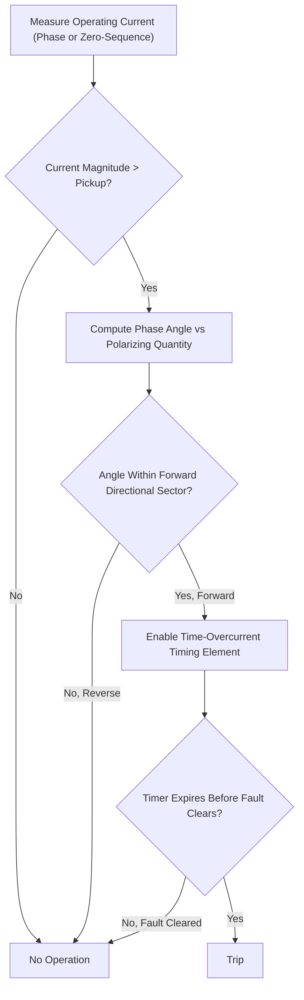

## Directional Overcurrent Protection

### Overview

Directional overcurrent protection (Device 67/67N) combines an overcurrent element with a directional element that determines the phase relationship between a measured current and a reference (polarizing) quantity, typically voltage. The relay operates only when both the current magnitude exceeds pickup and the current flows in the designated tripping direction. This addresses a fundamental limitation of plain overcurrent protection: in systems with multiple sources, parallel lines, or loop configurations, fault current can flow in either direction through a given relay location, and non-directional relays cannot achieve selective coordination in such cases.

### Why Directionality Is Needed

In a system fed from two sources (or with parallel lines forming a loop), a fault on Line 1 causes current to flow into the fault from both Bus A and Bus B. A non-directional relay at each line terminal cannot distinguish a fault on its own line from a fault on the parallel line without directional discrimination, since both scenarios can produce overcurrent in the same relay. Directional elements restrict each relay to respond only to current flowing into its own protected line section.

**Key Points**

- Directional overcurrent is essential wherever fault current can flow in more than one direction through a relay location: parallel lines, ring/loop-connected feeders, networks with distributed generation, and meshed subtransmission systems.
- Without directionality, achieving both selectivity and sensitivity in such topologies using time-overcurrent grading alone is generally not possible.
- Directional supervision is typically combined with standard inverse-time or instantaneous overcurrent elements, not used as a standalone protection function.

### Directional Element Principle

The directional element compares the phase angle between an operating quantity (measured current) and a polarizing quantity (usually a voltage, sometimes an auxiliary current) to determine whether the fault is in the "forward" (protected/tripping) or "reverse" (restrained) direction.

$$T = |S| \cos(\theta - \tau)$$

where $S$ is the operating torque/output quantity (historically a torque in electromechanical relays, now a computed quantity in numerical relays), $\theta$ is the measured phase angle between operating and polarizing quantities, and $\tau$ is the maximum torque angle (MTA), a relay setting chosen to align with the expected fault current angle relative to the polarizing voltage.

The relay operates when $T > 0$, i.e., when the measured angle falls within approximately $\pm 90°$ of the maximum torque angle, defining the directional characteristic as a half-plane (or a sector, depending on relay design) in the current-voltage phasor relationship.

### Polarization Methods

#### Phase (Self-Polarized) Directional Elements

Uses the voltage of the same phase as the operating current (e.g., $I_A$ polarized by $V_A$, or more commonly the associated line-to-line or quadrature voltage) for phase fault directional discrimination.

**Quadrature (90°) connection**: a common traditional polarization scheme where phase A current is compared against the $V_{BC}$ voltage (90° displaced from $V_A$ under balanced conditions), chosen historically because it keeps the polarizing voltage relatively unaffected by a fault on the faulted phase itself.

#### Zero-Sequence (Ground) Directional Polarization

For ground fault directional elements (67N), several polarizing sources are used:

| Polarizing Method | Source Quantity | Typical Application |
| --- | --- | --- |
| Zero-sequence voltage ($3V_0$) | Residual voltage from VT broken-delta or calculated $3V_0$ | Most common; reliable where $3V_0$ is measurable |
| Zero-sequence current | Neutral CT of a nearby grounded transformer | Used where VTs are unavailable or $3V_0$ is too small |
| Negative-sequence quantities | $V_2$, $I_2$ | Alternative for systems with limited zero-sequence sensitivity, or unbalanced/ungrounded systems |

**Key Points**

- Zero-sequence voltage polarization requires a VT connection capable of measuring residual voltage (e.g., wye-broken-delta secondary, or calculated $3V_0$ from a wye-connected VT set in numerical relays).
- Current polarization (using a grounded transformer's neutral CT as a reference) is common where a fixed, reliable zero-sequence current source exists near the relay location, such as at a grounded-wye/delta transformer bank.
- Negative-sequence directional elements are increasingly used in numerical relays as they avoid some of the sensitivity and mutual-coupling issues that can affect zero-sequence based schemes on parallel or heavily coupled lines.

### Maximum Torque Angle (MTA) Selection

The MTA is set to match the expected angle of fault current relative to the polarizing voltage for the protected system, maximizing relay sensitivity for actual fault conditions while providing restraint for reverse faults and normal load flow.

**Typical MTA guidance:**

- Phase directional elements: MTA commonly set between 30° and 60° lagging, reflecting typical transmission/distribution line X/R ratios.
- Ground directional elements: MTA commonly set between 45° and 90° lagging (often around 65–90°), reflecting the predominantly reactive character of zero-sequence source impedance in most grounded systems.

**[Inference]** Exact MTA values depend on the specific system's source and line impedance angles, and should be calculated or verified using system impedance data for the installation rather than applied as fixed defaults.

### Directional Characteristic Illustration

<svg xmlns="http://www.w3.org/2000/svg" viewBox="0 0 500 500">
<rect width="500" height="500" fill="#ffffff" />
<text x="250" y="25" text-anchor="middle" font-size="14" font-weight="bold">Directional Element Characteristic (svg_diagram)</text>
<line x1="50" y1="270" x2="450" y2="270" stroke="#999" stroke-width="1" />
<line x1="250" y1="70" x2="250" y2="470" stroke="#999" stroke-width="1" />
<text x="455" y="274" font-size="11">Ref (0°)</text>
<path d="M 250 270 L 250 90 A 180 180 0 0 1 430 270 Z" fill="#d3f9d8" fill-opacity="0.6" stroke="none" />
<path d="M 250 270 L 250 450 A 180 180 0 0 1 70 270 Z" fill="#ffe3e3" fill-opacity="0.6" stroke="none" />
<line x1="250" y1="270" x2="380" y2="140" stroke="#2f9e44" stroke-width="3" />
<text x="385" y="135" font-size="12" fill="#2f9e44">MTA (Max Torque Angle)</text>
<line x1="70" y1="130" x2="430" y2="410" stroke="#333" stroke-width="1.5" stroke-dasharray="5,3" />
<text x="380" y="415" font-size="11" fill="#333">Operate Boundary</text>
<text x="300" y="180" font-size="12" fill="#2b8a3e">Operate Region (Forward)</text>
<text x="150" y="360" font-size="12" fill="#c92a2a">Restrain Region (Reverse)</text>
<circle cx="250" cy="270" r="4" fill="#333" />
</svg>

### Directional Overcurrent Relay Logic

### Coordination of Directional Overcurrent Relays

In a loop or parallel-line system, directional relays are coordinated using a "coordination ring" approach: relays looking in one direction around the loop are graded against each other (like standard radial coordination), and relays looking in the opposite direction are graded independently, since a relay only needs to coordinate with other relays that can see the same direction of fault current for a given contingency.

**Key Points**

- Directional relays looking into a section (forward direction) coordinate with downstream non-directional or directional devices using standard CTI-based time-overcurrent grading principles.
- Reverse-looking elements are typically set with lower time delay or used for blocking/permissive schemes (e.g., directional comparison blocking) rather than participating in the primary forward coordination chain.
- Loss of polarizing voltage (e.g., VT fuse failure) can compromise a voltage-polarized directional element; many numerical relays include VT failure/supervision logic that either blocks the directional element or switches to an alternate polarizing method (e.g., memory voltage) to maintain security.

### Voltage Memory Polarization

For close-in three-phase faults, the polarizing voltage at the relay location may collapse to near zero, making phase angle determination unreliable using the instantaneous faulted voltage. Numerical relays commonly use "voltage memory," retaining the pre-fault voltage phasor for a short duration (typically several cycles) to maintain correct directional discrimination during voltage collapse.

**[Inference]** The exact memory duration and fallback behavior after memory expiration are manufacturer- and relay-model-specific and should be confirmed in the applicable relay instruction manual.

### Application Examples

**Example**

A subtransmission ring bus has two parallel 115 kV lines between Bus A and Bus B. Directional overcurrent relays are applied at both ends of each line:

- At Bus A, the relay looking into Line 1 (forward) is set to trip for faults on Line 1, coordinated in time with relays further along the system.
- The same physical relay location may also monitor Line 2 in the reverse direction (or a separate relay is dedicated to Line 2), restrained from tripping for faults that are actually on the parallel line, since a fault there is cleared by relays local to that line.
- This arrangement prevents a fault on Line 2 from causing unnecessary tripping of Line 1, preserving system integrity and minimizing the outage scope.

**Example**

A radial distribution feeder with a small embedded generator (distributed generation) at the customer end may require directional overcurrent protection at the substation recloser or relay to prevent the generator's fault contribution from causing miscoordination, and directional ground overcurrent at the point of interconnection to detect fault current flowing from the generator back toward the utility system, and to trip the generator's connection for utility-side faults per interconnection standards (e.g., IEEE 1547).

### Directional Overcurrent vs. Alternative Protection Schemes

| Consideration | Directional Overcurrent (67) | Differential Protection | Distance Protection (21) |
| --- | --- | --- | --- |
| Typical Application | Loop/parallel lines, DG interconnection | Transformers, buses, short lines | Transmission lines |
| Communication Required | No (standalone) or optional for pilot schemes | Yes, for line differential | Optional for pilot schemes (POTT/DCB) |
| Setting Complexity | Moderate (requires MTA, polarization method) | Moderate to high (CT matching, restraint) | High (zone reach calculations) |
| Sensitivity to CT/VT Issues | Sensitive to VT loss (directional integrity) | Sensitive to CT saturation/mismatch | Sensitive to VT loss (reach accuracy) |

### Common Application Issues

- **Incorrect MTA setting** relative to actual system source/line impedance angle, reducing sensitivity for actual fault conditions or causing incorrect directional decisions near the characteristic boundary.
- **Loss of polarizing voltage** without adequate supervision or memory polarization, potentially causing failure to operate (security bias) or incorrect operation (dependability bias), depending on relay design philosophy.
- **Mutual coupling on parallel lines** inducing zero-sequence voltage/current in a healthy line, which can affect ground directional element security if not accounted for in settings and polarizing source selection.
- **Weak-infeed conditions**, where one line terminal has insufficient fault current to reliably operate its directional element, relevant in pilot protection schemes and sometimes requiring weak-infeed logic or echo/tripping schemes.

**Related Topics**

- Overcurrent and Time-Overcurrent Relay Coordination
- Instrument Transformers for Protection Applications
- Pilot Protection Schemes (POTT, DCB, Directional Comparison)
- Distributed Generation Interconnection Protection (IEEE 1547)
- Zero-Sequence and Negative-Sequence Fault Analysis
- Distance Protection Fundamentals
- Voltage Transformer Supervision and Fuse-Failure Schemes