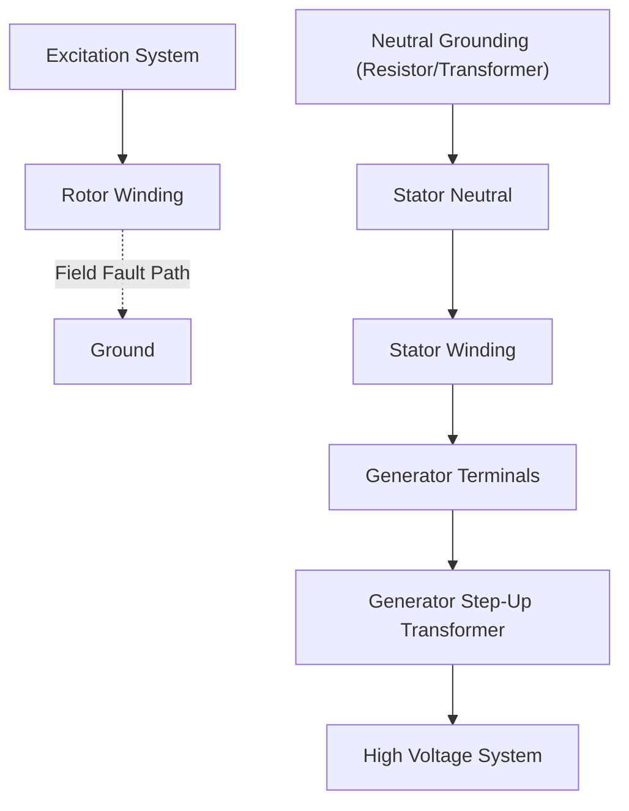
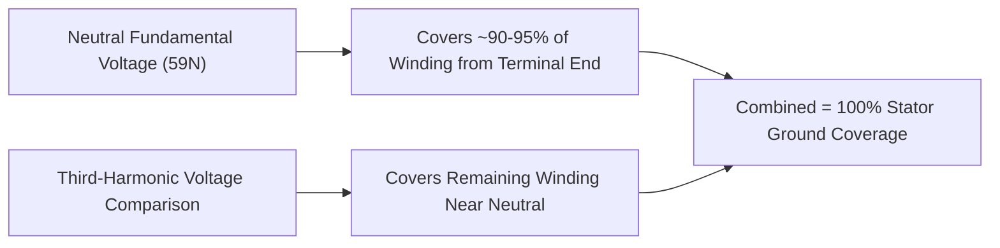
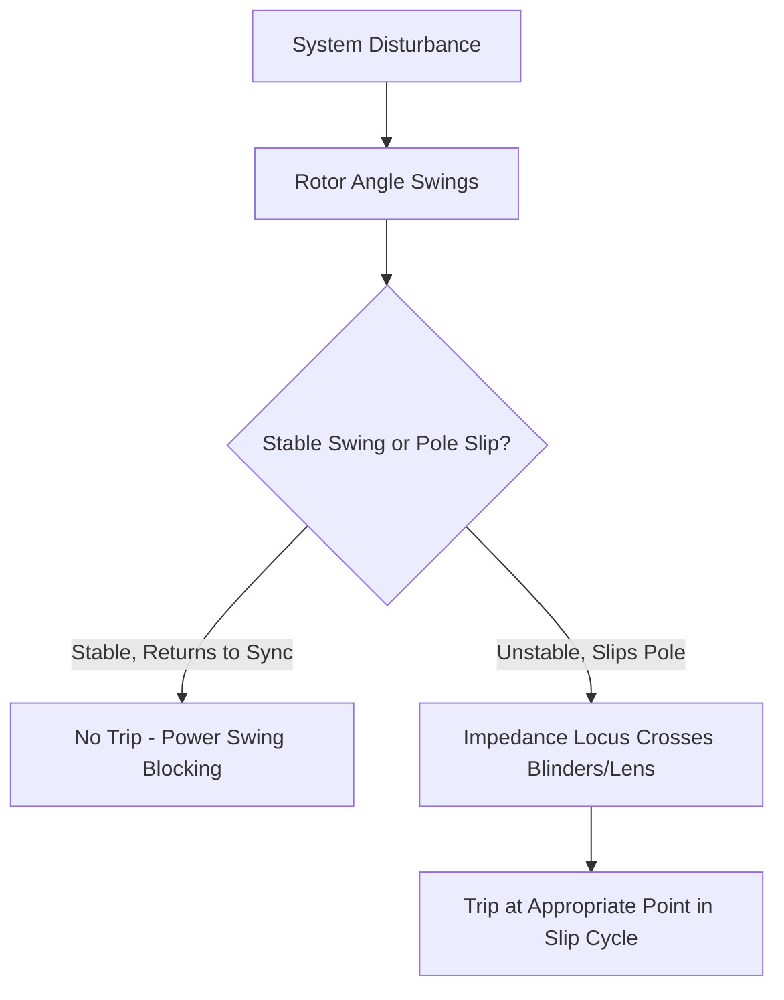
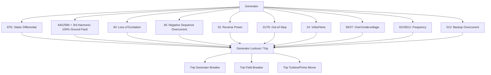

## Generator Protection Schemes

### Overview

Generator protection safeguards synchronous and, increasingly, inverter-based generating units against internal faults, abnormal operating conditions, and system disturbances that could cause equipment damage, safety hazards, or cascading system instability. Unlike line or transformer protection, generator schemes must address a broad range of electrical and mechanical stress mechanisms (stator faults, rotor faults, thermal limits, loss of synchronism, abnormal frequency/voltage) because generators represent high-value, long-lead-time assets where damage can result in extended outages.

### Generator Protection Function Summary

| ANSI Device | Function | Purpose |
| --- | --- | --- |
| 87G | Generator Differential | Detects stator winding phase faults |
| 87GT | Generator-Transformer Overall Differential | Detects faults spanning generator and step-up transformer |
| 64G / 64S | Stator Ground Fault (100%) | Detects ground faults across entire stator winding |
| 40 | Loss of Excitation | Detects field failure, prevents pole slipping/asynchronous operation |
| 32 | Reverse Power / Anti-Motoring | Detects generator operating as a motor (prime mover failure) |
| 46 | Negative-Sequence Overcurrent | Detects unbalanced loading, protects rotor from overheating |
| 21 | Loss of Synchronism / Out-of-Step | Detects pole slipping during system disturbances |
| 24 | Volts/Hertz (Overexcitation) | Protects core from overfluxing at low frequency/high voltage |
| 59 / 27 | Overvoltage / Undervoltage | Detects abnormal terminal voltage |
| 81O / 81U | Over/Underfrequency | Protects turbine blades, detects islanding |
| 51V | Voltage-Restrained/Controlled Overcurrent | Backup phase fault protection |
| 49 | Stator Thermal (RTD/Thermal Model) | Detects winding overtemperature |
| 60 | Voltage Balance (VT Fuse Failure) | Supervises voltage-dependent functions |
| 78 | Out-of-Step (alternate designation, overlaps with 21) | Pole slip / synchronism loss detection |

### Generator Protection Zone

### Stator Fault Protection

#### Generator Differential Protection (87G)

Compares current entering the stator winding (from the neutral-side CTs) against current leaving at the terminals (line-side CTs) for each phase, operating on the difference, which should be near zero under normal load or external fault conditions but significant for internal phase faults.

$$I_{op} = |I_{terminal} - I_{neutral}|$$

Percentage-restraint differential relays bias the operating threshold with a restraint quantity proportional to through-current, improving security against CT errors during heavy external faults or asymmetrical conditions:

$$I_{op} > k \times I_{restraint} + I_{min pickup}$$

**Key Points**

- Generator differential is typically a high-speed, highly sensitive scheme since internal stator faults can cause severe damage within cycles.
- CT accuracy and matching between neutral and terminal CTs is critical; generator CTs are typically specified with high accuracy class and adequate knee-point voltage for this application.
- Self-balancing (in-zone) differential schemes are used for smaller or medium generators; large units may use percentage-restraint schemes for better security against CT transient errors.

#### Stator Ground Fault Protection

Because most large generators use high-impedance (resistance) neutral grounding to limit ground fault current (often to under 10–25 A), conventional ground overcurrent schemes only detect faults over a limited portion of the winding.

**90% Stator Ground Protection**: A neutral overvoltage relay (59N/64G) measures fundamental-frequency voltage across the grounding resistor/transformer, detecting ground faults but with reduced sensitivity near the neutral end, where fault voltage approaches zero. Coverage is typically limited to roughly 90–95% of the winding from the terminal end.

**100% Stator Ground Protection**: Supplements the 90% scheme with a technique sensitive near the neutral, most commonly third-harmonic voltage monitoring. Since third-harmonic voltage is naturally present at the generator neutral and terminals under healthy conditions (due to winding/flux distribution) and its distribution changes characteristically during a neutral-end ground fault, comparing third-harmonic voltage magnitude or ratio between neutral and terminal provides coverage for the last 5–10% of the winding.

**[Inference]** Exact coverage percentages for 90% schemes vary with system grounding impedance, CT/VT accuracy, and relay sensitivity settings, and should be verified via specific setting calculations for the installation rather than treated as fixed universal figures.

### Rotor Protection

#### Loss of Excitation (40)

Detects failure of the excitation system (e.g., open circuit in field winding, exciter failure, accidental field breaker trip) by monitoring the apparent impedance seen at the generator terminals, which moves into a characteristic region on the R-X plane (typically offset mho or two-offset-mho characteristics) as the generator loses synchronism-supporting reactive support and begins absorbing reactive power from the system.

**Key Points**

- Loss of excitation causes the generator to operate as an induction generator, drawing reactive power from the system, risking rotor overheating from induced currents and potential system voltage instability.
- Two-zone offset mho characteristics are common: a fast zone for severe/rapid loss of excitation and a slower, more restrained zone for gradual field loss, coordinated with underexcitation limiter (UEL) action in the excitation system.
- Must be coordinated with generator capability curve (particularly the underexcited region) to avoid nuisance tripping during legitimate underexcited operation within capability limits.

#### Negative-Sequence Overcurrent Protection (46)

Unbalanced system conditions (single-line-to-ground faults, unbalanced loading, open conductors) produce negative-sequence current, which induces double-frequency currents in the rotor body and wedges, causing localized heating that standard thermal/overcurrent protection based on positive-sequence current would not detect.

$$t = \frac{K}{(I_2/I_{rated})^2}$$

where $K$ is the generator's negative-sequence withstand capability constant (per ANSI/IEEE C50.13, typically ranging from approximately 5 to 40 depending on generator type/cooling, with smaller air-cooled machines generally having higher K values and larger hydrogen/water-cooled machines lower values), and $I_2$ is negative-sequence current.

**[Inference]** Specific K constant values are machine-specific and specified by the generator manufacturer per applicable standards (ANSI C50.13 or IEC 60034-1); nameplate/manufacturer data should be used rather than generic assumptions for actual relay settings.

### Overexcitation Protection (Volts/Hertz, Device 24)

Operating the generator or step-up transformer core at excessive voltage relative to frequency causes magnetic core saturation and stray flux, leading to localized overheating. This is most critical during startup/shutdown (low frequency) and load rejection events (voltage rise).

$$\frac{V}{f} \text{(per unit)} = \frac{V_{pu}}{f_{pu}}$$

Typical continuous withstand limits are around 1.05 per unit V/Hz, with inverse-time tripping characteristics for higher levels, coordinated with the generator and transformer manufacturer's V/Hz capability curves.

### Loss of Synchronism / Out-of-Step Protection (21/78)

During severe system disturbances, a generator can lose synchronism with the system, causing the rotor angle to slip poles relative to the system, producing large current and torque oscillations. Out-of-step relays typically use impedance-based blinder or lens characteristics to detect the swing locus crossing the generator's electrical center, distinguishing stable power swings (which should not trip) from unstable/pole-slipping conditions (which require tripping, typically at a specific point in the slip cycle to minimize mechanical stress).

### Reverse Power / Anti-Motoring Protection (32)

Detects loss of prime mover input (e.g., turbine trip, boiler failure, loss of steam) while the generator remains connected to the system, causing it to draw real power from the system and motor the turbine-generator shaft. This condition risks mechanical damage, particularly to steam turbine blades operating without adequate steam flow for cooling, or hydraulic turbine cavitation.

**Key Points**

- Sensitivity requirements vary significantly by prime mover type: steam turbines typically require very sensitive settings (as low as 0.5–3% of rated power) due to blade windage/cooling concerns, while diesel or gas turbine units may tolerate higher motoring power before damage risk.
- Time delay is applied to avoid nuisance tripping during normal governor/load transients, while still operating promptly enough to prevent mechanical damage.
- Coordinated with turbine control/trip logic, since the prime mover control system typically also has its own reverse-power or anti-motoring protection.

### Frequency and Voltage Protection

- **Overfrequency (81O)/Underfrequency (81U)**: protects turbine blades from resonant stress at off-nominal frequency and can be used for islanding/load-shedding coordination; steam turbine blade frequency withstand curves impose cumulative time-at-frequency limits.
- **Overvoltage (59)/Undervoltage (27)**: protects generator and auxiliary equipment insulation and supports voltage stability; undervoltage protection must be coordinated to avoid tripping during legitimate system fault-clearing voltage dips.

### Backup and System Protection Interface

#### Voltage-Restrained/Controlled Overcurrent (51V)

Standard time-overcurrent protection is challenged on generators because fault current contribution decays over time as the machine's internal EMF and reactance change through subtransient, transient, and synchronous stages, and may fall below normal load current within seconds for some machines/faults. Voltage restraint (reducing pickup as terminal voltage drops during a fault) or voltage control (blocking the element until voltage falls below a threshold) maintains sensitivity for generator-fed faults despite this current decay.

#### Generator-Transformer Overall Differential (87GT)

For unit-connected generator-transformer configurations, an overall differential zone spanning both the generator and step-up transformer provides backup and can simplify protection zones, in addition to the dedicated generator differential (87G) and transformer differential (87T) zones.

### Typical Generator Protection One-Line Logic

**Key Points**

- A generator trip typically initiates a multi-stage lockout sequence: opening the generator breaker, tripping the field breaker (de-exciting the machine), and signaling the prime mover control system to shut down, since electrical isolation alone does not stop mechanical energy input.
- Some functions (e.g., loss of excitation, out-of-step) may be configured for sequential tripping (trip breaker first, then field) to reduce switching transients, per specific utility/manufacturer practice.

### Coordination with Generator Capability Curve

Many protection functions (loss of excitation, undervoltage, negative-sequence, stator thermal) must be set with reference to the generator's reactive and thermal capability curve to avoid restricting legitimate operating range while still protecting against genuine abnormal conditions. This requires coordination between protection engineers and the generator manufacturer's capability data (D-curve, reactive capability curve, V/Hz curve).

### Application Notes for Different Generator Types

- **Large steam/nuclear units**: comprehensive protection suites with high-impedance grounding, 100% stator ground protection, and sensitive reverse-power settings due to turbine blade sensitivity.
- **Hydro units**: often solidly or low-impedance grounded in some designs, with reverse-power/anti-motoring settings generally more tolerant than steam units, but still requiring coordination with governor and wicket-gate control.
- **Gas turbines/combined cycle units**: may have faster start/stop cycles, requiring protection settings coordinated with frequent transient conditions (start-up V/Hz excursions).
- **Inverter-based resources (wind, solar, battery storage)**: use fundamentally different protection approaches (converter-level current limiting, DC bus protection, anti-islanding) rather than classical synchronous generator schemes; **[Unverified]** the applicability of specific ANSI device numbers above to inverter-based resources varies significantly by manufacturer and should be evaluated against the specific converter control and protection architecture rather than assumed equivalent to synchronous machine protection.

**Related Topics**

- Instrument Transformers for Protection Applications
- Transformer Differential Protection
- Overcurrent and Time-Overcurrent Relay Coordination
- Directional Overcurrent Protection
- Generator Grounding Methods (High-Impedance, Low-Impedance)
- Islanding Detection and Anti-Islanding Protection for Distributed/Inverter-Based Resources
- Power Swing Detection and Blocking Schemes