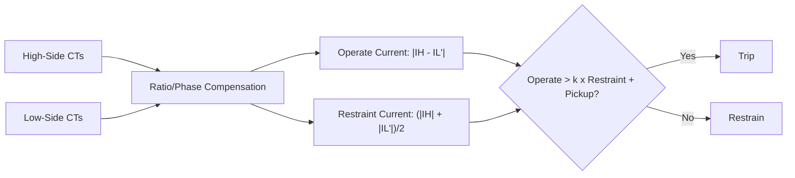
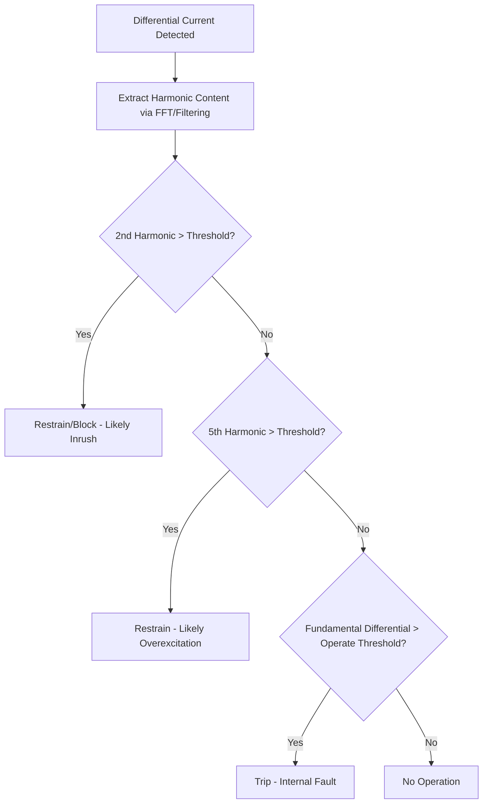
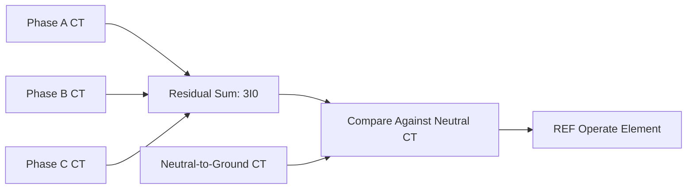
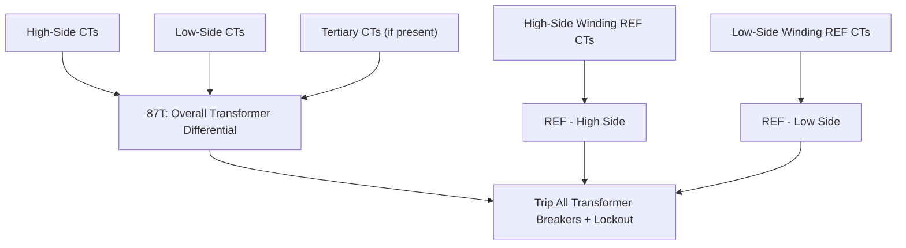

## Transformer Differential Protection

### Overview

Transformer differential protection (Device 87T) compares current entering and leaving a power transformer to detect internal faults such as winding-to-winding faults, winding-to-ground faults, and turn-to-turn faults. It provides fast, sensitive, and inherently selective protection since it responds only to faults within its defined zone (between the CT sets at each transformer terminal), remaining stable for external faults and normal load/magnetizing conditions. Unlike simple line or generator differential, transformer differential must specifically accommodate ratio transformation, phase shift, and inrush/overexcitation phenomena unique to transformers.

### Basic Differential Principle

Under normal or external fault conditions, current entering the transformer on one side, referred to the other side by turns ratio, should equal current leaving on the other side (accounting for magnetizing current). An internal fault breaks this balance, producing a differential (operate) current.

$$I_{op} = |I_{H} - I_{L}'|$$

where $I_H$ is high-side current and $I_L'$ is low-side current referred to the high-side base via CT ratio and transformer turns ratio compensation.

**Percentage-restraint characteristic:**

$$I_{op} > k \times I_{restraint} + I_{pickup}$$

$$I_{restraint} = \frac{|I_H| + |I_L'|}{2} \quad \text{(one common convention; some relays use max or sum)}$$

The restraint (bias) slope $k$ increases the required operate current as through-current increases, providing security against CT ratio errors, mismatch, and saturation during heavy external faults.

### Compensation Requirements Specific to Transformers

#### CT Ratio Matching

CT ratios on each side must be selected (or software-compensated in numerical relays) so that secondary currents are balanced under normal through-load, accounting for the transformer's turns ratio. Where standard CT ratios don't give an exact match, numerical relays apply software ratio-correction factors; older electromechanical/static relays required auxiliary interposing CTs.

$$CTR_{H} \times N_{H} = CTR_{L} \times N_{L}$$

(approximately, where $N_H$, $N_L$ represent the transformer's high/low winding turns, ensuring balanced secondary currents referred to a common base)

#### Phase Shift Compensation (Vector Group)

Transformers with delta-wye or other phase-shifting winding configurations introduce a phase angle shift between high-side and low-side currents (commonly 30° per vector group step) that must be compensated, or the relay would see a large "false" differential current under normal load.

**Key Points**

- Traditionally, this was done by connecting CTs in delta on the wye side of the transformer and wye on the delta side, physically compensating the 30° shift and providing zero-sequence current filtering as a side benefit.
- Modern numerical relays perform this compensation digitally, allowing standard wye-connected CTs on both sides while the relay internally applies the appropriate vector group compensation matrix (based on the configured vector group, e.g., Dyn1, Dyn11, YNyn0).
- Correct vector group configuration in the relay is critical; a mismatched setting produces a permanent false differential current proportional to load, which may cause nuisance tripping or mask real faults depending on characteristics.

#### Zero-Sequence Current Filtering

For transformers with a grounded-wye winding, external ground faults on that side produce zero-sequence current that flows through the wye winding but does not appear on the other side (if that side is delta or ungrounded-wye), which would create a false differential unless filtered.

**Key Points**

- Delta-connected CTs (or digital zero-sequence removal in numerical relays) on the grounded-wye side eliminate this zero-sequence contribution from the differential calculation.
- This filtering must be correctly configured per winding grounding configuration; incorrect configuration can cause misoperation for external ground faults.

### Magnetizing Inrush

When a transformer is energized, a transient magnetizing inrush current can reach several times rated current, appearing only on the energized side and thus resembling an internal fault to the basic differential element (unequal current, since inrush current does not flow through the other winding in the same proportion).

#### Harmonic Restraint

Inrush current is rich in second-harmonic content (typically 15–70% second harmonic, depending on transformer design, residual flux, and switching angle), distinctly different from fault current, which is predominantly fundamental frequency. Harmonic restraint blocks or restrains differential operation when second-harmonic content in the differential current exceeds a threshold (commonly 15–20%).

$$\text{Restraint if:} \quad \frac{I_{2nd harmonic}}{I_{fundamental}} > \text{threshold}$$

#### Harmonic Blocking vs. Restraint

- **Harmonic blocking**: completely blocks the differential element from tripping when harmonic content exceeds threshold, regardless of fundamental differential magnitude.
- **Harmonic restraint**: adds the harmonic component into the restraint quantity, requiring proportionally higher operate current to trip, but does not create an absolute block, allowing operation for a genuine internal fault occurring during inrush (e.g., fault during energization).

#### Fifth-Harmonic Restraint (Overexcitation)

Sustained overexcitation (excessive V/Hz, from overvoltage or underfrequency conditions) produces predominantly fifth-harmonic content in the exciting current, which can also cause a false differential. Fifth-harmonic restraint addresses this separately from second-harmonic (inrush) restraint since overexcitation is a sustained condition rather than a brief transient.

**[Inference]** Specific harmonic restraint thresholds (percentage values) are relay-manufacturer defaults that can typically be adjusted; optimal settings depend on the specific transformer's inrush characteristics (influenced by core design and residual flux) and should be verified against the applied relay's setting guidelines and, where available, transformer energization studies.

### CT Saturation During External Faults

Heavy external (through) faults can drive one set of CTs into saturation before the other (due to differing burden, residual flux, or X/R ratio effects), producing a spurious differential current that could cause misoperation for a fault outside the protected zone.

**Mitigation approaches:**

- Percentage-restraint characteristic with adequately steep slope at high current levels, since restraint current rises with through-current, requiring proportionally more operate current to trip.
- Dual-slope (variable percentage) characteristics, with a steeper slope at high current to accommodate expected CT saturation error growth.
- Waveform-based saturation detection algorithms in numerical relays, which recognize characteristic saturation signatures (e.g., flat-topped or distorted secondary current waveform) and add supplementary restraint or blocking during detected saturation.
- Adequate CT sizing (sufficient knee-point voltage/accuracy class per IEC 61869-2 PX or IEEE C57.13 C-class) to keep CTs out of saturation for the maximum expected through-fault current, as discussed in instrument transformer design practice.

### Typical Differential Characteristic (Dual-Slope)

<svg xmlns="http://www.w3.org/2000/svg" viewBox="0 0 550 400">
<rect width="550" height="400" fill="#ffffff" />
<text x="275" y="25" text-anchor="middle" font-size="14" font-weight="bold">Percentage-Restraint Differential Characteristic (svg_diagram)</text>
<line x1="70" y1="340" x2="520" y2="340" stroke="#333" stroke-width="1.5" />
<line x1="70" y1="340" x2="70" y2="50" stroke="#333" stroke-width="1.5" />
<text x="290" y="370" text-anchor="middle" font-size="12">Restraint Current (per unit)</text>
<text x="30" y="200" text-anchor="middle" font-size="12" transform="rotate(-90 30 200)">Operate Current (per unit)</text>
<line x1="70" y1="320" x2="200" y2="320" stroke="#1f6feb" stroke-width="2" />
<line x1="200" y1="320" x2="350" y2="260" stroke="#1f6feb" stroke-width="2" />
<line x1="350" y1="260" x2="500" y2="130" stroke="#1f6feb" stroke-width="2" />
<text x="150" y="310" font-size="10" fill="#1f6feb">Minimum Pickup (Flat Region)</text>
<text x="220" y="280" font-size="10" fill="#1f6feb">Slope 1 (Low Restraint)</text>
<text x="380" y="200" font-size="10" fill="#1f6feb">Slope 2 (High Restraint, CT Saturation Margin)</text>
<path d="M 250 300 L 400 180" stroke="#c92a2a" stroke-width="1" stroke-dasharray="4,3" />
<text x="300" y="230" font-size="10" fill="#c92a2a">Operate Region (Above Line)</text>
<text x="150" y="280" font-size="10" fill="#2b8a3e">Restrain Region (Below Line)</text>
</svg>

### Restricted Earth Fault (REF) Protection

REF protection is a specialized high-sensitivity ground fault scheme applied to a single transformer winding (typically the grounded-wye winding), summing the residual current from that winding's phase CTs and comparing against the current in the neutral-to-ground CT. It detects internal ground faults on that winding with much higher sensitivity than overall differential protection, particularly for faults near the neutral where fault current (and thus overall differential sensitivity) is low.

**Key Points**

- High-impedance REF schemes use a stabilizing resistor and voltage-operated relay element, relying on CT knee-point voltage design to remain stable for external faults even with CT saturation.
- Low-impedance (biased/percentage) REF schemes, common in numerical relays, use current-based restraint similar to overall differential, offering flexibility but requiring careful CT matching.
- REF protection is typically applied per winding (e.g., separately for high-side and low-side grounded windings) since it is winding-specific rather than an overall transformer zone function.

### Overall Differential Zone Configuration

**Key Points**

- Three-winding transformers (with a tertiary winding) require the differential zone to include all three winding CT sets, with appropriate ratio and phase compensation for each.
- Autotransformers require special consideration: the common winding carries the algebraic difference of high and low side currents, and differential zones are typically configured to include a CT set at the common point (tertiary or neutral-adjacent) to properly bound all zones (including a separate tertiary/delta zone if a tertiary winding exists).
- On-load tap changers (LTCs) shift the effective turns ratio during operation; the differential relay's restraint/pickup settings must accommodate this ratio variation across the full tap range, since a fixed ratio compensation could otherwise create a false differential at extreme tap positions.

### Tap Changer Considerations

$$I_{op,tap error} \approx I_{load} \times (\text{tap range \%})$$

The differential minimum pickup and slope settings must be set with margin above the maximum expected false differential current caused by tap position deviation from the nominal (compensated) tap, typically requiring pickup settings in the range of 20–40% (as a fraction of rated current) when wide tap ranges are present, though **[Inference]** the exact required margin depends on the specific tap range, tap step size, and CT/relay compensation approach, and should be calculated for the specific transformer and relay rather than assumed as a fixed percentage.

### Coordination with Other Transformer Protection

Differential protection is typically complemented by (not a replacement for) other transformer protective functions:

| Function | Device | Detects |
| --- | --- | --- |
| Sudden Pressure / Gas Relay | 63 | Internal arcing, insulation breakdown (mechanical/gas detection) |
| Overcurrent (Backup) | 51/50 | Backup for external faults, differential failure |
| Overexcitation (V/Hz) | 24 | Core overfluxing |
| Winding Temperature | 49 | Thermal overload |
| Restricted Earth Fault | 87N/64REF | Sensitive winding ground faults |

**Key Points**

- Sudden pressure (Buchholz) relays detect incipient faults (arcing, partial discharge) that may not yet produce sufficient current imbalance to operate differential protection, providing complementary sensitivity for slowly developing faults.
- Backup overcurrent protection provides redundancy for differential relay failure or CT circuit problems (open CT, wiring fault) and typically also protects against faults external to the differential zone that require backup clearing.

### Numerical Relay Implementation Notes

- Modern numerical transformer differential relays perform ratio, phase, and zero-sequence compensation digitally, eliminating the need for interposing/auxiliary CTs required by older electromechanical schemes.
- Dual-slope or multi-slope percentage-restraint characteristics with second and fifth harmonic restraint/blocking are standard in most commercial numerical relays.
- Many relays include waveform-based (rather than pure harmonic-content-based) inrush detection algorithms as a supplement or alternative to traditional harmonic restraint, intended to improve dependability for internal faults that happen to occur during energization while retaining security against inrush.
- CT circuit supervision (detecting open CT or CT wiring faults) is commonly included to prevent misoperation or blinding of the differential element due to a faulted CT circuit.

### Common Application Issues

- **Incorrect vector group compensation setting**, producing a standing false differential proportional to load current.
- **Inadequate CT knee-point voltage/accuracy** relative to maximum through-fault current, risking saturation-induced misoperation for external faults.
- **Insufficient minimum pickup margin** relative to tap changer range, causing nuisance operation as the LTC moves away from nominal tap under load.
- **Overlooking tertiary winding contribution** in three-winding or autotransformer differential zones, leaving a blind spot or false differential for faults involving the tertiary.
- **Harmonic restraint threshold mismatch** with actual transformer inrush characteristics (particularly for transformers with low-residual-flux core designs or specific switching conditions that produce reduced second-harmonic content), potentially delaying legitimate trips or, conversely, permitting inrush-induced misoperation if thresholds are set too loosely.

**Related Topics**

- Instrument Transformers for Protection Applications
- Generator Protection Schemes
- Overcurrent and Time-Overcurrent Relay Coordination
- Restricted Earth Fault and High-Impedance Differential Schemes
- Transformer Overexcitation and Volts/Hertz Protection
- Autotransformer and Multi-Winding Transformer Protection Zones
- CT Saturation Analysis for Differential Protection Security