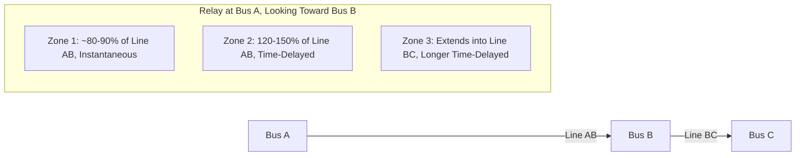
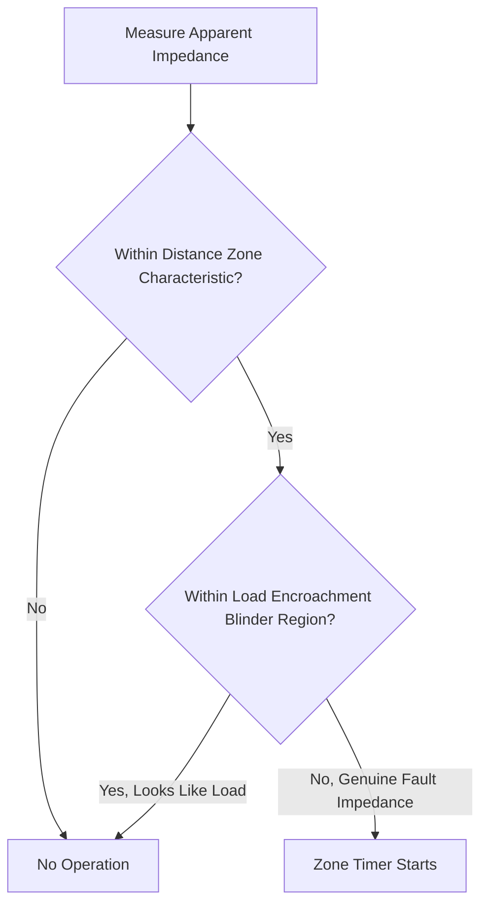
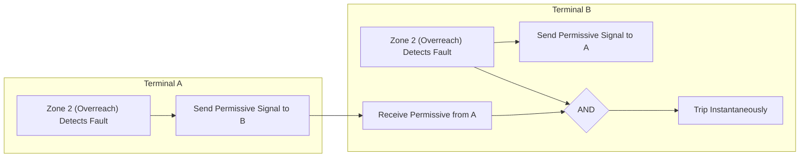
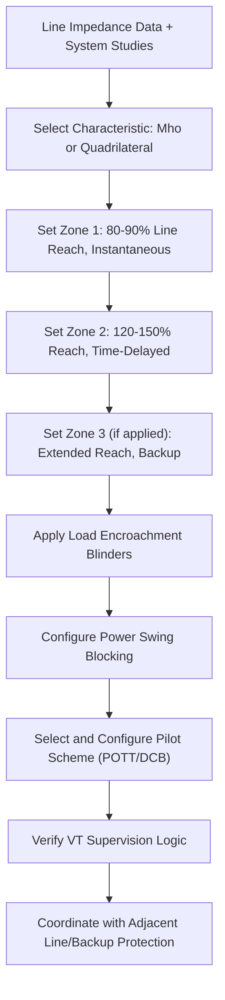

## Transmission Line Distance Protection

### Overview

Distance protection (Device 21) determines the location of a fault by calculating apparent impedance from voltage and current measured at the relay location, comparing it against predetermined reach zones. Because line impedance is approximately proportional to distance, this allows the relay to estimate fault distance and apply appropriately graded tripping zones without dependence on absolute current magnitude, which varies significantly with source strength and system configuration. Distance protection is the predominant primary protection method for transmission lines, particularly where communication-based schemes are impractical or as backup to pilot protection.

### Basic Impedance Measurement Principle

$$Z_{measured} = \frac{V_{relay}}{I_{relay}}$$

For a fault at distance $x$ along a line with impedance per unit length $z$, the relay measures approximately:

$$Z_{measured} \approx x \times z + R_{fault}$$

where $R_{fault}$ represents fault resistance (arc resistance, tower footing resistance), which introduces measurement error, particularly for phase-to-ground faults with significant fault resistance.

**Key Points**

- The relay does not measure distance directly; it measures impedance, which is used as a proxy for distance based on the known line impedance parameters.
- Fault resistance is a major source of underreach error (measured impedance appears larger than the actual fault reactance), particularly significant on longer lines or high-resistance ground faults through vegetation or tower footing resistance.
- Six separate measuring elements (or equivalent phasor-based calculations in numerical relays) are typically required to cover all fault types: three phase-to-phase loops (AB, BC, CA) and three phase-to-ground loops (AG, BG, CG).

### Fault Loop Selection

| Fault Type | Measuring Loop | Voltage Used | Current Used |
| --- | --- | --- | --- |
| Three-Phase | Any phase-phase loop | $V_{AB}, V_{BC}, V_{CA}$ | $I_A - I_B$, etc. |
| Phase-to-Phase (BC) | BC loop | $V_B - V_C$ | $I_B - I_C$ |
| Phase-to-Ground (AG) | AG loop | $V_A$ | $I_A + k_0 \times 3I_0$ |

For ground faults, a zero-sequence compensation factor $k_0$ (residual compensation factor) adjusts the measured loop impedance to account for the difference between positive-sequence and zero-sequence line impedance:

$$k_0 = \frac{Z_0 - Z_1}{3 Z_1}$$

where $Z_0$ is zero-sequence line impedance and $Z_1$ is positive-sequence line impedance.

**[Inference]** Different relay manufacturers may define or apply the residual compensation factor with slightly different conventions or notations; the specific formula and setting parameter names should be confirmed against the applied relay's instruction manual.

### Zone Stepping and Reach Philosophy

**Zone 1**: Set to approximately 80–90% of the protected line's impedance, operating instantaneously (no intentional time delay). The margin below 100% avoids overreaching into the adjacent line due to measurement errors (CT/VT accuracy, line parameter uncertainty), which would cause miscoordination for faults just beyond the remote bus.

**Zone 2**: Set to approximately 120–150% of the protected line, ensuring the entire line is covered even accounting for underreach effects (fault resistance, infeed), with a time delay (typically 0.2–0.4 seconds) to coordinate with Zone 1 of the adjacent line's relay and remote bus breaker failure clearing.

**Zone 3**: Extends further, often into or beyond the next adjacent line, providing remote backup protection with a longer time delay (typically 0.4–1.0 seconds or more), though Zone 3 application requires careful study to avoid overreach into heavily loaded conditions or miscoordination in networked systems.

**Key Points**

- The 10–20% margin left uncovered by Zone 1 (between 80–90% and 100% of line length) is cleared by Zone 2 of the local relay (time-delayed) or Zone 1 of the remote-end relay (instantaneous), assuming the remote relay's Zone 1 reaches back toward the local bus, which is the typical arrangement for a line protected at both ends.
- Some utilities apply Zone 4 (reverse-looking) for local breaker failure backup or specific coordination needs.
- Zone reach settings must account for potential future system changes (line additions, source impedance changes) that could affect coordination margins, typically verified through periodic protection coordination studies.

### Distance Relay Characteristics (R-X Plane)

<svg xmlns="http://www.w3.org/2000/svg" viewBox="0 0 500 500">
<rect width="500" height="500" fill="#ffffff" />
<text x="250" y="25" text-anchor="middle" font-size="14" font-weight="bold">Distance Relay Characteristics on R-X Plane (svg_diagram)</text>
<line x1="50" y1="270" x2="450" y2="270" stroke="#999" stroke-width="1" />
<line x1="250" y1="70" x2="250" y2="470" stroke="#999" stroke-width="1" />
<text x="455" y="274" font-size="11">R</text>
<text x="255" y="80" font-size="11">X</text>
<circle cx="250" cy="270" r="60" fill="none" stroke="#1f6feb" stroke-width="2" />
<text x="255" y="215" font-size="10" fill="#1f6feb">Mho Zone 1</text>
<circle cx="250" cy="270" r="100" fill="none" stroke="#e8590c" stroke-width="2" stroke-dasharray="6,3" />
<text x="255" y="175" font-size="10" fill="#e8590c">Mho Zone 2</text>
<rect x="130" y="170" width="240" height="100" fill="none" stroke="#2b8a3e" stroke-width="1.5" stroke-dasharray="3,2" />
<text x="135" y="165" font-size="10" fill="#2b8a3e">Quadrilateral Zone (Resistive Blinders)</text>
<line x1="330" y1="130" x2="180" y2="410" stroke="#333" stroke-width="1" stroke-dasharray="2,2" />
<text x="335" y="130" font-size="9" fill="#333">Line Impedance Angle</text>
</svg>

### Mho Characteristic

A mho circle passes through the origin (relay location) on the R-X plane, providing inherent directionality (the entire circle lies in the forward direction if centered appropriately) and offering natural adaptation to fault resistance tolerance that scales somewhat with reach, making it a traditional choice for phase fault protection, particularly on longer, more heavily loaded lines where distinguishing load from fault impedance is important.

**Key Points**

- Self-polarized mho elements can lose directionality for close-in faults with voltage collapse; most implementations use memory polarization (retaining pre-fault voltage phasor) or cross-polarization (using healthy phase voltages) to maintain correct operation for close-in, zero-voltage faults.
- Mho characteristics provide good load encroachment tolerance at typical power factor angles for many applications, but heavily loaded lines may still require load encroachment blinders or logic to prevent misoperation during high-load, low-impedance-angle conditions that approach the characteristic.

### Quadrilateral Characteristic

A quadrilateral (polygon) characteristic independently sets reactance reach and resistive reach (blinders), allowing more resistive fault coverage tolerance without proportionally extending reactive reach, making it common for ground fault elements where higher fault resistance (via tower footing or arc resistance) is more likely, and for shorter lines where mho characteristics may provide insufficient resistive coverage.

**Key Points**

- Independent R and X reach settings provide more flexibility in tailoring the characteristic to expected fault resistance and load conditions compared to a mho circle.
- Load encroachment blinders (resistive limits) are typically applied to prevent the quadrilateral characteristic's wider resistive coverage from overlapping with normal or emergency load impedance.

### Load Encroachment

Heavy load current, especially at reduced voltage (voltage depression during system stress) or low power factor, can produce an apparent impedance that falls within a distance element's reach, risking undesired tripping during high-load (non-fault) conditions.

**Key Points**

- Load encroachment blinders or characteristics restrict relay operation in the region of the R-X plane corresponding to expected maximum load current at minimum expected voltage and typical load power factor range.
- Proper coordination between load encroachment settings and maximum emergency loading studies is essential, particularly on heavily loaded transmission corridors, to avoid restricting legitimate protection reach while preventing load-induced misoperation.

### Power Swing Detection and Blocking

System disturbances can cause the apparent impedance trajectory to swing through a distance relay's characteristic even without an actual fault (a "power swing"), which should not cause tripping since it does not indicate a fault requiring isolation.

**Power Swing Blocking (PSB)**: detects the rate of change of impedance (genuine faults cause near-instantaneous impedance change, while swings evolve over many cycles) using concentric blinder/timer logic, blocking distance elements from operating during a detected swing.

**Out-of-Step Tripping (OST)**: a related but distinct function that deliberately trips at a controlled point during an unstable (pole-slipping) swing, typically applied at specific system locations per stability studies rather than as a general line protection function (see generator out-of-step protection for a related application).

**[Inference]** The specific point in the R-X plane trajectory and timing thresholds used to distinguish a fault from a swing are relay-specific algorithm details and system-specific tuning parameters, and should be set based on system stability studies rather than generic defaults.

### Pilot (Communication-Assisted) Distance Schemes

Since Zone 1 alone cannot provide instantaneous coverage of 100% of the line, pilot schemes use communication channels between line-end relays to achieve high-speed tripping for the entire line length.

#### Permissive Overreaching Transfer Trip (POTT)

Each terminal's relay uses an overreaching zone (typically Zone 2) that, upon detecting a fault, sends a permissive signal to the remote terminal. The remote terminal trips instantaneously only if it also detects the fault in its own overreaching zone AND receives the permissive signal, providing security against single-relay misoperation.

#### Directional Comparison Blocking (DCB)

Each terminal sends a blocking signal when it detects a fault in the reverse direction (outside the protected line). Local tripping occurs on an overreaching forward zone unless a blocking signal is received from the remote end, making this scheme dependent on channel availability differently than POTT (loss of channel in DCB tends toward less security but higher dependability, opposite tendency to POTT).

| Scheme | Trip Logic | Channel Failure Behavior |
| --- | --- | --- |
| POTT | Local overreach AND received permissive | Fails to trip (secure but less dependable) |
| DCB | Local overreach AND NOT received block | May overtrip (dependable but less secure) |
| Direct Transfer Trip (DTT) | Remote signal alone can trip | Depends on supervision; used cautiously |

### Weak-Infeed Conditions

At a line terminal with little or no fault current contribution (weak source, or the line open at that end), the local relay's forward zone may not detect a fault clearly enough to send/confirm a permissive signal in POTT schemes, potentially preventing the strong-end terminal from tripping.

**Weak-infeed logic** typically allows a terminal to echo back a received permissive signal (even without independently detecting sufficient fault current) or to trip on undervoltage plus received permissive, ensuring both ends can clear the fault despite asymmetric fault current contribution.

### Line Current Differential as an Alternative

On some applications (particularly shorter lines or where communication bandwidth supports it), line current differential protection is used as an alternative or complement to distance protection, directly comparing current phasors (with time synchronization) between line ends rather than relying on impedance calculation. **[Inference]** The choice between distance and current differential protection for a given line depends on line length, available communication infrastructure, and utility protection philosophy; both are widely used, sometimes in combination (distance as primary or backup to differential).

### Voltage Transformer Supervision

Distance protection relies fundamentally on voltage measurement, making it vulnerable to VT circuit failures (blown fuse, open MCB, wiring fault) that could cause the relay to see a false low voltage, potentially causing unwanted operation (relay interprets loss of voltage as a close-in fault). Voltage transformer supervision (fuse-failure detection, device 60) monitors for VT circuit anomalies and blocks or alarms affected distance elements accordingly.

### Series-Compensated Line Considerations

Lines with series capacitor compensation present special challenges for distance protection: the capacitor can cause apparent impedance to appear inductive-negative or otherwise distorted (voltage/current phase reversal effects near the capacitor, sub-synchronous resonance interactions), often requiring specialized relay logic, capacitor bypass/protection coordination awareness, and sometimes alternative protection philosophy (e.g., greater reliance on differential schemes) for lines with significant series compensation.

**[Unverified]** The specific relay algorithm adaptations required for series-compensated line distance protection vary substantially by manufacturer and specific compensation level, and detailed application guidance should be obtained from the relay manufacturer and a dedicated series-compensation protection study for the specific line.

### Typical Distance Protection Application Summary

### Common Application Issues

- **Underreach due to fault resistance**, particularly for ground faults with significant arc or tower footing resistance, potentially causing a fault within the intended zone to be measured as outside it.
- **Overreach due to infeed effect**, where current contribution from an intermediate source (e.g., a tapped load or parallel source) between the relay and the fault causes the relay to underestimate actual fault distance (a form of apparent overreach in some configurations) or, conversely, outfeed conditions causing underreach; the specific direction of error depends on the infeed/outfeed topology.
- **Incorrect zero-sequence compensation factor**, causing systematic ground fault reach errors.
- **Load encroachment misconfiguration**, either restricting legitimate fault coverage (blinders set too aggressively) or allowing nuisance tripping under heavy load (blinders set too loosely).
- **Pilot channel failure or delay** affecting scheme security/dependability balance, particularly relevant when channel media (power line carrier, microwave, fiber) has intermittent performance characteristics.

**Related Topics**

- Instrument Transformers for Protection Applications
- Directional Overcurrent Protection
- Generator Protection Schemes (Out-of-Step/Power Swing)
- Pilot Protection Communication Channels (PLC, Microwave, Fiber)
- Series Capacitor Compensation and Protection Coordination
- Breaker Failure Protection
- Line Current Differential Protection