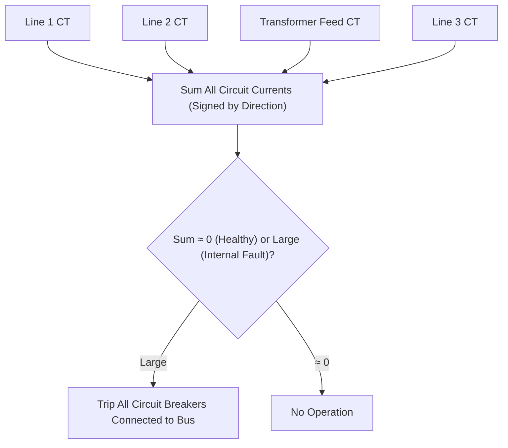
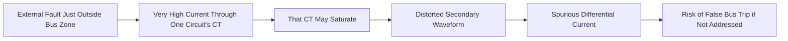
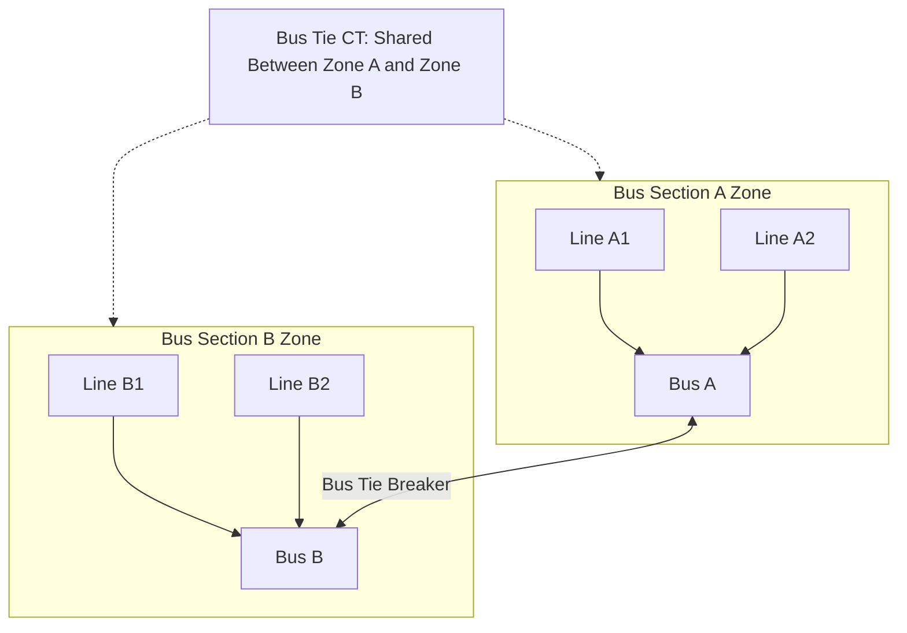

## Busbar Differential Protection

### Overview

Busbar differential protection (Device 87B) protects the busbar zone — the section of a substation between the CT sets bounding all circuits connected to the bus — by comparing the sum of all currents entering and leaving the bus. Under normal operation or external faults, Kirchhoff's current law dictates that the algebraic sum of all currents into a bus node equals zero; an internal bus fault breaks this balance. Because a bus fault can involve very high fault current (multiple source infeeds) and affects all connected circuits simultaneously, busbar protection demands both high security (to avoid unnecessary total substation outages from misoperation) and high speed/sensitivity for genuine internal faults.

### Basic Differential Principle

$$I_{op} = \left| \sum_{i=1}^{n} I_i \right|$$

where $I_i$ represents the current in each circuit (line, transformer, generator feeder) connected to the bus, with sign convention consistently defined as positive for current flowing into the bus.

For a healthy bus or external fault, $I_{op} \approx 0$ (aside from CT errors); for an internal bus fault, $I_{op}$ approximates the total fault current, since current continues flowing in from all sources but does not have a corresponding "out" path through the bus to balance it.



**Key Points**

- Unlike line or transformer differential (two or three terminals), busbar differential must sum currents from potentially many circuits (a large substation bus may have a dozen or more connected feeders/transformers), increasing the complexity of CT matching and the consequence of any single CT error.
- A busbar protection misoperation trips every circuit breaker connected to the bus, causing a total loss of the bus and all connected load/generation, making security against external-fault misoperation a paramount design consideration.
- Bus protection is typically zone-bounded precisely by the CT locations of each connected circuit breaker; any equipment between the CT and the bus itself (isolator/disconnector, bus section) falls within the protected zone, while equipment beyond the CT (into the connected line/transformer) does not.

### CT Saturation: The Central Design Challenge

Busbar protection is uniquely challenged by CT saturation because a close-in external fault (just outside the bus zone, on one connected circuit) can produce very high fault current through that circuit's CT while the bus itself carries no fault current. If that CT saturates while others do not, the resulting CT secondary current distortion creates a spurious differential signal that could cause busbar protection to incorrectly trip the entire bus for what is actually an external fault.



This scenario (through-fault with saturation on the faulted circuit's CT while healthy circuits' CTs remain accurate) is the dominant security concern in busbar protection design, more severe than for line/transformer differential because bus fault currents are often higher (multiple source contributions) and CT ratio/burden mismatches across many circuits are more likely.

### High-Impedance Busbar Differential Protection

A traditional and still widely applied approach connects all circuit CTs in parallel across a single, high-impedance relay element (historically a voltage-operated relay with a series stabilizing resistor). The high impedance forces any CT saturation current to circulate locally within the saturated CT's own circuit rather than flowing through the relay branch, providing inherent stability for external faults even with severe CT saturation.

$$V_{setting} \geq \frac{I_{f,max,external}}{CTR} \times (R_{ct} + 2R_l)$$

where $I_{f,max,external}$ is the maximum through-fault current (referred to primary), $CTR$ is the CT ratio, $R_{ct}$ is CT secondary winding resistance, and $R_l$ is the lead resistance from CT to the paralleling point (factor of 2 for the round-trip lead loop).

**Key Points**

- All CTs applied to a given high-impedance protection zone must have matched ratios (typically identical) since the scheme relies on current summation at a common secondary circuit node, unlike numerical differential schemes that can apply ratio correction in software.
- Stabilizing resistor value and relay voltage setting are calculated based on the worst-case through-fault scenario (maximum fault current with one CT fully saturated) to ensure the relay does not falsely operate; this calculation is a defining characteristic of high-impedance scheme design.
- A voltage-limiting device (e.g., metrosil/non-linear resistor) is typically applied across the relay circuit to limit peak voltage during an actual internal fault, since the high-impedance relay branch can otherwise develop very high transient voltages when full fault current attempts to flow through it.
- High-impedance schemes require dedicated CT cores (not shared with other protection functions) due to the strict matching and dedicated wiring requirements.

### Low-Impedance (Biased/Numerical) Busbar Differential Protection

Modern numerical busbar protection relays use a low-impedance, percentage-restraint approach similar in concept to transformer/generator differential, with each circuit's current individually measured and digitally summed, applying software ratio compensation so CTs of different ratios can be mixed on the same bus zone.

$$I_{op} > k \times I_{restraint} + I_{min}$$


$$I_{restraint} = \sum_{i=1}^{n} |I_i| \quad \text{(or an alternative restraint convention per manufacturer)}$$

**Key Points**

- Individual CT ratio compensation in software removes the requirement for identical CT ratios across all bus circuits, offering more flexibility for substations with mixed equipment ages/ratings.
- Numerical relays commonly include dedicated CT saturation detection algorithms (recognizing characteristic saturation waveform signatures) to add supplementary security beyond the basic percentage-restraint characteristic alone.
- Low-impedance schemes typically also provide integrated breaker failure protection and zone-selective interlocking logic as part of the same platform, leveraging the fact that all circuit currents are already being measured centrally.

### Comparison: High-Impedance vs. Low-Impedance Schemes

| Aspect | High-Impedance | Low-Impedance (Numerical) |
| --- | --- | --- |
| CT Ratio Requirement | Must be matched/identical | Can differ, ratio-corrected digitally |
| Security Principle | Circulating saturation current locally | Percentage restraint + saturation detection algorithms |
| Wiring Complexity | Dedicated CT cores, specific wiring topology | More flexible, centralized processing |
| Setting Calculation | Manual voltage/stabilizing resistor calculation | Relay-computed restraint slopes, often more automated |
| Flexibility for Bus Reconfiguration | Limited (fixed zone wiring) | Higher, especially with software-defined zones |

### Zone-Selective Bus Configurations

Substations with breaker-and-a-half, ring bus, double-bus, or sectionalized bus arrangements require busbar protection to dynamically or statically define multiple zones, often with bus-tie or bus-section breakers whose position determines which CTs belong to which zone.



**Key Points**

- The bus tie/coupler breaker's CT is logically included in both adjacent zone calculations, with its current sign/direction determined by which zone is being evaluated.
- For substations where bus configuration can change dynamically (e.g., double bus with bus coupler, transfer bus arrangements), protection systems use isolator/disconnector auxiliary contacts to dynamically reassign which CTs belong to which zone, requiring careful "topology processing" logic in numerical relays to maintain correct zone definition as switching occurs; incorrect topology tracking is a recognized risk area requiring robust auxiliary contact supervision.
- Check zone (overall zone) protection is sometimes applied as an additional independent differential zone encompassing the entire bus (all circuits, ignoring internal zone boundaries), providing a secondary confirmation requirement before tripping, adding security against topology processing errors in individually zoned schemes.

### CT Requirements for Busbar Protection

Given the central importance of avoiding saturation-induced misoperation, busbar protection CTs are typically specified with:

- High accuracy class and adequate knee-point voltage margin (per IEC 61869-2 PX class or IEEE C57.13 C-class) sized for the maximum credible through-fault current at that location.
- Matched characteristics (for high-impedance schemes) or documented individual characteristics (for low-impedance schemes with software compensation).
- Adequate thermal and mechanical rating for the maximum fault current the bus and connected equipment can deliver, which can be very high at buses with multiple strong infeeds.

### Breaker Failure Integration

Busbar protection systems are commonly integrated with breaker failure protection (Device 50BF), since a failure of a single breaker to clear a fault (whether the fault is on the bus or an adjacent circuit) requires tripping of all adjacent breakers to isolate the fault, a function naturally coordinated with the bus zone definitions already established for differential protection.

```mermaid
flowchart TD
    A["Feeder Protection Trips Breaker"] --> B{"Breaker Opens Within Expected Time?"}
    B -->|Yes| C["Normal Clearing"]
    B -->|No, Breaker Failure Detected"| D["50BF Timer Expires"]
    D --> E["Trip All Breakers in Local Bus Zone"]
    E --> F["Trip Remote-End Breakers via Transfer Trip (if applicable)"]
```

### Commissioning and Testing Considerations

- **CT ratio and polarity verification** across every connected circuit is critical before energization, since a single reversed CT polarity would cause that circuit's current to add rather than subtract in the differential sum, producing a standing false differential under normal load.
- **Primary injection testing** (where feasible) or secondary injection testing simulating multiple simultaneous circuit currents is used to verify differential stability under simulated through-fault conditions.
- **Topology/zone assignment verification** for dynamically zoned schemes, confirming that isolator/disconnector status correctly maps CTs to the appropriate zone under all credible switching configurations.
- **Check zone coordination testing**, where applicable, to confirm the overall check zone and individual zones agree for both internal and external fault simulations.

### Common Application Issues

- **CT saturation during close-in external faults** if CT sizing or scheme design margin is inadequate, historically the most significant cause of busbar protection misoperation.
- **Incorrect topology tracking** in dynamically zoned schemes following switching operations, potentially causing a circuit to be assigned to the wrong zone (or no zone), leading to either blinding (fault not detected) or false differential (nuisance trip).
- **CT ratio mismatch** in high-impedance schemes without adequate auxiliary CT compensation, producing standing differential current under load.
- **Inadequate coordination with breaker failure timers**, potentially causing unnecessary zone-wide tripping if breaker failure backup logic is not properly time-coordinated with primary protection clearing times.
- **Undersized CTs relative to available fault current growth** over the life of the installation, particularly relevant at substations where system fault levels increase due to network reinforcement or new generation connections after the original CT specification.

**Related Topics**

- Instrument Transformers for Protection Applications
- Transformer Differential Protection
- Transmission Line Distance Protection
- Breaker Failure Protection
- CT Saturation Analysis and Knee-Point Voltage Calculations
- Substation Bus Configurations (Breaker-and-a-Half, Ring Bus, Double Bus)
- Protection Zone Topology Processing in Numerical Relays