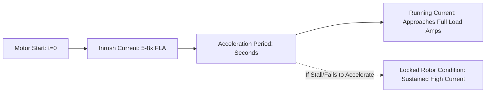
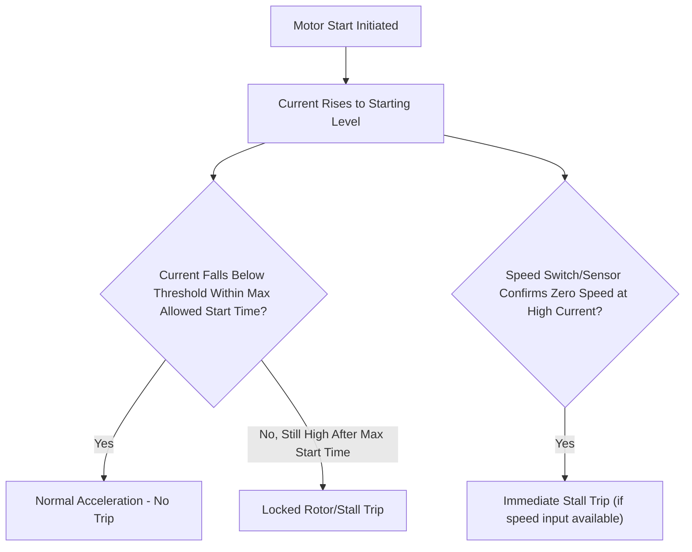
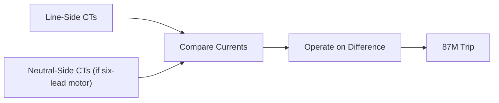
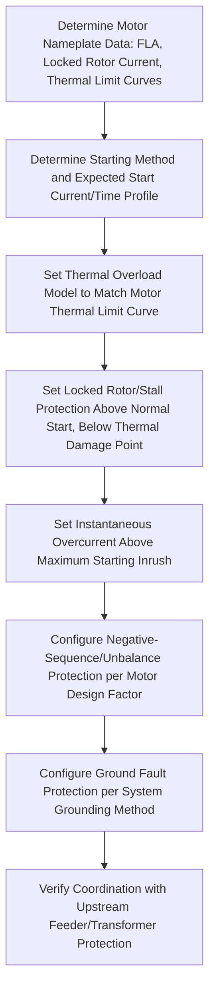

## Motor Protection Fundamentals

### Overview

Motor protection safeguards electric motors — predominantly induction motors, with synchronous motors requiring additional functions — against thermal damage, electrical faults, and abnormal operating conditions. Unlike generator or transformer protection, motor protection must accommodate high inrush current during starting (routinely 5–8 times rated current), thermal characteristics driven by both stator and rotor heating, and mechanical considerations from the driven load. Protection philosophy and function selection scale significantly with motor size, voltage class, and criticality of the driven process.

### Motor Protection Function Summary

| ANSI Device | Function | Purpose |
| --- | --- | --- |
| 49 | Thermal Overload | Protects stator/rotor from sustained overload heating |
| 50/51 | Instantaneous/Time Overcurrent | Detects short-circuit faults |
| 46 | Negative-Sequence Overcurrent | Detects unbalanced supply, protects rotor from unbalance heating |
| 37 | Undercurrent / Underpower | Detects loss of load (e.g., pump running dry, belt breakage) |
| 27 | Undervoltage | Detects supply voltage sag/loss |
| 59 | Overvoltage | Detects supply overvoltage |
| 66 | Starts-Per-Hour / Jam / Locked Rotor | Limits restart frequency, detects stall |
| 50S / 51S | Locked Rotor / Stall Protection | Detects failure to accelerate or mechanical jam |
| 87M | Motor Differential | Detects internal stator winding faults (larger motors) |
| 64 | Ground Fault | Detects stator winding ground faults |
| 32 | Reverse Power (synchronous motors, generators) | Loss of synchronism support |
| 40 | Loss of Excitation (synchronous motors) | Field failure detection |
| 55 | Power Factor (synchronous motors) | Excitation/synchronism monitoring |

### Motor Starting Characteristics

**Key Points**

- Starting current (locked rotor current) is substantially higher than running current but is a normal, expected transient; protection must distinguish this from an actual fault or a stalled/locked rotor condition that persists beyond the normal acceleration time.
- Motor thermal capability during starting is characterized by the motor's locked-rotor withstand time (thermal limit curve), typically specified by the manufacturer as maximum time the motor can sustain locked-rotor current at both hot and cold starting conditions.
- Large motors may have starting times (acceleration to full speed) ranging from a few seconds to tens of seconds depending on load inertia, requiring protection settings that permit normal starting while still detecting a genuine locked-rotor/stall condition.

### Thermal Overload Protection (49)

Protects against sustained overload conditions that would cause winding insulation damage through cumulative thermal stress, using a thermal model that approximates motor heating based on an $I^2t$ (or similar) relationship, often incorporating both positive- and negative-sequence current contributions since negative-sequence current causes disproportionate rotor heating.

$$t = \tau \ln\left(\frac{I^2 - I_{p}^2}{I^2 - I_{trip}^2}\right)$$

where $\tau$ is the motor's thermal time constant, $I_p$ represents pre-load thermal state (pre-existing heat content), and $I_{trip}$ is the thermal trip threshold, following the general form of thermal replica models used across motor protection relays (specific formula structure varies by manufacturer/standard, e.g., IEC 60255-149 / IEEE motor thermal models).

**Key Points**

- Modern numerical relays implement a thermal "replica" model that tracks cumulative heating and cooling over time, accounting for both running overload and, in more sophisticated implementations, separate stator and rotor thermal models with different time constants (since rotor heating during starting/stall is typically much faster than stator heating during running overload).
- Thermal memory is retained between starts, preventing successive starting attempts too close together from cumulatively overheating the motor even if no single start exceeds thermal limits individually (related to starts-per-hour limiting, device 66).
- Negative-sequence current weighting in the thermal model reflects the fact that a given magnitude of negative-sequence current produces significantly more rotor heating than the same magnitude of positive-sequence current, due to the near-double-supply-frequency induced rotor currents.

### Locked Rotor / Stall Protection (50S/51S)

Distinguishes normal starting inrush (expected, time-limited) from a locked rotor or stalled condition (current remains at starting level beyond the expected acceleration time, indicating failure to accelerate — mechanical jam, excessive load, low voltage, or broken rotor bar).

**Key Points**

- Where a speed-sensing input (speed switch, encoder) is available, stall protection can distinguish a genuine stalled-rotor condition (motor not turning) from a legitimately extended start (motor still accelerating, just slowly), allowing more sensitive and faster stall detection than current-only methods.
- Without speed sensing, protection relies on a timer set to the motor's maximum safe starting time (per manufacturer thermal limit curve), tripping if current remains above a threshold beyond that time, which necessarily provides less discrimination between a slow-but-successful start and a genuine stall.
- Locked rotor thermal withstand time is typically shorter when starting from a hot condition (motor already at elevated temperature from a prior run) than from cold, so relay logic often applies separate hot/cold thermal limit curves.

### Negative-Sequence (Unbalance) Protection (46)

Supply voltage unbalance (from unequal utility phase voltages, single-phasing from a blown fuse or open conductor, or unbalanced loading elsewhere on the system) produces negative-sequence current in the motor, inducing near-double-line-frequency currents in the rotor that cause disproportionate, highly localized rotor heating not proportional to the resulting increase in total RMS current.

$$I_2 (\%) \approx \frac{\% \text{Voltage Unbalance} \times K}{X_1''}$$

where $K$ is a factor depending on motor design (a small voltage unbalance can produce a substantially larger negative-sequence current, often cited as a multiplying factor of roughly 6–10 times the percentage voltage unbalance for typical induction motors, though **[Inference]** the exact multiplying relationship depends on the specific motor's subtransient/locked-rotor reactance and should be evaluated per motor nameplate/design data rather than assumed as a fixed universal ratio).

**Key Points**

- Single-phasing (complete loss of one supply phase, e.g., from a blown fuse) is a severe form of unbalance that can rapidly damage a motor if not detected quickly, since the motor continues attempting to run on two phases with substantially elevated current in the remaining phases and severe negative-sequence content.
- Negative-sequence protection is often combined with the thermal overload model (weighted contribution) rather than as a fully separate standalone element, though dedicated fast negative-sequence overcurrent elements are also common for rapid single-phasing detection.

### Ground Fault Protection (64)

Detects insulation failure to ground in the motor winding or connected cable, typically using either:

- **Residual (summed CT) connection**: three phase CTs paralleled, similar to feeder ground protection, adequate for many applications but with sensitivity limited by CT accuracy and mismatch under normal unbalanced load/inrush conditions.
- **Core-balance (zero-sequence) CT**: a single CT encircling all three phase conductors, directly sensing the vector sum, offering much higher sensitivity (able to detect ground fault currents of a few amps or less) since it avoids the summation errors of three separate CTs.

**Key Points**

- Core-balance CTs are strongly preferred for sensitive ground fault protection on motors, particularly on resistance-grounded or high-impedance grounded systems where ground fault current is deliberately limited to low levels.
- Ground fault protection must be set with adequate margin above normal CT/cable capacitive charging current (particularly relevant for long cable runs on ungrounded or high-impedance grounded systems) to avoid nuisance tripping.

### Undervoltage and Loss-of-Load Protection

**Undervoltage (27)**: protects against sustained low voltage conditions that increase motor current draw for a given mechanical load (torque is proportional to voltage squared for induction motors), risking thermal damage, and can also be used to initiate load shedding or sequenced restart logic after a voltage sag event.

**Underpower/Undercurrent (37)**: detects loss of mechanical load (e.g., a pump running dry, a broken coupling or belt, a conveyor jam causing the driven equipment — not the motor — to disconnect), which is not a motor electrical fault per se but often indicates a process problem requiring the motor to be stopped to prevent equipment damage (e.g., pump damage from running dry) or process upset.

### Motor Differential Protection (87M)

Applied on larger motors (typically above a few thousand horsepower/kW, threshold varies by utility/industry practice), motor differential compares current entering and leaving the stator winding (similar in principle to generator differential), detecting internal stator winding faults with high speed and sensitivity.

**Key Points**

- Requires access to both ends of each phase winding (six-lead motor connection), which is standard on larger motors but not always available on smaller machines with only three leads brought out.
- Self-balancing (single-CT-per-phase, core-balance style) differential schemes are an alternative for motors where only limited winding access is available, providing sensitive ground fault-focused protection rather than full phase differential.

### Synchronous Motor-Specific Protection

Synchronous motors require additional functions beyond standard induction motor protection, paralleling several generator protection concepts:

- **Loss of Excitation (40)**: detects field failure, which for a synchronous motor causes loss of synchronism and the motor pulling out of step, similar in consequence to generator field loss.
- **Power Factor Protection (55)**: monitors power factor as an indicator of excitation level and synchronism status, since a synchronous motor's power factor is directly related to field excitation.
- **Out-of-Step Protection**: detects pole-slipping conditions from excessive load torque, low excitation, or system disturbances, analogous to generator out-of-step protection.
- **Resynchronization/Pull-in Torque Monitoring**: during starting (synchronous motors typically start as induction motors via a damper/amortisseur winding before field application and synchronization), protection must supervise the transition to synchronous operation and detect failure to synchronize.

### Reduced-Voltage and Variable Frequency Drive (VFD) Starting Considerations

Where motors are started via reduced-voltage starters (autotransformer, resistor, soft-starter) or VFDs, protection settings must accommodate the different current/time profile during starting compared to across-the-line (direct-on-line) starting.

**Key Points**

- Soft-starters and VFDs typically limit starting current substantially below direct-on-line locked rotor current, which can allow more sensitive thermal/stall protection settings but requires coordination with the starter's own internal current-limiting behavior.
- For VFD-driven motors, much of the traditional starting-related protection (locked rotor timing, voltage dip during start) is often handled by the drive's internal protection, while the upstream protective relay (if separately applied) may focus more on protecting the supply feeder/transformer and providing backup, with specific coordination requirements between drive protection and relay protection depending on the drive manufacturer's fault-handling architecture.
- **[Unverified]** Specific VFD internal protection capabilities and the resulting division of protection responsibility between drive and external relay vary significantly by VFD manufacturer and should be confirmed against the specific drive's technical documentation for a given application.

### Motor Protection Coordination with Starting Equipment

### Common Application Issues

- **Thermal model mismatch with actual motor thermal limit curve**, particularly when generic relay defaults are used rather than the specific manufacturer's hot/cold locked-rotor withstand data, risking either premature tripping (nuisance) or inadequate protection.
- **Inadequate discrimination between starting inrush and locked-rotor/stall condition**, especially without speed sensing, potentially delaying stall detection or causing nuisance trips during legitimately extended starts (e.g., high-inertia loads, reduced starting voltage).
- **Undersized or improperly located ground fault CT**, reducing sensitivity or exposing the relay to false operation from CT positioning that does not correctly capture zero-sequence current (e.g., cable shield grounding practices affecting core-balance CT accuracy).
- **Neglecting negative-sequence protection coordination** with actual system voltage unbalance levels, particularly relevant where the motor is fed from a system with known or expected unbalance (e.g., near single-phase loads or unbalanced utility supply).
- **Starts-per-hour/thermal memory misconfiguration**, allowing successive restart attempts that cumulatively overheat the motor even though no single start individually triggers thermal protection.

**Related Topics**

- Instrument Transformers for Protection Applications
- Overcurrent and Time-Overcurrent Relay Coordination
- Generator Protection Schemes
- Transformer Differential Protection
- Motor Starting Methods (Direct-On-Line, Reduced Voltage, VFD)
- System Grounding Methods and Ground Fault Current Levels
- Negative-Sequence Fault and Unbalance Analysis