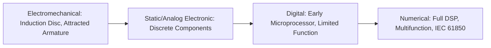
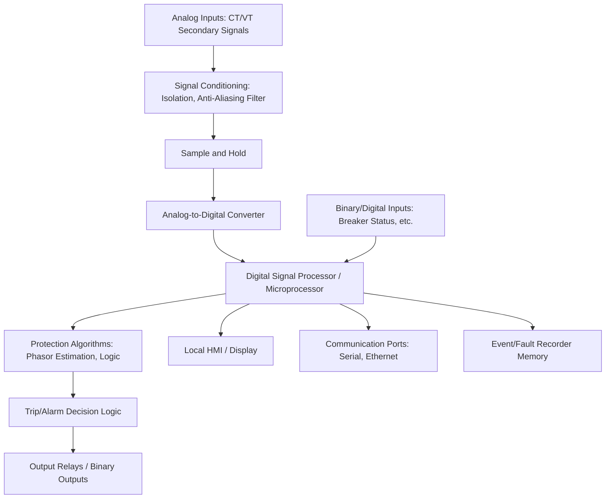
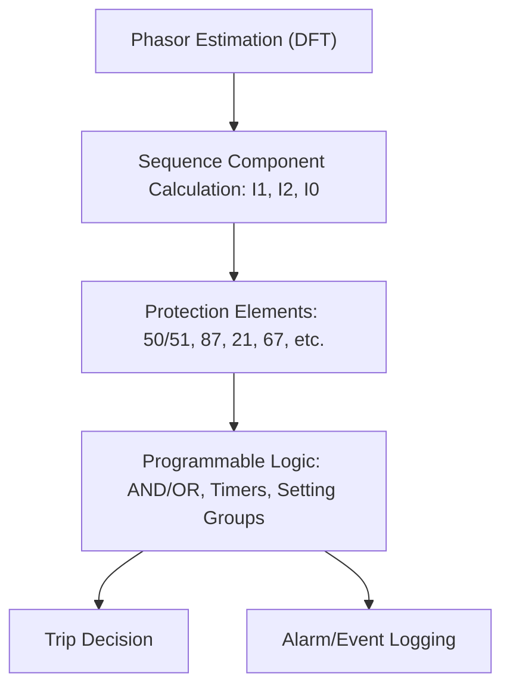
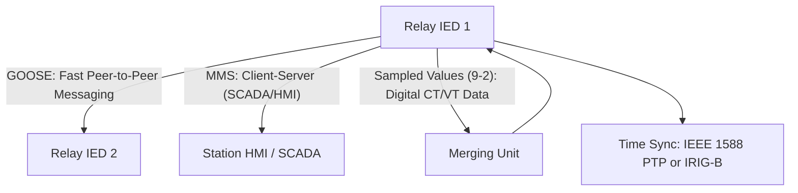
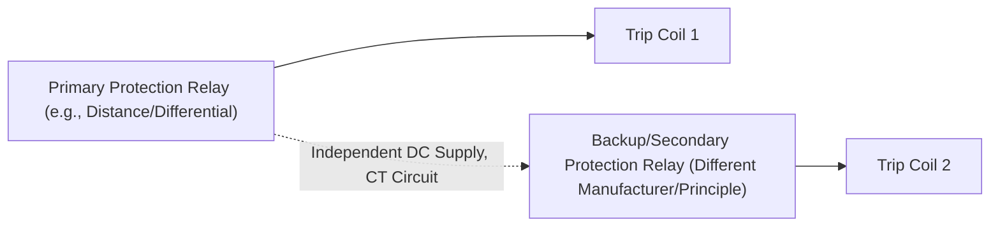
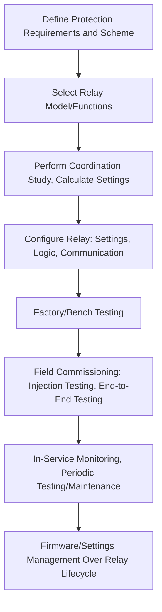

## Numerical and Digital Relay Architecture

### Overview

Numerical (microprocessor-based) protective relays sample analog voltage and current waveforms, convert them to digital values, and apply software-based algorithms to perform protection, control, metering, and communication functions within a single integrated device. They have largely superseded electromechanical and static (analog electronic) relays since the 1980s–1990s, offering multifunction integration, self-monitoring, programmable logic, extensive event/fault recording, and digital communication capability that older relay technologies could not provide.

### Evolution of Relay Technology

**Key Points**

- Electromechanical relays use physical principles (induction disc torque, electromagnetic attraction) to produce operating characteristics, offering high reliability and simplicity but limited flexibility, single-function-per-device design, and no self-diagnostic capability.
- Numerical relays consolidate many protection functions (multiple overcurrent elements, differential, distance, etc.) into a single device, dramatically reducing panel space, wiring, and commissioning effort compared to an equivalent electromechanical scheme.
- The terms "digital relay" and "numerical relay" are often used interchangeably in modern usage, though "digital" historically sometimes referred to earlier, less sophisticated microprocessor relays with more limited sampling/processing capability compared to full numerical (DSP-based) designs.

### Hardware Architecture

#### Analog Input Signal Conditioning

Current and voltage signals from instrument transformers are first scaled to levels suitable for the relay's internal circuitry (typically via internal auxiliary CTs/VTs or resistive dividers), then passed through anti-aliasing filters.

**Anti-Aliasing Filters**: Low-pass filters that remove frequency components above the Nyquist frequency (half the sampling rate) before digitization, preventing high-frequency noise or harmonics from being misrepresented as lower-frequency signals after sampling (aliasing).

#### Sampling and Analog-to-Digital Conversion

$$f_{sample} \geq 2 \times f_{max component}$$

(Nyquist criterion, though practical relay sampling rates are set well above this minimum to accommodate harmonic analysis and filtering algorithm requirements)

**Key Points**

- Typical numerical relay sampling rates range from approximately 16 to 128 samples per power cycle (or higher for specialized applications), commonly in the range of 32–96 samples/cycle for many general-purpose protection relays, though **[Inference]** the exact sampling rate varies significantly by manufacturer, relay generation, and specific protection function (e.g., some traveling-wave fault location functions use much higher sampling rates than standard phasor-based protection elements).
- ADC resolution (bits) determines the dynamic range and precision of digitized values; most modern relays use 16-bit or higher resolution ADCs to accommodate the wide current range from sensitive pickup settings to high fault currents without loss of accuracy.
- Simultaneous sampling (sample-and-hold circuits capturing all channels at the same instant) is important for phase angle accuracy in differential and directional elements, since sequential (multiplexed) sampling introduces small timing skew between channels that can distort phase measurements.

#### Processing Unit

The core processing is performed by a digital signal processor (DSP), general-purpose microprocessor, or increasingly a combination including field-programmable gate arrays (FPGAs) for time-critical, deterministic processing tasks (e.g., precise sampling timing, fast trip decision logic) alongside a more general processor for communication, logic, and HMI functions.

### Phasor Estimation Algorithms

Numerical relays convert time-domain sampled data into phasor (magnitude and phase) representations for use in protection algorithms, most commonly via a form of Discrete Fourier Transform (DFT).

$$X = \frac{2}{N} \sum_{k=0}^{N-1} x(k) e^{-j 2\pi k/N}$$

where $x(k)$ represents sampled values over one cycle (N samples), and $X$ is the resulting complex phasor at fundamental frequency.

**Key Points**

- A full-cycle DFT provides good harmonic rejection (theoretically eliminating DC offset and harmonics under ideal conditions) but introduces approximately one cycle of processing delay, a trade-off consideration for high-speed protection functions.
- Half-cycle or other shorter-window algorithms can reduce processing delay for faster tripping but with reduced harmonic/DC-offset rejection capability, representing a speed-versus-accuracy trade-off in algorithm design.
- Recursive DFT implementations update the phasor estimate with each new sample (rather than recalculating from scratch over a full window), improving computational efficiency for continuous real-time operation.
- **[Inference]** Specific algorithm variants (full-cycle, half-cycle, or advanced techniques such as Kalman filtering or least-squares estimation for faster/more accurate phasor extraction) are manufacturer- and function-specific implementation choices not typically fully disclosed in public relay documentation, so exact processing delay and accuracy characteristics should be obtained from the specific relay's technical specifications where precise performance data is needed.

### Protection Element Implementation

Once phasor quantities are available, protection algorithms (overcurrent pickup comparison, differential restraint calculation, distance impedance calculation, directional angle comparison) are implemented as software routines operating on these phasor values, executed on a defined processing cycle (often once per sample or once per few samples, depending on function speed requirements).

### Setting Groups

Most numerical relays support multiple setting groups (banks of protection settings), allowing rapid switching between different coordinated setting sets based on system configuration (e.g., normal vs. contingency switching state, seasonal loading variation, or alternate source configuration), selectable via binary input, communication command, or automatic logic based on system status.

### Self-Monitoring and Diagnostics

A significant advantage of numerical relays over electromechanical predecessors is continuous self-monitoring: watchdog timers, hardware diagnostic routines, CT/VT circuit supervision, and internal fault detection that can generate alarms or, in critical failure cases, automatically block relay output and signal an alarm condition, improving overall protection system dependability awareness (knowing when protection is unavailable) compared to electromechanical relays where internal failure might go undetected until a required operation failed to occur.

### Event and Fault Recording

Numerical relays typically include:

- **Sequence of Events Recording (SER)**: time-stamped log of digital input/output state changes and relay element pickups/operations, useful for post-fault analysis and coordination verification.
- **Fault/Disturbance (Oscillographic) Recording**: captures actual sampled or reconstructed analog waveforms (voltage and current) around a triggering event, providing detailed waveform data for post-event analysis, typically in COMTRADE format for interoperability with analysis software.
- **Fault Reports**: summary data (fault type, magnitude, duration, operated elements, estimated fault location for distance relays) generated automatically upon operation.

**Key Points**

- COMTRADE (Common Format for Transient Data Exchange, IEEE C37.111) is the standard file format for oscillographic records, allowing waveform data to be analyzed with third-party software regardless of relay manufacturer.
- Time synchronization (via GPS, IRIG-B, or network time protocols) across multiple relays in a substation or system is important for accurate event correlation during post-fault analysis, particularly for multi-terminal line events or system-wide disturbance analysis.

### Communication and Integration

#### Legacy Serial Protocols

Older and still-common protocols include Modbus, DNP3, and IEC 60870-5-103, typically over RS-232/RS-485 serial connections, used for SCADA integration, relay setting/configuration access, and basic event retrieval.

#### IEC 61850

The modern standard for substation automation communication, defining a comprehensive framework including:

- **GOOSE (Generic Object Oriented Substation Event)**: high-speed, peer-to-peer multicast messaging over Ethernet for fast inter-relay signaling (e.g., interlocking, breaker failure initiation, protection blocking signals), replacing hardwired control cabling in many modern designs.
- **MMS (Manufacturing Message Specification)**: client-server communication for SCADA polling, control commands, and configuration/settings access.
- **Sampled Values (IEC 61850-9-2)**: digitized instrument transformer data transmitted over the process bus from merging units to protection IEDs, supporting non-conventional (optical/electronic) instrument transformer architectures.
- **SCL (Substation Configuration Language)**: standardized XML-based configuration file format (ICD, CID, SCD files) enabling interoperable engineering and configuration exchange between different manufacturers' IEC 61850 tools.

**Key Points**

- GOOSE messaging typically achieves transmission times in the low milliseconds, suitable for time-critical protection signaling applications, though **[Inference]** specific achievable performance depends on network design, switch configuration, and traffic engineering, and should be verified through network performance testing for critical applications rather than assumed from generic specifications.
- Process bus architecture (sampled values from merging units) can eliminate traditional copper CT/VT wiring runs from the switchyard to the control building, though it introduces new dependencies on network reliability, precise time synchronization, and merging unit performance that must be addressed through appropriate architecture (redundant networks, PRP/HSR protocols) for protection-critical applications.

### Programmable Logic

Numerical relays provide user-configurable logic (via graphical logic editors, structured text, or similar programming interfaces) allowing custom combinations of protection elements, binary inputs/outputs, timers, and counters to implement scheme-specific logic (e.g., breaker failure initiation, autoreclose supervision, interlocking schemes, custom alarming) without requiring external relays or hardwired logic panels.

### Redundancy and Reliability Considerations

**Key Points**

- Critical protection applications (major transmission lines, large generators) commonly apply dual (main-1/main-2) protection using relays from different manufacturers or based on different operating principles, reducing common-mode failure risk (e.g., a firmware bug or design flaw affecting one manufacturer's relay family).
- Independent DC trip supplies, CT/VT circuits, and trip coils for main-1 and main-2 protection further reduce single-point-of-failure risk.
- Numerical relay self-monitoring alarms (relay "out of service" or "trouble" indications) are typically wired or communicated to SCADA/alarm systems so operators are aware when a protection function is unavailable, supporting timely corrective action.

### Cybersecurity Considerations

As numerical relays increasingly connect to Ethernet-based station and wide-area networks, cybersecurity has become a significant architecture consideration, addressed through practices such as:

- Role-based access control and strong authentication for relay configuration/settings access.
- Network segmentation (separating protection/control networks from corporate IT networks) and firewalls.
- Compliance frameworks such as NERC CIP (North American Electric Reliability Corporation Critical Infrastructure Protection) standards for bulk electric system relevant assets, or IEC 62351 for IEC 61850-based communication security.
- Secure firmware update processes and audit logging of configuration changes.

**[Unverified]** Specific cybersecurity requirements and compliance obligations vary by jurisdiction, system criticality classification, and applicable regulatory framework, and should be evaluated against the specific regulatory requirements applicable to the installation rather than assumed universal.

### Relay Engineering Workflow with Numerical Relays

### Common Architecture-Related Considerations

- **Processing delay trade-offs** between phasor estimation window length (accuracy/harmonic rejection) and protection speed requirements, particularly relevant for high-speed differential and distance protection applications.
- **Network dependency risks** in process bus/GOOSE-based architectures, requiring careful attention to network redundancy, latency, and failure-mode behavior to maintain protection dependability equivalent to traditional hardwired schemes.
- **Firmware and cybersecurity lifecycle management**, since numerical relays require ongoing firmware update evaluation, patch management, and configuration change control over their operational life, a maintenance dimension not present with electromechanical relays.
- **Time synchronization dependency** for accurate event correlation, sampled value alignment (process bus), and certain time-critical algorithms, requiring robust and redundant time source architecture (GPS antenna redundancy, PTP grandmaster redundancy).

**Related Topics**

- Instrument Transformers for Protection Applications
- IEC 61850 Process Bus and Sampled Value Architecture
- Transformer Differential Protection
- Busbar Differential Protection
- Protective Relay Coordination Software and Short-Circuit Studies
- Substation Cybersecurity and NERC CIP Compliance
- Relay Testing and Commissioning Methods