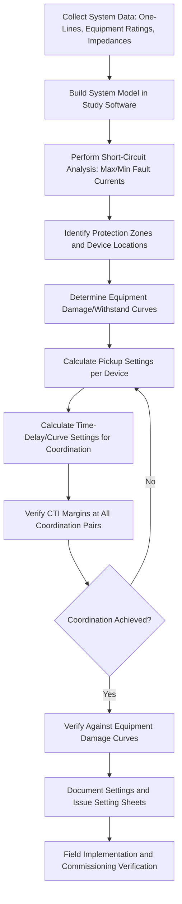
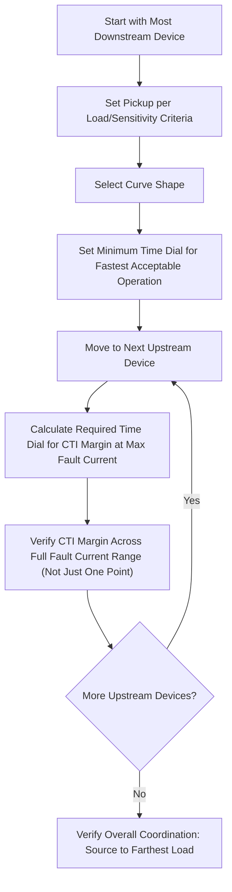
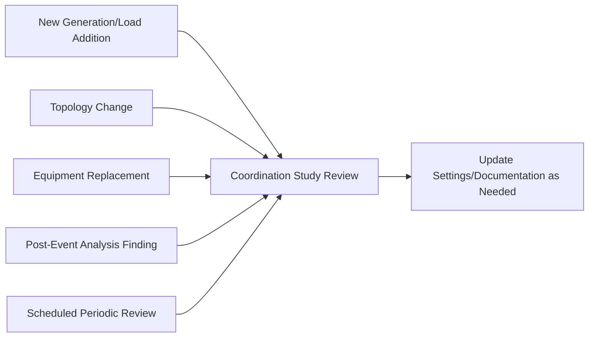

## Protection Coordination Studies and Relay Setting Calculation

### Overview

Protection coordination studies systematically determine relay settings across a power system so that protective devices operate selectively (only the device closest to a fault trips), sensitively (detects all credible faults within its zone), securely (does not misoperate for external events), and with adequate speed (minimizes equipment damage and system stability impact). The study integrates system modeling, short-circuit analysis, equipment damage/withstand curves, and device coordination margins into a documented set of relay settings applied across the protected system.

### Coordination Study Workflow

### System Data Collection

Accurate coordination requires comprehensive system data:

- **One-line diagrams**: showing all protected equipment, CT/VT locations and ratios, breaker positions, and protection device types.
- **Equipment impedance data**: transformer impedance (%Z, X/R ratio), line impedance (positive/negative/zero-sequence), generator subtransient/transient/synchronous reactances, motor locked-rotor impedance.
- **Source impedance**: utility/upstream system fault contribution (typically provided as available fault MVA or equivalent impedance at the point of connection, for both maximum and minimum system conditions).
- **Load data**: maximum normal and emergency loading at each protected point, used for pickup setting margin calculations.
- **Existing protection settings**: where modifying or extending an existing system, current settings of adjacent/upstream devices must be documented to maintain or improve coordination.

**Key Points**

- Both maximum and minimum fault current scenarios must be studied: maximum fault current (all sources in service, minimum system impedance) verifies protection speed/damage limitation adequacy, while minimum fault current (reduced generation, alternate switching configurations, single-source contingencies) verifies protection sensitivity is maintained under credible operating conditions.
- System topology changes (planned switching states, contingency configurations, seasonal source variations) that affect fault current levels must be identified, since a coordination study based only on a single "normal" configuration may miss cases where settings become inadequate or miscoordinated under alternate configurations.

### Short-Circuit Analysis

Short-circuit studies calculate fault current magnitude and distribution throughout the system for various fault types (three-phase, single-line-to-ground, line-to-line, double-line-to-ground) at each relevant location, forming the foundation for both pickup sensitivity and coordination timing calculations.

$$I_{fault,3\phi} = \frac{V_{LN}}{Z_1}$$

$$I_{fault,SLG} = \frac{3 V_{LN}}{Z_1 + Z_2 + Z_0}$$

where $Z_1$, $Z_2$, $Z_0$ are the positive-, negative-, and zero-sequence Thevenin impedances at the fault point.

**Key Points**

- Three-phase faults typically produce the maximum fault current on most systems (used for equipment rating and instantaneous element reach verification), while single-line-to-ground fault current depends heavily on system grounding method and can be either higher or lower than three-phase fault current depending on the zero-sequence impedance relative to positive-sequence.
- Fault current contribution from motors (particularly large induction and synchronous motor loads) can be significant in the first few cycles after a fault (subtransient contribution) and should be included in short-circuit studies per applicable standards (e.g., IEEE Std 141, IEC 60909) where motor load is substantial.
- Standards such as IEC 60909 and ANSI/IEEE C37 series provide standardized methodologies for short-circuit calculation, including specific treatment of motor contribution decay, X/R ratio effects on asymmetrical current, and other calculation nuances that should be applied per the relevant standard for the jurisdiction/industry.

### Pickup Setting Calculation Principles

#### Phase Overcurrent Pickup

$$I_{pickup} = k_{margin} \times I_{load,max}$$

Margin factor $k_{margin}$ typically 1.25–1.5 times maximum load, accounting for load growth, cold-load pickup, and CT accuracy tolerance, while remaining sensitive enough to detect the minimum expected fault current with adequate margin (commonly targeting a minimum fault-to-pickup ratio of around 1.5–2.0 or higher, per utility protection philosophy).

#### Ground Overcurrent Pickup

Ground (residual/zero-sequence) pickup is generally set more sensitively than phase pickup since balanced load current does not produce zero-sequence current (aside from small CT/measurement errors), allowing lower pickup thresholds while still avoiding nuisance operation from normal system unbalance and harmonic content.

#### Instantaneous Element Reach

$$I_{50 pickup} > k_{margin} \times I_{fault,max,zone boundary}$$

Set with margin (commonly 125–135% or higher, depending on utility practice and CT/study accuracy confidence) above the maximum fault current at the far end of the protected zone (or the maximum through-fault current for a downstream device), preventing the instantaneous element from overreaching into the next protected zone.

**[Inference]** Specific margin percentages for both pickup and instantaneous reach settings are utility/industry-practice-dependent rather than fixed universal values, and should be selected per applicable protection philosophy/standard for the specific system, informed by confidence in short-circuit study accuracy and CT performance.

### Time-Delay Coordination Calculation

For time-overcurrent relays, coordination proceeds from the most downstream device toward the source, calculating each device's time-dial/multiplier setting to satisfy the coordination time interval (CTI) at the maximum fault current seen by the immediately downstream device.

$$t_{upstream}(I_{fault}) - t_{downstream}(I_{fault}) \geq CTI$$

This calculation is typically performed iteratively across the full range of relevant fault currents (not just a single point) using coordination study software that plots time-current characteristic (TCC) curves, verifying adequate margin exists across the entire current range where both devices could see the fault, not merely at one operating point.

### Equipment Damage/Withstand Curve Verification

Beyond device-to-device coordination, settings must be verified against the thermal and mechanical withstand limits of protected equipment to ensure protection operates fast enough to prevent damage, even where device-to-device coordination alone would be satisfied.

| Equipment | Relevant Withstand Curve | Standard Reference |
| --- | --- | --- |
| Cables | Conductor thermal damage ($I^2t$) curve | ICEA, IEC 60287 |
| Transformers | Through-fault withstand (mechanical/thermal) curve | ANSI/IEEE C57.109 |
| Motors | Locked-rotor thermal limit (hot/cold) curve | NEMA MG-1, manufacturer data |
| Generators | Negative-sequence withstand ($K = I_2^2 t$) | ANSI/IEEE C50.13 |
| Conductors (Bare/Overhead) | Annealing/damage curve | IEEE 1284, utility-specific |

**Key Points**

- Transformer through-fault withstand curves (per ANSI/IEEE C57.109) define both mechanical (higher current, shorter duration, based on limited number of through-faults over transformer life) and thermal (lower current, longer duration) withstand categories, both of which must be checked against upstream/downstream protection clearing times.
- Where a coordination-based time delay would exceed equipment withstand capability, options include adding a dedicated protection zone (e.g., differential protection to reduce clearing time for a critical zone), accepting reduced coordination margin with compensating measures, or equipment upgrade, resolved through engineering judgment balancing selectivity, cost, and risk.

### Coordination Study Software Tools

Modern coordination studies are performed using dedicated software packages that integrate system modeling, short-circuit calculation, and TCC curve plotting/analysis. **[Unverified]** Specific commercial software packages and their exact feature sets change over time with vendor updates; commonly referenced tools in industry practice include products from vendors such as ETAP, SKM Systems Analysis (CAPTOR/DAPPER), and EasyPower, among others, but the current market landscape and specific capabilities should be verified directly with vendors or current industry sources rather than assumed from general familiarity, since this area evolves with software releases.

**Key Points**

- Coordination software typically integrates a system one-line model, automated short-circuit calculation, and interactive TCC plotting where multiple device curves can be overlaid and adjusted with immediate visual feedback on coordination margins.
- Device libraries within these tools typically include manufacturer-specific relay curve characteristics, fuse melting/clearing curves, and equipment damage curves, streamlining the process of building accurate coordination plots compared to manual calculation.

### Documentation: Relay Setting Sheets

A completed coordination study produces relay setting sheets (or equivalent digital setting files) documenting, for each protective device:

- Device identification, location, and associated CT/VT ratios.
- All applied protection function settings (pickup, time dial/curve, instantaneous reach, etc.) with calculated values and units.
- Reference to the coordination study revision/date and the fault current data used as the basis for calculation.
- Any special logic, blocking schemes, or setting group configurations applied.

**Key Points**

- Setting sheets serve as both the field implementation reference (for relay technicians configuring the physical device) and the historical record for future coordination study updates or troubleshooting.
- Version control and change management of setting sheets is important, since settings may be revised multiple times over a system's life as loads, sources, or topology change, and outdated setting sheets can lead to confusion or incorrect field configuration if not properly superseded.

### Periodic Review and Update Triggers

Coordination studies are not one-time exercises; they require periodic review and update triggered by:

- New generation or load additions changing fault current levels or load patterns.
- System topology changes (new lines, transformers, bus reconfigurations).
- Equipment replacement (different transformer impedance, different relay models/capabilities).
- Discovery of a misoperation or near-miss during an actual fault event, prompting review of the specific coordination pair involved.
- Periodic scheduled review per utility/industry practice (commonly every few years for critical systems, though **[Inference]** the specific review interval is utility/regulatory-practice-dependent rather than a universal fixed requirement).

### Coordination Study Considerations Across Protection Types

While the general CTI/margin-based approach described above applies most directly to time-overcurrent coordination, coordination studies for other protection types involve analogous but distinct considerations:

- **Distance protection**: zone reach calculations based on line impedance and adjacent line lengths, rather than CTI-based time grading, though Zone 2/3 time delays still require coordination margin calculation relative to adjacent zone clearing times.
- **Differential protection**: primarily involves CT sizing/matching verification and restraint slope selection rather than time-based coordination with other devices, since differential protection is inherently zone-selective by design.
- **Directional overcurrent**: requires the same CTI-based time grading as non-directional overcurrent, but only among devices that see the same direction of fault current flow for a given contingency, requiring careful identification of valid coordination pairs per system configuration.

### Common Coordination Study Issues

- **Incomplete contingency analysis**, where settings are verified only for the normal system configuration and subsequently found inadequate (either miscoordinated or insufficiently sensitive) under an alternate switching state or generation dispatch scenario.
- **Overlooking motor contribution** to fault current in systems with substantial motor load, potentially underestimating fault current magnitude and duration characteristics relevant to instantaneous element settings and coordination margins.
- **Neglecting equipment damage curve verification**, achieving device-to-device coordination while inadvertently allowing settings that exceed equipment thermal/mechanical withstand limits.
- **Inadequate CTI margin** for the specific relay technology and breaker speed involved, particularly relevant when mixing legacy electromechanical relays (longer overtravel) with modern numerical relays in the same coordination chain.
- **Settings documentation drift**, where field-implemented settings diverge from the documented study over time due to undocumented field changes, creating discrepancies discovered only during subsequent study updates or post-event investigation.

**Related Topics**

- Overcurrent and Time-Overcurrent Relay Coordination
- Instrument Transformers for Protection Applications
- Directional Overcurrent Protection
- Transmission Line Distance Protection
- Transformer Differential Protection
- Numerical and Digital Relay Architecture
- Relay Testing and Commissioning Methods