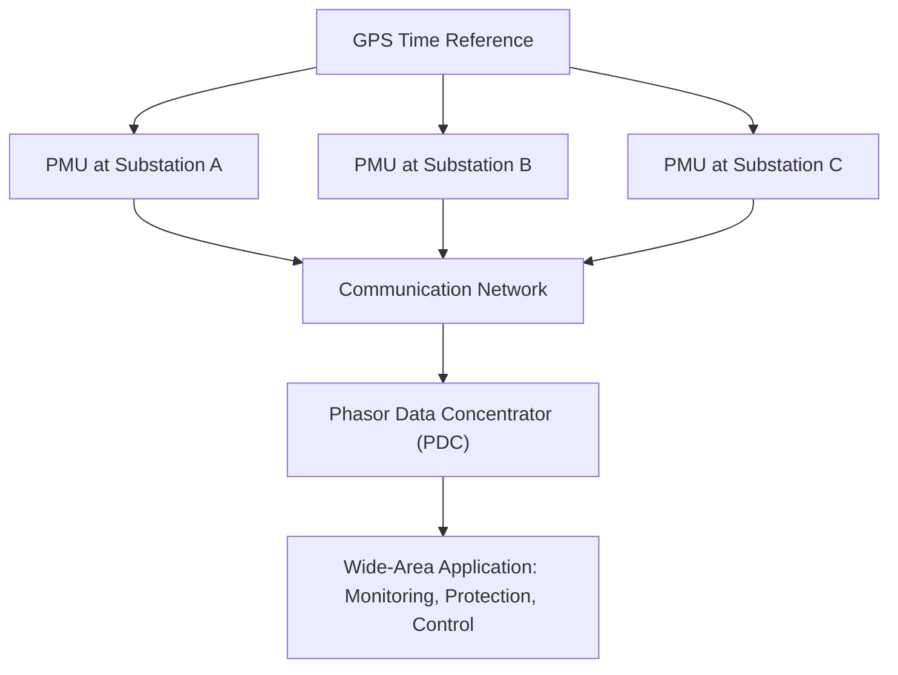
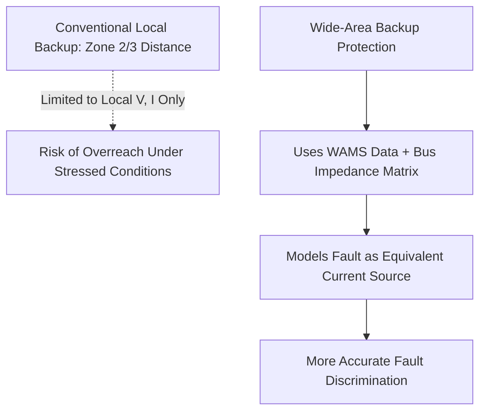
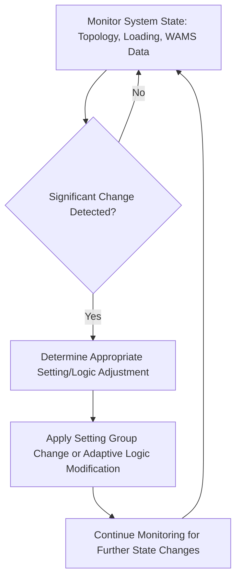
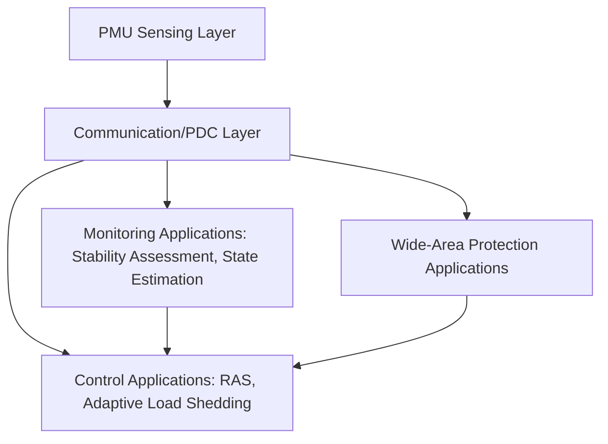

## Wide-Area and Adaptive Protection Schemes

### Overview

Wide-area protection extends traditional protection philosophy beyond information available locally at a single relay location, using synchronized measurements gathered across multiple points in the power system to make protection decisions. Adaptive protection refers to schemes that automatically modify relay settings or logic in response to changing system conditions, rather than relying on fixed settings derived for a limited set of anticipated operating states. These two concepts are closely related and frequently combined: wide-area measurement provides the situational awareness that enables adaptive protection decisions, particularly for conditions where conventional, locally-determined settings become inadequate.

### Motivation

Conventional protection (overcurrent, distance, differential) is set based on studies covering anticipated system configurations and fault scenarios, but modern power systems present challenges that increasingly strain this approach: increasingly variable operating conditions are making it ever more difficult to select relay characteristics that provide a suitable compromise for all loading conditions and contingencies. [Springer](https://link.springer.com/article/10.1007/s40565-016-0211-x)

**Key Points**

- Increasing penetration of variable renewable generation, changing power flow patterns, and more frequent switching operations create a wider range of operating conditions than legacy fixed-setting protection was originally designed to accommodate.
- Backup protection functions (particularly Zone 3 distance elements) are especially susceptible to overreach or maloperation under stressed system conditions (heavy loading, voltage depression) that were not fully anticipated in original settings.
- Wide-area situational awareness allows protection systems to distinguish genuinely abnormal/fault conditions from system stress conditions that merely resemble faults to a locally-limited measurement view.

### Wide-Area Measurement System (WAMS) Foundation

#### Phasor Measurement Units (PMUs)

PMUs are digital recording devices that record and communicate GPS-synchronized, high sampling rate dynamic power system data, providing time-stamped voltage and current phasor measurements referenced to a common absolute time base (via GPS), enabling direct comparison of phase angle and magnitude between geographically separated locations. [Academia.edu](https://www.academia.edu/18797193/PMU_s_Advance_Control_for_Power_System_Wide_area_Monitoring_Protection_using_MATLAB_Simulink)

**Key Points**

- Time synchronization is fundamental to WAMS: without a common time reference, phase angle measurements from different locations cannot be meaningfully compared, since angle differences between substations are central to detecting stress conditions like angular instability or power swings.
- The IEEE C37.118.2 standard defines PMU communication and data format requirements and has been extended with additional functionality over successive revisions to support evolving protection and control applications. [DOI](https://doi.org/10.3390/en10050633)
- PMUs stream synchrophasor measurements using the IEEE C37.118.2 protocol over TCP/IP or UDP/IP, typically to a phasor data concentrator that aggregates and time-aligns data from multiple PMUs for use by wide-area applications. [nih](https://www.ncbi.nlm.nih.gov/pmc/articles/PMC5647525/)

#### Phasor Data Concentrators (PDCs)

A PDC collects synchrophasor streams from multiple PMUs, time-aligns them, and forwards aggregated data to monitoring, protection, or control applications, potentially in a hierarchical architecture (local PDCs feeding regional or system-level PDCs).

**Key Points**

- Some wide-area protection and control applications use direct PMU-to-PMU communication rather than routing through an intermediate PDC, avoiding the non-deterministic delays that a PDC and protocol parsing stage can introduce, which is particularly relevant where protection-speed response times are required. [nih](https://www.ncbi.nlm.nih.gov/pmc/articles/PMC5647525/)
- The trade-off between direct PMU-to-PMU schemes (lower latency, simpler for point-to-point applications) and PDC-based hierarchical architectures (more scalable, supports broader system-wide applications) depends on the specific application's latency tolerance and geographic scope.

### Wide-Area Backup Protection

A prominent application area is wide-area backup protection for transmission lines, which supplements or replaces conventional local backup protection (traditionally Zone 2/Zone 3 distance elements) with schemes that use data from multiple substations.

**Key Points**

- One documented approach uses wide-area WAMS data and the bus impedance matrix of back-up protection zones rather than only local data and the impedance of the faulted line, modeling the fault as a current source, and requires a comparatively lower number of PMUs than some alternative PMU-based schemes. [ResearchGate](https://www.researchgate.net/publication/275218815_An_Adaptive_PMU-Based_Wide_Area_Backup_Protection_Scheme_for_Power_Transmission_Lines)
- Research has specifically targeted the known weakness of Zone 3 distance backup under system stress: work has addressed secured Zone 3 protection during stressed conditions and synchrophasor-assisted Zone 3 operation as ways to reduce the risk of Zone 3 misoperation during heavy loading or voltage depression that could otherwise appear similar to a remote fault. [Springer](https://link.springer.com/article/10.1186/s41601-017-0053-1)
- Communication-constrained regionalization approaches have been studied for synchrophasor-based wide-area backup protection, recognizing that full system-wide PMU coverage and communication bandwidth may not be available or economical, requiring the protection scheme to be partitioned into manageable regions. [Springer](https://link.springer.com/article/10.1186/s41601-017-0053-1)
- Wide-area measurement-based backup protection has also been extended to address power networks with series compensation, a scenario that (as discussed under distance protection) is particularly challenging for conventional impedance-based schemes. [Springer](https://link.springer.com/article/10.1186/s41601-017-0053-1)

### Adaptive Protection Concept

Adaptive protection automatically adjusts relay characteristics, settings, or logic based on prevailing system conditions rather than relying on a single fixed-setting compromise intended to cover all anticipated scenarios.

**Key Points**

- Adaptive relaying has been studied across multiple protection functions; documented work includes adaptive relaying approaches intended to balance protection dependability with power system security, reflecting the inherent trade-off that more sensitive/dependable protection settings can increase the risk of insecure (unwanted) operation, and adaptive approaches attempt to shift this balance dynamically as conditions warrant. [Springer](https://link.springer.com/article/10.1186/s41601-017-0053-1)
- One documented approach uses theoretical premises from transmission and relay protection combined with experience gathered from existing wide-area system operation to develop multifunctional line protection models incorporating both system and backup protection functions, tested against defined simulation scenarios. [DOI](https://doi.org/10.3390/en10050633)
- The simplest and most widely deployed form of "adaptive" behavior in conventional numerical relays is multiple setting groups (discussed under numerical relay architecture), switched based on known topology states; more advanced wide-area adaptive schemes extend this concept to continuous, WAMS-informed adjustment rather than discrete pre-defined setting groups alone.

### Adaptive Out-of-Step Protection

Traditional out-of-step (pole-slip) detection relies on local impedance trajectory analysis (blinder/lens characteristics, as discussed under generator and distance protection), which can be challenged by the increasing variability of modern system operating conditions affecting swing characteristics.

**Key Points**

- Adaptive out-of-step relaying using phasor measurement has been a documented research area, using wide-area angle and frequency information to improve discrimination between stable power swings and genuine loss-of-synchronism conditions compared to purely local impedance-based detection. [Springer](https://link.springer.com/article/10.1007/s40565-016-0211-x)
- Centralized out-of-step protection schemes using wide-area information have been proposed, monitoring voltage angle differences between line ends as a key input, recognizing that angle instability conditions are a primary concern for wide-area angle stability protection. [DOI](https://doi.org/10.3390/en10050633)

### Adaptive/Wide-Area Load Shedding

Underfrequency and undervoltage load shedding, traditionally implemented with fixed frequency/voltage thresholds and stepped timing at distributed locations, has been a significant area for wide-area/adaptive enhancement.

**Key Points**

- WAMS-based underfrequency load shedding schemes incorporating short-term frequency prediction have been studied, aiming to shed load proactively based on the predicted trajectory of system frequency decline rather than reacting only after a fixed threshold is crossed. [Springer](https://link.springer.com/article/10.1007/s40565-016-0211-x)
- Adaptive load shedding approaches combining frequency and voltage stability assessment using synchrophasor measurements have also been documented, and adaptive load shedding schemes have been described that use PMU data to determine the necessary load reduction during overload situations, moving beyond fixed shed-amount stages toward magnitude-informed shedding decisions. [Springer](https://link.springer.com/article/10.1007/s40565-016-0211-x)[Academia.edu](https://www.academia.edu/18797193/PMU_s_Advance_Control_for_Power_System_Wide_area_Monitoring_Protection_using_MATLAB_Simulink)
- **[Inference]** The degree to which such wide-area/adaptive load shedding schemes have moved from research/pilot deployment into widespread standard utility practice varies significantly by region and utility, and current deployment status should be confirmed against specific utility or system operator documentation rather than assumed as universally standard.

### System-Level WAMPAC Architecture

Wide-Area Monitoring, Protection, and Control (WAMPAC) describes the broader integration of wide-area measurement into not just protection but also real-time monitoring and control/remedial action functions.

**Key Points**

- Wide-area measurement system technology, building on PMUs and fast communication links, has emerged as an advanced monitoring and control infrastructure, with significant research investigating PMU structural design, placement, and diverse WAMS functionalities from a system-wide perspective. [IEEE Xplore](https://ieeexplore.ieee.org/abstract/document/7005374/)
- Control applications represent the least mature suite of WAMS-based applications, with relatively few WAMS-based control applications currently in operational use compared to monitoring applications, reflecting the greater complexity, reliability, and validation requirements for closed-loop control action compared to monitoring/situational-awareness applications. [IEEE Xplore](https://ieeexplore.ieee.org/abstract/document/7005374/)
- Documented wide-area protection and control system architectures address feasibility of applying WAMS data to voltage stability, transient stability, local protection, and oscillatory/angular stability applications, illustrating the breadth of functions that a mature WAMPAC deployment is intended to span beyond protection alone. [IEEE Xplore](https://ieeexplore.ieee.org/document/4116430/)

### Communication and Latency Considerations

Wide-area schemes introduce dependency on communication infrastructure spanning potentially large geographic distances, which raises distinct engineering considerations compared to conventional local protection:

- **Communication latency**: wide-area protection actions must tolerate or account for the transmission delay inherent in gathering and processing data from remote locations, which is typically much larger than the near-instantaneous local measurement available to conventional relays.
- **Communication reliability and redundancy**: since wide-area schemes depend on a communication network functioning correctly, architecture must address channel failure modes, redundant paths, and defined fallback behavior (e.g., reverting to conventional local protection) if wide-area data becomes unavailable.
- **Data quality and PMU/GPS availability**: loss of GPS time reference or a PMU malfunction affects the validity of wide-area measurements, requiring supervision logic analogous to VT/CT supervision in conventional protection.

**[Inference]** Specific latency budgets, redundancy architectures, and fallback behaviors for wide-area protection schemes are application- and utility-specific engineering decisions rather than universally standardized values, and should be established per the specific scheme's speed and reliability requirements.

### Comparison: Conventional vs. Wide-Area/Adaptive Protection

| Aspect | Conventional Protection | Wide-Area/Adaptive Protection |
| --- | --- | --- |
| Data Source | Local voltage/current only | Multiple synchronized remote measurements |
| Setting Basis | Fixed settings for anticipated scenarios (or discrete setting groups) | Dynamically informed by real-time wide-area system state |
| Typical Application | Primary line/equipment protection | Backup protection, out-of-step, load shedding, stability-related actions |
| Communication Dependency | Minimal (pilot schemes use local peer communication) | Significant (WAMS infrastructure, PDC, wide-area network) |
| Maturity | Well-established, decades of field experience | Increasingly deployed for specific applications; more mature for monitoring than closed-loop control |

### Application Scope and Maturity

Wide-area and adaptive protection schemes are generally applied as a complement to, rather than a wholesale replacement for, conventional local protection, particularly for primary protection functions requiring the fastest possible response (where local measurement and minimal processing/communication delay remain advantageous). Wide-area applications have found their most mature footing in backup protection enhancement, out-of-step/angular stability protection, and load-shedding/remedial action schemes, where the broader system perspective directly addresses known limitations of purely local approaches.

**[Unverified]** The current extent of commercial/operational (as opposed to research and pilot-stage) deployment of specific wide-area protection functions varies significantly by region, utility, and specific application, and should be confirmed against current vendor and utility documentation for any given system rather than assumed uniformly mature across all described application types.

**Related Topics**

- Transmission Line Distance Protection
- Generator Protection Schemes (Out-of-Step/Power Swing)
- Numerical and Digital Relay Architecture
- IEC 61850 Process Bus and Communication Architecture
- Underfrequency and Undervoltage Load Shedding
- System Protection Schemes / Special Protection Schemes (SPS/RAS)
- Protection Coordination Studies and Relay Setting Calculation