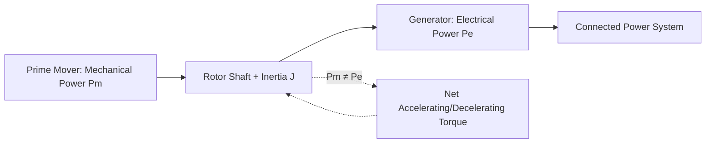
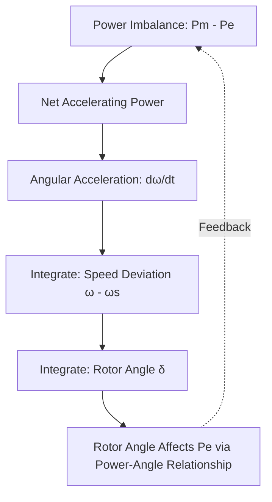
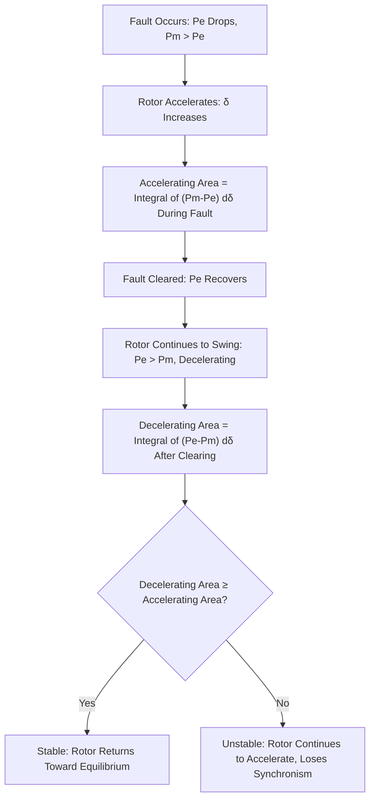
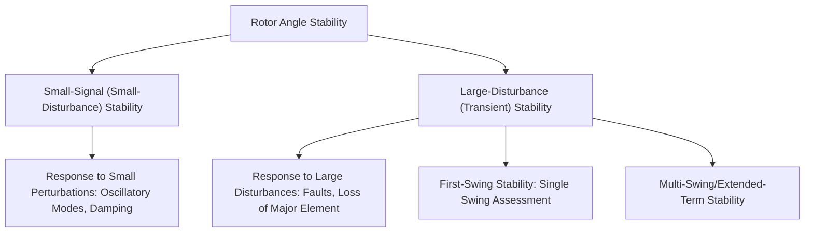

## The Swing Equation and Rotor Dynamics

### Overview

The swing equation describes the dynamic behavior of a synchronous machine's rotor angle in response to an imbalance between mechanical input power and electrical output power. It forms the fundamental mathematical basis for power system stability analysis, governing how a generator's rotor accelerates or decelerates relative to synchronous speed following a disturbance, and underpins concepts ranging from transient stability assessment to out-of-step protection.

### Physical Basis

A synchronous generator's rotor is driven by mechanical torque from the prime mover (turbine) and opposed by electrical torque resulting from the electromagnetic interaction with the connected power system. Under steady-state balanced conditions, mechanical input power equals electrical output power (neglecting losses), and the rotor turns at constant synchronous speed. Any imbalance between these powers produces a net accelerating or decelerating torque, causing the rotor to deviate from synchronous speed.

### Derivation of the Swing Equation

From Newton's second law applied to rotational motion, the net accelerating torque on the rotor equals the moment of inertia times angular acceleration:

$$J \frac{d^2\theta_m}{dt^2} = T_m - T_e$$

where $J$ is the combined moment of inertia of the turbine and generator rotor, $\theta_m$ is the mechanical rotor angle, and $T_m$, $T_e$ are mechanical and electrical torque respectively.

Converting to power (multiplying by mechanical angular velocity $\omega_m$) and expressing angle relative to a synchronously rotating reference frame gives the standard per-unit swing equation:

$$\frac{2H}{\omega_s} \frac{d^2\delta}{dt^2} = P_m - P_e$$

where:

- $H$ is the per-unit inertia constant (seconds), representing stored kinetic energy at rated speed divided by machine rating
- $\omega_s$ is synchronous angular speed (rad/s), $2\pi f$ for the system frequency $f$
- $\delta$ is the rotor angle (electrical radians) relative to a synchronously rotating reference
- $P_m$, $P_e$ are per-unit mechanical and electrical power

**Key Points**

- The rotor angle $\delta$ represents the machine's position relative to a reference rotating at exactly synchronous speed; a constant $\delta$ means the machine is in synchronism, while a continuously increasing or decreasing $\delta$ indicates loss of synchronism (the machine "slipping poles" relative to the system).
- The inertia constant $H$ is defined as $H = \frac{\frac{1}{2} J \omega_{s,mech}^2}{S_{rated}}$, representing the ratio of stored rotational kinetic energy at synchronous speed to the machine's rated MVA, typically expressed in seconds and commonly ranging from approximately 2 to 9 seconds depending on machine type (with turbo-generators and hydro units having characteristically different typical ranges).
- **[Inference]** Specific typical $H$ value ranges vary by machine type, size, and manufacturer design, and should be obtained from manufacturer data or standard reference tables for the specific machine type being studied rather than assumed as a fixed universal range.

### Simplified Swing Equation Form

For power system stability studies, the swing equation is frequently written using the per-unit slip or angular velocity deviation as an intermediate state variable, converting the second-order differential equation into two coupled first-order equations suitable for numerical integration:

$$\frac{d\delta}{dt} = \omega - \omega_s$$

$$\frac{2H}{\omega_s} \frac{d\omega}{dt} = P_m - P_e - D(\omega - \omega_s)$$

where $D$ is an optional damping coefficient representing damping torque effects (e.g., from damper windings, load damping) proportional to speed deviation.

**Key Points**

- This two-state formulation (angle and speed deviation) is the standard representation used in time-domain transient stability simulation software, allowing numerical integration (e.g., via Runge-Kutta or trapezoidal methods) of rotor dynamics following a disturbance.
- The damping term $D$ represents multiple physical damping mechanisms, including damper winding (amortisseur) currents induced by speed deviation and, in system-level studies, aggregate load damping characteristics; its value is typically a modeling parameter derived from machine design data or system studies rather than a single universally standard number.

### Power-Angle Relationship

The electrical power output $P_e$ is itself a function of rotor angle $\delta$ relative to the system, closing the feedback loop in the swing equation. For a simplified single generator connected to an infinite bus through a reactance $X$:

$$P_e = \frac{E V}{X} \sin\delta$$

where $E$ is the generator's internal EMF magnitude, $V$ is the infinite bus voltage, and $X$ is the total reactance between them (generator reactance plus any intervening transformer/line reactance).

<svg xmlns="http://www.w3.org/2000/svg" viewBox="0 0 550 400">
<rect width="550" height="400" fill="#ffffff" />
<text x="275" y="25" text-anchor="middle" font-size="14" font-weight="bold">Power-Angle Curve (svg_diagram)</text>
<line x1="60" y1="340" x2="520" y2="340" stroke="#333" stroke-width="1.5" />
<line x1="60" y1="340" x2="60" y2="50" stroke="#333" stroke-width="1.5" />
<text x="290" y="370" text-anchor="middle" font-size="12">Rotor Angle δ (degrees)</text>
<text x="20" y="200" text-anchor="middle" font-size="12" transform="rotate(-90 20 200)">Electrical Power Pe (p.u.)</text>
<path d="M 60 340 Q 175 40 290 40 Q 405 40 520 340" stroke="#1f6feb" stroke-width="2.5" fill="none" />
<text x="290" y="55" text-anchor="middle" font-size="10" fill="#1f6feb">Pe = (EV/X) sin(δ)</text>
<line x1="60" y1="220" x2="520" y2="220" stroke="#2b8a3e" stroke-width="1.5" stroke-dasharray="5,3" />
<text x="400" y="215" font-size="10" fill="#2b8a3e">Pm (Mechanical Power Input)</text>
<line x1="150" y1="340" x2="150" y2="220" stroke="#999" stroke-width="1" stroke-dasharray="2,2" />
<text x="130" y="360" font-size="10">δ0 (Stable)</text>
<line x1="430" y1="340" x2="430" y2="220" stroke="#999" stroke-width="1" stroke-dasharray="2,2" />
<text x="410" y="360" font-size="10">δmax (Unstable)</text>
<text x="290" y="50" font-size="10" fill="#333" text-anchor="middle">90°</text>
</svg>

**Key Points**

- The power-angle curve is sinusoidal for the simplified model, reaching maximum transferable power at $\delta = 90°$; beyond this point, further increase in angle actually reduces transferable electrical power, a fundamental characteristic underlying transient instability.
- Two equilibrium points typically exist where $P_m = P_e$ on the sinusoidal curve within $0°$ to $180°$: a stable operating point (below 90°, where a small angle increase raises $P_e$ above $P_m$, creating a restoring decelerating effect) and an unstable equilibrium (above 90°, where the relationship reverses).
- Real systems involve more complex network representations (multi-machine systems, detailed generator models with transient/subtransient reactances) where the simple single-machine-infinite-bus sinusoidal relationship is an idealization; **[Inference]** actual power-angle relationships in detailed system studies incorporate machine saliency, saturation, and multi-machine network interactions not captured by the simplified equation, and detailed stability software accounts for these effects beyond the basic swing equation form shown here.

### Equal Area Criterion

For a single machine connected to an infinite bus, the equal area criterion provides a graphical method to assess transient stability following a disturbance (e.g., a fault followed by clearing) without requiring full time-domain simulation, based on the principle that the rotor will return to a stable operating condition if the decelerating energy area available after fault clearing is at least equal to the accelerating energy area gained during the fault.

**Key Points**

- The equal area criterion is a graphical/energy-based simplification applicable rigorously only to a single machine against an infinite bus (or equivalent two-machine systems reducible to this form); multi-machine systems require full time-domain simulation for accurate stability assessment, since energy-based generalizations to multi-machine systems (e.g., transient energy function methods) involve additional complexity beyond the basic equal-area graphical method.
- The critical clearing angle (and corresponding critical clearing time) is the maximum rotor angle excursion (and time) for which the system remains just stable per the equal area criterion; faster fault clearing directly improves transient stability margin by limiting the accelerating area.

### Critical Clearing Time

The critical clearing time (CCT) is the maximum time a fault can be allowed to persist before clearing while the system remains transiently stable, directly informing protection speed requirements (a key link between stability studies and protection system design, since inadequately fast fault clearing can result in loss of synchronism even when a fault is eventually cleared).

**Key Points**

- CCT depends on pre-fault loading, fault location and type, post-fault network configuration, and machine inertia; lower inertia machines generally have shorter critical clearing times, all else being equal, since a given power imbalance produces faster angular acceleration.
- This dependency is a key driver behind the industry attention to declining system inertia as renewable generation (with different or no inherent rotational inertia contribution) displaces conventional synchronous generation, motivating research into fast-acting protection, synthetic inertia, and grid-forming inverter control strategies, though **[Inference]** the specific quantitative impact on required protection speeds for a given system depends on detailed system-specific inertia and stability studies rather than generic industry statements alone.
- Protection system design (particularly primary protection speed and pilot scheme application for critical transmission lines) is directly informed by critical clearing time requirements determined through system stability studies, illustrating a key interface between the power system stability discipline and protection engineering.

### Multi-Machine Systems

Real power systems involve many interconnected generators, each governed by its own swing equation, coupled through the network's power flow equations. The generalized multi-machine swing equation for machine $i$:

$$\frac{2H_i}{\omega_s} \frac{d^2\delta_i}{dt^2} = P_{m,i} - P_{e,i}(\delta_1, \delta_2, ..., \delta_n)$$

where $P_{e,i}$ depends on the angles of all machines in the system through the network admittance matrix, coupling all machines' dynamics together.

**Key Points**

- Multi-machine stability analysis requires simultaneous numerical integration of all machines' swing equations along with the network power flow equations, typically performed using specialized transient stability simulation software rather than closed-form analytical solutions.
- Coherency (groups of generators that swing together following a disturbance) and inter-area oscillation modes (where groups of generators in different regions swing against each other) are important multi-machine phenomena not captured by single-machine equivalent analysis, relevant to both stability assessment and wide-area monitoring/protection applications.
- Generator models used in detailed multi-machine stability studies typically extend well beyond the simplified classical model (constant EMF behind transient reactance) shown here, incorporating detailed excitation system, governor, and power system stabilizer dynamics that interact with the basic swing equation behavior.

### Types of Rotor Angle Stability

- **Small-signal (small-disturbance) stability**: concerns the system's ability to maintain synchronism under small perturbations, analyzed via linearization of the swing equations around an operating point, revealing oscillatory modes and their damping characteristics (relevant to power system stabilizer design and inter-area oscillation studies).
- **Large-disturbance (transient) stability**: concerns the system's ability to maintain synchronism following a severe disturbance (major fault, loss of a large generator or line), typically requiring nonlinear time-domain simulation of the full swing equations, of which first-swing stability (whether the rotor angle stays within bounds during the initial swing following the disturbance) is a commonly assessed subset.

### Relationship to Protection Engineering

The swing equation and rotor dynamics concepts connect directly to several protection functions covered elsewhere:

- **Out-of-step protection** (generator device 78/21 and wide-area out-of-step schemes) is fundamentally based on detecting the rotor angle trajectory associated with loss of synchronism as governed by the swing equation, distinguishing stable swings (bounded, damped oscillation returning toward equilibrium) from unstable ones (continuously increasing angle deviation).
- **Power swing blocking** in distance relays exists specifically because the impedance trajectory during a stable swing (predictable from swing equation dynamics) can traverse a distance relay's tripping characteristic without representing an actual fault requiring isolation.
- **Critical clearing time** derived from swing equation-based stability analysis directly establishes required protection clearing speed for critical system elements, linking stability study results to protection scheme speed requirements (influencing decisions such as pilot scheme application versus stepped-time backup protection).

### Illustrative Rotor Angle Response

<svg xmlns="http://www.w3.org/2000/svg" viewBox="0 0 550 350">
<rect width="550" height="350" fill="#ffffff" />
<text x="275" y="25" text-anchor="middle" font-size="14" font-weight="bold">Rotor Angle Response Following a Disturbance (svg_diagram)</text>
<line x1="60" y1="300" x2="520" y2="300" stroke="#333" stroke-width="1.5" />
<line x1="60" y1="300" x2="60" y2="50" stroke="#333" stroke-width="1.5" />
<text x="290" y="330" text-anchor="middle" font-size="12">Time (s)</text>
<text x="25" y="180" text-anchor="middle" font-size="12" transform="rotate(-90 25 180)">Rotor Angle δ</text>
<path d="M 60 250 L 130 250 Q 180 100 230 130 Q 280 160 330 145 Q 380 155 430 150 Q 480 152 520 150" stroke="#2b8a3e" stroke-width="2.5" fill="none" />
<text x="380" y="130" font-size="10" fill="#2b8a3e">Stable: Damped Oscillation to New Equilibrium</text>
<path d="M 60 250 L 130 250 Q 180 100 250 60 Q 320 30 400 -10" stroke="#c92a2a" stroke-width="2.5" fill="none" stroke-dasharray="6,3" />
<text x="330" y="45" font-size="10" fill="#c92a2a">Unstable: Continuous Angle Increase</text>
<line x1="130" y1="60" x2="130" y2="300" stroke="#999" stroke-width="1" stroke-dasharray="3,3" />
<text x="90" y="315" font-size="10">Disturbance Occurs</text>
</svg>

### Common Analytical Considerations

- **Model simplification trade-offs**: the classical swing equation with constant EMF behind reactance is a simplification adequate for first-swing/short-term analysis but does not capture excitation system, governor, or longer-term thermal/mechanical dynamics relevant to extended-term or voltage stability studies.
- **Inertia constant aggregation**: system-wide equivalent inertia (relevant to overall frequency response and stability margin) depends on the aggregate of all connected synchronous machines' individual $H$ constants weighted by their MVA rating, a quantity of growing interest as synchronous generation is displaced by inverter-based resources with fundamentally different (or absent) inherent inertial response.
- **Numerical integration accuracy**: time-domain simulation of the swing equation requires appropriate integration time steps and methods to accurately capture fast dynamics (particularly during and immediately after a fault) without introducing numerical instability or excessive computational burden.

**Related Topics**

- Generator Protection Schemes (Out-of-Step/Power Swing)
- Transmission Line Distance Protection (Power Swing Blocking)
- Wide-Area and Adaptive Protection Schemes
- Small-Signal Stability and Power System Stabilizers
- Inertia and Frequency Response in Systems with High Renewable Penetration
- Transient Stability Simulation Methods and Software